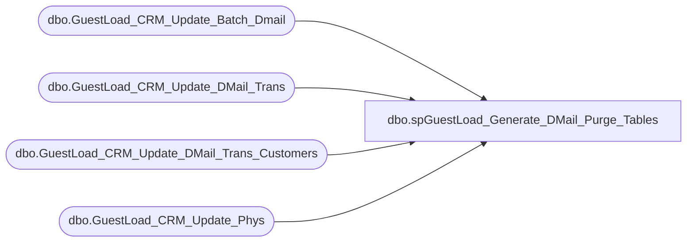

# dbo.spGuestLoad_Generate_DMail_Purge_Tables

**Database:** dw  
**Server:** papamart  

## Architecture Diagram



## Table Dependencies

| Referenced Table |
|---|
| dbo.GuestLoad_CRM_Update_Batch_Dmail |
| dbo.GuestLoad_CRM_Update_DMail_Trans |
| dbo.GuestLoad_CRM_Update_DMail_Trans_Customers |
| dbo.GuestLoad_CRM_Update_Phys |

## Stored Procedure Code

```sql
-- =============================================================================================================
-- Name: spGuestLoad_Generate_DMail_Purge_Tables
--
-- Description:	
--		This procedure will purge all of the work data from the datawarehouse to CRM upload
--		process. We will retain the information for 2 weeks
--
-- Input:
--		None
--
-- Output: 
--		None
--
-- Dependencies: 
--
-- EXAMPLE:
--		exec dw.dbo.spGuestLoad_Generate_DMail_Purge_Tables
--
-- Revision History
--		Name:				Date:			Comments:
--		Gary Murrish		5/13/2011		created
-- =============================================================================================================	
CREATE PROCEDURE [dbo].[spGuestLoad_Generate_DMail_Purge_Tables] 

AS
BEGIN


DECLARE @maxDate AS datetime
DECLARE @maxBatch AS int
SET @maxDate = DATEADD(d, -14, GETDATE())

SET @maxbatch = (SELECT
                     MAX(batch_id)
                 FROM
                     dbo.GuestLoad_CRM_Update_Batch_Dmail WITH (NOLOCK)
                 WHERE
                 INS_DT < @maxDate)

-- Purge from Dave's trigger of the process.
DELETE  FROM
        dbo.GuestLoad_CRM_Update_Phys
WHERE
batch_id BETWEEN-1 * @maxBatch
AND @maxBatch


-- Purge the file which contains the trigger records in CRM
DELETE  FROM
        crmdb02.crm.dbo.GuestLoad_CRM_Update_DMail_Trans
WHERE
BATCH_ID <= @maxBatch

-- Purge the file which contains the records to update in CRM
DELETE  FROM
        crmdb02.crm.dbo.GuestLoad_CRM_Update_DMail_Trans_Customers
WHERE
BATCH_ID <= @maxBatch

-- Purge the records from the batch table
DELETE  FROM
        dbo.GuestLoad_CRM_Update_Batch_Dmail
WHERE
batch_id <= @maxBatch


END
```

