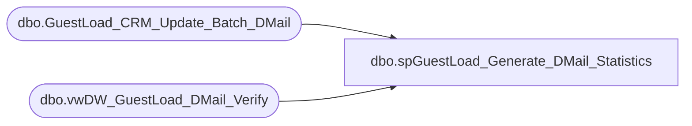

# dbo.spGuestLoad_Generate_DMail_Statistics

**Database:** dw  
**Server:** papamart  

## Architecture Diagram



## Table Dependencies

| Referenced Table |
|---|
| dbo.GuestLoad_CRM_Update_Batch_DMail |
| dbo.vwDW_GuestLoad_DMail_Verify |

## Stored Procedure Code

```sql
-- =============================================================================================================
-- Name: spGuestLoad_Generate_DMail_Statistics
--
-- Description:	
--		This process updates the statistics on the batch record with the number of records that should be
--		processed and the number processed.
--
--		A batch is considered to be closed when we get the same number of records two times in a row
--		and there was something to be posted and there was something posted.
--
-- Input:
--		@batchID			int	
--			The batch number to process
--
-- Output: 
--		None
--
-- Dependencies: 
--
-- EXAMPLE:
--		exec dw.dbo.spGuestLoad_Generate_DMail_Statistics @batchID = ?
--
-- Revision History
--		Name:				Date:			Comments:
--		Gary Murrish		2/25/2011		created
-- =============================================================================================================
CREATE PROCEDURE [dbo].[spGuestLoad_Generate_DMail_Statistics] @batchID int
AS
BEGIN
	-- SET NOCOUNT ON added to prevent extra result sets from
	-- interfering with SELECT statements.
    SET NOCOUNT ON ;

    DECLARE @numGuestsToProcess integer
    DECLARE @numGuestsProcessed integer
    DECLARE @numGuestsToInvalidate integer
    DECLARE @numGuestsInvalidated integer
    DECLARE @numAttrsToProcess integer
    DECLARE @numAttrsProcessed integer

    SELECT
        @numGuestsToInvalidate = ISNULL([# Address to Invalidate],0)
       ,@numGuestsInvalidated = ISNULL([# Addresses Invalidated],0)
       ,@numGuestsToProcess = ISNULL([# Address to Update],0)
       ,@numGuestsProcessed = ISNULL([# Address Changed],0)
       ,@numAttrsToProcess = ISNULL([# Attr to Change],0)
       ,@numAttrsProcessed = ISNULL([# Attr Changed],0)
    FROM
        crmdb02.crm.dbo.vwDW_GuestLoad_DMail_Verify
    WHERE
    BATCH_ID = @batchID

    DECLARE @GuestsToPost integer
    DECLARE @GuestsPosted integer
    SET @GuestsToPost = @numGuestsToProcess + @numGuestsToInvalidate
    SET @GuestsPosted = @numGuestsProcessed + @numGuestsInvalidated

    DECLARE @wasGuestsToPost integer
    DECLARE @wasGuestsPosted integer
    DECLARE @wasAttrToPost integer
    DECLARE @wasAttrPosted integer
    DECLARE @wasBatch_Status integer
    DECLARE @CMPL_DT datetime

    SELECT
        @wasGuestsToPost = NUM_GUESTS_TO_CHANGE + NUM_GUESTS_TO_INVALIDATE
       ,@wasGuestsPosted = NUM_GUESTS_CHANGED + NUM_GUESTS_INVALIDATED
       ,@wasAttrToPost = NUM_ATTRS_TO_CHANGE
       ,@wasAttrPosted = NUM_ATTRS_CHANGED
       ,@wasBatch_Status = BATCH_Status
       ,@CMPL_DT = CMPLT_DT
    FROM
        dbo.GuestLoad_CRM_Update_Batch_DMail
    WHERE
    batch_id = @batchID

-- Figure out what the status should be.
    DECLARE @newBatch_Status integer

    SET @newBatch_Status = @wasBatch_Status

    IF @guestsToPost = @wasGuestsToPost	-- Same number of records to post since the last time
    AND @numAttrsToProcess = @wasAttrToPost
    AND @guestsPosted = @wasGuestsPosted
    AND @numAttrsProcessed = @wasAttrPosted
        BEGIN
	-- See if there has been some posting activity (that the file is not hung)
            IF (@guestsToPost <> 0
                AND @guestsPosted <> 0)
            AND (@numAttrsToProcess <> 0
                 AND @NumAttrsProcessed <> 0)
                BEGIN
                    SET @newBatch_Status = 900
                    SET @CMPL_DT = GETDATE()
                END
        END


    UPDATE
        dbo.GuestLoad_CRM_Update_Batch_DMail
    SET
        NUM_GUESTS_TO_CHANGE = ISNULL(@numGuestsToProcess,0)
       ,NUM_GUESTS_TO_INVALIDATE = ISNULL(@numGuestsToInvalidate,0)
       ,NUM_ATTRS_TO_CHANGE = ISNULL(@numAttrsToProcess,0)
       ,NUM_GUESTS_CHANGED = ISNULL(@numGuestsProcessed,0)
       ,NUM_GUESTS_INVALIDATED = ISNULL(@numGuestsInvalidated,0)
       ,NUM_ATTRS_CHANGED = ISNULL(@numAttrsProcessed,0)
       ,BATCH_Status = @newBatch_Status
       ,CMPLT_DT = @CMPL_DT
    WHERE
    batch_id = @batchID
END
```

