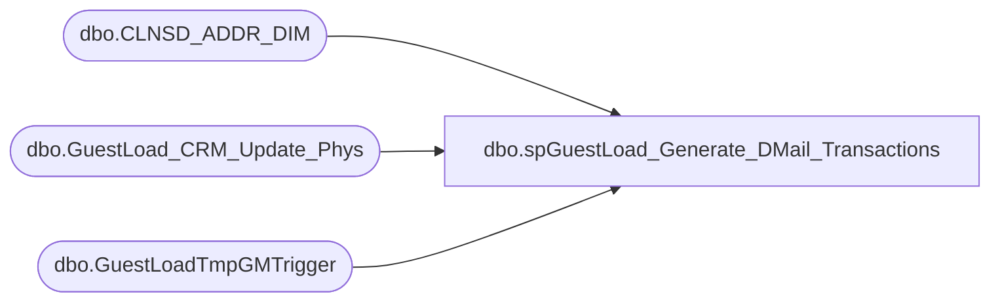

# dbo.spGuestLoad_Generate_DMail_Transactions

**Database:** dw  
**Server:** papamart  

## Architecture Diagram



## Table Dependencies

| Referenced Table |
|---|
| dbo.CLNSD_ADDR_DIM |
| dbo.GuestLoad_CRM_Update_Phys |
| dbo.GuestLoadTmpGMTrigger |

## Stored Procedure Code

```sql
-- =============================================================================================================
-- Name: spGuestLoad_Generate_DMail_Transactions
--
-- Description:	
--		Generate the Direct Mail transactions for this batch
--		These records will be transfered to CRM
--
-- Input:
--		@batchID			int	
--			The batch number to process
--
-- Output: 
--		None
--
-- Dependencies: 
--
-- EXAMPLE:
--		exec dw.dbo.spGuestLoad_Generate_DMail_Transactions @batchID = ?
--
-- Revision History
--		Name:				Date:			Comments:
--		Kevin Shyr			3/4/3015		Change temp table to permanent table in DWStaging to allow SSIS to store meta data
--		Gary Murrish		2/25/2011		Allow either OPT-IN or Y to be the opted in values
--		Gary Murrish		12/30/2010		created
-- =============================================================================================================
CREATE PROCEDURE [dbo].[spGuestLoad_Generate_DMail_Transactions]
	@batchID int
AS
BEGIN
	-- SET NOCOUNT ON added to prevent extra result sets from
	-- interfering with SELECT statements.
	SET NOCOUNT ON;
	
	TRUNCATE TABLE DWStaging.dbo.GuestLoadTmpGMTrigger
	-- Create the trigger table of all of the requested changes for this batch
	INSERT INTO DWStaging.dbo.GuestLoadTmpGMTrigger
		(CNTRY_TXT_OLD
		,ADDR_LN_1_TXT_OLD
		,ADDR_LN_2_TXT_OLD
		,PSTL_CD_OLD
		,clnsd_addr_id
		,isBad
		,isChangeAddr
		,isChangeOption)
	SELECT
		UPPER(BASE.CNTRY_TXT_OLD) AS CNTRY_TXT_OLD,
		LTRIM(RTRIM(ISNULL(BASE.ADDR_LN_1_TXT_OLD, ''))) AS ADDR_LN_1_TXT_OLD,
		LTRIM(RTRIM(ISNULL(BASE.ADDR_LN_2_TXT_OLD, ''))) AS ADDR_LN_2_TXT_OLD,
		LTRIM(RTRIM(ISNULL(BASE.PSTL_CD_OLD, ''))) AS PSTL_CD_OLD,
		BASE.clnsd_addr_id,
		SUM(CASE
			WHEN LEN(LTRIM(RTRIM(ISNULL(BASE.ADDR_LN_1_TXT_OLD, ''))) + LTRIM(RTRIM(ISNULL(BASE.ADDR_LN_2_TXT_OLD, '')))
			+ LTRIM(RTRIM(ISNULL(BASE.PSTL_CD_OLD, '')))) = 0 THEN 1
			WHEN base.clnsd_addr_ID = -1 THEN 1
			WHEN BASE.CLEANSABLE = 'N' THEN 1
			ELSE 0
		END) AS isBad,
		SUM(CASE
			WHEN BASE.CLEANSABLE = 'Y' AND base.clnsd_addr_id <> -1 THEN 1
			ELSE 0
		END) AS isChangeAddr,
		SUM(CASE
			WHEN BASE.CLEANSABLE IS NULL THEN 1
			ELSE 0
		END) AS isChangeOption
	--INTO #tmpGMTrigger  (2015-03-04, replaced with permanent table)
	FROM
		dbo.GuestLoad_CRM_Update_Phys BASE WITH(READCOMMITTED)
	WHERE
		BASE.batch_id = @batchID
	GROUP BY	UPPER(BASE.CNTRY_TXT_OLD),
				BASE.ADDR_LN_1_TXT_OLD,
				BASE.ADDR_LN_2_TXT_OLD,
				BASE.PSTL_CD_OLD,
				BASE.clnsd_addr_id
	ORDER BY	UPPER(BASE.CNTRY_TXT_OLD),
				BASE.ADDR_LN_1_TXT_OLD,
				BASE.ADDR_LN_2_TXT_OLD,
				BASE.PSTL_CD_OLD

	-- Generate the "KILL" Records    
	SELECT
		CAST(CNTRY_TXT_OLD AS varchar(3)) AS CNTRY_TXT_OLD,
		CAST(ADDR_LN_1_TXT_OLD AS varchar(60)) AS ADDR_LN_1_TXT_OLD,
		CAST(ADDR_LN_2_TXT_OLD AS varchar(60)) AS ADDR_LN_2_TXT_OLD,
		CAST(PSTL_CD_OLD AS varchar(20)) AS PSTL_CD_OLD,
		CAST('KILL' AS varchar(10)) AS TransType,
		CAST('' AS varchar(3)) AS CNTRY_TXT_NEW,
		CAST('' AS varchar(60)) AS address_1,
		CAST('' AS varchar(60)) AS address_2,
		CAST('' AS varchar(60)) AS address_3,
		CAST('' AS varchar(60)) AS address_4,
		CAST('' AS varchar(60)) AS address_5,
		CAST('' AS varchar(60)) AS address_6,
		CAST('' AS varchar(11)) AS postal_code,
		@batchID AS BATCH_ID,
		CAST('' AS varchar(1)) AS opt_in_flag
	FROM
		DWStaging.dbo.GuestLoadTmpGMTrigger WITH(READCOMMITTED) --#tmpGMTrigger WITH (NOLOCK) -- (2015-03-04, replaced with permanent table)
	WHERE
		isBad > 0
		AND isChangeAddr = 0
	UNION ALL
	-- Generate the "CHANGE" Records    
	SELECT
		CAST(CNTRY_TXT_OLD AS varchar(3)) AS CNTRY_TXT_OLD,
		CAST(ADDR_LN_1_TXT_OLD AS varchar(60)) AS ADDR_LN_1_TXT_OLD,
		CAST(ADDR_LN_2_TXT_OLD AS varchar(60)) AS ADDR_LN_2_TXT_OLD,
		CAST(PSTL_CD_OLD AS varchar(20)) AS PSTL_CD_OLD,
		'CHANGE' AS TransType,
		LEFT(ADDR.CNTRY_ABBRV, 3) AS CNTRY_TXT_NEW,
		ADDR.ADDR_LN_1_TXT AS address_1,
		LEFT(ISNULL(ADDR.ADDR_LN_2_TXT, '') + ISNULL(ADDR.APT_UNIT_NBR, ''), 60) AS address_2,
		ADDR.CTY_NM AS address_3,
		ADDR.ST_PRVNC_ABBRV AS address_4,
		'' AS address_5,
		'' AS address_6,
		ADDR.PSTL_CD + CASE
			WHEN ADDR.PSTL_PLS_4_CD IS NULL THEN ''
			ELSE '-' + ADDR.PSTL_PLS_4_CD
		END AS postal_code,
		@batchID AS BATCH_ID,
		CASE
			WHEN ADDR.MAIL_STAT_CD IN ('OPT-IN', 'Y') THEN '1'
			ELSE '2'
		END AS opt_in_flag
	FROM
		DWStaging.dbo.GuestLoadTmpGMTrigger TRIG WITH(READCOMMITTED) --#tmpGMTrigger WITH (NOLOCK) -- (2015-03-04, replaced with permanent table)
		INNER JOIN dw.dbo.CLNSD_ADDR_DIM ADDR WITH (READCOMMITTED)
			ON TRIG.clnsd_addr_id = ADDR.clnsd_addr_id
	WHERE
		isBad = 0
		AND (isChangeAddr > 0
		OR isChangeOption > 0)

--DROP TABLE #tmpGMTrigger	-- So that SSIS can pick up the definition of the outputed table
	TRUNCATE TABLE DWStaging.dbo.GuestLoadTmpGMTrigger

END
```

