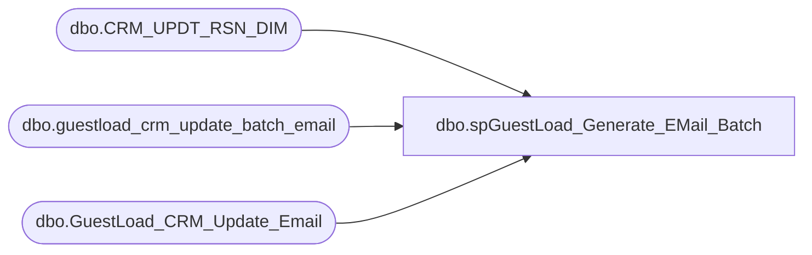

# dbo.spGuestLoad_Generate_EMail_Batch

**Database:** dw  
**Server:** papamart  

## Architecture Diagram



## Table Dependencies

| Referenced Table |
|---|
| dbo.CRM_UPDT_RSN_DIM |
| dbo.guestload_crm_update_batch_email |
| dbo.GuestLoad_CRM_Update_Email |

## Stored Procedure Code

```sql
-- =============================================================================================================
-- Name: spGuestLoad_Generate_EMail_Batch
--
-- Description:	
--		This procedure will start the process to migrate the email changes from the datawarehouse to CRM.
--		This procedure creates a batch record and then flags a number of records to be contained in that batch.
--
-- Input:
--		@numRecsToProcess			int	
--			Number of records to be contained in the batch
--
-- Output: 
--		The batch number
--
-- Dependencies: 
--
-- EXAMPLE:
--		? = exec dw.dbo.spGuestLoad_Generate_EMail_Batch
--
-- Revision History
--		Name:				Date:			Comments:
--		Gary Murrish		5/25/2011		Blocked old email addresses that are any number of blanks
--		Gary Murrish		12/30/2010		created
-- =============================================================================================================
CREATE PROCEDURE [dbo].[spGuestLoad_Generate_EMail_Batch] 
	-- Add the parameters for the stored procedure here
    @numRecsToProcess int = 10
AS
BEGIN
	-- SET NOCOUNT ON added to prevent extra result sets from
	-- interfering with SELECT statements.
    SET NOCOUNT ON ;

	-- Construct the batch number
    DECLARE @thisBatch int
    INSERT INTO
        dw.dbo.guestload_crm_update_batch_email
        (
         INS_DT)
    VALUES
        (
         GETDATE())
    SELECT
        @thisBatch = SCOPE_IDENTITY()
	
	-- Flag all of the 'blank' records with a negative batch number so that they will
	--	not be processed. CRM doesn't handle them
	--  There appears to be a bunch of records that come through with a x'0909' in them
	--		don't allow them to come through.
    UPDATE
        dw.dbo.GuestLoad_CRM_Update_Email
    SET
        batch_id = @thisBatch * -1
    WHERE
    UPDT_ID IN (SELECT
                    UPDT_ID
                FROM
                    dw.dbo.GuestLoad_CRM_Update_Email TRIG
                INNER JOIN dw.dbo.CRM_UPDT_RSN_DIM RSN
                    ON rsn.CRM_UPDT_RSN_ID = trig.CRM_UPDT_RSN_ID
                WHERE
                    (BATCH_ID = 0
                    OR BATCH_ID IS NULL)
                AND rsn.PASS_TO_EPICOR = 1
                AND (ISNULL(LTRIM(RTRIM(trig.EMAIL_ADDR_TXT_OLD)), '') = ''
                     OR sys.fn_varbintohexstr(CAST(LEFT(trig.email_addr_txt_old, 1) AS varbinary(max))) < '0x20'))

	-- Flag the records that we will process in this batch
    UPDATE
        dw.dbo.GuestLoad_CRM_Update_Email
    SET
        batch_id = @thisBatch
    WHERE
    UPDT_ID IN (SELECT TOP (@numRecsToProcess)
                    UPDT_ID
                FROM
                    dw.dbo.GuestLoad_CRM_Update_Email TRIG
                INNER JOIN dw.dbo.CRM_UPDT_RSN_DIM RSN
                    ON rsn.CRM_UPDT_RSN_ID = trig.CRM_UPDT_RSN_ID
                WHERE
                    (BATCH_ID = 0
                    OR BATCH_ID IS NULL)
                AND rsn.PASS_TO_EPICOR = 1)

    RETURN @thisBatch
END
```

