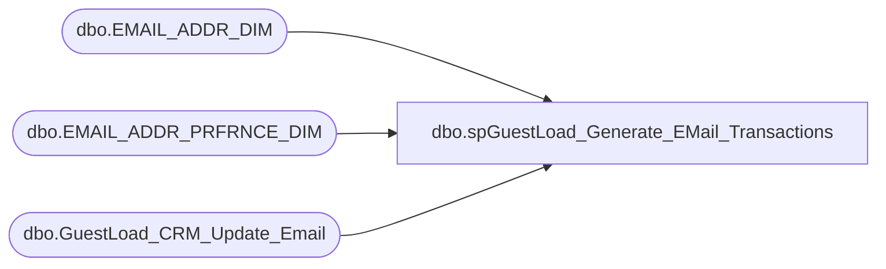

# dbo.spGuestLoad_Generate_EMail_Transactions

**Database:** dw  
**Server:** papamart  

## Architecture Diagram



## Table Dependencies

| Referenced Table |
|---|
| dbo.EMAIL_ADDR_DIM |
| dbo.EMAIL_ADDR_PRFRNCE_DIM |
| dbo.GuestLoad_CRM_Update_Email |

## Stored Procedure Code

```sql
-- =============================================================================================================
-- Name: spGuestLoad_Generate_EMail_Transactions
--
-- Description:	
--		Generate the EMail transactions for this batch
--		These records will be transfered to CRM
--
-- Input:
--		@batchID			int	
--			The batch number to process
--
-- Output: 
--		None
--
-- Dependencies: 
--
-- EXAMPLE:
--		exec dw.dbo.spGuestLoad_Generate_EMail_Transactions @batchID = ?
--
-- Revision History
--		Name:				Date:			Comments:
--		Gary Murrish		2/11/2011		Added casing statements since crmdb02 is case sensitive
--		Gary Murrish		12/30/2010		created
-- =============================================================================================================
CREATE PROCEDURE [dbo].[spGuestLoad_Generate_EMail_Transactions] @batchID int
AS
BEGIN
	-- SET NOCOUNT ON added to prevent extra result sets from
	-- interfering with SELECT statements.
    SET NOCOUNT ON ;

    -- Get the EMail that should be flagged as 'BAD'
    SELECT
        LOWER(EMAIL_ADDR_TXT_OLD) AS EMAIL_ADDR_TXT_OLD
       ,LOWER(EMAIL_ADDR_TXT_NEW) AS EMAIL_ADDR_TXT_NEW
       ,CAST('KILL' AS varchar(10)) AS TransType
       ,MIN(BATCH_ID) AS BATCH_ID
       ,'4' AS SB_EMAIL_STAT_CD
        ,'' AS SB_OPT_IN_FLAG
       ,'' AS SB_PROMO_PREF
       ,'' AS SB_SFSCERT_PREF
       ,'' AS SB_SFSPNTS_PREF
    FROM
        dw.dbo.GuestLoad_CRM_Update_Email
    WHERE
    BATCH_ID = @batchID
    AND (EMAIL_ADDR_TXT_NEW IS NULL
         OR CLEANSABLE = 'N')
    GROUP BY
        EMAIL_ADDR_TXT_OLD
           ,EMAIL_ADDR_TXT_NEW
           
	--           

    UNION ALL

    -- Get the EMail Status or Email address change
    SELECT
        LOWER(EMAIL_ADDR_TXT_OLD) AS EMAIL_ADDR_TXT_OLD
       ,LOWER(EMAIL_ADDR_TXT_NEW) AS EMAIL_ADDR_TXT_NEW
       ,CAST('STATUS' AS varchar(10)) AS TransType
       ,MIN(BATCH_ID) AS BATCH_ID
       ,CASE
             WHEN MIN(EM.EMAIL_STAT_CD) = 'VALID' THEN '0'
             ELSE '4'
        END AS SB_EMAIL_STAT_CD
       ,CASE
             WHEN MIN(PREF.PROMO_PREF) = 'Y' THEN '1'
             ELSE '2'
        END AS SB_OPT_IN_FLAG
       ,CASE
             WHEN MIN(PREF.PROMO_PREF) = 'Y' THEN '1'
             ELSE '0'
        END AS SB_PROMO_PREF
       ,CASE
             WHEN MIN(PREF.SFSCERT_PREF) = 'Y' THEN '1'
             ELSE '0'
        END AS SB_SFSCERT_PREF
       ,CASE
             WHEN MIN(PREF.SFSPNTS_PREF) = 'Y' THEN '1'
             ELSE '0'
        END AS SB_SFSPNTS_PREF
    FROM
        dbo.GuestLoad_CRM_Update_Email TRIG WITH (NOLOCK)
    INNER JOIN dbo.EMAIL_ADDR_DIM EM WITH (NOLOCK)
        ON TRIG.EMAIL_ADDR_TXT_NEW = EM.EMAIL_ADDR_TXT
    LEFT JOIN dbo.EMAIL_ADDR_PRFRNCE_DIM PREF WITH (NOLOCK)
        ON EM.EMAIL_ADDR_ID = PREF.EMAIL_ADDR_ID
    WHERE
    BATCH_ID = @batchID
    AND ISNULL(CLEANSABLE, '') <> 'N'
    AND EMAIL_ADDR_TXT_NEW IS NOT NULL
    GROUP BY
        EMAIL_ADDR_TXT_OLD
           ,EMAIL_ADDR_TXT_NEW
    ORDER BY
        EMAIL_ADDR_TXT_OLD

END
```

