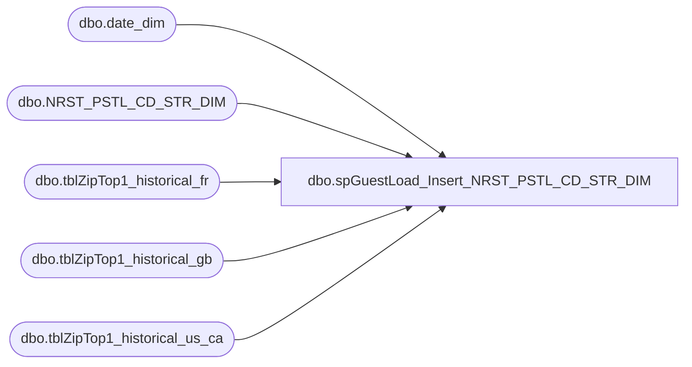

# dbo.spGuestLoad_Insert_NRST_PSTL_CD_STR_DIM

**Database:** dw  
**Server:** papamart  

## Architecture Diagram



## Table Dependencies

| Referenced Table |
|---|
| dbo.date_dim |
| dbo.NRST_PSTL_CD_STR_DIM |
| dbo.tblZipTop1_historical_fr |
| dbo.tblZipTop1_historical_gb |
| dbo.tblZipTop1_historical_us_ca |

## Stored Procedure Code

```sql
-- =============================================
-- Author:		dave
-- Create date: 06/09/2009
-- Description:	this will regenerate the current/future store keys/ids for the new version of the data warehouse
--		in the old days, this info was actually attached to the address table, but that involved a lot of updates,
--		so we decided to go with a table that you need to join to.  heck of a lot simpler, but probably a moot point
--		since we are not in a big expansion phase like we were 3 years ago.
--
-- this proc is probably called from the NearestStoreHistoricalInsert papamart job, since that's where the master info
-- comes from
--
--	G Murrish	2/17/2014 Trimed US postal codes. They have a trailing blank...
-- =============================================
CREATE PROCEDURE [dbo].[spGuestLoad_Insert_NRST_PSTL_CD_STR_DIM]
AS
BEGIN

set nocount on

declare @us_ca_cur_date_key int
set @us_ca_cur_date_key = (
	select max(date_key) 
	from dw.dbo.tblZipTop1_historical_us_ca with (nolock)
	where date_key <= (select date_key from dw.dbo.date_dim where actual_date = cast(convert(varchar, getdate(), 101) as datetime)))
declare @us_ca_future_date_key int
set @us_ca_future_date_key = (
	select max(date_key) 
	from dw.dbo.tblZipTop1_historical_us_ca with (nolock)
	where date_key <= (select date_key from dw.dbo.date_dim where actual_date = cast(convert(varchar, dateadd(ww, 6, getdate()), 101) as datetime)))

declare @gb_cur_date_key int
set @gb_cur_date_key = (
	select max(date_key) 
	from dw.dbo.tblZipTop1_historical_gb with (nolock)
	where date_key <= (select date_key from dw.dbo.date_dim where actual_date = cast(convert(varchar, getdate(), 101) as datetime)))
declare @gb_future_date_key int
set @gb_future_date_key = (
	select max(date_key) 
	from dw.dbo.tblZipTop1_historical_gb with (nolock)
	where date_key <= (select date_key from dw.dbo.date_dim where actual_date = cast(convert(varchar, dateadd(ww, 6, getdate()), 101) as datetime)))

declare @fr_cur_date_key int
set @fr_cur_date_key = (
	select max(date_key) 
	from dw.dbo.tblZipTop1_historical_fr with (nolock)
	where date_key <= (select date_key from dw.dbo.date_dim where actual_date = cast(convert(varchar, getdate(), 101) as datetime)))
declare @fr_future_date_key int
set @fr_future_date_key = (
	select max(date_key) 
	from dw.dbo.tblZipTop1_historical_fr with (nolock)
	where date_key <= (select date_key from dw.dbo.date_dim where actual_date = cast(convert(varchar, dateadd(ww, 6, getdate()), 101) as datetime)))

truncate table dw.dbo.NRST_PSTL_CD_STR_DIM

insert into dw.dbo.NRST_PSTL_CD_STR_DIM (cntry_abbrv, pstl_cd, str_id, futr_str_id, ins_dt, updt_dt, etl_log_id, etl_evnt_id)
select distinct c.cntry_abbrv, LTRIM(RTRIM(c.pstl_cd)), c.str_id, f.futr_str_id, getdate(), getdate(), -1, -1
from (
	select case when len(postal_code) = 5 then 'USA' else 'CAN' end cntry_abbrv,  postal_code pstl_cd, store_key str_id
	from dw.dbo.tblZipTop1_historical_us_ca with (nolock)
	where date_key = @us_ca_cur_date_key
	) c
	join (
	select case when len(postal_code) = 5 then 'USA' else 'CAN' end cntry_abbrv,  postal_code pstl_cd, store_key futr_str_id
	from dw.dbo.tblZipTop1_historical_us_ca with (nolock)
	where date_key = @us_ca_future_date_key
	) f
	on f.cntry_abbrv = c.cntry_abbrv
	and LTRIM(RTRIM(f.pstl_cd)) = LTRIM(RTRIM(c.pstl_cd))
union
select distinct c.cntry_abbrv, c.pstl_cd, c.str_id, f.futr_str_id, getdate(), getdate(), -1, -1
from (
	select 'GBR' cntry_abbrv,  postal_code pstl_cd, store_key str_id
	from dw.dbo.tblZipTop1_historical_gb with (nolock)
	where date_key = @gb_cur_date_key
	) c
	join (
	select 'GBR' cntry_abbrv,  postal_code pstl_cd, store_key futr_str_id
	from dw.dbo.tblZipTop1_historical_gb with (nolock)
	where date_key = @gb_future_date_key
	) f
	on f.cntry_abbrv = c.cntry_abbrv
	and f.pstl_cd = c.pstl_cd
union
select distinct c.cntry_abbrv, c.pstl_cd, c.str_id, f.futr_str_id, getdate(), getdate(), -1, -1
from (
	select 'FRA' cntry_abbrv,  postal_code pstl_cd, store_key str_id
	from dw.dbo.tblZipTop1_historical_fr with (nolock)
	where date_key = @fr_cur_date_key
	) c
	join (
	select 'FRA' cntry_abbrv,  postal_code pstl_cd, store_key futr_str_id
	from dw.dbo.tblZipTop1_historical_fr with (nolock)
	where date_key = @fr_future_date_key
	) f
	on f.cntry_abbrv = c.cntry_abbrv
	and f.pstl_cd = c.pstl_cd

END


dbo,spGuestLoad_Build_ADDR_SUM_FACT,-- =============================================================================================================
-- Name: spGuestLoad_Build_ADDR_SUM_FACT
--
-- Description:	
--		Builds an addresses' tkf facts.  this code can be used after a guest load run or the entire clnsd_addr_dim table 
--		can be trunc'd and then refreshed because this code looks for missing clnsd_addr_ids
--
-- Input:
--		@etl_log_id				int	
--			last guest load to touch this, used for logging.  if truncing the table, any int will do
--
--		@etl_evnt_id			int			
--			last guest load to touch this, used for logging.  if truncing the table, any int will do
--
-- Output: 
--		data will be loaded into dw.dbo.addr_sum_fact
--
-- Dependencies: 
--
-- EXAMPLE:
--		exec dw.dbo.spGuestLoad_Build_ADDR_SUM_FACT -1, -1
--
-- Revision History
--		Name:			Date:			Comments:
--		Dave Rice		7/19/2010		created
-- =============================================================================================================
CREATE PROCEDURE [dbo].[spGuestLoad_Build_ADDR_SUM_FACT](@etl_log_id int, @etl_evnt_id int)
AS
BEGIN
-- SET NOCOUNT ON added to prevent extra result sets from
-- interfering with SELECT statements.
SET NOCOUNT ON;

--exec dbo.usp_Build_ADDR_SUM_FACT 11, 22
--declare @etl_log_id int
--declare @etl_evnt_id int
--set @etl_log_id = 1
--set @etl_evnt_id = 1


-- get today's date_key
declare @date_key int
set @date_key = (select date_key from dw.dbo.date_dim where actual_date = cast(convert(varchar, getdate(), 101) as datetime))

-- look for any missing addresses, typically these will come from the latest guestload run
IF (Object_ID('tempdb..#addr') IS NOT NULL) DROP TABLE #addr
select distinct cgd.clnsd_addr_id
into #addr
from dw.dbo.trn_ksk_fact tkf with (nolock) 
	inner join tkf_clnsd_gst_brdg b with (nolock) 
	on b.tkf_id = tkf.tkf_id
	INNER JOIN dw.dbo.clnsd_gst_dim cgd with (nolock)
	ON cgd.clnsd_gst_id = b.clnsd_gst_id 
	left join addr_sum_fact asf with (nolock) 
	on asf.clnsd_addr_id = cgd.clnsd_addr_id
where asf.clnsd_addr_id is null
	and cgd.clnsd_addr_id >= 0

create index ix_addr on #addr(clnsd_addr_id) with FILLFACTOR = 100

--
--
--IF (Object_ID('tempdb..#addr') IS NOT NULL) DROP TABLE #addr
--select top 10000 clnsd_addr_id
--into #addr
--from (
--	select distinct clnsd_addr_id
--	from (
--		select top 20000 clnsd_addr_id 
--		from tkf_clnsd_gst_brdg b
--			join clnsd_gst_dim cgd
--			on cgd.clnsd_gst_id = b.clnsd_gst_id
--		where clnsd_addr_id >= 0
--		order by tkf_id desc
--	) d
--	) b
--
--create index ix_addr on #addr(clnsd_addr_id) with FILLFACTOR = 100


--CREATE TABLE #asf(
--	[CLNSD_ADDR_ID] [int] NOT NULL,
--	[NRST_PSTL_CD_STR_ID] [int] NOT NULL,
--	[FRST_STR_VST_DT_ID] [int] NOT NULL,
--	[SCND_STR_VST_DT_ID] [int] NOT NULL,
--	[THRD_STR_VST_DT_ID] [int] NOT NULL,
--	[LAST_STR_VST_DT_ID] [int] NOT NULL,
--	[ADDR_SUM_FACT_UPDT_DT_ID] [int] NOT NULL,
--	[DY_INTVL_FRST_SCND_VST_CNT] [int] NULL,
--	[DY_INTVL_SCND_THRD_VST_CNT] [int] NULL,
--	[NEW_VS_RPT_CD] [char](1) NULL,
--	[TTL_VST_CNT] [int] NULL,
--	[MNTH_RCNCY_CNT] [int] NULL,
--	[MNTH_01_03_VST_CNT] [int] NULL,
--	[MNTH_04_06_VST_CNT] [int] NULL,
--	[MNTH_07_09_VST_CNT] [int] NULL,
--	[MNTH_10_12_VST_CNT] [int] NULL,
--	[MNTH_13_15_VST_CNT] [int] NULL,
--	[MNTH_16_18_VST_CNT] [int] NULL,
--	[MNTH_19_21_VST_CNT] [int] NULL,
--	[MNTH_22_24_VST_CNT] [int] NULL,
--	[MNTH_25_PLUS_VST_CNT] [int] NULL,
--	[ADDR_MBR_CNT] [int] NULL,
--	[MBR_AGE_0_CNT] [int] NULL,
--	[MBR_AGE_01_12_CNT] [int] NULL,
--	[MBR_AGE_01_03_CNT] [int] NULL,
--	[MBR_AGE_04_06_CNT] [int] NULL,
--	[MBR_AGE_07_09_CNT] [int] NULL,
--	[MBR_AGE_10_12_CNT] [int] NULL,
--	[MBR_AGE_01_02_CNT] [int] NULL,
--	[MBR_AGE_03_07_CNT] [int] NULL,
--	[MBR_AGE_08_12_CNT] [int] NULL,
--	[MBR_AGE_13_19_CNT] [int] NULL,
--	[MBR_AGE_20_29_CNT] [int] NULL,
--	[MBR_AGE_20_PLUS_CNT] [int] NULL,
--	[MBR_AGE_30_PLUS_CNT] [int] NULL,
--	[MBR_AGE_UKWN_CNT] [int] NULL,
--	[MALE_MBR_CNT] [int] NULL,
--	[FMALE_MBR_CNT] [int] NULL,
--	[MBR_GNDR_UKWN_CNT] [int] NULL,
--	[DSTNC_TO_STR_QTY] [decimal](12, 2) NULL,
--	[DSTNC_TO_FUTR_STR_QTY] [decimal](12, 2) NULL,
--	[TTL_ANML_CNT] [int] NULL,
--	[MNTH_01_03_ANML_CNT] [int] NULL,
--	[MNTH_04_06_ANML_CNT] [int] NULL,
--	[MNTH_07_09_ANML_CNT] [int] NULL,
--	[MNTH_10_12_ANML_CNT] [int] NULL,
--	[MNTH_13_15_ANML_CNT] [int] NULL,
--	[MNTH_16_18_ANML_CNT] [int] NULL,
--	[MNTH_19_21_ANML_CNT] [int] NULL,
--	[MNTH_22_24_ANML_CNT] [int] NULL,
--	[MNTH_25_PLUS_ANML_CNT] [int] NULL,
--	[TTL_SWIPE_CNT] [int] NULL,
--	[MNTH_01_03_SWIPES_CNT] [int] NULL,
--	[MNTH_04_06_SWIPES_CNT] [int] NULL,
--	[MNTH_07_09_SWIPES_CNT] [int] NULL,
--	[MNTH_10_12_SWIPES_CNT] [int] NULL,
--	[MNTH_13_15_SWIPES_CNT] [int] NULL,
--	[MNTH_16_18_SWIPES_CNT] [int] NULL,
--	[MNTH_19_21_SWIPES_CNT] [int] NULL,
--	[MNTH_22_24_SWIPES_CNT] [int] NULL,
--	[MNTH_25_PLUS_SWIPES_CNT] [int] NULL,
--	[INS_DT] [datetime] NOT NULL,
--	[ETL_LOG_ID] [int] NOT NULL,
--	[ETL_EVNT_ID] [int] NOT NULL
--) ON [PRIMARY]
--
--CREATE TABLE #asf_new(
--	[CLNSD_ADDR_ID] [int] NOT NULL,
--	[NRST_PSTL_CD_STR_ID] [int] NOT NULL,
--	[FRST_STR_VST_DT_ID] [int] NOT NULL,
--	[SCND_STR_VST_DT_ID] [int] NOT NULL,
--	[THRD_STR_VST_DT_ID] [int] NOT NULL,
--	[LAST_STR_VST_DT_ID] [int] NOT NULL,
--	[ADDR_SUM_FACT_UPDT_DT_ID] [int] NOT NULL,
--	[DY_INTVL_FRST_SCND_VST_CNT] [int] NULL,
--	[DY_INTVL_SCND_THRD_VST_CNT] [int] NULL,
--	[NEW_VS_RPT_CD] [char](1) NULL,
--	[TTL_VST_CNT] [int] NULL,
--	[MNTH_RCNCY_CNT] [int] NULL,
--	[MNTH_01_03_VST_CNT] [int] NULL,
--	[MNTH_04_06_VST_CNT] [int] NULL,
--	[MNTH_07_09_VST_CNT] [int] NULL,
--	[MNTH_10_12_VST_CNT] [int] NULL,
--	[MNTH_13_15_VST_CNT] [int] NULL,
--	[MNTH_16_18_VST_CNT] [int] NULL,
--	[MNTH_19_21_VST_CNT] [int] NULL,
--	[MNTH_22_24_VST_CNT] [int] NULL,
--	[MNTH_25_PLUS_VST_CNT] [int] NULL,
--	[ADDR_MBR_CNT] [int] NULL,
--	[MBR_AGE_0_CNT] [int] NULL,
--	[MBR_AGE_01_12_CNT] [int] NULL,
--	[MBR_AGE_01_03_CNT] [int] NULL,
--	[MBR_AGE_04_06_CNT] [int] NULL,
--	[MBR_AGE_07_09_CNT] [int] NULL,
--	[MBR_AGE_10_12_CNT] [int] NULL,
--	[MBR_AGE_01_02_CNT] [int] NULL,
--	[MBR_AGE_03_07_CNT] [int] NULL,
--	[MBR_AGE_08_12_CNT] [int] NULL,
--	[MBR_AGE_13_19_CNT] [int] NULL,
--	[MBR_AGE_20_29_CNT] [int] NULL,
--	[MBR_AGE_20_PLUS_CNT] [int] NULL,
--	[MBR_AGE_30_PLUS_CNT] [int] NULL,
--	[MBR_AGE_UKWN_CNT] [int] NULL,
--	[MALE_MBR_CNT] [int] NULL,
--	[FMALE_MBR_CNT] [int] NULL,
--	[MBR_GNDR_UKWN_CNT] [int] NULL,
--	[DSTNC_TO_STR_QTY] [decimal](12, 2) NULL,
--	[DSTNC_TO_FUTR_STR_QTY] [decimal](12, 2) NULL,
--	[TTL_ANML_CNT] [int] NULL,
--	[MNTH_01_03_ANML_CNT] [int] NULL,
--	[MNTH_04_06_ANML_CNT] [int] NULL,
--	[MNTH_07_09_ANML_CNT] [int] NULL,
--	[MNTH_10_12_ANML_CNT] [int] NULL,
--	[MNTH_13_15_ANML_CNT] [int] NULL,
--	[MNTH_16_18_ANML_CNT] [int] NULL,
--	[MNTH_19_21_ANML_CNT] [int] NULL,
--	[MNTH_22_24_ANML_CNT] [int] NULL,
--	[MNTH_25_PLUS_ANML_CNT] [int] NULL,
--	[TTL_SWIPE_CNT] [int] NULL,
--	[MNTH_01_03_SWIPES_CNT] [int] NULL,
--	[MNTH_04_06_SWIPES_CNT] [int] NULL,
--	[MNTH_07_09_SWIPES_CNT] [int] NULL,
--	[MNTH_10_12_SWIPES_CNT] [int] NULL,
--	[MNTH_13_15_SWIPES_CNT] [int] NULL,
--	[MNTH_16_18_SWIPES_CNT] [int] NULL,
--	[MNTH_19_21_SWIPES_CNT] [int] NULL,
--	[MNTH_22_24_SWIPES_CNT] [int] NULL,
--	[MNTH_25_PLUS_SWIPES_CNT] [int] NULL,
--	[INS_DT] [datetime] NOT NULL,
--	[ETL_LOG_ID] [int] NOT NULL,
--	[ETL_EVNT_ID] [int] NOT NULL
--) ON [PRIMARY]
--

--truncate table #asf
----truncate table #asf_new


--INSERT INTO dw.dbo.addr_sum_fact (
--	CLNSD_ADDR_ID, NRST_PSTL_CD_STR_ID, ADDR_SUM_FACT_UPDT_DT_ID, 
--	FRST_STR_VST_DT_ID, SCND_STR_VST_DT_ID, THRD_STR_VST_DT_ID, last_STR_VST_DT_ID, DY_INTVL_FRST_SCND_VST_CNT, DY_INTVL_SCND_THRD_VST_CNT, NEW_VS_RPT_CD, MNTH_RCNCY_CNT, 
--	TTL_VST_CNT, 
--	MNTH_01_03_VST_CNT, MNTH_04_06_VST_CNT, MNTH_07_09_VST_CNT, MNTH_10_12_VST_CNT, MNTH_13_15_VST_CNT, MNTH_16_18_VST_CNT, MNTH_19_21_VST_CNT, MNTH_22_24_VST_CNT, MNTH_25_PLUS_VST_CNT, 
--	TTL_ANML_CNT, 
--	MNTH_01_03_ANML_CNT, MNTH_04_06_ANML_CNT, MNTH_07_09_ANML_CNT, MNTH_10_12_ANML_CNT, MNTH_13_15_ANML_CNT, MNTH_16_18_ANML_CNT, MNTH_19_21_ANML_CNT, MNTH_22_24_ANML_CNT, MNTH_25_PLUS_ANML_CNT, 
--	TTL_SWIPE_CNT, 
--	MNTH_01_03_SWIPES_CNT, MNTH_04_06_SWIPES_CNT, MNTH_07_09_SWIPES_CNT, MNTH_10_12_SWIPES_CNT, MNTH_13_15_SWIPES_CNT, MNTH_16_18_SWIPES_CNT, MNTH_19_21_SWIPES_CNT, MNTH_22_24_SWIPES_CNT, MNTH_25_PLUS_SWIPES_CNT, 
--	ADDR_MBR_CNT, 
--	MBR_AGE_0_CNT, MBR_AGE_01_12_CNT, MBR_AGE_01_03_CNT, MBR_AGE_04_06_CNT, MBR_AGE_07_09_CNT, MBR_AGE_10_12_CNT, MBR_AGE_01_02_CNT, MBR_AGE_03_07_CNT, MBR_AGE_08_12_CNT, MBR_AGE_13_19_CNT, MBR_AGE_20_29_CNT, MBR_AGE_20_PLUS_CNT, MBR_AGE_30_PLUS_CNT, MBR_AGE_UKWN_CNT, 
--	MALE_MBR_CNT, FMALE_MBR_CNT, MBR_GNDR_UKWN_CNT, 
--	DSTNC_TO_STR_QTY, DSTNC_TO_FUTR_STR_QTY, 
--	INS_DT, ETL_LOG_ID, ETL_EVNT_ID)
--
--SELECT tkf.clnsd_addr_id as clnsd_addr_id, 
--	IsNull(ns.nrst_pstl_cd_str_id, -1) as nrst_pstl_cd_str_id, 
--
--	@date_key as addr_sum_fact_updt_dt_id, 
--	IsNull(vst_1.dt_id, -1) as frst_str_vst_dt_id, 
--	IsNull(vst_2.dt_id, -1) as scnd_str_vst_dt_id, 
--	IsNull(vst_3.dt_id, -1) as thrd_str_vst_dt_id, 
--	IsNull(visits.dt_id, -1) as last_str_vst_dt_id, 
--
--	CASE WHEN vst_2.dt_id IS NULL THEN 0 ELSE IsNull(vst_2.dt_id, 0) - IsNull(vst_1.dt_id, 0) END as dy_intrvl_frst_scnd_vst_cnt, 
--	CASE WHEN vst_3.dt_id IS NULL THEN 0 ELSE IsNull(vst_3.dt_id, 0) - IsNull(vst_2.dt_id, 0) END as dy_intrvl_scnd_thrd_vst_cnt, 
--	CASE WHEN visits.cnt > 1 THEN 'R' ELSE 'F' END as new_vs_rpt_ind, 
--
--	CASE 
--		WHEN visits.dt_id IS NULL THEN 0 
--		WHEN visits.dt_id = -1 THEN 999999
--		ELSE DateDiff(MM, visits.dt, getdate()) 
--	END as mnth_rcncy_cnt, 
--
--	isnull(visits.cnt,0), 
--	isnull(visits.m_01_03_cnt,0), 
--	isnull(visits.m_04_06_cnt,0),
--	isnull(visits.m_07_09_cnt,0), 
--	isnull(visits.m_10_12_cnt,0), 
--	isnull(visits.m_13_15_cnt,0), 
--	isnull(visits.m_16_18_cnt,0), 
--	isnull(visits.m_19_21_cnt,0), 
--	isnull(visits.m_22_24_cnt,0), 
--	isnull(visits.m_25_plus_cnt,0), 
--
--	animals.cnt, 
--	animals.m_01_03_cnt, 
--	animals.m_04_06_cnt,
--	animals.m_07_09_cnt,
--	animals.m_10_12_cnt,
--	animals.m_13_15_cnt,
--	animals.m_16_18_cnt,
--	animals.m_19_21_cnt,
--	animals.m_22_24_cnt,
--	animals.m_25_plus_cnt,
--
--	swipes.cnt,
--	swipes.m_01_03_cnt,
--	swipes.m_04_06_cnt,
--	swipes.m_07_09_cnt,
--	swipes.m_10_12_cnt,
--	swipes.m_13_15_cnt,
--	swipes.m_16_18_cnt,
--	swipes.m_19_21_cnt,
--	swipes.m_22_24_cnt,
--	swipes.m_25_plus_cnt,
--
--
--	age_bands.cnt as addr_mbr_cnt, 
--	age_bands.age0 as mbr_age_0_cnt, 
--	age_bands.age01_12 as mbr_age_01_12_cnt, 
--	age_bands.age01_03 as mbr_age_01_03_cnt, 
--	age_bands.age04_06 as mbr_age_04_06_cnt, 
--	age_bands.age07_09 as mbr_age_07_09_cnt, 
--	age_bands.age10_12 as mbr_age_10_12_cnt, 
--	age_bands.age01_02 as mbr_age_01_02_cnt, 
--	age_bands.age03_07 as mbr_age_03_07_cnt, 
--	age_bands.age08_12 as mbr_age_08_12_cnt, 
--	age_bands.age13_19 as mbr_age_13_19_cnt, 
--	age_bands.age20_29 as mbr_age_20_29_cnt, 
--	age_bands.age20up as mbr_age_20_plus_cnt, 
--	age_bands.age30up as mbr_age_30_plus_cnt, 
--	age_bands.ageunk as mbr_age_ukwn_cnt, 
--	age_bands.gndrM as male_mbr_cnt, 
--	age_bands.gndrF as fmale_mbr_cnt, 
--	age_bands.gndrU as mbr_gndr_ukwn_cnt, 
--
--	ns.dstnc_to_str_qty,
--	ns.dstnc_to_futr_str_qty,
--
--	getdate() as ins_dt, 
--	@etl_log_id as etl_log_id,
--	@etl_evnt_id as etl_evnt_id
--
--from 
---- ******************************************************
--	#addr tkf
---- ******************************************************
--	LEFT OUTER JOIN (
--		SELECT DISTINCT 
--			a.clnsd_addr_id, 
--			tkf.dt_id, 
--			DENSE_RANK() OVER (PARTITION BY a.clnsd_addr_id ORDER BY tkf.dt_id) as rnk
--		FROM #addr a
--			INNER JOIN dw.dbo.clnsd_gst_dim cgd with (nolock)
--			ON cgd.clnsd_addr_id = a.clnsd_addr_id
--			INNER JOIN dw.dbo.tkf_clnsd_gst_brdg b with (nolock)
--			on b.clnsd_gst_id = cgd.clnsd_gst_id
--			INNER JOIN dw.dbo.trn_ksk_fact tkf with (nolock) 
--			ON tkf.tkf_id = b.tkf_id
--		WHERE dt_id > 0
--	) vst_1
--	ON tkf.clnsd_addr_id = vst_1.clnsd_addr_id 
--	AND vst_1.rnk = 1
---- ******************************************************
--	LEFT OUTER JOIN (
--		SELECT DISTINCT 
--			a.clnsd_addr_id, 
--			tkf.dt_id, 
--			DENSE_RANK() OVER (PARTITION BY a.clnsd_addr_id ORDER BY tkf.dt_id) as rnk
--		FROM #addr a
--			INNER JOIN dw.dbo.clnsd_gst_dim cgd with (nolock)
--			ON cgd.clnsd_addr_id = a.clnsd_addr_id
--			INNER JOIN dw.dbo.tkf_clnsd_gst_brdg b with (nolock)
--			on b.clnsd_gst_id = cgd.clnsd_gst_id
--			INNER JOIN dw.dbo.trn_ksk_fact tkf with (nolock) 
--			ON tkf.tkf_id = b.tkf_id
--		WHERE dt_id > 0
--	) vst_2
--	ON tkf.clnsd_addr_id = vst_2.clnsd_addr_id 
--	AND vst_2.rnk = 2
---- ******************************************************
--	LEFT OUTER JOIN (
--		SELECT DISTINCT 
--			a.clnsd_addr_id, 
--			tkf.dt_id, 
--			DENSE_RANK() OVER (PARTITION BY a.clnsd_addr_id ORDER BY tkf.dt_id) as rnk
--		FROM #addr a
--			INNER JOIN dw.dbo.clnsd_gst_dim cgd with (nolock)
--			ON cgd.clnsd_addr_id = a.clnsd_addr_id
--			INNER JOIN dw.dbo.tkf_clnsd_gst_brdg b with (nolock)
--			on b.clnsd_gst_id = cgd.clnsd_gst_id
--			INNER JOIN dw.dbo.trn_ksk_fact tkf with (nolock) 
--			ON tkf.tkf_id = b.tkf_id
--		WHERE dt_id > 0
--	) vst_3
--	ON tkf.clnsd_addr_id = vst_3.clnsd_addr_id 
--	AND vst_3.rnk = 3
---- ******************************************************
--	-- gender/age questions
--	LEFT OUTER JOIN (
--		SELECT 
--			cgd.clnsd_addr_id, 
--			SUM(CASE WHEN cgd.gndr_cd = 'M' THEN 1 ELSE 0 END) as gndrM, 
--			SUM(CASE WHEN cgd.gndr_cd = 'F' THEN 1 ELSE 0 END) as gndrF, 
--			SUM(CASE WHEN cgd.gndr_cd = 'U' THEN 1 ELSE 0 END) as gndrU,
--			COUNT(distinct cgd.clnsd_gst_id) as cnt,
--
--			SUM(CASE WHEN cast(((datediff(dy, cgd.brth_dt, getdate())/365.25)) as int) < 1 THEN 1 ELSE 0 END) as age0, 
--			SUM(CASE WHEN cast(((datediff(dy, cgd.brth_dt, getdate())/365.25)) as int) between 01 and 02 THEN 1 ELSE 0 END) as age01_02, 
--			SUM(CASE WHEN cast(((datediff(dy, cgd.brth_dt, getdate())/365.25)) as int) between 01 and 03 THEN 1 ELSE 0 END) as age01_03, 
--			SUM(CASE WHEN cast(((datediff(dy, cgd.brth_dt, getdate())/365.25)) as int) between 01 and 12 THEN 1 ELSE 0 END) as age01_12, 
--
--			SUM(CASE WHEN cast(((datediff(dy, cgd.brth_dt, getdate())/365.25)) as int) between 03 and 07 THEN 1 ELSE 0 END) as age03_07, 
--			SUM(CASE WHEN cast(((datediff(dy, cgd.brth_dt, getdate())/365.25)) as int) between 04 and 06 THEN 1 ELSE 0 END) as age04_06, 
--			SUM(CASE WHEN cast(((datediff(dy, cgd.brth_dt, getdate())/365.25)) as int) between 07 and 09 THEN 1 ELSE 0 END) as age07_09, 
--			SUM(CASE WHEN cast(((datediff(dy, cgd.brth_dt, getdate())/365.25)) as int) between 08 and 12 THEN 1 ELSE 0 END) as age08_12, 
--			SUM(CASE WHEN cast(((datediff(dy, cgd.brth_dt, getdate())/365.25)) as int) between 10 and 12 THEN 1 ELSE 0 END) as age10_12, 
--			SUM(CASE WHEN cast(((datediff(dy, cgd.brth_dt, getdate())/365.25)) as int) between 13 and 19 THEN 1 ELSE 0 END) as age13_19, 
--			SUM(CASE WHEN cast(((datediff(dy, cgd.brth_dt, getdate())/365.25)) as int) between 20 and 29 THEN 1 ELSE 0 END) as age20_29, 
--
--			SUM(CASE WHEN cast(((datediff(dy, cgd.brth_dt, getdate())/365.25)) as int) >= 20 THEN 1 ELSE 0 END) as age20up, 
--			SUM(CASE WHEN cast(((datediff(dy, cgd.brth_dt, getdate())/365.25)) as int) >= 30 THEN 1 ELSE 0 END) as age30up, 
--			SUM(CASE WHEN cgd.brth_dt Is Null THEN 1 ELSE 0 END) as ageunk
--		FROM #addr a
--			INNER JOIN dw.dbo.clnsd_gst_dim cgd with (nolock)
--			ON cgd.clnsd_addr_id = a.clnsd_addr_id
--		GROUP BY cgd.clnsd_addr_id
--	) age_bands
--	ON tkf.clnsd_addr_id = age_bands.clnsd_addr_id
---- ******************************************************
--	-- visits		distinct store, date per address
--	LEFT OUTER JOIN (
--		SELECT 
--			d.clnsd_addr_id, 
--			MAX(d.dt_id) as dt_id, 
--			MAX(d.actual_date) as dt,
--			SUM(CASE WHEN DateDiff(MM, d.actual_date, getdate()) between 00 and 03 THEN 1 ELSE 0 END) as m_01_03_cnt, 
--			SUM(CASE WHEN DateDiff(MM, d.actual_date, getdate()) between 04 and 06 THEN 1 ELSE 0 END) as m_04_06_cnt, 
--			SUM(CASE WHEN DateDiff(MM, d.actual_date, getdate()) between 07 and 09 THEN 1 ELSE 0 END) as m_07_09_cnt, 
--			SUM(CASE WHEN DateDiff(MM, d.actual_date, getdate()) between 10 and 12 THEN 1 ELSE 0 END) as m_10_12_cnt, 
--			SUM(CASE WHEN DateDiff(MM, d.actual_date, getdate()) between 13 and 15 THEN 1 ELSE 0 END) as m_13_15_cnt, 
--			SUM(CASE WHEN DateDiff(MM, d.actual_date, getdate()) between 16 and 18 THEN 1 ELSE 0 END) as m_16_18_cnt, 
--			SUM(CASE WHEN DateDiff(MM, d.actual_date, getdate()) between 19 and 21 THEN 1 ELSE 0 END) as m_19_21_cnt, 
--			SUM(CASE WHEN DateDiff(MM, d.actual_date, getdate()) between 22 and 24 THEN 1 ELSE 0 END) as m_22_24_cnt, 
--			SUM(CASE WHEN DateDiff(MM, d.actual_date, getdate()) >= 25 THEN 1 ELSE 0 END) as m_25_plus_cnt,
--			count(*) cnt
--		from (
--			select distinct a.clnsd_addr_id, str_id, dt_id, actual_date
--			FROM #addr a
--				INNER JOIN dw.dbo.clnsd_gst_dim cgd with (nolock)
--				ON cgd.clnsd_addr_id = a.clnsd_addr_id
--				INNER JOIN dw.dbo.tkf_clnsd_gst_brdg b with (nolock)
--				on b.clnsd_gst_id = cgd.clnsd_gst_id
--				INNER JOIN dw.dbo.trn_ksk_fact tkf with (nolock) 
--				ON tkf.tkf_id = b.tkf_id
--				INNER JOIN dw.dbo.date_dim dd with (nolock)
--				ON tkf.dt_id = dd.date_key
--		) d
--		GROUP BY d.clnsd_addr_id
--	) visits
--	ON tkf.clnsd_addr_id = visits.clnsd_addr_id
---- ******************************************************
--	-- animal		distinct date, barcode
--	LEFT OUTER JOIN (
--		SELECT 
--			d.clnsd_addr_id, 
--			SUM(CASE WHEN DateDiff(MM, d.actual_date, getdate()) between 00 and 03 THEN 1 ELSE 0 END) as m_01_03_cnt, 
--			SUM(CASE WHEN DateDiff(MM, d.actual_date, getdate()) between 04 and 06 THEN 1 ELSE 0 END) as m_04_06_cnt, 
--			SUM(CASE WHEN DateDiff(MM, d.actual_date, getdate()) between 07 and 09 THEN 1 ELSE 0 END) as m_07_09_cnt, 
--			SUM(CASE WHEN DateDiff(MM, d.actual_date, getdate()) between 10 and 12 THEN 1 ELSE 0 END) as m_10_12_cnt, 
--			SUM(CASE WHEN DateDiff(MM, d.actual_date, getdate()) between 13 and 15 THEN 1 ELSE 0 END) as m_13_15_cnt, 
--			SUM(CASE WHEN DateDiff(MM, d.actual_date, getdate()) between 16 and 18 THEN 1 ELSE 0 END) as m_16_18_cnt, 
--			SUM(CASE WHEN DateDiff(MM, d.actual_date, getdate()) between 19 and 21 THEN 1 ELSE 0 END) as m_19_21_cnt, 
--			SUM(CASE WHEN DateDiff(MM, d.actual_date, getdate()) between 22 and 24 THEN 1 ELSE 0 END) as m_22_24_cnt, 
--			SUM(CASE WHEN DateDiff(MM, d.actual_date, getdate()) >= 25 THEN 1 ELSE 0 END) as m_25_plus_cnt,
--			count(*) cnt
--		from (
--			select distinct a.clnsd_addr_id, anml_barcd_nbr, actual_date
--			FROM #addr a
--				INNER JOIN dw.dbo.clnsd_gst_dim cgd with (nolock)
--				ON cgd.clnsd_addr_id = a.clnsd_addr_id
--				INNER JOIN dw.dbo.tkf_clnsd_gst_brdg b with (nolock)
--				on b.clnsd_gst_id = cgd.clnsd_gst_id
--				INNER JOIN dw.dbo.trn_ksk_fact tkf with (nolock) 
--				ON tkf.tkf_id = b.tkf_id
--				INNER JOIN dw.dbo.date_dim dd with (nolock)
--				ON tkf.dt_id = dd.date_key
--		) d
--		GROUP BY d.clnsd_addr_id
--	) animals
--	ON tkf.clnsd_addr_id = animals.clnsd_addr_id
---- ******************************************************
--	-- swipes		distinct tkf entries - basically, they can swipe the same barcode, or multiple barcodes for that day
--	LEFT OUTER JOIN (
--		SELECT 
--			a.clnsd_addr_id, 
--			SUM(CASE WHEN DateDiff(MM, actual_date, getdate()) between 00 and 03 THEN 1 ELSE 0 END) as m_01_03_cnt, 
--			SUM(CASE WHEN DateDiff(MM, actual_date, getdate()) between 04 and 06 THEN 1 ELSE 0 END) as m_04_06_cnt, 
--			SUM(CASE WHEN DateDiff(MM, actual_date, getdate()) between 07 and 09 THEN 1 ELSE 0 END) as m_07_09_cnt, 
--			SUM(CASE WHEN DateDiff(MM, actual_date, getdate()) between 10 and 12 THEN 1 ELSE 0 END) as m_10_12_cnt, 
--			SUM(CASE WHEN DateDiff(MM, actual_date, getdate()) between 13 and 15 THEN 1 ELSE 0 END) as m_13_15_cnt, 
--			SUM(CASE WHEN DateDiff(MM, actual_date, getdate()) between 16 and 18 THEN 1 ELSE 0 END) as m_16_18_cnt, 
--			SUM(CASE WHEN DateDiff(MM, actual_date, getdate()) between 19 and 21 THEN 1 ELSE 0 END) as m_19_21_cnt, 
--			SUM(CASE WHEN DateDiff(MM, actual_date, getdate()) between 22 and 24 THEN 1 ELSE 0 END) as m_22_24_cnt, 
--			SUM(CASE WHEN DateDiff(MM, actual_date, getdate()) >= 25 THEN 1 ELSE 0 END) as m_25_plus_cnt,
--			count(*) cnt
--		FROM #addr a
--			INNER JOIN dw.dbo.clnsd_gst_dim cgd with (nolock)
--			ON cgd.clnsd_addr_id = a.clnsd_addr_id
--			INNER JOIN dw.dbo.tkf_clnsd_gst_brdg b with (nolock)
--			on b.clnsd_gst_id = cgd.clnsd_gst_id
--			INNER JOIN dw.dbo.trn_ksk_fact tkf with (nolock) 
--			ON tkf.tkf_id = b.tkf_id
--			INNER JOIN dw.dbo.date_dim dd with (nolock)
--			ON tkf.dt_id = dd.date_key
--		GROUP BY a.clnsd_addr_id
--	) swipes
--	ON tkf.clnsd_addr_id = swipes.clnsd_addr_id
---- ******************************************************
--	-- nearest store info
--	LEFT OUTER JOIN (
--		SELECT 
--			cad.clnsd_addr_id, 
--			dw.dbo.fnCalcDistance(cad.lat_nbr, cad.long_nbr, sdns1.latitude, sdns1.longitude) as dstnc_to_str_qty, 
--			dw.dbo.fnCalcDistance(cad.lat_nbr, cad.long_nbr, sdns2.latitude, sdns2.longitude) as dstnc_to_futr_str_qty, 
--			npcsd.nrst_pstl_cd_str_id 
--		FROM #addr a
--			INNER JOIN dw.dbo.clnsd_addr_dim cad with (nolock) 
--			ON cad.clnsd_addr_id = a.clnsd_addr_id
--			INNER JOIN dw.dbo.nrst_pstl_cd_str_dim npcsd with (nolock)
--			ON npcsd.cntry_abbrv = cad.cntry_abbrv 
--			AND npcsd.pstl_cd  = cad.nrst_str_pstl_cd
--			INNER JOIN dw.dbo.store_dim sdns1 with (nolock)
--			ON sdns1.store_key = npcsd.str_id
--			INNER JOIN dw.dbo.store_dim sdns2 with (nolock)
--			ON sdns2.store_key = npcsd.futr_str_id
--	) ns 
--	ON tkf.clnsd_addr_id = ns.clnsd_addr_id


-- *********************************************************************************************************************
-- *********************************************************************************************************************
-- *********************************************************************************************************************
-- *********************************************************************************************************************
-- *********************************************************************************************************************


IF (Object_ID('tempdb..#tkf') IS NOT NULL) DROP TABLE #tkf
-- do not do distincts, we need all of them for the swipes
select 
	a.clnsd_addr_id, tkf.str_id, tkf.dt_id, dd.actual_date, anml_barcd_nbr
into #tkf
FROM #addr a
	INNER JOIN dw.dbo.clnsd_gst_dim cgd with (nolock)
	ON cgd.clnsd_addr_id = a.clnsd_addr_id
	inner join dw.dbo.tkf_clnsd_gst_brdg b with (nolock)
	on b.clnsd_gst_id = cgd.clnsd_gst_id
	inner join dw.dbo.trn_ksk_fact tkf with (nolock) 
	on tkf.tkf_id = b.tkf_id
	INNER JOIN dw.dbo.date_dim dd with (nolock)
	ON  dd.date_key = tkf.dt_id
WHERE dt_id > 0

create index ix_tkf on #tkf (clnsd_addr_id)

--declare @etl_log_id int
--declare @etl_evnt_id int
--set @etl_log_id = 1
--set @etl_evnt_id = 1
--
--
---- get today's date_key
--declare @date_key int
--set @date_key = (select date_key from dw.dbo.date_dim where actual_date = cast(convert(varchar, getdate(), 101) as datetime))

INSERT INTO dw.dbo.addr_sum_fact (
--INSERT INTO #asf_new (
	CLNSD_ADDR_ID, NRST_PSTL_CD_STR_ID, ADDR_SUM_FACT_UPDT_DT_ID, 
	FRST_STR_VST_DT_ID, SCND_STR_VST_DT_ID, THRD_STR_VST_DT_ID, last_STR_VST_DT_ID, DY_INTVL_FRST_SCND_VST_CNT, DY_INTVL_SCND_THRD_VST_CNT, NEW_VS_RPT_CD, MNTH_RCNCY_CNT, 
	TTL_VST_CNT, 
	MNTH_01_03_VST_CNT, MNTH_04_06_VST_CNT, MNTH_07_09_VST_CNT, MNTH_10_12_VST_CNT, MNTH_13_15_VST_CNT, MNTH_16_18_VST_CNT, MNTH_19_21_VST_CNT, MNTH_22_24_VST_CNT, MNTH_25_PLUS_VST_CNT, 
	TTL_ANML_CNT, 
	MNTH_01_03_ANML_CNT, MNTH_04_06_ANML_CNT, MNTH_07_09_ANML_CNT, MNTH_10_12_ANML_CNT, MNTH_13_15_ANML_CNT, MNTH_16_18_ANML_CNT, MNTH_19_21_ANML_CNT, MNTH_22_24_ANML_CNT, MNTH_25_PLUS_ANML_CNT, 
	TTL_SWIPE_CNT, 
	MNTH_01_03_SWIPES_CNT, MNTH_04_06_SWIPES_CNT, MNTH_07_09_SWIPES_CNT, MNTH_10_12_SWIPES_CNT, MNTH_13_15_SWIPES_CNT, MNTH_16_18_SWIPES_CNT, MNTH_19_21_SWIPES_CNT, MNTH_22_24_SWIPES_CNT, MNTH_25_PLUS_SWIPES_CNT, 
	ADDR_MBR_CNT, 
	MBR_AGE_0_CNT, MBR_AGE_01_12_CNT, MBR_AGE_01_03_CNT, MBR_AGE_04_06_CNT, MBR_AGE_07_09_CNT, MBR_AGE_10_12_CNT, MBR_AGE_01_02_CNT, MBR_AGE_03_07_CNT, MBR_AGE_08_12_CNT, MBR_AGE_13_19_CNT, MBR_AGE_20_29_CNT, MBR_AGE_20_PLUS_CNT, MBR_AGE_30_PLUS_CNT, MBR_AGE_UKWN_CNT, 
	MALE_MBR_CNT, FMALE_MBR_CNT, MBR_GNDR_UKWN_CNT, 
	DSTNC_TO_STR_QTY, DSTNC_TO_FUTR_STR_QTY, 
	INS_DT, ETL_LOG_ID, ETL_EVNT_ID)

SELECT tkf.clnsd_addr_id as clnsd_addr_id, 
	IsNull(ns.nrst_pstl_cd_str_id, -1) as nrst_pstl_cd_str_id, 

	@date_key as addr_sum_fact_updt_dt_id, 
	IsNull(vst_1.dt_id, -1) as frst_str_vst_dt_id, 
	IsNull(vst_2.dt_id, -1) as scnd_str_vst_dt_id, 
	IsNull(vst_3.dt_id, -1) as thrd_str_vst_dt_id, 
	IsNull(visits.dt_id, -1) as last_str_vst_dt_id, 

	CASE WHEN vst_2.dt_id IS NULL THEN 0 ELSE IsNull(vst_2.dt_id, 0) - IsNull(vst_1.dt_id, 0) END as dy_intrvl_frst_scnd_vst_cnt, 
	CASE WHEN vst_3.dt_id IS NULL THEN 0 ELSE IsNull(vst_3.dt_id, 0) - IsNull(vst_2.dt_id, 0) END as dy_intrvl_scnd_thrd_vst_cnt, 
	CASE WHEN visits.cnt > 1 THEN 'R' ELSE 'F' END as new_vs_rpt_ind, 

	CASE 
		WHEN visits.dt_id IS NULL THEN 0 
		WHEN visits.dt_id = -1 THEN 999999
		ELSE DateDiff(MM, visits.dt, getdate()) 
	END as mnth_rcncy_cnt, 

	isnull(visits.cnt,0), 
	isnull(visits.m_01_03_cnt,0), 
	isnull(visits.m_04_06_cnt,0),
	isnull(visits.m_07_09_cnt,0), 
	isnull(visits.m_10_12_cnt,0), 
	isnull(visits.m_13_15_cnt,0), 
	isnull(visits.m_16_18_cnt,0), 
	isnull(visits.m_19_21_cnt,0), 
	isnull(visits.m_22_24_cnt,0), 
	isnull(visits.m_25_plus_cnt,0), 

	animals.cnt, 
	animals.m_01_03_cnt, 
	animals.m_04_06_cnt,
	animals.m_07_09_cnt,
	animals.m_10_12_cnt,
	animals.m_13_15_cnt,
	animals.m_16_18_cnt,
	animals.m_19_21_cnt,
	animals.m_22_24_cnt,
	animals.m_25_plus_cnt,

	swipes.cnt,
	swipes.m_01_03_cnt,
	swipes.m_04_06_cnt,
	swipes.m_07_09_cnt,
	swipes.m_10_12_cnt,
	swipes.m_13_15_cnt,
	swipes.m_16_18_cnt,
	swipes.m_19_21_cnt,
	swipes.m_22_24_cnt,
	swipes.m_25_plus_cnt,


	age_bands.cnt as addr_mbr_cnt, 
	age_bands.age0 as mbr_age_0_cnt, 
	age_bands.age01_12 as mbr_age_01_12_cnt, 
	age_bands.age01_03 as mbr_age_01_03_cnt, 
	age_bands.age04_06 as mbr_age_04_06_cnt, 
	age_bands.age07_09 as mbr_age_07_09_cnt, 
	age_bands.age10_12 as mbr_age_10_12_cnt, 
	age_bands.age01_02 as mbr_age_01_02_cnt, 
	age_bands.age03_07 as mbr_age_03_07_cnt, 
	age_bands.age08_12 as mbr_age_08_12_cnt, 
	age_bands.age13_19 as mbr_age_13_19_cnt, 
	age_bands.age20_29 as mbr_age_20_29_cnt, 
	age_bands.age20up as mbr_age_20_plus_cnt, 
	age_bands.age30up as mbr_age_30_plus_cnt, 
	age_bands.ageunk as mbr_age_ukwn_cnt, 
	age_bands.gndrM as male_mbr_cnt, 
	age_bands.gndrF as fmale_mbr_cnt, 
	age_bands.gndrU as mbr_gndr_ukwn_cnt, 

	ns.dstnc_to_str_qty,
	ns.dstnc_to_futr_str_qty,

	getdate() as ins_dt, 
	@etl_log_id as etl_log_id,
	@etl_evnt_id as etl_evnt_id

from 
-- ******************************************************
	#addr tkf
-- ******************************************************
	LEFT OUTER JOIN (
		SELECT DISTINCT 
			clnsd_addr_id, 
			dt_id, 
			DENSE_RANK() OVER (PARTITION BY clnsd_addr_id ORDER BY dt_id) as rnk
		FROM #tkf
	) vst_1
	ON tkf.clnsd_addr_id = vst_1.clnsd_addr_id 
	AND vst_1.rnk = 1
-- ******************************************************
	LEFT OUTER JOIN (
		SELECT DISTINCT 
			clnsd_addr_id, 
			dt_id, 
			DENSE_RANK() OVER (PARTITION BY clnsd_addr_id ORDER BY dt_id) as rnk
		FROM #tkf
	) vst_2
	ON tkf.clnsd_addr_id = vst_2.clnsd_addr_id 
	AND vst_2.rnk = 2
-- ******************************************************
	LEFT OUTER JOIN (
		SELECT DISTINCT 
			clnsd_addr_id, 
			dt_id, 
			DENSE_RANK() OVER (PARTITION BY clnsd_addr_id ORDER BY dt_id) as rnk
		FROM #tkf
	) vst_3
	ON tkf.clnsd_addr_id = vst_3.clnsd_addr_id 
	AND vst_3.rnk = 3
-- ******************************************************
	-- gender/age questions
	LEFT OUTER JOIN (
		SELECT 
			cgd.clnsd_addr_id, 
			SUM(CASE WHEN cgd.gndr_cd = 'M' THEN 1 ELSE 0 END) as gndrM, 
			SUM(CASE WHEN cgd.gndr_cd = 'F' THEN 1 ELSE 0 END) as gndrF, 
			SUM(CASE WHEN cgd.gndr_cd = 'U' THEN 1 ELSE 0 END) as gndrU,
			COUNT(distinct cgd.clnsd_gst_id) as cnt,

			SUM(CASE WHEN cast(((datediff(dy, cgd.brth_dt, getdate())/365.25)) as int) < 1 THEN 1 ELSE 0 END) as age0, 
			SUM(CASE WHEN cast(((datediff(dy, cgd.brth_dt, getdate())/365.25)) as int) between 01 and 02 THEN 1 ELSE 0 END) as age01_02, 
			SUM(CASE WHEN cast(((datediff(dy, cgd.brth_dt, getdate())/365.25)) as int) between 01 and 03 THEN 1 ELSE 0 END) as age01_03, 
			SUM(CASE WHEN cast(((datediff(dy, cgd.brth_dt, getdate())/365.25)) as int) between 01 and 12 THEN 1 ELSE 0 END) as age01_12, 

			SUM(CASE WHEN cast(((datediff(dy, cgd.brth_dt, getdate())/365.25)) as int) between 03 and 07 THEN 1 ELSE 0 END) as age03_07, 
			SUM(CASE WHEN cast(((datediff(dy, cgd.brth_dt, getdate())/365.25)) as int) between 04 and 06 THEN 1 ELSE 0 END) as age04_06, 
			SUM(CASE WHEN cast(((datediff(dy, cgd.brth_dt, getdate())/365.25)) as int) between 07 and 09 THEN 1 ELSE 0 END) as age07_09, 
			SUM(CASE WHEN cast(((datediff(dy, cgd.brth_dt, getdate())/365.25)) as int) between 08 and 12 THEN 1 ELSE 0 END) as age08_12, 
			SUM(CASE WHEN cast(((datediff(dy, cgd.brth_dt, getdate())/365.25)) as int) between 10 and 12 THEN 1 ELSE 0 END) as age10_12, 
			SUM(CASE WHEN cast(((datediff(dy, cgd.brth_dt, getdate())/365.25)) as int) between 13 and 19 THEN 1 ELSE 0 END) as age13_19, 
			SUM(CASE WHEN cast(((datediff(dy, cgd.brth_dt, getdate())/365.25)) as int) between 20 and 29 THEN 1 ELSE 0 END) as age20_29, 

			SUM(CASE WHEN cast(((datediff(dy, cgd.brth_dt, getdate())/365.25)) as int) >= 20 THEN 1 ELSE 0 END) as age20up, 
			SUM(CASE WHEN cast(((datediff(dy, cgd.brth_dt, getdate())/365.25)) as int) >= 30 THEN 1 ELSE 0 END) as age30up, 
			SUM(CASE WHEN cgd.brth_dt Is Null THEN 1 ELSE 0 END) as ageunk
		FROM #addr a
			INNER JOIN dw.dbo.clnsd_gst_dim cgd with (nolock)
			ON cgd.clnsd_addr_id = a.clnsd_addr_id
		GROUP BY cgd.clnsd_addr_id
	) age_bands
	ON tkf.clnsd_addr_id = age_bands.clnsd_addr_id
-- ******************************************************
	-- visits		distinct store, date per address
	LEFT OUTER JOIN (
		SELECT 
			d.clnsd_addr_id, 
			MAX(d.dt_id) as dt_id, 
			MAX(d.actual_date) as dt,
			SUM(CASE WHEN DateDiff(MM, d.actual_date, getdate()) between 00 and 03 THEN 1 ELSE 0 END) as m_01_03_cnt, 
			SUM(CASE WHEN DateDiff(MM, d.actual_date, getdate()) between 04 and 06 THEN 1 ELSE 0 END) as m_04_06_cnt, 
			SUM(CASE WHEN DateDiff(MM, d.actual_date, getdate()) between 07 and 09 THEN 1 ELSE 0 END) as m_07_09_cnt, 
			SUM(CASE WHEN DateDiff(MM, d.actual_date, getdate()) between 10 and 12 THEN 1 ELSE 0 END) as m_10_12_cnt, 
			SUM(CASE WHEN DateDiff(MM, d.actual_date, getdate()) between 13 and 15 THEN 1 ELSE 0 END) as m_13_15_cnt, 
			SUM(CASE WHEN DateDiff(MM, d.actual_date, getdate()) between 16 and 18 THEN 1 ELSE 0 END) as m_16_18_cnt, 
			SUM(CASE WHEN DateDiff(MM, d.actual_date, getdate()) between 19 and 21 THEN 1 ELSE 0 END) as m_19_21_cnt, 
			SUM(CASE WHEN DateDiff(MM, d.actual_date, getdate()) between 22 and 24 THEN 1 ELSE 0 END) as m_22_24_cnt, 
			SUM(CASE WHEN DateDiff(MM, d.actual_date, getdate()) >= 25 THEN 1 ELSE 0 END) as m_25_plus_cnt,
			count(*) cnt
		from (
			select distinct clnsd_addr_id, str_id, dt_id, actual_date
			FROM #tkf
		) d
		GROUP BY d.clnsd_addr_id
	) visits
	ON tkf.clnsd_addr_id = visits.clnsd_addr_id
-- ******************************************************
	-- animal		distinct date, barcode
	LEFT OUTER JOIN (
		SELECT 
			d.clnsd_addr_id, 
			SUM(CASE WHEN DateDiff(MM, d.actual_date, getdate()) between 00 and 03 THEN 1 ELSE 0 END) as m_01_03_cnt, 
			SUM(CASE WHEN DateDiff(MM, d.actual_date, getdate()) between 04 and 06 THEN 1 ELSE 0 END) as m_04_06_cnt, 
			SUM(CASE WHEN DateDiff(MM, d.actual_date, getdate()) between 07 and 09 THEN 1 ELSE 0 END) as m_07_09_cnt, 
			SUM(CASE WHEN DateDiff(MM, d.actual_date, getdate()) between 10 and 12 THEN 1 ELSE 0 END) as m_10_12_cnt, 
			SUM(CASE WHEN DateDiff(MM, d.actual_date, getdate()) between 13 and 15 THEN 1 ELSE 0 END) as m_13_15_cnt, 
			SUM(CASE WHEN DateDiff(MM, d.actual_date, getdate()) between 16 and 18 THEN 1 ELSE 0 END) as m_16_18_cnt, 
			SUM(CASE WHEN DateDiff(MM, d.actual_date, getdate()) between 19 and 21 THEN 1 ELSE 0 END) as m_19_21_cnt, 
			SUM(CASE WHEN DateDiff(MM, d.actual_date, getdate()) between 22 and 24 THEN 1 ELSE 0 END) as m_22_24_cnt, 
			SUM(CASE WHEN DateDiff(MM, d.actual_date, getdate()) >= 25 THEN 1 ELSE 0 END) as m_25_plus_cnt,
			count(*) cnt
		from (
			select distinct clnsd_addr_id, anml_barcd_nbr, actual_date
			FROM #tkf
		) d
		GROUP BY d.clnsd_addr_id
	) animals
	ON tkf.clnsd_addr_id = animals.clnsd_addr_id
-- ******************************************************
	-- swipes		distinct tkf entries - basically, they can swipe the same barcode, or multiple barcodes for that day
	LEFT OUTER JOIN (
		SELECT 
			clnsd_addr_id, 
			SUM(CASE WHEN DateDiff(MM, actual_date, getdate()) between 00 and 03 THEN 1 ELSE 0 END) as m_01_03_cnt, 
			SUM(CASE WHEN DateDiff(MM, actual_date, getdate()) between 04 and 06 THEN 1 ELSE 0 END) as m_04_06_cnt, 
			SUM(CASE WHEN DateDiff(MM, actual_date, getdate()) between 07 and 09 THEN 1 ELSE 0 END) as m_07_09_cnt, 
			SUM(CASE WHEN DateDiff(MM, actual_date, getdate()) between 10 and 12 THEN 1 ELSE 0 END) as m_10_12_cnt, 
			SUM(CASE WHEN DateDiff(MM, actual_date, getdate()) between 13 and 15 THEN 1 ELSE 0 END) as m_13_15_cnt, 
			SUM(CASE WHEN DateDiff(MM, actual_date, getdate()) between 16 and 18 THEN 1 ELSE 0 END) as m_16_18_cnt, 
			SUM(CASE WHEN DateDiff(MM, actual_date, getdate()) between 19 and 21 THEN 1 ELSE 0 END) as m_19_21_cnt, 
			SUM(CASE WHEN DateDiff(MM, actual_date, getdate()) between 22 and 24 THEN 1 ELSE 0 END) as m_22_24_cnt, 
			SUM(CASE WHEN DateDiff(MM, actual_date, getdate()) >= 25 THEN 1 ELSE 0 END) as m_25_plus_cnt,
			count(*) cnt
		FROM #tkf
		GROUP BY clnsd_addr_id
	) swipes
	ON tkf.clnsd_addr_id = swipes.clnsd_addr_id
-- ******************************************************
	-- nearest store info
	LEFT OUTER JOIN (
		SELECT 
			cad.clnsd_addr_id, 
			dw.dbo.fnCalcDistance(cad.lat_nbr, cad.long_nbr, sdns1.latitude, sdns1.longitude) as dstnc_to_str_qty, 
			dw.dbo.fnCalcDistance(cad.lat_nbr, cad.long_nbr, sdns2.latitude, sdns2.longitude) as dstnc_to_futr_str_qty, 
			npcsd.nrst_pstl_cd_str_id 
		FROM #addr a
			INNER JOIN dw.dbo.clnsd_addr_dim cad with (nolock) 
			ON cad.clnsd_addr_id = a.clnsd_addr_id
			INNER JOIN dw.dbo.nrst_pstl_cd_str_dim npcsd with (nolock)
			ON npcsd.cntry_abbrv = cad.cntry_abbrv 
			AND npcsd.pstl_cd  = cad.nrst_str_pstl_cd
			INNER JOIN dw.dbo.store_dim sdns1 with (nolock)
			ON sdns1.store_key = npcsd.str_id
			INNER JOIN dw.dbo.store_dim sdns2 with (nolock)
			ON sdns2.store_key = npcsd.futr_str_id
	) ns 
	ON tkf.clnsd_addr_id = ns.clnsd_addr_id


--select count(*) from #tkf
----50126
--
--select ADDR_MBR_CNT, * from #asf where clnsd_addr_id = 1895496
--select ADDR_MBR_CNT,* from #asf_new where clnsd_addr_id = 1895496
--
--select distinct 
--	cgd.clnsd_gst_id, cgd.gndr_cd, cgd.brth_dt, 
--	a.clnsd_addr_id, tkf.str_id, tkf.dt_id, dd.actual_date, anml_barcd_nbr
--FROM #addr a
--	INNER JOIN dw.dbo.clnsd_gst_dim cgd with (nolock)
--	ON cgd.clnsd_addr_id = a.clnsd_addr_id
--	left join dw.dbo.tkf_clnsd_gst_brdg b with (nolock)
--	on b.clnsd_gst_id = cgd.clnsd_gst_id
--	left  join dw.dbo.trn_ksk_fact tkf with (nolock) 
--	on tkf.tkf_id = b.tkf_id
--	left JOIN dw.dbo.date_dim dd with (nolock)
--	ON  dd.date_key = tkf.dt_id
--where a.clnsd_addr_id = 1895496
--
--
--WHERE dt_id > 0
--
--
--271
--
--		SELECT DISTINCT 
--cgd.*
--		FROM #addr a
--			INNER JOIN dw.dbo.clnsd_gst_dim cgd with (nolock)
--			ON cgd.clnsd_addr_id = a.clnsd_addr_id
--			INNER JOIN dw.dbo.tkf_clnsd_gst_brdg b with (nolock)
--			on b.clnsd_gst_id = cgd.clnsd_gst_id
--			INNER JOIN dw.dbo.trn_ksk_fact tkf with (nolock) 
--			ON tkf.tkf_id = b.tkf_id
--		WHERE cgd.clnsd_addr_id = 1895496
--
--select cgd.*
--		FROM #addr a
--			INNER JOIN dw.dbo.clnsd_gst_dim cgd with (nolock)
--			ON cgd.clnsd_addr_id = a.clnsd_addr_id
--		WHERE cgd.clnsd_addr_id = 1895496
--
--select * from dw.dbo.clnsd_gst_dim where clnsd_addr_id = 1895496
--
--
--271	3297	1
--271	3554	2
--271	3921	3
--271	4944	4
--
--
--		SELECT DISTINCT 
--			clnsd_addr_id, 
--			dt_id, 
--			DENSE_RANK() OVER (PARTITION BY clnsd_addr_id ORDER BY dt_id) as rnk
--		FROM #tkf
--		where clnsd_addr_id = 1895496
--
--select * from #tkf 
--		where clnsd_addr_id = 271
--
--
--
--
--select n.FRST_STR_VST_DT_ID, o.FRST_STR_VST_DT_ID, n.MBR_AGE_0_CNT, o.MBR_AGE_0_CNT, *
--from #asf o
--	join #asf_new n
--	on n.clnsd_addr_id = o.clnsd_addr_id
--where 
--n.NRST_PSTL_CD_STR_ID != o.NRST_PSTL_CD_STR_ID or 
--n.ADDR_SUM_FACT_UPDT_DT_ID != o.ADDR_SUM_FACT_UPDT_DT_ID or 
--n.FRST_STR_VST_DT_ID != o.FRST_STR_VST_DT_ID or 
--n.SCND_STR_VST_DT_ID != o.SCND_STR_VST_DT_ID or 
--n.THRD_STR_VST_DT_ID != o.THRD_STR_VST_DT_ID or 
--n.last_STR_VST_DT_ID != o.last_STR_VST_DT_ID or 
--n.DY_INTVL_FRST_SCND_VST_CNT != o.DY_INTVL_FRST_SCND_VST_CNT or 
--n.DY_INTVL_SCND_THRD_VST_CNT != o.DY_INTVL_SCND_THRD_VST_CNT or 
--n.NEW_VS_RPT_CD != o.NEW_VS_RPT_CD or 
--n.MNTH_RCNCY_CNT != o.MNTH_RCNCY_CNT or 
--n.TTL_VST_CNT != o.TTL_VST_CNT or 
--n.MNTH_01_03_VST_CNT != o.MNTH_01_03_VST_CNT or 
--n.MNTH_04_06_VST_CNT != o.MNTH_04_06_VST_CNT or 
--n.MNTH_07_09_VST_CNT != o.MNTH_07_09_VST_CNT or 
--n.MNTH_10_12_VST_CNT != o.MNTH_10_12_VST_CNT or 
--n.MNTH_13_15_VST_CNT != o.MNTH_13_15_VST_CNT or 
--n.MNTH_16_18_VST_CNT != o.MNTH_16_18_VST_CNT or 
--n.MNTH_19_21_VST_CNT != o.MNTH_19_21_VST_CNT or 
--n.MNTH_22_24_VST_CNT != o.MNTH_22_24_VST_CNT or 
--n.MNTH_25_PLUS_VST_CNT != o.MNTH_25_PLUS_VST_CNT or 
--n.TTL_ANML_CNT != o.TTL_ANML_CNT or 
--n.MNTH_01_03_ANML_CNT != o.MNTH_01_03_ANML_CNT or 
--n.MNTH_04_06_ANML_CNT != o.MNTH_04_06_ANML_CNT or 
--n.MNTH_07_09_ANML_CNT != o.MNTH_07_09_ANML_CNT or 
--n.MNTH_10_12_ANML_CNT != o.MNTH_10_12_ANML_CNT or 
--n.MNTH_13_15_ANML_CNT != o.MNTH_13_15_ANML_CNT or 
--n.MNTH_16_18_ANML_CNT != o.MNTH_16_18_ANML_CNT or 
--n.MNTH_19_21_ANML_CNT != o.MNTH_19_21_ANML_CNT or 
--n.MNTH_22_24_ANML_CNT != o.MNTH_22_24_ANML_CNT or 
--n.MNTH_25_PLUS_ANML_CNT != o.MNTH_25_PLUS_ANML_CNT or 
--n.TTL_SWIPE_CNT != o.TTL_SWIPE_CNT or 
--n.MNTH_01_03_SWIPES_CNT != o.MNTH_01_03_SWIPES_CNT or 
--n.MNTH_04_06_SWIPES_CNT != o.MNTH_04_06_SWIPES_CNT or 
--n.MNTH_07_09_SWIPES_CNT != o.MNTH_07_09_SWIPES_CNT or 
--n.MNTH_10_12_SWIPES_CNT != o.MNTH_10_12_SWIPES_CNT or 
--n.MNTH_13_15_SWIPES_CNT != o.MNTH_13_15_SWIPES_CNT or 
--n.MNTH_16_18_SWIPES_CNT != o.MNTH_16_18_SWIPES_CNT or 
--n.MNTH_19_21_SWIPES_CNT != o.MNTH_19_21_SWIPES_CNT or 
--n.MNTH_22_24_SWIPES_CNT != o.MNTH_22_24_SWIPES_CNT or 
--n.MNTH_25_PLUS_SWIPES_CNT != o.MNTH_25_PLUS_SWIPES_CNT or 
--n.ADDR_MBR_CNT != o.ADDR_MBR_CNT or 
--n.MBR_AGE_0_CNT != o.MBR_AGE_0_CNT or 
--n.MBR_AGE_01_12_CNT != o.MBR_AGE_01_12_CNT or 
--n.MBR_AGE_01_03_CNT != o.MBR_AGE_01_03_CNT or 
--n.MBR_AGE_04_06_CNT != o.MBR_AGE_04_06_CNT or 
--n.MBR_AGE_07_09_CNT != o.MBR_AGE_07_09_CNT or 
--n.MBR_AGE_10_12_CNT != o.MBR_AGE_10_12_CNT or 
--n.MBR_AGE_01_02_CNT != o.MBR_AGE_01_02_CNT or 
--n.MBR_AGE_03_07_CNT != o.MBR_AGE_03_07_CNT or 
--n.MBR_AGE_08_12_CNT != o.MBR_AGE_08_12_CNT or 
--n.MBR_AGE_13_19_CNT != o.MBR_AGE_13_19_CNT or 
--n.MBR_AGE_20_29_CNT != o.MBR_AGE_20_29_CNT or 
--n.MBR_AGE_20_PLUS_CNT != o.MBR_AGE_20_PLUS_CNT or 
--n.MBR_AGE_30_PLUS_CNT != o.MBR_AGE_30_PLUS_CNT or 
--n.MBR_AGE_UKWN_CNT != o.MBR_AGE_UKWN_CNT or 
--n.MALE_MBR_CNT != o.MALE_MBR_CNT or 
--n.FMALE_MBR_CNT != o.FMALE_MBR_CNT or 
--n.MBR_GNDR_UKWN_CNT != o.MBR_GNDR_UKWN_CNT or 
--n.DSTNC_TO_STR_QTY != o.DSTNC_TO_STR_QTY or 
--n.DSTNC_TO_FUTR_STR_QTY != o.DSTNC_TO_FUTR_STR_QTY 
--
--
--
--
--


END


dbo,dt_droppropertiesbyid,/*
**	Drop one or all the associated properties of an object or an attribute 
**
**	dt_dropproperties objid, null or '' -- drop all properties of the object itself
**	dt_dropproperties objid, property -- drop the property
*/
create procedure dbo.dt_droppropertiesbyid
	@id int,
	@property varchar(64)
as
	set nocount on

	if (@property is null) or (@property = '')
		delete from dbo.dtproperties where objectid=@id
	else
		delete from dbo.dtproperties 
			where objectid=@id and property=@property
```

