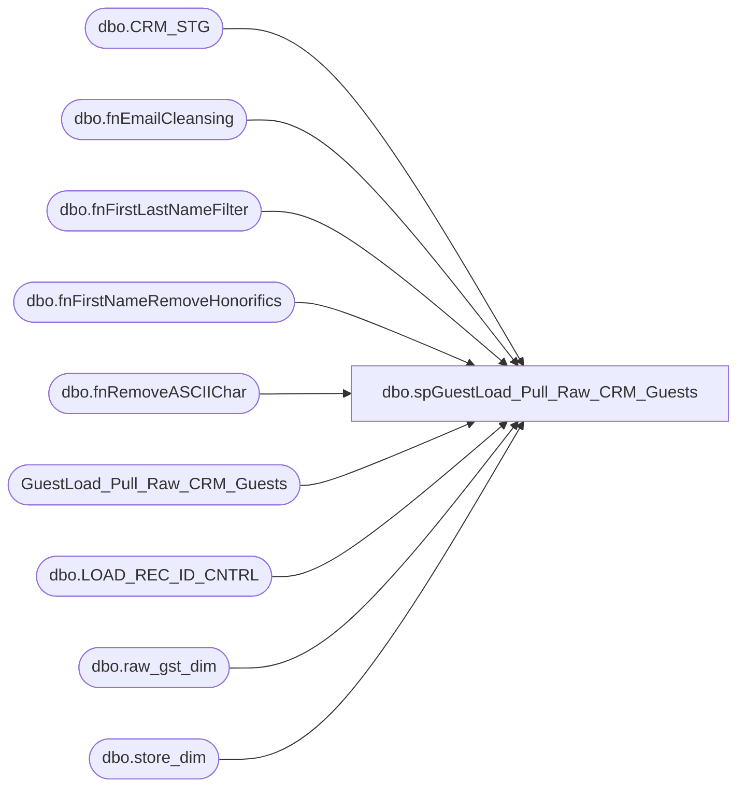

# dbo.spGuestLoad_Pull_Raw_CRM_Guests

**Database:** dw  
**Server:** papamart  

## Architecture Diagram



## Table Dependencies

| Referenced Table |
|---|
| dbo.CRM_STG |
| dbo.fnEmailCleansing |
| dbo.fnFirstLastNameFilter |
| dbo.fnFirstNameRemoveHonorifics |
| dbo.fnRemoveASCIIChar |
| GuestLoad_Pull_Raw_CRM_Guests |
| dbo.LOAD_REC_ID_CNTRL |
| dbo.raw_gst_dim |
| dbo.store_dim |

## Stored Procedure Code

```sql
-- =============================================================================================================
-- Name: spGuestLoad_Pull_Raw_CRM_Guests
--
-- Description:	
--		Take the staged crm guests and merge them with the raw_gst_dim to see if we have matches
--
-- Input:
--		@etl_log_id			int	
--			Current load to process
--
-- Output: 
--		data will be loaded into dw.dbo.GuestLoad_Pull_Raw_CRM_Guests 
--
-- Dependencies: 
--
-- EXAMPLE:
--		exec dw.dbo.spGuestLoad_Pull_Raw_CRM_Guests 1
--
-- Revision History
--		Name:			Date:			Comments:
--		Dave Rice		7/19/2010		created
--		dave			01/06/2011		added new email prefs
-- =============================================================================================================

CREATE PROCEDURE [dbo].[spGuestLoad_Pull_Raw_CRM_Guests](@etl_log_id int)
AS
BEGIN
-- SET NOCOUNT ON added to prevent extra result sets from
-- interfering with SELECT statements.
SET NOCOUNT ON;

--select * from raw_gst_dim
------exec dbo.[spGuestLoad_Pull_Raw_CRM_Guests] 14003
-- select * from GuestLoad_Pull_Raw_CRM_Guests
--declare @etl_log_id int
--set @etl_log_id = 17123

declare @null_date datetime
set @null_date = '1/1/1900'

-- pull and translate the crm staging data for this run
IF (Object_ID('tempdb..#staging_crm') IS NOT NULL) DROP TABLE #staging_crm
select distinct
	GST_CHKSUM,
	CRM_STG_ID,

	isnull(CRM_GST_NBR, '') CRM_GST_NBR,
	isnull(CRM_LYLTY_NBR, '') LYLTY_GST_NBR,

	isnull(dw.dbo.fnFirstNameRemoveHonorifics(dw.dbo.fnRemoveASCIIChar(FRST_NM, 0)),'') FRST_NM, 
	isnull(dw.dbo.fnRemoveASCIIChar(LAST_NM, 0),'') LAST_NM, 
	dw.dbo.fnFirstLastNameFilter (FRST_NM, LAST_NM) FirstLastNameFilter,
	isnull(BRTH_DT, @null_date) BRTH_DT, 

	isnull(GNDR_CD,'') GNDR_CD, 
	case 
		when GNDR_CD in ('M') then 'M'
		when GNDR_CD in ('F') then 'F'
		when GNDR_CD in ('U') then 'U'
		else 'U'
	end DRVD_GNDR_CD,

	isnull(EMAIL_ADDR_TXT, '') EMAIL_ADDR_TXT, 
	isnull(dw.dbo.fnEmailCleansing(dw.dbo.fnRemoveASCIIChar(EMAIL_ADDR_TXT, 1)), '') DRVD_EMAIL_ADDR_TXT,

	isnull(SND_EMAIL_CD, '') CRM_SND_EMAIL_CD,
	isnull(EMAIL_OPT_IN_CD, '') CRM_EMAIL_OPT_IN_CD,

-- opt_in flags mean the following
--0     unknown     
--1     yes           
--2     no	

	case 
		when EMAIL_OPT_IN_CD not in ('2') THEN 'Y'
		else 'N' 
--		when SND_EMAIL_CD NOT IN ('1','4') and EMAIL_OPT_IN_CD NOT IN ('2') THEN 'Y'
--		else 'N' 
	end DRVD_EMAIL_STAT_CD,
--	isnull(EMAIL_UPDT_DT, @null_date) EMAIL_UPDT_DT, 

	isnull(PHN_NBR, '') PHN_NBR, 
	isnull(PHN_EXTNS_NBR, '') PHN_EXTNS_NBR, 
	isnull(LANG_CD, '') LANG_CD, 

	isnull(SRC_REC_UPDT_DT, @null_date) LYLTY_UPDT_DT,
	isnull(CRM_MBRSHP_DT, @null_date) CRM_MBRSHP_DT,

	isnull(STR_NBR, -999) CRM_STR_NBR,
	isnull(st.store_key, -999) DRVD_CRM_REGIS_STR_ID,

	isnull(MOBILE_TXT_NBR, '') MOBILE_TXT_NBR, 
	isnull(MOBILE_TXT_STAT_CD, '') MOBILE_TXT_STAT_CD, 

	case 
		when MOBILE_TXT_STAT_CD IN ('1') THEN 'Y'
		when MOBILE_TXT_STAT_CD is null THEN 'U'
		else 'N' 
	end DRVD_MOBILE_TXT_STAT_CD,
-- don't include these dates, it will only push the raw count high
--	isnull(MOBILE_OPT_IN_DT, @null_date) MOBILE_OPT_IN_DT, 

	-- how to handle missing data?
	isnull(EMAILCERT_STAT_CD, '') EMAILCERT_STAT_CD, 
	case 
		when EMAILCERT_STAT_CD IN ('1') THEN 'Y'
		when EMAILCERT_STAT_CD is null THEN 'Y'
		else 'N' 
	end DRVD_EMAILCERT_STAT_CD,
-- don't include these dates, it will only push the raw count high
--	isnull(EMAILCERT_OPT_IN_DT, @null_date) EMAILCERT_OPT_IN_DT, 

	isnull(SFSPOINTS_STAT_CD, '') SFSPOINTS_STAT_CD, 
	case 
		when SFSPOINTS_STAT_CD IN ('1') THEN 'Y'
		when SFSPOINTS_STAT_CD is null THEN 'Y'
		else 'N' 
	end DRVD_SFSPOINTS_STAT_CD,
-- don't include these dates, it will only push the raw count high
--	isnull(SFSPOINTS_OPT_IN_DT, @null_date) SFSPOINTS_OPT_IN_DT, 

--	-- kiosk specific columns - these should be the null equivalent so that we can join easier
	cast('' as varchar(1)) NCK_NM,
	cast('' as varchar(1)) KSK_SNDR_SND_EMAIL_CD,
	cast('' as varchar(1)) PARNT_CNSNT_CD,
	cast('' as varchar(1)) DRVD_PARNT_CNSNT_IND,
	cast('' as varchar(1)) PARNT_NM,
	cast('' as varchar(1)) UNDR_AGE_13_CD,
	cast('' as varchar(1)) DRVD_UNDR_AGE_13_IND

into #staging_crm
from dwStaging.dbo.CRM_STG s with (nolock)
left join dw.dbo.store_dim st with (nolock)
	on st.store_id = s.STR_NBR
where s.[etl_log_id] = @etl_log_id


-- strip out the distinct chksums
IF (Object_ID('tempdb..#gst_chksum') IS NOT NULL) DROP TABLE #gst_chksum
select distinct gst_chksum
into #gst_chksum
from #staging_crm
create index ix_tmp_gst_chksum on #gst_chksum(gst_chksum)

-- find all raw guests from the staging chksums
IF (Object_ID('tempdb..#rgd') IS NOT NULL) DROP TABLE #rgd
select 
	rgd.raw_gst_id,
	rgd.raw_addr_id,
	rgd.gst_chksum,

	isnull(rgd.CRM_GST_NBR, '') CRM_GST_NBR,
	isnull(rgd.LYLTY_GST_NBR, '') LYLTY_GST_NBR,
	isnull(rgd.CRM_MBRSHP_DT, '') CRM_MBRSHP_DT,
    isnull(rgd.FRST_NM, '') FRST_NM,
	isnull(rgd.LAST_NM, '') LAST_NM,
	isnull(rgd.NCK_NM, '') NCK_NM,
	isnull(rgd.GNDR_CD, '') GNDR_CD,
	isnull(rgd.DRVD_GNDR_CD, '') DRVD_GNDR_CD,
	isnull(rgd.BRTH_DT, @null_date) BRTH_DT,

	isnull(rgd.PHN_NBR, '') PHN_NBR,
	isnull(rgd.PHN_EXTNS_NBR, '') PHN_EXTNS_NBR,

	isnull(rgd.EMAIL_ADDR_TXT, '') EMAIL_ADDR_TXT,
	isnull(rgd.DRVD_EMAIL_ADDR_TXT, '') DRVD_EMAIL_ADDR_TXT,
	isnull(rgd.UNDR_AGE_13_CD, '') UNDR_AGE_13_CD,
	isnull(rgd.DRVD_UNDR_AGE_13_IND, '') DRVD_UNDR_AGE_13_IND,

	isnull(rgd.KSK_SNDR_SND_EMAIL_CD, '') KSK_SNDR_SND_EMAIL_CD,
	isnull(rgd.DRVD_EMAIL_STAT_CD, '') DRVD_EMAIL_STAT_CD,

	isnull(rgd.LYLTY_UPDT_DT, @null_date) LYLTY_UPDT_DT,
	isnull(rgd.LANG_CD, '') LANG_CD,
	isnull(rgd.PARNT_CNSNT_CD, '') PARNT_CNSNT_CD,
	isnull(rgd.DRVD_PARNT_CNSNT_IND, '') DRVD_PARNT_CNSNT_IND,
	isnull(rgd.PARNT_NM, '') PARNT_NM,

	isnull(rgd.CRM_SND_EMAIL_CD, '') CRM_SND_EMAIL_CD,
	isnull(rgd.CRM_EMAIL_OPT_IN_CD, '') CRM_EMAIL_OPT_IN_CD,
--	isnull(rgd.EMAIL_OPT_IN_DT, @null_date) EMAIL_OPT_IN_DT, 

	isnull(rgd.CRM_STR_NBR, -999) CRM_STR_NBR,
	isnull(rgd.DRVD_CRM_REGIS_STR_ID, -999) DRVD_CRM_REGIS_STR_ID,

	isnull(rgd.MOBILE_TXT_NBR, '') MOBILE_TXT_NBR, 
	isnull(rgd.MOBILE_TXT_STAT_CD, '') MOBILE_TXT_STAT_CD, 
	isnull(rgd.DRVD_MOBILE_TXT_STAT_CD, '') DRVD_MOBILE_TXT_STAT_CD,
--	isnull(rgd.MOBILE_OPT_IN_DT, @null_date) MOBILE_OPT_IN_DT

	isnull(rgd.EMAILCERT_STAT_CD, '') EMAILCERT_STAT_CD,
	isnull(rgd.DRVD_EMAILCERT_STAT_CD, '') DRVD_EMAILCERT_STAT_CD,
	isnull(rgd.SFSPOINTS_STAT_CD, '') SFSPOINTS_STAT_CD,
	isnull(rgd.DRVD_SFSPOINTS_STAT_CD, '') DRVD_SFSPOINTS_STAT_CD

into #rgd
from #gst_chksum g
	join dw.dbo.raw_gst_dim rgd with (nolock)
	on rgd.gst_chksum = g.gst_chksum
create index ix_rgd_gst_chksum on #rgd(gst_chksum)


truncate table GuestLoad_Pull_Raw_CRM_Guests

insert into GuestLoad_Pull_Raw_CRM_Guests (
	CRM_STG_ID,
	CRM_GST_NBR,
	LYLTY_GST_NBR,
	FRST_NM, 
	LAST_NM, 
	FirstLastNameFilter,
	BRTH_DT, 
	GNDR_CD, 
	DRVD_GNDR_CD, 

	EMAIL_ADDR_TXT, 
	DRVD_EMAIL_ADDR_TXT, 

	CRM_SND_EMAIL_CD,
	CRM_EMAIL_OPT_IN_CD,
	DRVD_EMAIL_STAT_CD,

	PHN_NBR, 
	PHN_EXTNS_NBR, 
	LANG_CD,

	LYLTY_UPDT_DT, 
	CRM_MBRSHP_DT,

	CRM_STR_NBR,
	DRVD_CRM_REGIS_STR_ID,

	MOBILE_TXT_NBR,
	MOBILE_TXT_STAT_CD,
	DRVD_MOBILE_TXT_STAT_CD,

	EMAILCERT_STAT_CD,
	DRVD_EMAILCERT_STAT_CD,
	SFSPOINTS_STAT_CD,
	DRVD_SFSPOINTS_STAT_CD,

	gst_chksum,
	raw_addr_id,
	raw_gst_id
)
select 
	s.CRM_STG_ID,
	s.CRM_GST_NBR,
	s.LYLTY_GST_NBR,
	s.FRST_NM, 
	s.LAST_NM, 
	s.FirstLastNameFilter,
	case when s.BRTH_DT = @null_date then null else s.BRTH_DT end, 
	s.GNDR_CD, 
	s.DRVD_GNDR_CD, 

	s.EMAIL_ADDR_TXT, 
	s.DRVD_EMAIL_ADDR_TXT, 

	s.CRM_SND_EMAIL_CD,
	s.CRM_EMAIL_OPT_IN_CD,
	s.DRVD_EMAIL_STAT_CD,

	s.PHN_NBR, 
	s.PHN_EXTNS_NBR, 
	s.LANG_CD,

	s.LYLTY_UPDT_DT, 
	s.CRM_MBRSHP_DT,

	s.CRM_STR_NBR,
	s.DRVD_CRM_REGIS_STR_ID,

	s.MOBILE_TXT_NBR,
	s.MOBILE_TXT_STAT_CD,
	s.DRVD_MOBILE_TXT_STAT_CD,
--	s.MOBILE_OPT_IN_DT, 

	s.EMAILCERT_STAT_CD,
	s.DRVD_EMAILCERT_STAT_CD,
	s.SFSPOINTS_STAT_CD,
	s.DRVD_SFSPOINTS_STAT_CD,

	s.gst_chksum,
	c.raw_addr_id,
	rgd.raw_gst_id
from #staging_crm s
	-- grab the raw address
	join dwStaging.dbo.LOAD_REC_ID_CNTRL c with (nolock)
	on c.stg_id = s.CRM_STG_ID
	and c.STG_DTA_SET_CD = 'CRM'

	left join #rgd rgd with (nolock)
	on rgd.raw_addr_id = c.raw_addr_id
	and rgd.gst_chksum = s.gst_chksum
	and rgd.CRM_GST_NBR = s.CRM_GST_NBR
	and rgd.LYLTY_GST_NBR = s.LYLTY_GST_NBR
    and rgd.FRST_NM = s.FRST_NM
	and rgd.LAST_NM = s.LAST_NM
	and rgd.NCK_NM = s.NCK_NM

	and rgd.GNDR_CD = s.GNDR_CD
	and rgd.DRVD_GNDR_CD = s.DRVD_GNDR_CD

	and rgd.BRTH_DT = s.BRTH_DT
	and rgd.PHN_NBR = s.PHN_NBR
	and rgd.PHN_EXTNS_NBR = s.PHN_EXTNS_NBR

	and rgd.EMAIL_ADDR_TXT = s.EMAIL_ADDR_TXT
	and rgd.DRVD_EMAIL_ADDR_TXT = s.DRVD_EMAIL_ADDR_TXT

	and rgd.UNDR_AGE_13_CD = s.UNDR_AGE_13_CD
	and rgd.DRVD_UNDR_AGE_13_IND = s.DRVD_UNDR_AGE_13_IND

	and rgd.KSK_SNDR_SND_EMAIL_CD = s.KSK_SNDR_SND_EMAIL_CD
	and rgd.DRVD_EMAIL_STAT_CD = s.DRVD_EMAIL_STAT_CD

	and rgd.LYLTY_UPDT_DT = s.LYLTY_UPDT_DT
	and rgd.CRM_MBRSHP_DT = s.CRM_MBRSHP_DT
	and rgd.LANG_CD = s.LANG_CD
	and rgd.PARNT_CNSNT_CD = s.PARNT_CNSNT_CD
	and rgd.DRVD_PARNT_CNSNT_IND = s.DRVD_PARNT_CNSNT_IND
	and rgd.PARNT_NM = s.PARNT_NM
	and rgd.CRM_SND_EMAIL_CD = s.CRM_SND_EMAIL_CD
	and rgd.CRM_EMAIL_OPT_IN_CD = s.CRM_EMAIL_OPT_IN_CD

	and rgd.CRM_STR_NBR = s.CRM_STR_NBR
	and rgd.DRVD_CRM_REGIS_STR_ID = s.DRVD_CRM_REGIS_STR_ID

	and rgd.MOBILE_TXT_NBR = s.MOBILE_TXT_NBR
	and rgd.MOBILE_TXT_STAT_CD = s.MOBILE_TXT_STAT_CD
	and rgd.DRVD_MOBILE_TXT_STAT_CD = s.DRVD_MOBILE_TXT_STAT_CD

	and rgd.EMAILCERT_STAT_CD = s.EMAILCERT_STAT_CD
	and rgd.DRVD_EMAILCERT_STAT_CD = s.DRVD_EMAILCERT_STAT_CD
	and rgd.SFSPOINTS_STAT_CD = s.SFSPOINTS_STAT_CD
	and rgd.DRVD_SFSPOINTS_STAT_CD = s.DRVD_SFSPOINTS_STAT_CD

END
```

