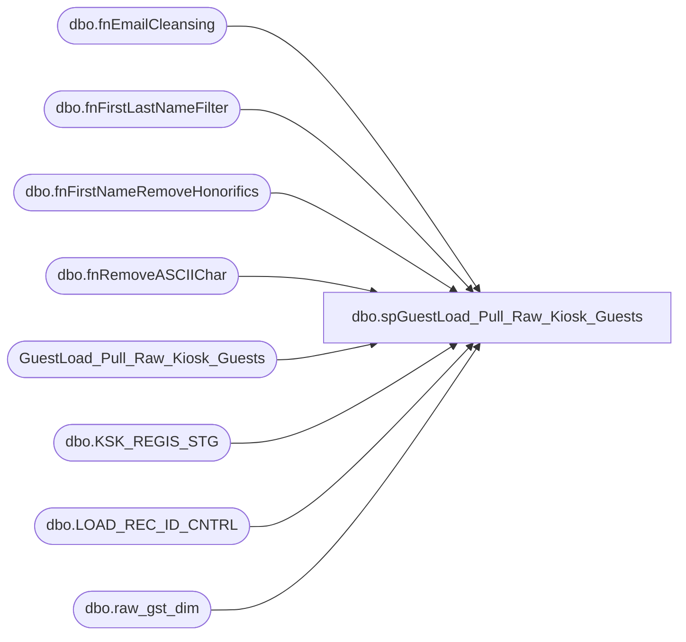

# dbo.spGuestLoad_Pull_Raw_Kiosk_Guests

**Database:** dw  
**Server:** papamart  

## Architecture Diagram



## Table Dependencies

| Referenced Table |
|---|
| dbo.fnEmailCleansing |
| dbo.fnFirstLastNameFilter |
| dbo.fnFirstNameRemoveHonorifics |
| dbo.fnRemoveASCIIChar |
| GuestLoad_Pull_Raw_Kiosk_Guests |
| dbo.KSK_REGIS_STG |
| dbo.LOAD_REC_ID_CNTRL |
| dbo.raw_gst_dim |

## Stored Procedure Code

```sql
-- =============================================================================================================
-- Name: spGuestLoad_Pull_Raw_Kiosk_Guests
--
-- Description:	
--		Take the staged kiosk guests and merge them with the raw_gst_dim to see if we have matches
--
-- Input:
--		@etl_log_id			int	
--			Current load to process
--
-- Output: 
--		data will be loaded into dw.dbo.GuestLoad_Pull_Raw_Kiosk_Guests 
--
-- Dependencies: 
--
-- EXAMPLE:
--		exec dw.dbo.spGuestLoad_Pull_Raw_Kiosk_Guests 1
--
-- Revision History
--		Name:			Date:			Comments:
--		Dave Rice		7/19/2010		created
--		Dave Rice		12/13/2010		new reqs on opt-in/out.
--		Keith Missey	2/6/2012		updated case statement to remove scenario where a registration from the web opt-outs e-mail
-- =============================================================================================================

CREATE PROCEDURE [dbo].[spGuestLoad_Pull_Raw_Kiosk_Guests](@etl_log_id int)
AS
BEGIN
-- SET NOCOUNT ON added to prevent extra result sets from
-- interfering with SELECT statements.
SET NOCOUNT ON;

------exec dbo.[spGuestLoad_Pull_Raw_Kiosk_Guests] 13882
--select top 1 etl_log_id from dwstaging.dbo.load_rec_id_cntrl with (nolock)
--declare @etl_log_id int
--set @etl_log_id = 14003

declare @null_date datetime
set @null_date = '1/1/1900'

-- pull and translate the kiosk staging data for this run
IF (Object_ID('tempdb..#staging_kiosk') IS NOT NULL) DROP TABLE #staging_kiosk
select 
	GST_CHKSUM,
	KSK_REGIS_STG_ID,

	isnull(dw.dbo.fnFirstNameRemoveHonorifics(dw.dbo.fnRemoveASCIIChar(SNDR_FRST_NM, 0)),'') SNDR_FRST_NM, 
	isnull(dw.dbo.fnRemoveASCIIChar(SNDR_LAST_NM, 0),'') SNDR_LAST_NM, 
	dw.dbo.fnFirstLastNameFilter (SNDR_FRST_NM, SNDR_LAST_NM) FirstLastNameFilter,

	isnull(dw.dbo.fnRemoveASCIIChar(SNDR_ALIAS_NM, 0),'') SNDR_ALIAS_NM, 
	isnull(SNDR_BRTH_DT, @null_date) SNDR_BRTH_DT, 

	isnull(SNDR_GNDR_TXT,'') SNDR_GNDR_TXT, 
	case 
		when SNDR_GNDR_TXT in ('BOY', 'MALE', 'M', 'NIÑO') then 'M'
		when SNDR_GNDR_TXT in ('GIRL', 'F', 'FEMALE', 'FEMAL', 'NIÑA') then 'F'
		else 'U'
	end DRVD_GNDR_CD,

	isnull(SNDR_EMAIL_ADDR_TXT, '') SNDR_EMAIL_ADDR_TXT, 
	isnull(dw.dbo.fnEmailCleansing(dw.dbo.fnRemoveASCIIChar(SNDR_EMAIL_ADDR_TXT, 1)), '') DRVD_EMAIL_ADDR_TXT,

	isnull(SNDR_SND_EMAIL_CD, '') SNDR_SND_EMAIL_CD,

	case
		when SNDR_SND_EMAIL_CD in ('KEEP') then 'Y'
		when SNDR_SND_EMAIL_CD in ('Y', 'YES', 'T', 'TRUE', '1', '') or SNDR_SND_EMAIL_CD is null then 'Y'
		when SNDR_SND_EMAIL_CD in ('N', 'NO', 'F', 'FALSE', '0') AND str_nbr NOT IN (13,2013) then 'N' --DON'T LET WEB OPT-OUT E-MAIL
		when SNDR_SND_EMAIL_CD in ('N', 'NO', 'F', 'FALSE', '0') AND str_nbr IN (13,2013) then 'Y' --MAY OPT-IN EXISTING OPT-OUTS, BUT VERY SMALL AMOUNT OF RECORDS ARE IMPACTED
		else 'U'
	end DRVD_EMAIL_STAT_CD,
str_nbr,
	isnull(TRN_LANG_CD,'') TRN_LANG_CD, 

	isnull(PARNT_CNSNT_CD,'') PARNT_CNSNT_CD, 
	case 
		when PARNT_CNSNT_CD in ('YES', 'TRUE') then 'Y'
		when PARNT_CNSNT_CD in ('NO', 'FALSE', '0', 'N') then 'N'
		else 'U'
	end DRVD_PARNT_CNSNT_IND,

	isnull(PARNT_NM,'') PARNT_NM, 

	isnull(UNDR_AGE_13_CD,'') UNDR_AGE_13_CD,
	case 
		when UNDR_AGE_13_CD in ('YES', 'TRUE') then 'Y'
		when UNDR_AGE_13_CD in ('NO', 'FALSE', '0', 'N') then 'N'
		else 'U'
	end DRVD_UNDR_AGE_13_IND,

--	-- loyalty specific columns - these should be the null equivalent so that we can join easier
	cast('' as varchar(1)) CRM_GST_NBR,
	cast(''	as varchar(1)) LYLTY_GST_NBR,
	cast(''	as varchar(1)) PHN_NBR,
	cast(''	as varchar(1)) PHN_EXTNS_NBR,
	@null_date LYLTY_UPDT_DT,
	@null_date CRM_MBRSHP_DT,
	cast(''	as varchar(1)) CRM_SND_EMAIL_CD,
	cast(''	as varchar(1)) CRM_EMAIL_OPT_IN_CD,
	cast(-999 as int) CRM_STR_NBR,
	cast(-999 as int) DRVD_CRM_REGIS_STR_ID,

	cast(''	as varchar(1)) MOBILE_TXT_NBR,
	cast(''	as varchar(1)) MOBILE_TXT_STAT_CD,
	cast(''	as varchar(1)) DRVD_MOBILE_TXT_STAT_CD,

	cast(''	as varchar(1)) EMAILCERT_STAT_CD,
	cast(''	as varchar(1)) DRVD_EMAILCERT_STAT_CD,
	cast(''	as varchar(1)) SFSPOINTS_STAT_CD,
	cast(''	as varchar(1)) DRVD_SFSPOINTS_STAT_CD

into #staging_kiosk
from dwStaging.dbo.KSK_REGIS_STG with (nolock)
where [etl_log_id] = @etl_log_id

create index ix_staging_kiosk on #staging_kiosk(KSK_REGIS_STG_ID)

-- strip out the distinct chksums
IF (Object_ID('tempdb..#gst_chksum') IS NOT NULL) DROP TABLE #gst_chksum
select distinct gst_chksum
into #gst_chksum
from #staging_kiosk
create index ix_tmp_gst_chksum on #gst_chksum(gst_chksum)

-- find all raw guests from the staging chksums
IF (Object_ID('tempdb..#rgd') IS NOT NULL) DROP TABLE #rgd
select 
	rgd.raw_gst_id,
	rgd.raw_addr_id,
	rgd.gst_chksum,

	isnull(rgd.CRM_GST_NBR, '') CRM_GST_NBR,
	isnull(rgd.LYLTY_GST_NBR, '') LYLTY_GST_NBR,
	isnull(rgd.CRM_MBRSHP_DT, '') CRM_MBRSHP_DT,
    isnull(rgd.FRST_NM, '') FRST_NM,
	isnull(rgd.LAST_NM, '') LAST_NM,
	isnull(rgd.NCK_NM, '') NCK_NM,
	isnull(rgd.GNDR_CD, '') GNDR_CD,
	isnull(rgd.DRVD_GNDR_CD, '') DRVD_GNDR_CD,
	isnull(rgd.BRTH_DT, @null_date) BRTH_DT,

	isnull(rgd.PHN_NBR, '') PHN_NBR,
	isnull(rgd.PHN_EXTNS_NBR, '') PHN_EXTNS_NBR,

	isnull(rgd.EMAIL_ADDR_TXT, '') EMAIL_ADDR_TXT,
	isnull(rgd.DRVD_EMAIL_ADDR_TXT, '') DRVD_EMAIL_ADDR_TXT,
	isnull(rgd.UNDR_AGE_13_CD, '') UNDR_AGE_13_CD,
	isnull(rgd.DRVD_UNDR_AGE_13_IND, '') DRVD_UNDR_AGE_13_IND,

	isnull(rgd.KSK_SNDR_SND_EMAIL_CD, '') KSK_SNDR_SND_EMAIL_CD,
	isnull(rgd.DRVD_EMAIL_STAT_CD, '') DRVD_EMAIL_STAT_CD,

	isnull(rgd.LYLTY_UPDT_DT, @null_date) LYLTY_UPDT_DT,
	isnull(rgd.LANG_CD, '') LANG_CD,
	isnull(rgd.PARNT_CNSNT_CD, '') PARNT_CNSNT_CD,
	isnull(rgd.DRVD_PARNT_CNSNT_IND, '') DRVD_PARNT_CNSNT_IND,
	isnull(rgd.PARNT_NM, '') PARNT_NM,

	isnull(rgd.CRM_SND_EMAIL_CD, '') CRM_SND_EMAIL_CD,
	isnull(rgd.CRM_EMAIL_OPT_IN_CD, '') CRM_EMAIL_OPT_IN_CD,

	isnull(rgd.CRM_STR_NBR, -999) CRM_STR_NBR,
	isnull(rgd.DRVD_CRM_REGIS_STR_ID, -999) DRVD_CRM_REGIS_STR_ID,

	isnull(rgd.MOBILE_TXT_NBR, '') MOBILE_TXT_NBR,
	isnull(rgd.MOBILE_TXT_STAT_CD, '') MOBILE_TXT_STAT_CD,
	isnull(rgd.DRVD_MOBILE_TXT_STAT_CD, '') DRVD_MOBILE_TXT_STAT_CD,

	isnull(rgd.EMAILCERT_STAT_CD, '') EMAILCERT_STAT_CD,
	isnull(rgd.DRVD_MOBILE_TXT_STAT_CD, '') DRVD_EMAILCERT_STAT_CD,
	isnull(rgd.SFSPOINTS_STAT_CD, '') SFSPOINTS_STAT_CD,
	isnull(rgd.DRVD_SFSPOINTS_STAT_CD, '') DRVD_SFSPOINTS_STAT_CD

--select * from raw_gst_dim


into #rgd
from #gst_chksum g
	join dw.dbo.raw_gst_dim rgd with (nolock)
	on rgd.gst_chksum = g.gst_chksum
create index ix_rgd_gst_chksum on #rgd(gst_chksum)

truncate table GuestLoad_Pull_Raw_Kiosk_Guests

insert into GuestLoad_Pull_Raw_Kiosk_Guests (
	KSK_REGIS_STG_ID,
	SNDR_FRST_NM,
	SNDR_LAST_NM,
	FirstLastNameFilter,
	SNDR_ALIAS_NM,
	SNDR_BRTH_DT,
	SNDR_GNDR_TXT,
	DRVD_GNDR_CD,

	SNDR_EMAIL_ADDR_TXT,
	DRVD_EMAIL_ADDR_TXT,

	SNDR_SND_EMAIL_CD,
	DRVD_EMAIL_STAT_CD,

	TRN_LANG_CD,
	PARNT_CNSNT_CD,
	DRVD_PARNT_CNSNT_IND,
	PARNT_NM,
	UNDR_AGE_13_CD,
	DRVD_UNDR_AGE_13_IND,

	gst_chksum,
	raw_addr_id,
	raw_gst_id
)
select 
	s.KSK_REGIS_STG_ID,
	s.SNDR_FRST_NM, 
	s.SNDR_LAST_NM, 
	s.FirstLastNameFilter,
	s.SNDR_ALIAS_NM, 
	case when s.SNDR_BRTH_DT = @null_date then null else s.SNDR_BRTH_DT end, 
	s.SNDR_GNDR_TXT, 
	s.DRVD_GNDR_CD, 

	s.SNDR_EMAIL_ADDR_TXT, 
	s.DRVD_EMAIL_ADDR_TXT, 

	s.SNDR_SND_EMAIL_CD,
	s.DRVD_EMAIL_STAT_CD,

	s.TRN_LANG_CD, 
	s.PARNT_CNSNT_CD, 
	s.DRVD_PARNT_CNSNT_IND, 

	s.PARNT_NM, 
	s.UNDR_AGE_13_CD,
	s.DRVD_UNDR_AGE_13_IND,

	s.gst_chksum,
	c.raw_addr_id,
	rgd.raw_gst_id

from #staging_kiosk s
	-- grab the raw address
	join dwStaging.dbo.LOAD_REC_ID_CNTRL c with (nolock)
	on c.stg_id = s.KSK_REGIS_STG_ID
	and c.STG_DTA_SET_CD = 'KSK'

	left join #rgd rgd with (nolock)
	on rgd.raw_addr_id = c.raw_addr_id
	and rgd.gst_chksum = s.gst_chksum
	and rgd.CRM_GST_NBR = s.CRM_GST_NBR
	and rgd.LYLTY_GST_NBR = s.LYLTY_GST_NBR
    and rgd.FRST_NM = s.SNDR_FRST_NM
	and rgd.LAST_NM = s.SNDR_LAST_NM
	and rgd.NCK_NM = s.SNDR_ALIAS_NM

	and rgd.GNDR_CD = s.SNDR_GNDR_TXT
	and rgd.DRVD_GNDR_CD = s.DRVD_GNDR_CD

	and rgd.BRTH_DT = s.SNDR_BRTH_DT
	and rgd.PHN_NBR = s.PHN_NBR
	and rgd.PHN_EXTNS_NBR = s.PHN_EXTNS_NBR

	and rgd.EMAIL_ADDR_TXT = s.SNDR_EMAIL_ADDR_TXT
	and rgd.DRVD_EMAIL_ADDR_TXT = s.DRVD_EMAIL_ADDR_TXT

	and rgd.UNDR_AGE_13_CD = s.UNDR_AGE_13_CD
	and rgd.DRVD_UNDR_AGE_13_IND = s.DRVD_UNDR_AGE_13_IND

	and rgd.KSK_SNDR_SND_EMAIL_CD = s.SNDR_SND_EMAIL_CD
	and rgd.DRVD_EMAIL_STAT_CD = s.DRVD_EMAIL_STAT_CD

	and rgd.LYLTY_UPDT_DT = s.LYLTY_UPDT_DT
	and rgd.CRM_MBRSHP_DT = s.CRM_MBRSHP_DT
	and rgd.LANG_CD = s.TRN_LANG_CD
	and rgd.PARNT_CNSNT_CD = s.PARNT_CNSNT_CD
	and rgd.DRVD_PARNT_CNSNT_IND = s.DRVD_PARNT_CNSNT_IND
	and rgd.PARNT_NM = s.PARNT_NM
	and rgd.CRM_SND_EMAIL_CD = s.CRM_SND_EMAIL_CD
	and rgd.CRM_EMAIL_OPT_IN_CD = s.CRM_EMAIL_OPT_IN_CD

	and rgd.CRM_STR_NBR = s.CRM_STR_NBR
	and rgd.DRVD_CRM_REGIS_STR_ID = s.DRVD_CRM_REGIS_STR_ID

	and rgd.MOBILE_TXT_NBR = s.MOBILE_TXT_NBR
	and rgd.MOBILE_TXT_STAT_CD = s.MOBILE_TXT_STAT_CD
	and rgd.DRVD_MOBILE_TXT_STAT_CD = s.DRVD_MOBILE_TXT_STAT_CD

	and rgd.EMAILCERT_STAT_CD = s.EMAILCERT_STAT_CD
	and rgd.DRVD_EMAILCERT_STAT_CD = s.DRVD_EMAILCERT_STAT_CD
	and rgd.SFSPOINTS_STAT_CD = s.SFSPOINTS_STAT_CD
	and rgd.DRVD_SFSPOINTS_STAT_CD = s.DRVD_SFSPOINTS_STAT_CD


END
```

