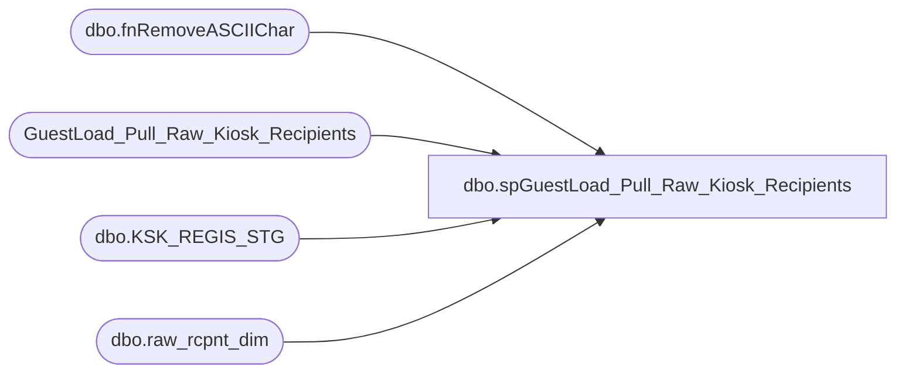

# dbo.spGuestLoad_Pull_Raw_Kiosk_Recipients

**Database:** dw  
**Server:** papamart  

## Architecture Diagram



## Table Dependencies

| Referenced Table |
|---|
| dbo.fnRemoveASCIIChar |
| GuestLoad_Pull_Raw_Kiosk_Recipients |
| dbo.KSK_REGIS_STG |
| dbo.raw_rcpnt_dim |

## Stored Procedure Code

```sql
-- =============================================================================================================
-- Name: spGuestLoad_Pull_Raw_Kiosk_Recipients
--
-- Description:	
--		Take the staged kiosk recipients and merge them with the raw_rcpnt_dim to see if we have matches
--
-- Input:
--		@etl_log_id			int	
--			Current load to process
--
-- Output: 
--		data will be loaded into dw.dbo.GuestLoad_Pull_Raw_Kiosk_Recipients
--
-- Dependencies: 
--
-- EXAMPLE:
--		exec crm.dbo.spGuestLoad_Pull_Raw_Kiosk_Recipients 1
--
-- Revision History
--		Name:			Date:			Comments:
--		Dave Rice		7/19/2010		created
-- =============================================================================================================
CREATE PROCEDURE [dbo].[spGuestLoad_Pull_Raw_Kiosk_Recipients](@etl_log_id int)
AS
BEGIN
-- SET NOCOUNT ON added to prevent extra result sets from
-- interfering with SELECT statements.
SET NOCOUNT ON;

------exec dbo.[spGuestLoad_Pull_Raw_Kiosk_Recipients] 13919
--declare @etl_log_id int
--set @etl_log_id = 13990

-- pull and translate the kiosk staging data for this run
IF (Object_ID('tempdb..#staging_kiosk') IS NOT NULL) DROP TABLE #staging_kiosk
select 
	distinct 
	RCPNT_CHKSUM,
	KSK_REGIS_STG_ID,

	isnull(dw.dbo.fnRemoveASCIIChar('RCPNT_FRST_NM',0), '') RCPNT_FRST_NM, 
	isnull(dw.dbo.fnRemoveASCIIChar('RCPNT_LAST_NM',0), '') RCPNT_LAST_NM, 
	isnull(RCPNT_BRTH_DT, '1/1/1900') RCPNT_BRTH_DT, 
	isnull(RCPNT_GNDR_TXT, '') RCPNT_GNDR_TXT, 
	case 
		when RCPNT_GNDR_TXT in ('BOY', 'MALE', 'M', 'NIÑO') then 'M'
		when RCPNT_GNDR_TXT in ('GIRL', 'F', 'FEMALE', 'FEMAL', 'NIÑA') then 'F'
		else 'U'
	end DRVD_GNDR_CD,
	isnull(RCPNT_EMAIL_ADDR_TXT, '') RCPNT_EMAIL_ADDR_TXT, 
	isnull(RCPNT_ADDR_LN_1_TXT, '') RCPNT_ADDR_LN_1_TXT, 
	isnull(RCPNT_ADDR_LN_2_TXT, '') RCPNT_ADDR_LN_2_TXT, 
	isnull(RCPNT_APT_UNIT_NBR, '') RCPNT_APT_UNIT_NBR, 
	isnull(RCPNT_CTY_NM, '') RCPNT_CTY_NM, 
	isnull(RCPNT_PSTL_CD, '') RCPNT_PSTL_CD, 
	isnull(RCPNT_ST_PRVNC_TXT, '') RCPNT_ST_PRVNC_TXT, 
	isnull(RCPNT_CNTRY_TXT, '') RCPNT_CNTRY_TXT
into #staging_kiosk
from dwStaging.dbo.KSK_REGIS_STG with (nolock)
where [etl_log_id] = @etl_log_id
create index ix_staging_kiosk on #staging_kiosk(KSK_REGIS_STG_ID)

-- strip out the distinct chksums
IF (Object_ID('tempdb..#rcpnt_chksum') IS NOT NULL) DROP TABLE #rcpnt_chksum
select distinct rcpnt_chksum
into #rcpnt_chksum
from #staging_kiosk
create index ix_tmp_rcpnt_chksum on #rcpnt_chksum(rcpnt_chksum)

-- find all raw guests from the staging chksums
IF (Object_ID('tempdb..#rcpnt') IS NOT NULL) DROP TABLE #rcpnt
select 
	rrd.raw_rcpnt_id,
	rrd.rcpnt_chksum,
	isnull(rrd.FRST_NM, '') FRST_NM,
	isnull(rrd.LAST_NM, '') LAST_NM,
	isnull(rrd.GNDR_CD, '') GNDR_CD,
	isnull(rrd.DRVD_GNDR_CD, '') DRVD_GNDR_CD,
	
	isnull(rrd.BRTH_DT, '1/1/1900') BRTH_DT,
	isnull(rrd.EMAIL_ADDR_TXT, '') EMAIL_ADDR_TXT,
	isnull(rrd.ADDR_LN_1_TXT, '') ADDR_LN_1_TXT,
	isnull(rrd.ADDR_LN_2_TXT, '') ADDR_LN_2_TXT,
	isnull(rrd.APT_UNIT_NBR, '') APT_UNIT_NBR,
	isnull(rrd.CTY_NM, '') CTY_NM,
	isnull(rrd.ST_PRVNC_TXT, '') ST_PRVNC_TXT,
	isnull(rrd.PSTL_CD, '') PSTL_CD,
	isnull(rrd.CNTRY_TXT, '') CNTRY_TXT
into #rcpnt
from #rcpnt_chksum g
	join dw.dbo.raw_rcpnt_dim rrd with (nolock)
	on rrd.rcpnt_chksum = g.rcpnt_chksum
create index ix_rrd_rcpnt_chksum on #rcpnt(rcpnt_chksum)

truncate table GuestLoad_Pull_Raw_Kiosk_Recipients

insert into GuestLoad_Pull_Raw_Kiosk_Recipients (
	KSK_REGIS_STG_ID,
	RAW_RCPNT_ID,
	RCPNT_CHKSUM,

	RCPNT_FRST_NM,
	RCPNT_LAST_NM,
	RCPNT_GNDR_TXT,
	DRVD_GNDR_CD,
	
	RCPNT_BRTH_DT,
	RCPNT_EMAIL_ADDR_TXT,
	RCPNT_ADDR_LN_1_TXT,
	RCPNT_ADDR_LN_2_TXT,
	RCPNT_APT_UNIT_NBR,
	RCPNT_CTY_NM,
	RCPNT_ST_PRVNC_TXT,
	RCPNT_PSTL_CD,
	RCPNT_CNTRY_TXT
)
select 
	s.KSK_REGIS_STG_ID,
	rrd.RAW_RCPNT_ID,
	s.RCPNT_CHKSUM,

	s.RCPNT_FRST_NM,
	s.RCPNT_LAST_NM,
	s.RCPNT_GNDR_TXT,
	s.DRVD_GNDR_CD,
	
	s.RCPNT_BRTH_DT,
	s.RCPNT_EMAIL_ADDR_TXT,
	s.RCPNT_ADDR_LN_1_TXT,
	s.RCPNT_ADDR_LN_2_TXT,
	s.RCPNT_APT_UNIT_NBR,
	s.RCPNT_CTY_NM,
	s.RCPNT_ST_PRVNC_TXT,
	s.RCPNT_PSTL_CD,
	s.RCPNT_CNTRY_TXT
from #staging_kiosk s
	left join #rcpnt rrd with (nolock)
	on rrd.rcpnt_chksum = s.rcpnt_chksum

    and rrd.FRST_NM = s.RCPNT_FRST_NM
	and rrd.LAST_NM = s.RCPNT_LAST_NM
	and rrd.GNDR_CD = s.RCPNT_GNDR_TXT
	and rrd.DRVD_GNDR_CD = s.DRVD_GNDR_CD
	and rrd.BRTH_DT = s.RCPNT_BRTH_DT
	and rrd.EMAIL_ADDR_TXT = s.RCPNT_EMAIL_ADDR_TXT
	and rrd.ADDR_LN_1_TXT = s.RCPNT_ADDR_LN_1_TXT
	and rrd.ADDR_LN_2_TXT = s.RCPNT_ADDR_LN_2_TXT
	and rrd.APT_UNIT_NBR = s.RCPNT_APT_UNIT_NBR
	and rrd.CTY_NM = s.RCPNT_CTY_NM
	and rrd.ST_PRVNC_TXT = s.RCPNT_ST_PRVNC_TXT
	and rrd.PSTL_CD = s.RCPNT_PSTL_CD
	and rrd.CNTRY_TXT = s.RCPNT_CNTRY_TXT
END
```

