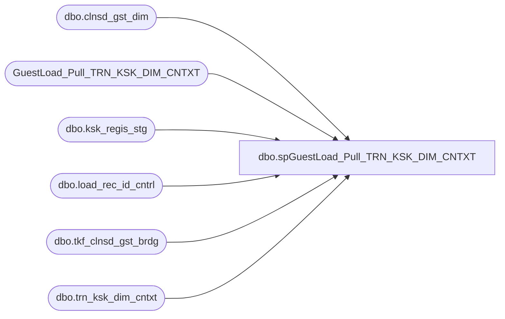

# dbo.spGuestLoad_Pull_TRN_KSK_DIM_CNTXT

**Database:** dw  
**Server:** papamart  

## Architecture Diagram



## Table Dependencies

| Referenced Table |
|---|
| dbo.clnsd_gst_dim |
| GuestLoad_Pull_TRN_KSK_DIM_CNTXT |
| dbo.ksk_regis_stg |
| dbo.load_rec_id_cntrl |
| dbo.tkf_clnsd_gst_brdg |
| dbo.trn_ksk_dim_cntxt |

## Stored Procedure Code

```sql
-- =============================================================================================================
-- Name: spGuestLoad_Pull_TRN_KSK_DIM_CNTXT
--
-- Description:	
--		pull a list of contexts tied to the tkf records
--		contexts are basically simple common records around a tkf record.  they were common enough that it made
--		sense to put them in one table so we didn't have a bunch of duplicated data.  more efficient this way
--
--		drew's original query was ill tuned for large amounts of data.
--		so, i tried many things, but what seemed to work the best was using a temporary table
--
-- Input:
--		@etl_log_id			int	
--			Current load to process
--
-- Output: 
--		data will be loaded into dw.dbo.GuestLoad_Pull_TRN_KSK_DIM_CNTXT 
--
-- Dependencies: 
--
-- EXAMPLE:
--		exec crm.dbo.spGuestLoad_Pull_TRN_KSK_DIM_CNTXT 1
--
-- Revision History
--		Name:			Date:			Comments:
--		Dave Rice		7/19/2010		created
-- =============================================================================================================
CREATE PROCEDURE [dbo].[spGuestLoad_Pull_TRN_KSK_DIM_CNTXT](@etl_log_id int)
AS
BEGIN
-- SET NOCOUNT ON added to prevent extra result sets from
-- interfering with SELECT statements.
SET NOCOUNT ON;

------exec dbo.[spGuestLoad_Pull_Raw_CRM_Guests] 14003
--select top 1 etl_log_id from dwstaging.dbo.load_rec_id_cntrl with (nolock)
--declare @etl_log_id int
--set @etl_log_id = 14629

-- get the cleansed kiosk guests for this load
IF (Object_ID('tempdb..#tmp_clnsd_gst_id') IS NOT NULL) DROP TABLE #tmp_clnsd_gst_id
select distinct b.clnsd_gst_id 
into #tmp_clnsd_gst_id
from dwstaging.dbo.load_rec_id_cntrl lric with (nolock)
	join dw.dbo.tkf_clnsd_gst_brdg b with (nolock) 
	on b.clnsd_gst_id = lric.clnsd_gst_id
WHERE lric.etl_log_id = @etl_log_id
	and lric.clnsd_gst_id >= 0
create index ix_tmp_clnsd_gst_id on #tmp_clnsd_gst_id(clnsd_gst_id)

IF (Object_ID('tempdb..#tmp_clnsd_addr_id') IS NOT NULL) DROP TABLE #tmp_clnsd_addr_id
select distinct cgd.clnsd_addr_id 
into #tmp_clnsd_addr_id
from dwstaging.dbo.load_rec_id_cntrl lric with (nolock)
	join dw.dbo.tkf_clnsd_gst_brdg b with (nolock) 
	on b.clnsd_gst_id = lric.clnsd_gst_id
	join dw.dbo.clnsd_gst_dim cgd with (nolock) 
	on cgd.clnsd_gst_id = b.clnsd_gst_id
WHERE lric.etl_log_id = @etl_log_id
	and lric.clnsd_gst_id >= 0
	and cgd.clnsd_addr_id >= 0
create index ix_tmp_clnsd_addr_id on #tmp_clnsd_addr_id(clnsd_addr_id)

truncate table GuestLoad_Pull_TRN_KSK_DIM_CNTXT

insert into GuestLoad_Pull_TRN_KSK_DIM_CNTXT (KSK_REGIS_STG_ID, STG_DTA_SET_CD, TRN_KSK_CNTXT_ID, GST_VST_RECUR_CD, GST_VST_RECUR_DESCR, ADDR_VST_RECUR_CD, ADDR_VST_RECUR_DESCR, PRTY_TRN_IND, GIFT_IND, KSK_NBR, KSK_LANG_CD)
SELECT distinct
	d.ksk_regis_stg_id,
	d.stg_dta_set_cd,
	tkdc.trn_ksk_cntxt_id,
	d.gst_vst_recur_cd,
	d.gst_vst_recur_descr,
	d.addr_vst_recur_cd,
	d.addr_vst_recur_descr,
	d.prty_trn_ind,
	d.gift_ind,
	d.ksk_nbr,
	d.ksk_lang_cd
from (
	select distinct 
		krs.ksk_regis_stg_id,
		lric.stg_dta_set_cd,
		CASE WHEN tkf.clnsd_gst_id IS NULL THEN 'N' ELSE 'R' END gst_vst_recur_cd,
		CASE WHEN tkf.clnsd_gst_id IS NULL THEN 'New' ELSE 'Repeat' END  gst_vst_recur_descr,
		CASE WHEN cad.clnsd_addr_id IS NULL THEN 'N' ELSE 'R' END addr_vst_recur_cd,
		CASE WHEN cad.clnsd_addr_id IS NULL THEN 'New' ELSE 'Repeat' END  addr_vst_recur_descr,
		CASE WHEN krs.prty_trn_cd IN ('Y', 'YES', 'T', 'TRUE', '1') THEN 'Y' ELSE 'N' END prty_trn_ind,
		CASE WHEN krs.rcpnt_typ_cd = 'FOR_ME' THEN 'N' ELSE 'Y' END  gift_ind,
		IsNull(krs.ksk_nbr, -1) ksk_nbr,
		IsNull(krs.trn_lang_cd, '') ksk_lang_cd
	FROM dwstaging.dbo.load_rec_id_cntrl lric with (nolock)
		INNER JOIN dwstaging.dbo.ksk_regis_stg krs with (nolock)
		ON lric.stg_id = krs.ksk_regis_stg_id
		AND lric.stg_dta_set_cd = 'KSK'
		LEFT OUTER JOIN #tmp_clnsd_gst_id tkf
		ON tkf.clnsd_gst_id = lric.clnsd_gst_id
		LEFT OUTER JOIN #tmp_clnsd_addr_id cad
		ON cad.clnsd_addr_id = lric.clnsd_addr_id
	WHERE lric.etl_log_id = @etl_log_id
	) d
	left outer join dw.dbo.trn_ksk_dim_cntxt tkdc with (nolock)
	on tkdc.gst_vst_recur_cd = d.gst_vst_recur_cd
	and tkdc.gst_vst_recur_descr = d.gst_vst_recur_descr
	and tkdc.addr_vst_recur_cd = d.addr_vst_recur_cd
	and tkdc.addr_vst_recur_descr = d.addr_vst_recur_descr
	and tkdc.prty_trn_ind = d.prty_trn_ind
	and tkdc.gift_ind = d.gift_ind
	and tkdc.ksk_nbr = d.ksk_nbr
	and tkdc.ksk_lang_cd = d.ksk_lang_cd
END
```

