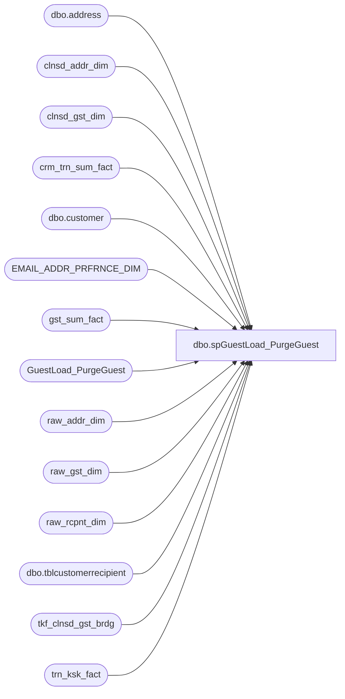

# dbo.spGuestLoad_PurgeGuest

**Database:** dw  
**Server:** papamart  

## Architecture Diagram



## Table Dependencies

| Referenced Table |
|---|
| dbo.address |
| clnsd_addr_dim |
| clnsd_gst_dim |
| crm_trn_sum_fact |
| dbo.customer |
| EMAIL_ADDR_PRFRNCE_DIM |
| gst_sum_fact |
| GuestLoad_PurgeGuest |
| raw_addr_dim |
| raw_gst_dim |
| raw_rcpnt_dim |
| dbo.tblcustomerrecipient |
| tkf_clnsd_gst_brdg |
| trn_ksk_fact |

## Stored Procedure Code

```sql
-- =============================================
-- Author:		dave
-- Create date: 12/02/2009
-- Description:	
--
/*
exec spGuestLoad_PurgeGuest (clnsd_gst_id int, thoroughness varchar(20), user varchar(20), reason varchar(80))

	clnsd_gst_id - person being deleted

	thoroughness = 'Complete'	complete purge of recipient and address information - provided no one else is tied to it.
		to be used for those emails where they say purge me from your system, privacy issues
		address info and raw data will be deleted from the source systems - crm is tricky, but we can at least mark them as opted out

	thoroughness = 'Partial'		
		to be used to stop mailings from happening, raw data will be retained 
		used for deaths

	user = who is running this proc

	reason = anything you want to say about this event
*/
/*
This proc should handle the following situations:
	1.  "Remove me from your system" requests.  This comes from emails asking to be purged for privacy issues.

	2.  Deaths, remove the information so that we don't inadvertantly mail to them.  This is especially important
		when a child dies.  Although, we do get the occasional requests to recreate their animals, so, as long as we 
		keep the address info at the time of purchase, we should be fine.

		This will also apply to NCOA death cleanses.

This proc utilizes an inherent truth in the current warehouse system, we do not add a guest if we do not have sufficient information.
And, therefore, we can not mail to them.  A standalone address without Kiosk or CRM records behind it should not be mailed to.
However, emails are a little different since there are newsletters and such that go out, we need to flag that as opted-out.
	1.  Non-Loyalty
			Need cleansed address
			Need at least a last name, just a first name will not cut it for NCOA reasons and QAS matching

	2.  Loyalty
			Do not need a cleansed address, it can be -1
			Still need a last name, again for NCOA and QAS matching

crm is an issue, if we remove the person, then we have to make sure crm is removed.  no easy way to do this yet, 
all i can do is keep the clnsd_gst on dw, but opt them out here and there.

how to make sure that we don't mail to them in the future, there is a danger where we could start pulling lists
where they have no recency or frequency, but then again, we should still need a clnsd_gst_id.


papamart dw tables

	--raw tables don't matter since we don't mail from them, nor do we use the recipient table, again, because it's raw
	-- destroy these only if going complete
	raw_gst_dim
	raw_addr_dim
	raw_rcpnt_dim

'raw_gst_id'
raw_gst_dim
trn_ksk_fact

'raw_addr_id'
raw_gst_dim
raw_addr_dim
trn_ksk_fact

'raw_rcpnt_id'
raw_rcpnt_dim
trn_ksk_fact


	-- staging doesn't matter since that gets purged after 90 days or so
	dwstaging.dbo.ksk_stg_regis
	dwstaging.dbo.crm_stg


begin tran
	clnsd_gst_dim
		delete this 

	crm_trn_sum_fact
		delete any records tied to clnsd_gst_id

	gst_sum_fact
		delete where clnsd_gst_id = @clnsd_gst_dim

	addr_sum_fact
		since we're not deleting addresses, we might as well what for the full update to happen

	tkf_clnsd_gst_brdg
		set clnsd_gst_id = -1
		
	trn_ksk_fact
		changing the bridge alone should do this, but should we be more thorough and set the raw_gst_id to -1?

	clnsd_addr_dim
		retain address, but if no one else is tied to it, make mail_stat_cd = 'UNK'
		if purging, delete if no one else

commit tran


begin tran
	email_addr_dim
		if no one else tied to it, delete

	email_addr_stat_fact
		delete if we deleted from email_addr_dim

	email_addr_prsnlztn_attr_dim
		delete if we deleted from email_addr_dim
commit tran


Source Records
	mamamart.babw.dbo.tblcustomerrecipient
		retain the address but delete the name info, guess we can leave the recipient data alone
			set sSFirstName = '' set sSLastName = ''

	crmdb02
		for now, just opt them out for email and mail

log all this into a dw table so we can make doubly sure that we can redo it if necessary

--implementation:
select PROMO_PREF, SFSCERT_PREF, SFSPNTS_PREF, * 
from dbo.EMAIL_ADDR_DIM e with (nolock)
left join dbo.EMAIL_ADDR_PRFRNCE_DIM p with (nolock)
on (e.EMAIL_ADDR_ID = p.EMAIL_ADDR_ID)
left join dbo.CLNSD_GST_DIM g with (nolock)
on (e.EMAIL_ADDR_ID = g.EMAIL_ADDR_ID)
where e.EMAIL_ADDR_TXT
in ('prayingwithguitarcountsdouble@yahoo.com')


--do spam since that changes all preferences to no

	--UPDATE STATUS CODE
	UPDATE dw.dbo.[EMAIL_ADDR_DIM] 
		SET [EMAIL_STAT_CD] = 'SPAM', email_stat_dt = Getdate(), 
		[UPDT_DT] = GETDATE()
	FROM dw.dbo.email_addr_dim WITH (NOLOCK) 
	WHERE email_addr_txt = 'prayingwithguitarcountsdouble@yahoo.com'

	
	--OPT OUT OF ALL PREFERENCES
	UPDATE dw.dbo.[EMAIL_ADDR_PRFRNCE_DIM] SET
		SFSCERT_PREF = 'N',
		SFSCERT_UPDT_DT = Getdate(),
		[UPDT_DT] = GETDATE()
	FROM dw.dbo.EMAIL_ADDR_PRFRNCE_DIM p
		INNER JOIN dw.dbo.email_addr_dim e WITH (NOLOCK) ON (p.email_addr_id = e.email_addr_id)
	WHERE e.email_addr_txt = 'prayingwithguitarcountsdouble@yahoo.com'
	
	--UPDATE CHANGE TABLE
	INSERT dw.dbo.GuestLoad_CRM_Update_Email(CLNSD_GST_ID, EMAIL_ADDR_ID, CRM_UPDT_RSN_ID, CRM_GST_NBR, EMAIL_ADDR_TXT_OLD, EMAIL_ADDR_TXT_NEW, CLEANSABLE, EMAIL_STAT_CD_OLD, EMAIL_STAT_CD_NEW, PROMO_PREF_OLD, PROMO_PREF_NEW, SFSCERT_PREF_OLD, SFSCERT_PREF_NEW, SFSPNTS_PREF_OLD, SFSPNTS_PREF_NEW, BATCH_ID, PROCESS_DT, EMAIL_SENT_DT, UPDT_CONFIRMED_DT, INS_DT, ETL_LOG_ID)	
	SELECT NULL, e.email_addr_id, 0, NULL, email_addr_txt, email_addr_txt,
		NULL, 'VALID', 'SPAM', NULL, 'N', NULL, 'N', NULL, 'N',
		NULL, NULL, NULL, NULL, GETDATE(), -1
	FROM dw.dbo.EMAIL_ADDR_PRFRNCE_DIM p
		INNER JOIN dw.dbo.email_addr_dim e WITH (NOLOCK) ON p.email_addr_id = e.email_addr_id
	WHERE e.email_addr_txt = 'prayingwithguitarcountsdouble@yahoo.com'


--exec [dbo].[spGuestLoad_PurgeGuest] @clnsd_gst_id  = 25541454, @thoroughness = 'Partial', @userid = 'CRMAdmin', @reason = 'Guest request'
--exec [dbo].[spGuestLoad_PurgeGuest] @clnsd_gst_id  = 47068916, @thoroughness = 'Partial', @userid = 'CRMAdmin', @reason = 'Guest request'

*/
-- =============================================
CREATE PROCEDURE [dbo].[spGuestLoad_PurgeGuest](@clnsd_gst_id int, @thoroughness varchar(20), @userid varchar(20), @reason varchar(80))

AS
BEGIN
-- SET NOCOUNT ON added to prevent extra result sets from
-- interfering with SELECT statements.
SET NOCOUNT ON;

--declare @clnsd_gst_id int
--declare @thoroughness varchar(20)
--declare @userid varchar(20)
--declare @reason varchar(80)
--
--set @clnsd_gst_id = 18317719
--set @thoroughness = 'Complete'
--set @userid = 'davidr'
--set @reason = 'from bsr: She requested that all offers and information pertaining to her be deleted.'
--set nocount off

-- protect ourselves
if isnull(@clnsd_gst_id,-9) <= 0
	or @thoroughness not in ('Complete','Partial')
	or isnull(@userid,'') = ''
	or len(isnull(@reason,'')) < 10
begin
	print 'invalid input parameters'
	print ''
	print 'clnsd_gst_id >= 0'
	print 'thoroughness in (Complete,Partial)'
	print 'userid must be something'
	print 'reason - must be descriptive and less than 80 char'

end
else
begin


IF (Object_ID('tempdb..#temp_delete') IS NOT NULL) DROP TABLE #temp_delete
create table #temp_delete (
	tkf_id int,
	trn_nbr int,
	raw_gst_id int, 
	raw_addr_id int, 
	raw_rcpnt_id int, 
	tor_clnsd_addr_id int, 
	clnsd_gst_id int, 
	lylty_gst_nbr int, 
	clnsd_addr_id int, 
	email_addr_id int
)


-- find the guest, and their other identifying features, this could be a crm guest, so there might not be any tkf records
-- make sure to not delete any -1 base records 
insert into #temp_delete (tkf_id, trn_nbr, raw_gst_id, raw_addr_id, raw_rcpnt_id, tor_clnsd_addr_id, clnsd_gst_id, lylty_gst_nbr, clnsd_addr_id, email_addr_id)
select distinct 
	tkf.tkf_id, 
	tkf.trn_nbr,
	case when tkf.raw_gst_id = -1 then null else tkf.raw_gst_id end raw_gst_id, 
	case when rgd.raw_addr_id = -1 then null else rgd.raw_addr_id end raw_addr_id, 
	case when tkf.raw_rcpnt_id = -1 then null else tkf.raw_rcpnt_id end raw_rcpnt_id, 
	case when tkf.tor_clnsd_addr_id = -1 then null else tkf.tor_clnsd_addr_id end tor_clnsd_addr_id, 
	cgd.clnsd_gst_id, 
	cgd.lylty_gst_nbr,
	case when cgd.clnsd_addr_id = -1 then null else cgd.clnsd_addr_id end clnsd_addr_id, 
	case when cgd.email_addr_id = -1 then null else cgd.email_addr_id end email_addr_id
from clnsd_gst_dim cgd with (nolock)
	left join tkf_clnsd_gst_brdg b with (nolock)
	on b.clnsd_gst_id = cgd.clnsd_gst_id
	left join trn_ksk_fact tkf with (nolock)
	on tkf.tkf_id = b.tkf_id
	left join raw_gst_dim rgd with (nolock)
	on rgd.raw_gst_id = tkf.raw_gst_id
-- this slowed things waaaaaay down
--	-- if the loyalty number doesn't exist in crm, then this person really isn't loyalty
--	left join crmdb02.crm.dbo.customer c
--	on c.customer_no = cgd.lylty_gst_nbr
where cgd.clnsd_gst_id = @clnsd_gst_id


--create table GuestLoad_PurgeGuest (
--	clnsd_gst_id	int,
--	frst_nm			varchar(60),
--	last_nm			varchar(60),
--	lylty_gst_nbr	varchar(20),
--	clnsd_addr_id	int,
--	addr_ln_1_txt	varchar(60),
--	addr_ln_2_txt	varchar(60),
--	apt_unit_nbr	varchar(60),
--	pstl_cd			varchar(5),
--	cntry_abbrv		varchar(5),
--	tkf_id			int,
--	trn_nbr			int,
--	thoroughness	varchar(20),
--	userid			varchar(20),
--	reason			varchar(80),
--	datestamp		datetime
--)

insert into GuestLoad_PurgeGuest (
	clnsd_gst_id, frst_nm, last_nm, lylty_gst_nbr,
	clnsd_addr_id, addr_ln_1_txt, addr_ln_2_txt, apt_unit_nbr, pstl_cd, cntry_abbrv,
	tkf_id, trn_nbr, thoroughness, userid, reason, datestamp)
select cgd.clnsd_gst_id, cgd.frst_nm, cgd.last_nm, cgd.lylty_gst_nbr,
	cad.clnsd_addr_id, cad.addr_ln_1_txt, cad.addr_ln_2_txt, cad.apt_unit_nbr, cad.pstl_cd, cad.cntry_abbrv,
	tkf.tkf_id, tkf.trn_nbr, @thoroughness, @userid, @reason, getdate()
from clnsd_gst_dim cgd
	left join TKF_CLNSD_GST_BRDG b
	on b.clnsd_gst_id = cgd.clnsd_gst_id
	left join trn_ksk_fact tkf
	on tkf.tkf_id = b.tkf_id
	left join clnsd_addr_dim cad
	on cad.clnsd_addr_id = cgd.clnsd_addr_id
where cgd.clnsd_gst_id = @clnsd_gst_id


--exec spGuestLoad_PurgeGuest (clnsd_gst_id int, thoroughness varchar(20), user varchar(20), reason varchar(80))


declare @lylty_gst_nbr int
set @lylty_gst_nbr = (select distinct lylty_gst_nbr from #temp_delete)

-- destroy the raw data, but only if we are being very thorough
-- there should be no affect on crm folks if they have no kiosk data because the links are made on the tkf table
if @thoroughness = 'Complete'
begin
	-- *******************************************************************************************************
	-- * raw_addr_dim
	-- *******************************************************************************************************
	--'raw_addr_id'
	--raw_addr_dim
	--raw_gst_dim

	-- should only be tied to a raw_gst
	declare @raw_addr_id int
	declare @raw_addr_id_count int

	declare curDelete cursor
	for
	select distinct raw_addr_id
	from #temp_delete
	open curDelete

	fetch next from curDelete into @raw_addr_id
	while (@@fetch_STATUS <> -1)
	begin
		-- are there any other guests tied to this address?
		set @raw_addr_id_count = (
		select count(1)
		from raw_gst_dim rgd with (nolock)
		where 1=1
			and rgd.raw_addr_id = @raw_addr_id
			and rgd.raw_gst_id not in (select distinct raw_gst_id from #temp_delete)
		)

		-- if not, then pop it	
		if @raw_addr_id_count = 0
		begin
			print 'delete raw_addr_id from raw_addr_dim' + cast(@raw_addr_id as varchar)
			delete from raw_addr_dim where raw_addr_id = @raw_addr_id
		end
	
		fetch next from curDelete into @raw_addr_id
	end
	close curDelete
	deallocate curDelete


	-- *******************************************************************************************************
	-- * raw_gst_dim
	-- *******************************************************************************************************
	--'raw_gst_id'
	--raw_gst_dim
	--trn_ksk_fact

	-- should only be tied to tkf
	declare @raw_gst_id int
	declare @raw_gst_id_count int

	declare curDelete cursor
	for
	select distinct raw_gst_id
	from #temp_delete
	open curDelete

	fetch next from curDelete into @raw_gst_id
	while (@@fetch_STATUS <> -1)
	begin
		-- are there any other tkf records tied to this guest?
		set @raw_gst_id_count = (
		select count(1)
		from trn_ksk_fact tkf with (nolock)
		where 1=1
			and tkf.raw_gst_id = @raw_gst_id
			and tkf.tkf_id not in (select distinct tkf_id from #temp_delete)
		)
	
		-- if not, then pop it	
		if @raw_gst_id_count = 0
		begin
			print 'delete @raw_gst_id from raw_gst_dim' + cast(@raw_gst_id as varchar)
			delete from raw_gst_dim where raw_gst_id = @raw_gst_id
		end
	
		fetch next from curDelete into @raw_gst_id
	end
	close curDelete
	deallocate curDelete

	-- *******************************************************************************************************
	-- * raw_rcpnt_dim
	-- *******************************************************************************************************
	--'raw_rcpnt_id'
	--raw_rcpnt_dim
	--trn_ksk_fact

	-- should only be tied to a trn_ksk_fact
	declare @raw_rcpnt_id int
	declare @raw_rcpnt_id_count int

	declare curDelete cursor
	for
	select distinct raw_rcpnt_id
	from #temp_delete
	open curDelete

	fetch next from curDelete into @raw_rcpnt_id
	while (@@fetch_STATUS <> -1)
	begin
		-- are there any other tkf records tied to this recipient?
		set @raw_rcpnt_id_count = (
		select count(1)
		from trn_ksk_fact tkf with (nolock)
		where 1=1
			and tkf.raw_rcpnt_id = @raw_rcpnt_id
			and tkf.tkf_id not in (select distinct tkf_id from #temp_delete)
		)
	
		-- if not, then pop it	
		if @raw_rcpnt_id_count = 0
		begin
			print 'delete @raw_rcpnt_id from raw_rcpnt_dim' + cast(@raw_rcpnt_id as varchar)
			delete from raw_rcpnt_dim where raw_rcpnt_id = @raw_rcpnt_id
		end
	
		fetch next from curDelete into @raw_rcpnt_id
	end
	close curDelete
	deallocate curDelete
end

-- *******************************************************************************************************
-- *******************************************************************************************************
-- *******************************************************************************************************


-- handle loyalty members differently
if @lylty_gst_nbr is not null
begin
	print 'loyalty'

--	clnsd_gst_dim
--	do nothing	because of not integrating into CRM, we would have to pop their address through the import process, all we can do is opt them out on crm


--	crm_trn_sum_fact
--	do nothing since we can't delete this guest

end

-- non-loyalty - we can be more destructive
else
begin
	print 'non-loyalty'

--	clnsd_gst_dim
	print 'deleting from clnsd_gst_dim'
	delete from clnsd_gst_dim where clnsd_gst_id = @clnsd_gst_id

--	crm_trn_sum_fact
	print 'deleting from crm_trn_sum_fact'
	delete from crm_trn_sum_fact where clnsd_gst_id = @clnsd_gst_id
end


--	gst_sum_fact
	print 'deleting from gst_sum_fact'
	delete from gst_sum_fact where clnsd_gst_id = @clnsd_gst_id

--	tkf_clnsd_gst_brdg
	print 'update tkf_clnsd_gst_brdg'
	update tkf_clnsd_gst_brdg set clnsd_gst_id = -1 where tkf_id in (select distinct tkf_id from #temp_delete)

--	trn_ksk_fact
	-- for partials, changing the bridge alone should take of this
	if @thoroughness = 'Complete'
	begin
		print 'thoroughness-complete update trn_ksk_fact'
		update trn_ksk_fact set raw_gst_id = -1, raw_rcpnt_id = -1, tor_clnsd_addr_id = -1 where tkf_id in (select distinct tkf_id from #temp_delete)
	end


	-- there should be no harm in keeping the cleansed address since we disassociated the guest and the tkf record from it.
	-- if no one else is tied to it, then we can set the mail_stat_cd
--	clnsd_addr_dim
	declare @clnsd_addr_id int
	set @clnsd_addr_id = (select distinct clnsd_addr_id from #temp_delete)

	declare @clnsd_gst_id_count int
	set @clnsd_gst_id_count = (
	select count(1)
	from clnsd_gst_dim cgd with (nolock)
	where 1=1
		and cgd.clnsd_addr_id = @clnsd_addr_id
		and cgd.clnsd_gst_id != @clnsd_gst_id
	)


	-- if no one else there, then make it unknown
	-- if someone else is there, don't do anything unless this is a loyalty person
	-- this gets into killing off the entire household in case of deaths, or even opt-outs
	-- but since we are opting out loyalty in crm, we need to keep the two systems in sync, so this loyalty person
	-- will trump all others.
	if @lylty_gst_nbr is not null
	begin
		print 'update clnsd_addr_dim set mail_stat_cd = opt-out ' + cast(@clnsd_addr_id as varchar)
		update clnsd_addr_dim
		set 
			mail_stat_cd = 'OPT-OUT',
--			opt_in_src_sys_cd = 'DBA', - don't think it's right to use DBA here because that is an override that must then be manually overridden
			glbl_opt_in_dt = getdate(),
			updt_dt = getdate()
		where clnsd_addr_id = @clnsd_addr_id
			and mail_stat_cd in ('OPT-IN','UNK')
	end
	-- for kiosk folks, if no one is at the address then just set them to unknown
	else if @clnsd_gst_id_count = 0
	begin
		print 'update clnsd_addr_dim set mail_stat_cd = unk ' + cast(@clnsd_addr_id as varchar)
		update clnsd_addr_dim
		set 
			mail_stat_cd = 'UNK',
--			opt_in_src_sys_cd = 'DBA', - don't think it's right to use DBA here because that is an override that must then be manually overridden
			glbl_opt_in_dt = getdate(),
			updt_dt = getdate()
		where clnsd_addr_id = @clnsd_addr_id
	end


-- *******************************************************************************************************
-- * email
-- *******************************************************************************************************
--	email_addr_dim
	-- shouldn't delete it because we need to get the opt-out to the email system
	-- but if it is opted out, should i delete it?

	print 'update email_addr_dim'
	UPDATE EMAIL_ADDR_PRFRNCE_DIM
	SET 
		promo_pref = 'N',
		promo_updt_dt = getdate(),
--		sfscert_pref = 'N',
--		sfscert_updt_dt = getdate(),
		sfspnts_pref = 'N',
		sfspnts_updt_dt = getdate(),
		updt_dt = getdate()
	where email_addr_id in (select distinct email_addr_id from #temp_delete where email_addr_id is not null)
		and (promo_pref in ('Y') or sfspnts_pref in ('Y'))


--	email_addr_stat_fact
--		delete if we deleted from email_addr_dim
--
--	email_addr_prsnlztn_attr_dim
--		delete if we deleted from email_addr_dim
--commit tran


-- *******************************************************************************************************
-- * Source Records
-- *******************************************************************************************************
--	mamamart.babw.dbo.tblcustomerrecipient
--		retain the address but delete the name info, guess we can leave the recipient data alone
--			set sSFirstName = '' set sSLastName = ''

	-- if very thorough, then pop all identifiable data
	-- should only be tied to tkf
	declare @trn_nbr int

	declare curUpdate cursor
	for
	select distinct trn_nbr
	from #temp_delete
	open curUpdate

	fetch next from curUpdate into @trn_nbr
	while (@@fetch_STATUS <> -1)
	begin
		if @thoroughness = 'Complete'
		begin
			print 'Complete update tblcustomerrecipient'

			update mamamart.babw.dbo.tblcustomerrecipient
			set ssfirstname = '', sslastname = '', ssaddress1 = '', ssaddress2 = '', ssappartment = '', ssemail = '' ,
				srfirstname = '', srlastname = '', sraddress1 = '', sraddress2 = '', srappartment = ''
			where id = @trn_nbr
		end
		else
		begin
			print 'Partial update tblcustomerrecipient'
			update mamamart.babw.dbo.tblcustomerrecipient
			set sslastname = '', ssemail = '' -- no real need to remove the first name too, so just pop the last name
--			set ssfirstname = '', sslastname = '', ssemail = '' 
			where id = @trn_nbr
		end	

		fetch next from curUpdate into @trn_nbr
	end
	close curUpdate
	deallocate curUpdate


--	crmdb02
--		for now, just opt them out for email and mail
	if @lylty_gst_nbr is not null
	begin
		declare @customer_id int
		declare @active_address_id int

		select  @customer_id = customer_id, @active_address_id = active_address_id
		from crmdb02.crm.dbo.customer
		where customer_no = @lylty_gst_nbr

		--case when mail_indicator not in (1) and mail_opt_in_flag not in (1) then 'Y' else 'N' end drvd_mail_stat_cd,
		--case when email_indicator not in (1) and opt_in_flag not in (1) then 'Y' else 'N' end drvd_email_stat_cd,
		print 'update crmdb02.crm.dbo.customer'
		update crmdb02.crm.dbo.customer
		set email_indicator = 1, opt_in_flag = 2 where customer_id = @customer_id

		print 'update crmdb02.crm.dbo.address'
		update crmdb02.crm.dbo.address
		set mail_indicator = 1, mail_opt_in_flag = 2 where customer_id = @customer_id and @active_address_id = @active_address_id
	end

end


END
```

