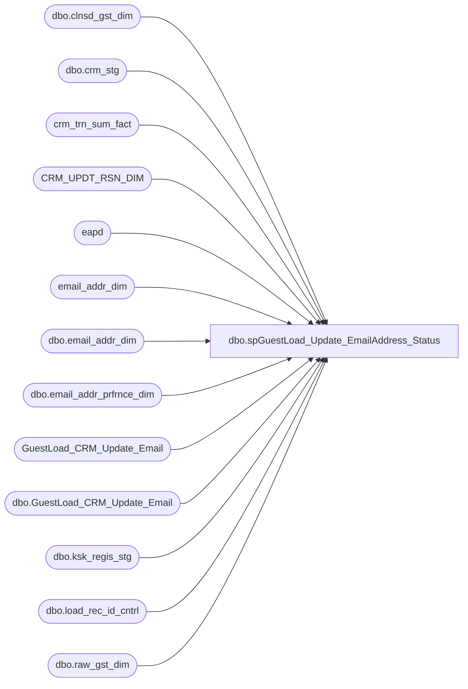

# dbo.spGuestLoad_Update_EmailAddress_Status

**Database:** dw  
**Server:** papamart  

## Architecture Diagram



## Table Dependencies

| Referenced Table |
|---|
| dbo.clnsd_gst_dim |
| dbo.crm_stg |
| crm_trn_sum_fact |
| CRM_UPDT_RSN_DIM |
| eapd |
| email_addr_dim |
| dbo.email_addr_dim |
| dbo.email_addr_prfrnce_dim |
| GuestLoad_CRM_Update_Email |
| dbo.GuestLoad_CRM_Update_Email |
| dbo.ksk_regis_stg |
| dbo.load_rec_id_cntrl |
| dbo.raw_gst_dim |

## Stored Procedure Code

```sql
-- =============================================================================================================
-- Name: spGuestLoad_Update_EmailAddress_Status
--
-- Description:	
--	!!!!!!!!!!!!!!!!!!!!!!!!!!!!!!!!!!!!!!!!!!!!!!!!!!!!!!!!!!!!!!!!!!!!!!!!!!!!!!!!!!!!!!!!!!!!!!!!!!!!!!!!!!
--	!!!!!!!!!!!!!!!!!!!!!!!!!!!!!!!!!!!!!!!!!!!!!!!!!!!!!!!!!!!!!!!!!!!!!!!!!!!!!!!!!!!!!!!!!!!!!!!!!!!!!!!!!!
--		this keeps changing, so bear with the code
--		i didn't make an attempt to consolidate code into a loop because it keeps changing
--		so bear with the repetitiveness and make sure that if you change one set of logic that you make the change
--		in the other duplicated sections of the code
--	!!!!!!!!!!!!!!!!!!!!!!!!!!!!!!!!!!!!!!!!!!!!!!!!!!!!!!!!!!!!!!!!!!!!!!!!!!!!!!!!!!!!!!!!!!!!!!!!!!!!!!!!!!
--	!!!!!!!!!!!!!!!!!!!!!!!!!!!!!!!!!!!!!!!!!!!!!!!!!!!!!!!!!!!!!!!!!!!!!!!!!!!!!!!!!!!!!!!!!!!!!!!!!!!!!!!!!!
--
--
--		Update the status_cd of emails.  The problem is that there is a complicated list of rules on who can
--		update whom and when.  So, resolve the batch of ksk and crm emails then look to see what the current
--		status of the email address is.  For example, this load might have kiosk entries for the email address,
--		but, when we look at the current email address, it's tied to a loyalty member, so then, we can not do 
--		any updates since a crm member overrides kiosk.
--
--		the goal of this proc is to only do the necessary updates, before, we were doing a series
--		of optins, then optouts, then unknowns.  there was lots of redundancy, this proc
--		gets down to the core update by working on a temp table
--
--		a kiosk record can not update a CRM guest or a HandRaiser
--
--		a crm record can not update a HandRaiser
--		going with the theory that crm is the master then, any updates coming down, should be taken 
--		as gospel, meaning that an existing opt-out, could be opted back in via crm
--
--
--	2010/10/15
--	it's been decided to throw out our opt-out is forever except when manually overridden and crm is gospel mantra.
--	from now on, last in wins.  validation routines will be tricky (or not, haven't thought it through yet).
--	so, within a batch order by the changed dates and the last one in wins.
--
--	we also need to deal with hand raisers, these come from crm through the new preference center.  basically, these
--	folks have opted in and do not have loyalty sales or kiosk registrations, so the only way to pull them for mailers
--	is to have a status.  
--
--	kiosk emails are pretty easy to tell what came in recently because we can use the 
--
--there are crm guests, preference guests, and kiosk guests
--updates can come from crm/preference center, kiosks, responsys, website, and manual updates
--who overrides whom?
--we need to keep responsys, the data warehouse, and crm in sync.  an update in one must flow to the others.
--responsys will be providing bounce/invalid stats on the actual email and shouldnt be touching the opt-in statuses
--crm is typically the master, but if an update comes from ???????? 
--crm loyalty/preference center guests are equivalent, they both have the same priority.  if a pref guest comes through, then we need to update any
--	crm guests that have the same email
--
-- Input:
--		@etl_log_id			int	
--			Current load to process
--
--		@etl_evnt_id		int	
--			Current load to process
--
-- Output: 
--
-- Dependencies: 
--
-- EXAMPLE:
--		exec dw.dbo.spGuestLoad_Update_EmailAddress_Status 41331, 41331
--
-- Revision History
--		Name:			Date:			Comments:
--		Dave Rice		7/19/2010		created
--		Dave Rice		02/14/2011		tweaked the order of dup deletion so that crm trumps kiosk
--		Dave Rice		02/18/2011		beefed up validation to include indicator issues
-- =============================================================================================================

CREATE PROCEDURE [dbo].[spGuestLoad_Update_EmailAddress_Status](@etl_log_id int, @etl_evnt_id int)
AS
BEGIN
-- SET NOCOUNT ON added to prevent extra result sets from
-- interfering with SELECT statements.
SET NOCOUNT ON;

--select top 1 etl_log_id from dwstaging.dbo.load_rec_id_cntrl with (nolock)
--declare @etl_log_id int
--declare @etl_evnt_id int
--set @etl_log_id = 41331
--set @etl_evnt_id = @etl_log_id
--
-- ************************************************************************************************************
-- * handle any crm records that have been unmarked as bounced
-- *	need to do this early because code below ignores bounces in the opt-in portion
-- ************************************************************************************************************

delete from crm_trn_sum_fact
from crm_trn_sum_fact ctsf
	join (
		select TDF_TRN_ID, count(*) count
		from crm_trn_sum_fact with (nolock)
		group by TDF_TRN_ID
		having count(*) > 1
	) d
	on d.TDF_TRN_ID = ctsf.TDF_TRN_ID

-- ************************************************************************************************************
/*
select * from GuestLoad_CRM_Update_Email
where ins_dt >= '2011-03-16 17:10:25.857'
order by updt_id desc

*/


-- clear out old data
delete 
from dw.dbo.GuestLoad_CRM_Update_Email
where ins_dt < dateadd(dd, -14, getdate())
-- the email notification for the kiosk party attempted update isn't in production yet, so don't accumulate the rows
	and (batch_id is not null or crm_updt_rsn_id = 7)

-- ************************************************************************************************************

-- This set of code allows bounces to be overridden on dw from crm.  If the crm indicator is not 4 then it's valid.
-- Assume that someone on CRM changed the indicator on purpose, so update dw accordingly to valid.
IF (Object_ID('tempdb..#revalidate') IS NOT NULL) DROP TABLE #revalidate
select distinct 
	ead.email_addr_id, 
	ead.email_stat_cd dw_stat_cd,
	case when s.snd_email_cd not in (4) then 'VALID' else 'BOUNCE' end imported_stat_cd,
	ead.email_addr_txt,
	rgd.drvd_email_addr_txt
into #revalidate
from dwstaging.dbo.load_rec_id_cntrl lric with (nolock)
	join dwstaging.dbo.crm_stg s with (nolock)
	ON s.crm_stg_id = lric.stg_id
	join dw.dbo.raw_gst_dim rgd with (nolock)
	ON rgd.raw_gst_id = lric.raw_gst_id
	join dw.dbo.email_addr_dim ead with (nolock)
	on ead.email_addr_txt = rgd.drvd_email_addr_txt
where lric.stg_dta_set_cd = 'CRM'
	and rgd.drvd_email_addr_txt is not null
	and case when s.snd_email_cd not in (4) then 'VALID' else 'BOUNCE' end != ead.email_stat_cd
	and lric.etl_log_id = @etl_log_id


-- i question this code, time has passed and we should be in sync.  if crm says the email is invalid (indicator 4) but dw says it's valid then 
-- we should update crm with the dw status

-------- we're only going to update current bounces with a valid status.  invalid emails will stay as such.
-------- if crm still says they are 
------delete from #revalidate
--------select * from #revalidate 
------where imported_stat_cd != 'VALID' and dw_stat_cd != 'BOUNCE'

-- do not allow spams to be changed back to valid, this was determined at the responsys level
delete from #revalidate
--select * from #revalidate 
where dw_stat_cd = 'SPAM'

-- update the live data
update email_addr_dim
set email_stat_cd = 'VALID',
	updt_dt = getdate(),
	etl_log_id = @etl_log_id,
	etl_evnt_id = @etl_evnt_id
--select *
from email_addr_dim ead
	join #revalidate r
	on r.email_addr_id = ead.email_addr_id

-- inform the crm update process that we changed things
insert into GuestLoad_CRM_Update_Email (CRM_UPDT_RSN_ID, EMAIL_ADDR_ID, EMAIL_ADDR_TXT_OLD, EMAIL_ADDR_TXT_NEW, INS_DT, ETL_LOG_ID)
select distinct
	(select CRM_UPDT_RSN_ID from CRM_UPDT_RSN_DIM where CRM_UPDT_RSN_CD = 'CRM_UPDT'),
	u.email_addr_id,
	email_addr_txt,
	drvd_email_addr_txt,
	getdate(),
--	-1
	@etl_log_id
--select *
from #revalidate u
	-- don't insert dups that haven't been processed yet
	left join GuestLoad_CRM_Update_Email ue
	on ue.email_addr_id = u.email_addr_id
	and ue.BATCH_ID is null
	and ue.crm_updt_rsn_id = (select CRM_UPDT_RSN_ID from CRM_UPDT_RSN_DIM where CRM_UPDT_RSN_CD = 'CRM_UPDT')
where u.dw_stat_cd != u.imported_stat_cd
	and ue.updt_id is null

-- ************************************************************************************************************

-- This code can catch differences in opt-in status and bounces, but one thing we forgot is that we weren't 
-- checking the indicators.  an email might be perfectly in sync with opt in/out status, but the indicator 
-- wouldn't be updated from a 9/1 to a 0, the default from when crm inserted things
IF (Object_ID('tempdb..#reindicate') IS NOT NULL) DROP TABLE #reindicate
select distinct 
	ead.email_addr_id, 
	ead.email_addr_txt,
	rgd.drvd_email_addr_txt
into #reindicate
from dwstaging.dbo.load_rec_id_cntrl lric with (nolock)
	join dwstaging.dbo.crm_stg s with (nolock)
	ON s.crm_stg_id = lric.stg_id
	join dw.dbo.raw_gst_dim rgd with (nolock)
	ON rgd.raw_gst_id = lric.raw_gst_id
	join dw.dbo.email_addr_dim ead with (nolock)
	on ead.email_addr_txt = rgd.drvd_email_addr_txt
where lric.stg_dta_set_cd = 'CRM'
	and rgd.drvd_email_addr_txt is not null
	and ead.email_stat_cd = 'VALID'
	and s.snd_email_cd != 0
	and lric.etl_log_id = @etl_log_id

-- inform the crm update process of the indicate issue
insert into GuestLoad_CRM_Update_Email (CRM_UPDT_RSN_ID, EMAIL_ADDR_ID, EMAIL_ADDR_TXT_OLD, EMAIL_ADDR_TXT_NEW, INS_DT, ETL_LOG_ID)
select distinct
	(select CRM_UPDT_RSN_ID from CRM_UPDT_RSN_DIM where CRM_UPDT_RSN_CD = 'CRM_UPDT'),
	u.email_addr_id,
	email_addr_txt,
	drvd_email_addr_txt,
	getdate(),
--	-1
	@etl_log_id
--select *
from #reindicate u
	-- don't insert dups that haven't been processed yet
	left join GuestLoad_CRM_Update_Email ue
	on ue.email_addr_id = u.email_addr_id
	and ue.BATCH_ID is null
	and ue.crm_updt_rsn_id = (select CRM_UPDT_RSN_ID from CRM_UPDT_RSN_DIM where CRM_UPDT_RSN_CD = 'CRM_UPDT')
where 1=1
	and ue.updt_id is null

-- ************************************************************************************************************
-- * kiosk emails
-- ************************************************************************************************************

-- any new emails would have been inserted into email_addr_dim earlier in the guest load process by the email_addr_insert package. 
-- opt-outs should have overridden opt-ins
IF (Object_ID('tempdb..#kiosk') IS NOT NULL) DROP TABLE #kiosk
select distinct 
	'KSK' source,

	ead.email_addr_id, 
	ead.email_stat_cd,	-- for valid/invalid/bounce

	rgd.email_addr_txt,
	rgd.drvd_email_addr_txt,

	eapd.promo_pref dw_promo_pref,
	cast(convert(varchar, eapd.promo_updt_dt, 101) as datetime) dw_promo_updt_dt,

	eapd.sfscert_pref dw_sfscert_pref,
	cast(convert(varchar, eapd.sfscert_updt_dt, 101) as datetime) dw_sfscert_updt_dt,

	eapd.sfspnts_pref dw_sfspnts_pref,
	cast(convert(varchar, eapd.sfspnts_updt_dt, 101) as datetime) dw_sfspnts_updt_dt,

	rgd.drvd_email_stat_cd imported_promo_pref,
	cast(convert(varchar, s.trn_start_dt, 101) as datetime) imported_promo_updt_dt,

	'Y' imported_sfscert_pref, 
	cast('1/1/1900' as datetime) imported_sfscert_updt_dt,

	'Y' imported_sfspnts_pref, 
	cast('1/1/1900' as datetime) imported_sfspnts_updt_dt,

	case when  s.prty_trn_cd in ('true','yes','1') then 'Y' else 'N' end party,

	0 InternalDuplicateFlag,
	case when cgd.lylty_gst_nbr is not null then 1 else 0 end lylty_gst_nbr_flag
into #kiosk
from dwstaging.dbo.load_rec_id_cntrl lric with (nolock)
	join dwstaging.dbo.ksk_regis_stg s with (nolock)
	ON s.ksk_regis_stg_id = lric.stg_id
	join dw.dbo.raw_gst_dim rgd with (nolock)
	ON rgd.raw_gst_id = lric.raw_gst_id
	join dw.dbo.email_addr_dim ead with (nolock)
	on ead.email_addr_txt = rgd.drvd_email_addr_txt
	join dw.dbo.email_addr_prfrnce_dim eapd with (nolock)
	on eapd.email_addr_id = ead.email_addr_id
	-- this is for prior crm guests that have this email
	-- need to handle new crm guests in the same batch
	left join dw.dbo.clnsd_gst_dim cgd with (nolock)
	on cgd.email_addr_id = ead.email_addr_id
where lric.stg_dta_set_cd = 'KSK'
	and rgd.drvd_email_addr_txt is not null
--	and lric.etl_log_id = 17498
	and lric.etl_log_id = @etl_log_id


-- ************************************************************************************************************
-- * crm emails
-- ************************************************************************************************************
--truncate table GuestLoad_CRM_Update_Email
-- select * from GuestLoad_CRM_Update_Email

-- log the cleansed updates for email addresses - provided that they actually changed.  either they are invalid (now null), 
-- or we tweaked them by removing special characters
-- this table will be used to upload the cleansed addresses up to CRM
insert into GuestLoad_CRM_Update_Email (CRM_UPDT_RSN_ID, EMAIL_ADDR_TXT_OLD, EMAIL_ADDR_TXT_NEW, CLEANSABLE, INS_DT, ETL_LOG_ID)
select distinct
	(select CRM_UPDT_RSN_ID from CRM_UPDT_RSN_DIM where CRM_UPDT_RSN_CD = 'CLEANSED'), 
	rgd.email_addr_txt, 
	rgd.drvd_email_addr_txt, 
	case when rgd.drvd_email_addr_txt is null then 'N' else 'Y' end,
	getdate(),
	@etl_log_id
--	-1
--select distinct isnull(rgd.email_addr_txt,''), isnull(rgd.drvd_email_addr_txt,'')
from dwstaging.dbo.load_rec_id_cntrl lric with (nolock)
--	join dwstaging.dbo.crm_stg s with (nolock)
--	ON s.crm_stg_id = lric.stg_id
	join dw.dbo.raw_gst_dim rgd with (nolock)
	ON rgd.raw_gst_id = lric.raw_gst_id
--	-- do not insert duplicate records if the previous ones haven't been processed yet
	left join GuestLoad_CRM_Update_Email ue
--	on u.email_addr_id = lric.email_addr_id
	on ue.email_addr_txt_old = rgd.email_addr_txt
	and CRM_UPDT_RSN_ID = (select CRM_UPDT_RSN_ID from CRM_UPDT_RSN_DIM where CRM_UPDT_RSN_CD = 'CLEANSED')
	and ue.BATCH_ID is null
where lric.stg_dta_set_cd = 'CRM'
	-- did the address change?  if so, it needs to move up to CRM
	and isnull(rgd.email_addr_txt,'') != isnull(rgd.drvd_email_addr_txt,'')
	and lric.etl_log_id = @etl_log_id
	and ue.updt_id is null

-- pull all distinct permutations of emails in this batch, so we can be efficient in our updates
IF (Object_ID('tempdb..#crm') IS NOT NULL) DROP TABLE #crm
select distinct 
	'CRM' source,
	ead.email_addr_id, 
	ead.email_stat_cd,	-- for valid/invalid/bounce

	rgd.email_addr_txt, 
	rgd.drvd_email_addr_txt, 

	s.crm_lylty_nbr,
--	s.crm_gst_nbr,

	eapd.promo_pref dw_promo_pref,
	cast(convert(varchar, eapd.promo_updt_dt, 101) as datetime) dw_promo_updt_dt,

	eapd.sfscert_pref dw_sfscert_pref,
	cast(convert(varchar, eapd.sfscert_updt_dt, 101) as datetime) dw_sfscert_updt_dt,

	eapd.sfspnts_pref dw_sfspnts_pref,
	cast(convert(varchar, eapd.sfspnts_updt_dt, 101) as datetime) dw_sfspnts_updt_dt,

	s.email_attr_stat_cd stg_email_attr_stat_cd,
	s.emailcert_stat_cd stg_sfscert_stat_cd,
	s.sfspoints_stat_cd stg_sfspoints_stat_cd,

	rgd.drvd_email_stat_cd imported_promo_pref,
	cast(convert(varchar, s.email_updt_dt, 101) as datetime) imported_promo_updt_dt,

	rgd.drvd_emailcert_stat_cd imported_sfscert_pref, 
	cast(convert(varchar, s.emailcert_updt_dt, 101) as datetime) imported_sfscert_updt_dt,

	rgd.drvd_sfspoints_stat_cd imported_sfspnts_pref,
	cast(convert(varchar, s.sfspoints_updt_dt, 101) as datetime) imported_sfspnts_updt_dt,

	0 InternalDuplicateFlag
--	0 UpdateFlag
--	case when cgd.lylty_gst_nbr is not null then 1 else 0 end loyalty
into #crm
--select rgd.drvd_emailcert_stat_cd, rgd.drvd_sfspoints_stat_cd, *
from dwstaging.dbo.load_rec_id_cntrl lric with (nolock)
	join dwstaging.dbo.crm_stg s with (nolock)
	ON s.crm_stg_id = lric.stg_id
	join dw.dbo.raw_gst_dim rgd with (nolock)
	ON rgd.raw_gst_id = lric.raw_gst_id
	join dw.dbo.email_addr_dim ead with (nolock)
	on ead.email_addr_txt = rgd.drvd_email_addr_txt
	join dw.dbo.email_addr_prfrnce_dim eapd with (nolock)
	on eapd.email_addr_id = ead.email_addr_id
where lric.stg_dta_set_cd = 'CRM'
--and ead.email_addr_id = 766
	and rgd.drvd_email_addr_txt is not null
	and lric.etl_log_id = @etl_log_id

--select * from #crm where email_addr_id = 766


--766	CRM
--774	CRM
--779	CRM
--783	CRM
--785	CRM
--
--
--select * From email_Addr_Dim
--
--select * from #kiosk
--select * from #crm

--where dw_sfscert_pref != 'Y'
--	or dw_sfspnts_pref != 'Y'

-- requirement 12/22/2010 
--		New SFS e-mails should automatically be opted-in.  This will also apply to mailing addresses.
-- for only loyalty folks, if this is a new email that is not currently tied to a customer, then 
-- force the status to Y, irregardless of what the real parameters are.
-- the question then is how do we know these are new SFS guests and that their emails haven't been used before?
-- since the update of the email status - this proc - occurs after the insert and before any updates to
-- clnsd_gst_dim, helps, we just need to look at the etl_log_id to see if it matches and assume it was inserted today.
-- and the same goes for the email, the inserts would have occurred before these updates, so the etl_log_id 
-- could be used.
-- upon further reflection, we should just use the email_addr_dim etl_log_id, that would be an obvious insert
-- and since the only updates to email_addr_dim should be this proc, then that just leaves the kiosk situation
--
-- but, what if the email already exists and now a crm customer uses it as a loyalty member?
--
-- requirement 01/25/2011
-- this has changed again.  i raised the question of why i am overriding valid customer settings from the pref center?
-- either they should be opted in automatically there and then let the guest choose to turn them off or i am forced to 
-- override their preferences, didnt seem right.  So, now i only set the flags to Y if they come from the POS and not 
-- pref.  
-- if there 


--select * From dwstaging.dbo.crm_stg
--select * from raw_gst_dim
--
--
--select * from #crm
--
--select * from email_addr_dim 
--
--update #crm
--set imported_promo_pref = 'Y',
--	imported_sfscert_pref = 'Y',
--	imported_sfspnts_pref = 'Y'
----	updateflag = 1
----select c.* 
--from #crm c
--	join dw.dbo.email_addr_dim ead
--	on ead.email_addr_id = c.email_addr_id
--where etl_log_id = @etl_log_id
--	and crm_lylty_nbr is not null  -- only sfs accounts should be affected by these, emal and prf should not have the lylty_gst_nbr coming down
--	and (imported_promo_pref != 'Y'
--		or imported_sfscert_pref != 'Y'
--		or imported_sfspnts_pref != 'Y')


/*
have a problem with pref guests or even crm folks that don't make it into clnsd_gst_dim (no last name),
there is nothing to say they are preference/crm guests.
*/


-- remove any kiosk entries that are correspondingly in this batch of crm updates, the crm updates will take precedence in the batch
-- basically, handle the situation where a new guest registers an animal and then signs up for CRM on the same day
-- this will break down if we historically load a bunch of older records with mixed dates between kiosk and crm, e.g., old crm records but new kiosk records
--delete from k
--from #kiosk k
--	join #crm c
--	on c.email_addr_id = k.email_addr_id


-- decided to allow bounces/invalids through because it throws off validation and really didn't save
-- that much on update costs.  Plus, when they do switch from bounce to invalid, the optin/out and datestamps
-- aren't going to match the previous inputs.
---- if this address bounced or is invalid, then don't try to update it again
--delete from #kiosk
--where email_stat_cd in ('BOUNCE', 'INVALID')
--
---- if this address bounced or is invalid, then don't try to update it again
--delete from #crm
--where email_stat_cd in ('BOUNCE', 'INVALID')


-- ************************************************************************************************************
-- ************************************************************************************************************

-- consolidate the updates
-- only grab the new ones
IF (Object_ID('tempdb..#update') IS NOT NULL) DROP TABLE #update
create table #update (
	id int IDENTITY(1,1) NOT NULL,
	source varchar(10),
	email_addr_id int, 
	email_addr_txt_old varchar(100),
	email_addr_txt_new varchar(100),
	dw_pref	varchar(5),
	dw_updt_dt	datetime,
	imported_pref varchar(5),
	imported_updt_dt	datetime,
	InternalDuplicateFlag int
)


IF (Object_ID('tempdb..#pref_types') IS NOT NULL) DROP TABLE #pref_types
create table #pref_types (
	id int IDENTITY(1,1) NOT NULL,
	pref varchar(50)
)

insert into #pref_types values('promo')
insert into #pref_types values('sfscert')
insert into #pref_types values('sfspnts')
--insert into #pref_types values('ksk_promo')
--insert into #pref_types values('ksk_sfspnts')
--insert into #pref_types values('crm_promo')
--insert into #pref_types values('crm_sfscert')
--insert into #pref_types values('crm_sfspnts')

declare curPrefs cursor
for
	select pref from #pref_types
	order by id
open curPrefs

declare @pref varchar(50)

fetch next from curPrefs into @pref
while (@@fetch_STATUS <> -1)
begin
print @pref

	truncate table #update

-- ************************************************************************************************************
-- ************************************************************************************************************

-- dang, do i need to update the date anyhow?
-- just because the stat doesn't change doesn't mean that the date shouldn't
-- if a reload happens, then you would have to process all the records anyhow

-- 01/01/2008		N
-- 01/10/2008		N
-- 01/08/2008		Y
-- by this example, depending on the order of records (and not updating the date if the status doesn't change),
-- the result could be N or Y
-- All is well, i did code for the date to be updated, i will not update if the date and status is the same as the update record


	-- promo updates
	if @pref = 'promo' 
	begin
print @pref + ' insert into #update'
--truncate table #update

		insert into #update (source, email_addr_id, email_addr_txt_old, email_addr_txt_new, dw_pref, dw_updt_dt, imported_pref, imported_updt_dt, InternalDuplicateFlag)
		select distinct 
			source,
			email_addr_id, 
			email_addr_txt,
			drvd_email_addr_txt,
			dw_promo_pref,
			dw_promo_updt_dt,
			imported_promo_pref,
			imported_promo_updt_dt,
			0 
		from #kiosk
		where imported_promo_updt_dt >= dw_promo_updt_dt
			and party != 'Y'

		union

		select distinct 
			source,
			email_addr_id, 
			email_addr_txt,
			drvd_email_addr_txt,
			dw_promo_pref,
			dw_promo_updt_dt,
			imported_promo_pref,
			imported_promo_updt_dt,
			0 
		from #crm
		where imported_promo_updt_dt >= dw_promo_updt_dt


--insert into #update values('KSK',	22822487,	'AHOBGOOD13@GMAIL.COM',	'AHOBGOOD13@GMAIL.COM',	'Y',	'2011-02-19 00:00:00.000',	'Y',	'2011-02-19 00:00:00.000',	0)
--insert into #update values('KSK',	22822487,	'AHOBGOOD13@GMAIL.COM',	'AHOBGOOD13@GMAIL.COM',	'Y',	'2011-02-19 00:00:00.000',	'Y',	'2011-02-19 00:00:00.000',	0)
--insert into #update values('KSK',	22822487,	'AHOBGOOD13@GMAIL.COM',	'AHOBGOOD13@GMAIL.COM',	'Y',	'2011-02-19 00:00:00.000',	'N',	'2011-02-19 00:00:00.000',	0)

--insert into #update values('CRM',	22822487,	'AHOBGOOD13@GMAIL.COM',	'AHOBGOOD13@GMAIL.COM',	'Y',	'2010-11-22 00:00:00.000',	'N',	'2010-11-22 00:00:00.000',	0)
--insert into #update values('CRM',	22822487,	'AHOBGOOD13@GMAIL.COM',	'AHOBGOOD13@GMAIL.COM',	'Y',	'2010-11-22 00:00:00.000',	'U',	'2010-11-22 00:00:00.000',	0)
--insert into #update values('KSK',	22822487,	'AHOBGOOD13@GMAIL.COM',	'AHOBGOOD13@GMAIL.COM',	'Y',	'2010-11-22 00:00:00.000',	'Y',	'2010-11-22 00:00:00.000',	0)
--insert into #update values('KSK',	22822487,	'AHOBGOOD13@GMAIL.COM',	'AHOBGOOD13@GMAIL.COM',	'Y',	'2010-11-22 00:00:00.000',	'N',	'2010-12-22 00:00:00.000',	0)
--insert into #update values('KSK',	22822487,	'AHOBGOOD13@GMAIL.COM',	'AHOBGOOD13@GMAIL.COM',	'Y',	'2010-11-22 00:00:00.000',	'N',	'2010-02-22 00:00:00.000',	0)


	end

	-- sfscert_pref updates
	else if @pref = 'sfscert'
	begin
print @pref + ' insert into #update'
		insert into #update (source, email_addr_id, email_addr_txt_old, email_addr_txt_new, dw_pref, dw_updt_dt, imported_pref, imported_updt_dt, InternalDuplicateFlag)
		select distinct 
			source,
			email_addr_id, 
			email_addr_txt,
			drvd_email_addr_txt,
			dw_sfscert_pref,
			dw_sfscert_updt_dt,
			imported_sfscert_pref,
			imported_sfscert_updt_dt,
			0 
		from #kiosk
		where imported_sfscert_updt_dt >= dw_sfscert_updt_dt
			and party != 'Y'

		union

		select distinct 
			source,
			email_addr_id, 
			email_addr_txt,
			drvd_email_addr_txt,
			dw_sfscert_pref,
			dw_sfscert_updt_dt,
			imported_sfscert_pref,
			imported_sfscert_updt_dt,
			0 
		from #crm
		where imported_sfscert_updt_dt >= dw_sfscert_updt_dt

	end

	-- sfspnts_pref
	else if @pref = 'sfspnts'
	begin
print @pref + ' insert into #update'
		insert into #update (source, email_addr_id, email_addr_txt_old, email_addr_txt_new, dw_pref, dw_updt_dt, imported_pref, imported_updt_dt, InternalDuplicateFlag)
		select distinct 
			source,
			email_addr_id, 
			email_addr_txt,
			drvd_email_addr_txt,
			dw_sfspnts_pref,
			dw_sfspnts_updt_dt,
			imported_sfspnts_pref,
			imported_sfspnts_updt_dt,
			0 
		from #kiosk
		where imported_sfspnts_updt_dt >= dw_sfspnts_updt_dt
			and party != 'Y'
		
		union

		select distinct 
			source,
			email_addr_id, 
			email_addr_txt,
			drvd_email_addr_txt,
			dw_sfspnts_pref,
			dw_sfspnts_updt_dt,
			imported_sfspnts_pref,
			imported_sfspnts_updt_dt,
			0 
		from #crm
		where imported_sfspnts_updt_dt >= dw_sfspnts_updt_dt

	end

--select * from #crm
--where imported_sfspnts_pref != imported_sfspnts_pref_orig
--
--select * from #update
--where dw_pref != imported_pref
----267

-- ************************************************************************************************************
-- ************************************************************************************************************

	-- the whole goal of the following commands is to find the most recent update 

	-- remove any updates that are older than what we have in production - could be from a reload
	-- except where the current update is 'U' and it's a newer date than what is coming in.  basically, an historical load 
	-- could have been loaded out of sync
	delete from #update
	--select * from #update
	where dw_updt_dt > imported_updt_dt
		and dw_pref not in ('U')

	-- if we have valid updates that are earlier than an unknown, find that unknown and pop it so it doesn't contaminate things
	delete from #update
	from #update u
		join (
		select email_addr_id, max(imported_updt_dt) max_imported_updt_dt
		from #update
		where imported_pref != 'U'
		group by email_addr_id
		) d
		on d.email_addr_id = u.email_addr_id
	where u.imported_updt_dt > d.max_imported_updt_dt
		and imported_pref = 'U'

	-- remove any updates that are less than the max newest date
	-- make sure not to include unknowns in this, they could be the max date
	delete from #update
--select *
	from #update u
		join (
		select email_addr_id, max(imported_updt_dt) max_imported_updt_dt
		from #update
		group by email_addr_id
		having count(*) > 1
		) d
		on d.email_addr_id = u.email_addr_id
	where u.imported_updt_dt < d.max_imported_updt_dt

	-- mark the dups
	update #update
	set InternalDuplicateFlag = 1
	from #update k
		join (
		select email_addr_id
		from #update
		group by email_addr_id
		having count(*) > 1
		) d
		on d.email_addr_id = k.email_addr_id

	-- we might still have dups, this could occur if a CRM and KSK entry try to update the same email, on the same day, with the same status
	-- so find them and then pop the KSK version
	delete from #update
--select *
	from #update u
		join (
		select email_addr_id, sum(case when source = 'CRM' then 1 else 0 end) crm_count, sum(case when source = 'KSK' then 1 else 0 end) ksk_count
		from #update
		where InternalDuplicateFlag = 1
		group by email_addr_id
		having count(*) > 1
		) d
		on d.email_addr_id = u.email_addr_id
		and crm_count > 0 and ksk_count > 0
	where source = 'KSK'

	-- if we have a NO, then it superceeds all other statuses, so remove all others
	delete from #update
--select *
	from #update u
		join (
		select email_addr_id, sum(case when imported_pref = 'N' then 1 else 0 end) found_N
		from #update
		where InternalDuplicateFlag = 1
		group by email_addr_id
		having count(*) > 1
		) d
		on d.email_addr_id = u.email_addr_id
	where found_N > 0
		and imported_pref not in ('N')

	-- if we have a Yes, then it superceeds all remaining statuses, so remove all others
	delete from #update
	from #update u
		join (
		select email_addr_id, sum(case when imported_pref = 'Y' then 1 else 0 end) found_Y
		from #update
		where InternalDuplicateFlag = 1
		group by email_addr_id
		having count(*) > 1
		) d
		on d.email_addr_id = u.email_addr_id
	where found_Y > 0
		and imported_pref not in ('Y', 'N')

	-- remove anything that is the same status AND date - would be a bit redundant to do these updates
	-- even if the status is the same, we will do the update to the warehouse if the date is different
	-- you need the date updated so that a No from 5 years ago with subsequent Nos every where there after
	-- being overridden by a Yes from 3 years ago
	delete from #update
	where imported_pref = dw_pref
		and imported_updt_dt = dw_updt_dt

	-- do not allow any unknowns to update a valid status
	delete from #update
	--select * from #update
	where dw_pref in ('N','Y') and imported_pref = 'U'

	-- might still have dups, so take the max id and delete any others
	delete from #update
--select max_id,*
	from #update u
		join (
		select email_addr_id, max(id) max_id
		from #update
		where InternalDuplicateFlag = 1
		group by email_addr_id
		having count(*) > 1
		) d
		on d.email_addr_id = u.email_addr_id
	where id != max_id

--truncate table #update
--select * from #update

	-- do not allow an import ksk record to update a production crm record for the same day
	-- shouldn't need to get too detailed on the multitude of email statuses because ksk can only
	-- update the main one - promo_pref
	delete from #update
--select *
	from #update u
		join dw.dbo.email_addr_prfrnce_dim eapd
		on eapd.email_addr_id = u.email_addr_id
	where eapd.updt_src_sys_cd = 'CRM' and u.source = 'KSK'
		and eapd.promo_updt_dt = u.imported_updt_dt

	-- do not allow a Yes to update a No for the same day 
	delete from #update
	where imported_pref = 'Y'
		and dw_pref = 'N'
		and imported_updt_dt = dw_updt_dt

-- ************************************************************************************************************
-- ************************************************************************************************************

	-- do the remaining updates
	-- this is a little bit different.  the issue is that i need to get 
	if @pref = 'promo'
	begin
print @pref + ' update'
		update eapd
		set eapd.updt_src_sys_cd = source
			, eapd.promo_pref = imported_pref
			, eapd.promo_updt_dt = imported_updt_dt
			, eapd.updt_dt = getdate()
			, eapd.etl_log_id = @etl_log_id
			, eapd.etl_evnt_id = @etl_evnt_id
--		select *
		from dw.dbo.email_addr_prfrnce_dim eapd 
			join #update u
			on u.email_addr_id = eapd.email_addr_id


		-- find all the original email addr txts so that we can update them	in CRM, 
		-- the cleansed version of the email address won't help if they haven't been updated yet
		-- the problem is that we do not know what emails are on crm at what point in time, granted, we could
		-- use a linked server and find out, but doesn't this business logic belong in the export process to CRM?
		insert into GuestLoad_CRM_Update_Email (CRM_UPDT_RSN_ID, EMAIL_ADDR_ID, EMAIL_ADDR_TXT_OLD, EMAIL_ADDR_TXT_NEW, INS_DT, ETL_LOG_ID)
		select distinct
			case 
				when source = 'KSK' then (select CRM_UPDT_RSN_ID from CRM_UPDT_RSN_DIM where CRM_UPDT_RSN_CD = 'KSK_UPDT')
				when source = 'CRM' then (select CRM_UPDT_RSN_ID from CRM_UPDT_RSN_DIM where CRM_UPDT_RSN_CD = 'CRM_UPDT')
			end, 
			eapd.email_addr_id,
			u.email_addr_txt_old, 
			u.email_addr_txt_new, 
			getdate(),
			@etl_log_id
--			-1
--		select  *
		from dw.dbo.email_addr_prfrnce_dim eapd 
			join #update u
			on u.email_addr_id = eapd.email_addr_id
			-- don't insert dups
			left join GuestLoad_CRM_Update_Email ue
			on ue.email_addr_id = u.email_addr_id
			and ue.BATCH_ID is null
			and ue.crm_updt_rsn_id = 
				case 
					when source = 'KSK' then (select CRM_UPDT_RSN_ID from CRM_UPDT_RSN_DIM where CRM_UPDT_RSN_CD = 'KSK_UPDT')
					when source = 'CRM' then (select CRM_UPDT_RSN_ID from CRM_UPDT_RSN_DIM where CRM_UPDT_RSN_CD = 'CRM_UPDT')
				end
		where u.dw_pref != u.imported_pref
			and ue.updt_id is null

		union

		-- pull any emails where we are missing the appropriate prft attribute, use GaryM's code to create these in CRM
		-- these will be coming from crm/pos and not from crm/pref
		select distinct
			case 
				when source = 'KSK' then (select CRM_UPDT_RSN_ID from CRM_UPDT_RSN_DIM where CRM_UPDT_RSN_CD = 'KSK_UPDT')
				when source = 'CRM' then (select CRM_UPDT_RSN_ID from CRM_UPDT_RSN_DIM where CRM_UPDT_RSN_CD = 'CRM_UPDT')
			end, 
			s.email_addr_id,
			s.email_addr_txt, 
			s.drvd_email_addr_txt, 
			getdate(),
			@etl_log_id
--			-1
-- select *
		from #crm s
			join dw.dbo.email_addr_prfrnce_dim eapd 
			on eapd.email_addr_id = s.email_addr_id
			-- don't insert dups
			left join GuestLoad_CRM_Update_Email ue
			on ue.email_addr_id = s.email_addr_id
			and ue.BATCH_ID is null
			and ue.crm_updt_rsn_id = 
				case 
					when source = 'KSK' then (select CRM_UPDT_RSN_ID from CRM_UPDT_RSN_DIM where CRM_UPDT_RSN_CD = 'KSK_UPDT')
					when source = 'CRM' then (select CRM_UPDT_RSN_ID from CRM_UPDT_RSN_DIM where CRM_UPDT_RSN_CD = 'CRM_UPDT')
				end
		where stg_email_attr_stat_cd is null
			and ue.updt_id is null

-- if the status changed and we have a CRM guest tied to this, then log it, but not if the status is the same, which could happen if the date is different
	end
	else if @pref = 'sfscert'
	begin
print @pref + ' update'
		update eapd
		set eapd.updt_src_sys_cd = source
			, eapd.sfscert_pref = imported_pref
			, eapd.sfscert_updt_dt = imported_updt_dt
			, eapd.updt_dt = getdate()
			, eapd.etl_log_id = @etl_log_id
			, eapd.etl_evnt_id = @etl_evnt_id
--		select *
		from dw.dbo.email_addr_prfrnce_dim eapd 
			join #update u
			on u.email_addr_id = eapd.email_addr_id

		insert into GuestLoad_CRM_Update_Email (CRM_UPDT_RSN_ID, EMAIL_ADDR_ID, EMAIL_ADDR_TXT_OLD, EMAIL_ADDR_TXT_NEW, INS_DT, ETL_LOG_ID)
		select distinct
			case 
				when source = 'KSK' then (select CRM_UPDT_RSN_ID from CRM_UPDT_RSN_DIM where CRM_UPDT_RSN_CD = 'KSK_UPDT')
				when source = 'CRM' then (select CRM_UPDT_RSN_ID from CRM_UPDT_RSN_DIM where CRM_UPDT_RSN_CD = 'CRM_UPDT')
			end, 
			eapd.email_addr_id,
			u.email_addr_txt_old, 
			u.email_addr_txt_new, 
			getdate(),
			@etl_log_id
--			-1
-- select *
		from dw.dbo.email_addr_prfrnce_dim eapd 
			join #update u
			on u.email_addr_id = eapd.email_addr_id
			-- don't insert dups
			left join GuestLoad_CRM_Update_Email ue
			on ue.email_addr_id = u.email_addr_id
			and ue.BATCH_ID is null
			and ue.crm_updt_rsn_id = 
				case 
					when source = 'KSK' then (select CRM_UPDT_RSN_ID from CRM_UPDT_RSN_DIM where CRM_UPDT_RSN_CD = 'KSK_UPDT')
					when source = 'CRM' then (select CRM_UPDT_RSN_ID from CRM_UPDT_RSN_DIM where CRM_UPDT_RSN_CD = 'CRM_UPDT')
				end
		where u.dw_pref != u.imported_pref
			and ue.updt_id is null

		union

		-- pull any emails where we are missing the appropriate prft attribute, use GaryM's code to create these in CRM
		-- these will be coming from crm/pos and not from crm/pref
		select distinct
			case 
				when source = 'KSK' then (select CRM_UPDT_RSN_ID from CRM_UPDT_RSN_DIM where CRM_UPDT_RSN_CD = 'KSK_UPDT')
				when source = 'CRM' then (select CRM_UPDT_RSN_ID from CRM_UPDT_RSN_DIM where CRM_UPDT_RSN_CD = 'CRM_UPDT')
			end, 
			s.email_addr_id,
			s.email_addr_txt, 
			s.drvd_email_addr_txt, 
			getdate(),
			@etl_log_id
--			-1
-- select *
		from #crm s
			join dw.dbo.email_addr_prfrnce_dim eapd 
			on eapd.email_addr_id = s.email_addr_id
			-- don't insert dups
			left join GuestLoad_CRM_Update_Email ue
			on ue.email_addr_id = s.email_addr_id
			and ue.BATCH_ID is null
			and ue.crm_updt_rsn_id = 
				case 
					when source = 'KSK' then (select CRM_UPDT_RSN_ID from CRM_UPDT_RSN_DIM where CRM_UPDT_RSN_CD = 'KSK_UPDT')
					when source = 'CRM' then (select CRM_UPDT_RSN_ID from CRM_UPDT_RSN_DIM where CRM_UPDT_RSN_CD = 'CRM_UPDT')
				end
		where stg_sfscert_stat_cd is null
			and ue.updt_id is null

	end
	else if @pref = 'sfspnts'
	begin
print @pref + ' update'
		update eapd
		set eapd.updt_src_sys_cd = source
			, eapd.sfspnts_pref = imported_pref
			, eapd.sfspnts_updt_dt = imported_updt_dt
			, eapd.updt_dt = getdate()
			, eapd.etl_log_id = @etl_log_id
			, eapd.etl_evnt_id = @etl_evnt_id
--		select *
		from dw.dbo.email_addr_prfrnce_dim eapd 
			join #update u
			on u.email_addr_id = eapd.email_addr_id

		insert into GuestLoad_CRM_Update_Email (CRM_UPDT_RSN_ID, EMAIL_ADDR_ID, EMAIL_ADDR_TXT_OLD, EMAIL_ADDR_TXT_NEW, INS_DT, ETL_LOG_ID)
		select distinct
			case 
				when source = 'KSK' then (select CRM_UPDT_RSN_ID from CRM_UPDT_RSN_DIM where CRM_UPDT_RSN_CD = 'KSK_UPDT')
				when source = 'CRM' then (select CRM_UPDT_RSN_ID from CRM_UPDT_RSN_DIM where CRM_UPDT_RSN_CD = 'CRM_UPDT')
			end, 
			eapd.email_addr_id,
			u.email_addr_txt_old, 
			u.email_addr_txt_new, 
			getdate(),
			@etl_log_id
--			-1
-- select *
		from dw.dbo.email_addr_prfrnce_dim eapd 
			join #update u
			on u.email_addr_id = eapd.email_addr_id
			-- don't insert dups
			left join GuestLoad_CRM_Update_Email ue
			on ue.email_addr_id = u.email_addr_id
			and ue.BATCH_ID is null
			and ue.crm_updt_rsn_id = 
				case 
					when source = 'KSK' then (select CRM_UPDT_RSN_ID from CRM_UPDT_RSN_DIM where CRM_UPDT_RSN_CD = 'KSK_UPDT')
					when source = 'CRM' then (select CRM_UPDT_RSN_ID from CRM_UPDT_RSN_DIM where CRM_UPDT_RSN_CD = 'CRM_UPDT')
				end
		where u.dw_pref != u.imported_pref
			and ue.updt_id is null

		union

		-- pull any emails where we are missing the appropriate prft attribute, use GaryM's code to create these in CRM
		-- these will be coming from crm/pos and not from crm/pref
		select distinct
			case 
				when source = 'KSK' then (select CRM_UPDT_RSN_ID from CRM_UPDT_RSN_DIM where CRM_UPDT_RSN_CD = 'KSK_UPDT')
				when source = 'CRM' then (select CRM_UPDT_RSN_ID from CRM_UPDT_RSN_DIM where CRM_UPDT_RSN_CD = 'CRM_UPDT')
			end, 
			s.email_addr_id,
			s.email_addr_txt, 
			s.drvd_email_addr_txt, 
			getdate(),
			@etl_log_id
--			-1
		from #crm s
			join dw.dbo.email_addr_prfrnce_dim eapd 
			on eapd.email_addr_id = s.email_addr_id
			-- don't insert dups
			left join GuestLoad_CRM_Update_Email ue
			on ue.email_addr_id = s.email_addr_id
			and ue.BATCH_ID is null
			and ue.crm_updt_rsn_id = 
				case 
					when source = 'KSK' then (select CRM_UPDT_RSN_ID from CRM_UPDT_RSN_DIM where CRM_UPDT_RSN_CD = 'KSK_UPDT')
					when source = 'CRM' then (select CRM_UPDT_RSN_ID from CRM_UPDT_RSN_DIM where CRM_UPDT_RSN_CD = 'CRM_UPDT')
				end
		where stg_sfspoints_stat_cd is null
			and ue.updt_id is null
	end

	fetch next from curPrefs into @pref
END
close curPrefs
deallocate curPrefs


-- handle any parties that tried to make changes
-- need to run this after the updates because a party could come in at the same time as a transaction or in a batch,
-- so if the party update is older, then ignore it
insert into GuestLoad_CRM_Update_Email (CRM_UPDT_RSN_ID, EMAIL_ADDR_ID, EMAIL_ADDR_TXT_OLD, EMAIL_ADDR_TXT_NEW, INS_DT, ETL_LOG_ID)
select distinct
	(select CRM_UPDT_RSN_ID from CRM_UPDT_RSN_DIM where CRM_UPDT_RSN_CD = 'PRTY_UPDT'), 
	k.email_addr_id,
	k.email_addr_txt, 
	k.drvd_email_addr_txt, 
--	k.dw_promo_pref,
--	imported_promo_pref,
	getdate(),
	@etl_log_id
--	-1
--select *
from #kiosk k
	join dw.dbo.email_addr_prfrnce_dim eapd with (nolock)
	on eapd.email_addr_id = k.email_addr_id
	-- don't insert dups that haven't been processed yet
	left join GuestLoad_CRM_Update_Email ue
	on ue.email_addr_id = k.email_addr_id
	and ue.BATCH_ID is null
	and ue.crm_updt_rsn_id = (select CRM_UPDT_RSN_ID from CRM_UPDT_RSN_DIM where CRM_UPDT_RSN_CD = 'PRTY_UPDT')
where party = 'Y'
	and k.imported_promo_updt_dt >= eapd.promo_updt_dt
	and k.imported_promo_pref != eapd.promo_pref
	and k.imported_promo_pref not in ('U')
	and ue.updt_id is null

END
```

