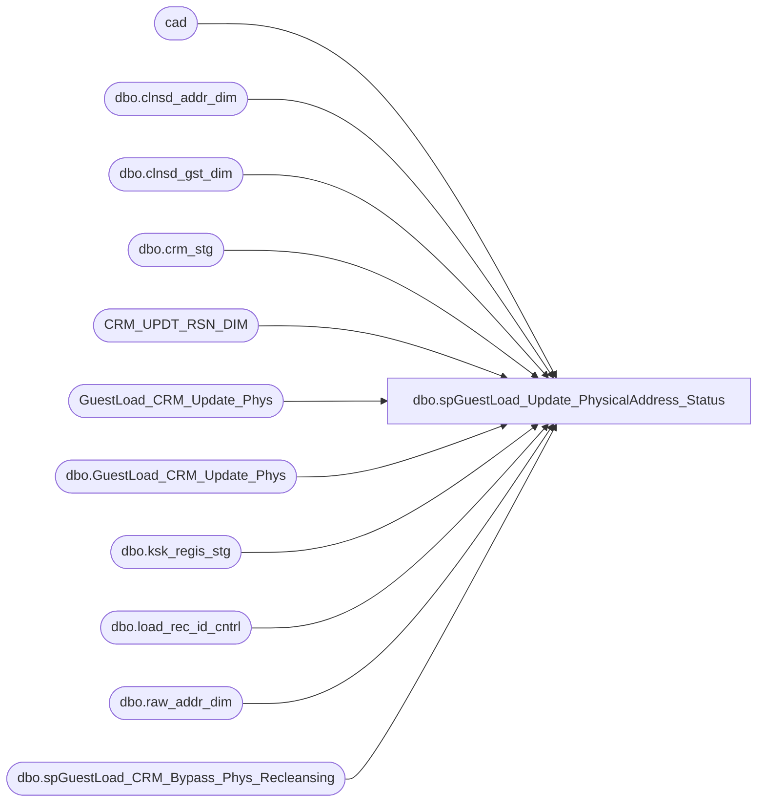

# dbo.spGuestLoad_Update_PhysicalAddress_Status

**Database:** dw  
**Server:** papamart  

## Architecture Diagram



## Table Dependencies

| Referenced Table |
|---|
| cad |
| dbo.clnsd_addr_dim |
| dbo.clnsd_gst_dim |
| dbo.crm_stg |
| CRM_UPDT_RSN_DIM |
| GuestLoad_CRM_Update_Phys |
| dbo.GuestLoad_CRM_Update_Phys |
| dbo.ksk_regis_stg |
| dbo.load_rec_id_cntrl |
| dbo.raw_addr_dim |
| dbo.spGuestLoad_CRM_Bypass_Phys_Recleansing |

## Stored Procedure Code

```sql
-- =============================================================================================================
-- Name: spGuestLoad_Update_PhysicalAddress_Status
--
-- Description:	
--		Update the status_cd of physical addresses.  The problem is that there is a complicated list of rules on who can
--		update whom and when.  So, resolve the batch of ksk and crm physical addresses then look to see what the current
--		status of thephysical address is.  For example, this load might have kiosk entries for the physical address,
--		but, when we look at the current physical address, it's tied to a loyalty member, so then, we can not do 
--		any updates since a crm member overrides kiosk.
--
--		the goal of this proc is to only do the necessary updates, before, we were doing a series
--		of optins, then optouts, then unknowns.  there was lots of redundancy, this proc
--		gets down to the core update by working on a temp table
--
--		a kiosk record can not update a CRM guest or a HandRaiser
--
--		a crm record can not update a HandRaiser
--		going with the theory that crm is the master then, any updates coming down, should be taken 
--		as gospel, meaning that an existing opt-out, could be opted back in via crm
--
-- Input:
--		@etl_log_id			int	
--			Current load to process
--
--		@etl_evnt_id		int	
--			Current load to process
--
-- Output: 
--
-- Dependencies: 
--
-- EXAMPLE:
--		exec dw.dbo.spGuestLoad_Update_PhysicalAddress_Status 17824, 1
--
-- Revision History
--		Name:			Date:			Comments:
--		Dave Rice		7/19/2010		created
--		Dave Rice		02/14/2011		tweaked the order of dup deletion so that crm trumps kiosk
-- =============================================================================================================
CREATE PROCEDURE [dbo].[spGuestLoad_Update_PhysicalAddress_Status](@etl_log_id int, @etl_evnt_id int)
AS
BEGIN
-- SET NOCOUNT ON added to prevent extra result sets from
-- interfering with SELECT statements.
SET NOCOUNT ON;

--update clnsd_addr_dim set glbl_opt_in_dt = '1/1/1900' where glbl_opt_in_dt is not null

----select top 1 etl_log_id from dwstaging.dbo.load_rec_id_cntrl with (nolock)
--declare @etl_log_id int
--declare @etl_evnt_id int
--set @etl_log_id = 41501
--set @etl_evnt_id = -1

-- clear out old data
delete 
from dw.dbo.GuestLoad_CRM_Update_Phys
where ins_dt < dateadd(dd, -14, getdate())
	and batch_id is not null

-- ************************************************************************************************************
-- * kiosk addresses
-- ************************************************************************************************************

-- any new addresses would have been inserted into clnsd_addr_dim earlier in the guest load process by the clnsd_addr package. 
-- opt-outs should have overridden opt-ins

IF (Object_ID('tempdb..#kiosk') IS NOT NULL) DROP TABLE #kiosk
select distinct 
	'KSK' source,
	cad.clnsd_addr_id, 
--	-- not valid for clnsd_addr_dim yet, not sure it is ever applicable, but we could use it if we get data back from the printer
--	-- but that's not likely because it costs extra money
--	cad.mail_stat_cd,	-- for valid/invalid/bounce

	case 
		when cad.mail_stat_cd = 'OPT-IN' then 'Y'
		when cad.mail_stat_cd = 'OPT-OUT' then 'N'
		else 'U'
	end dw_promo_pref,
	cast(convert(varchar, cad.glbl_opt_in_dt, 101) as datetime) dw_promo_updt_dt,

--	case 
--		when rad.drvd_mail_stat_cd = 'Y' then 'OPT-IN'
--		when rad.drvd_mail_stat_cd = 'N' then 'OPT-OUT'
--		else 'UNK'
--	end 
	rad.drvd_mail_stat_cd imported_promo_pref,
	cast(convert(varchar, s.trn_start_dt, 101) as datetime) imported_promo_updt_dt,

	rad.addr_ln_1_txt addr_ln_1_txt_old,
	rad.addr_ln_2_txt addr_ln_2_txt_old,
	rad.pstl_cd pstl_cd_old,
	rad.cntry_txt cntry_txt_old,

	cad.addr_ln_1_txt addr_ln_1_txt_new,
	cad.addr_ln_2_txt addr_ln_2_txt_new,
	cad.apt_unit_nbr apt_unit_nbr_new,
	cad.cty_nm cty_nm_new, 
	cad.st_prvnc_abbrv st_prvnc_abbrv_new,
	cad.pstl_cd pstl_cd_new,
	cad.pstl_pls_4_cd pstl_pls_4_cd_new,
	cad.cntry_abbrv cntry_abbrv_new,

	case when s.prty_trn_cd in ('true','yes','1') then 'Y' else 'N' end party,
	0 InternalDuplicateFlag,

	case when cgd.lylty_gst_nbr is not null then 1 else 0 end lylty_gst_nbr_flag
--	cgd.crm_gst_nbr,
--	cgd.lylty_gst_nbr
into #kiosk
from dwstaging.dbo.load_rec_id_cntrl lric  with (nolock)
	join dwstaging.dbo.ksk_regis_stg s with (nolock)
	ON s.ksk_regis_stg_id = lric.stg_id
	join dw.dbo.raw_addr_dim rad with (nolock)
	on rad.raw_addr_id = lric.raw_addr_id
	join dw.dbo.clnsd_addr_dim cad with (nolock)
	on cad.clnsd_addr_id = rad.clnsd_addr_id
	-- this is for prior crm guests that have this address
	-- need to handle new crm guests in the same batch
	left join dw.dbo.clnsd_gst_dim cgd with (nolock)
	on cgd.clnsd_addr_id = cad.clnsd_addr_id
where 1=1
	and lric.clnsd_addr_id >= 0
	and lric.stg_dta_set_cd = 'KSK'
	and lric.ETL_LOG_ID = @etl_log_id

-- we will not be sending emails or postal updates to guests from a party that tried to change a stat code for a physical address
-- so just delete parties out completely so there is no chance of contamination
delete from #kiosk
where party = 'Y'


-- ************************************************************************************************************
-- * crm 
-- ************************************************************************************************************
--truncate table GuestLoad_CRM_Update_Phys
-- select * from GuestLoad_CRM_Update_Phys

-- might have a problem with puerto rico because of address 2 and an apartment number, worst case, we
-- could repeated updates going to CRM for PR.

-- log the cleansed updates for addresses
insert into GuestLoad_CRM_Update_Phys (
	CRM_UPDT_RSN_ID, 
--	RAW_ADDR_ID, 
	CLNSD_ADDR_ID,

	-- old data
	ADDR_LN_1_TXT_OLD, ADDR_LN_2_TXT_OLD, PSTL_CD_OLD, CNTRY_TXT_OLD,
--	-- new data
--	ADDR_LN_1_TXT_NEW, ADDR_LN_2_TXT_NEW, APT_UNIT_NBR_NEW, CTY_NM_NEW, ST_PRVNC_ABBRV_NEW, PSTL_CD_NEW, PSTL_PLS_4_CD_NEW, CNTRY_ABBRV_NEW, 
	CLEANSABLE,
	INS_DT, ETL_LOG_ID)
select distinct
	(select CRM_UPDT_RSN_ID from CRM_UPDT_RSN_DIM where CRM_UPDT_RSN_CD = 'CLEANSED'), 
--	rad.RAW_ADDR_ID,
	cad.CLNSD_ADDR_ID,
	
	rad.ADDR_LN_1_TXT,
	rad.ADDR_LN_2_TXT,
	rad.PSTL_CD,
	rad.CNTRY_TXT,

--	-- new data
--	case when cad.ST_PRVNC_ABBRV = 'PR' and cad.ADDR_LN_2_TXT is not null then cad.ADDR_LN_2_TXT else cad.ADDR_LN_1_TXT end ADDR_LN_1_TXT,
--	null ADDR_LN_2_TXT,
--	cad.APT_UNIT_NBR,
--	cad.CTY_NM,
--	cad.ST_PRVNC_ABBRV,
--	cad.PSTL_CD,
--	cad.PSTL_PLS_4_CD,
--	cad.CNTRY_ABBRV,

	case when cad.clnsd_addr_id = -1 then 'N' else 'Y' end,

	getdate(),
	@etl_log_id
--	-1
--
--select *
from dwstaging.dbo.load_rec_id_cntrl lric with (nolock)
--	join dwstaging.dbo.crm_stg s with (nolock)
--	ON s.crm_stg_id = lric.stg_id
	join dw.dbo.raw_addr_dim rad with (nolock)
	ON rad.raw_addr_id = lric.raw_addr_id
	join dw.dbo.clnsd_addr_dim cad
	on cad.clnsd_addr_id = rad.clnsd_addr_id

	-- do not insert duplicate records if the previous ones haven't been processed yet
	left join GuestLoad_CRM_Update_Phys up
	on up.raw_addr_id = rad.raw_addr_id
	and up.BATCH_ID is null
	and up.crm_updt_rsn_id = (select CRM_UPDT_RSN_ID from CRM_UPDT_RSN_DIM where CRM_UPDT_RSN_CD = 'CLEANSED')

where lric.stg_dta_set_cd = 'CRM'
	-- did the address change?  if so, it needs to move up to CRM
	-- comparing apartment number and address 2 with PR can be difficult, in general addr_ln_2 should contain the apartment 
	-- number 
	and (
		isnull(rad.ADDR_LN_1_TXT,'') != isnull(cad.ADDR_LN_1_TXT,'')
		or isnull(rad.ADDR_LN_2_TXT,'') != isnull(cad.APT_UNIT_NBR,'')
		or isnull(rad.CTY_NM,'') != isnull(cad.CTY_NM,'')
		or isnull(rad.PSTL_CD,'') != isnull(cad.PSTL_CD,'')
		or isnull(rad.ST_PRVNC_TXT,'') != isnull(cad.ST_PRVNC_ABBRV,'')
		or isnull(rad.CNTRY_TXT,'') != isnull(cad.CNTRY_ABBRV,'')
	)	
	and up.updt_id is null
	and lric.etl_log_id = @etl_log_id

-- pull all distinct permutations of addresses in this batch, so we can be efficient in our updates
IF (Object_ID('tempdb..#crm') IS NOT NULL) DROP TABLE #crm
select distinct 
	'CRM' source,
	cad.clnsd_addr_id, 
--	-- not valid for clnsd_addr_dim yet, not sure it is ever applicable, but we could use it if we get data back from the printer
--	-- but that's not likely because it costs extra money
--	cad.mail_stat_cd,	-- for valid/invalid/bounce

	case 
		when cad.mail_stat_cd = 'OPT-IN' then 'Y'
		when cad.mail_stat_cd = 'OPT-OUT' then 'N'
		else 'U'
	end dw_promo_pref,
	cast(convert(varchar, cad.glbl_opt_in_dt, 101) as datetime) dw_promo_updt_dt,

--	case 
--		when rad.drvd_mail_stat_cd = 'Y' then 'OPT-IN'
--		when rad.drvd_mail_stat_cd = 'N' then 'OPT-OUT'
--		else 'UNK'
--	end imported_promo_pref,
	rad.drvd_mail_stat_cd imported_promo_pref,
	cast(convert(varchar, s.mail_updt_dt, 101) as datetime) imported_promo_updt_dt,

	s.dm_attr_stat_cd stg_dm_attr_stat_cd,

	s.crm_lylty_nbr,
--	s.crm_gst_nbr,

	rad.addr_ln_1_txt addr_ln_1_txt_old,
	rad.addr_ln_2_txt addr_ln_2_txt_old,
	rad.pstl_cd pstl_cd_old,
	rad.cntry_txt cntry_txt_old,

	cad.addr_ln_1_txt addr_ln_1_txt_new,
	cad.addr_ln_2_txt addr_ln_2_txt_new,
	cad.apt_unit_nbr apt_unit_nbr_new,
	cad.cty_nm cty_nm_new,
	cad.st_prvnc_abbrv st_prvnc_abbrv_new,
	cad.pstl_cd pstl_cd_new,
	cad.pstl_pls_4_cd pstl_pls_4_cd_new,
	cad.cntry_abbrv cntry_abbrv_new,

	0 InternalDuplicateFlag
--	0 UpdateFlag
--	case when cgd.lylty_gst_nbr is not null then 1 else 0 end loyalty
into #crm
----select *
from dwstaging.dbo.load_rec_id_cntrl lric  with (nolock)
	join dwstaging.dbo.crm_stg s with (nolock)
	ON s.crm_stg_id = lric.stg_id
	join dw.dbo.raw_addr_dim rad with (nolock)
	on rad.raw_addr_id = lric.raw_addr_id
	join dw.dbo.clnsd_addr_dim cad with (nolock)
	on cad.clnsd_addr_id = rad.clnsd_addr_id
	-- this is for prior crm guests that have this address
	-- need to handle new crm guests in the same batch
	left join dw.dbo.clnsd_gst_dim cgd with (nolock)
	on cgd.clnsd_addr_id = cad.clnsd_addr_id
where 1=1
	and lric.clnsd_addr_id >= 0
	and lric.stg_dta_set_cd = 'CRM'
	and lric.ETL_LOG_ID = @etl_log_id


------ requirement 12/22/2010 
------		New SFS emails should automatically be opted-in.  This will also apply to mailing addresses.
------ for only loyalty folks, if this is a new email that is not currently tied to a customer, then 
------ force the status to Y, irregardless of what the real parameters are.
------ the question then is how do we know these are new SFS guests and that their emails haven't been used before?
------ since the update of the email status - this proc - occurs after the insert and before any updates to
------ clnsd_gst_dim, helps, we just need to look at the etl_log_id to see if it matches and assume it was inserted today.
------ and the same goes for the email, the inserts would have occurred before these updates, so the etl_log_id 
------ could be used.
------ upon further reflection, we should just use the email_addr_dim etl_log_id, that would be an obvious insert
------ and since the only updates to email_addr_dim should be this proc, then that just leaves the kiosk situation
------
------ but, what if the email already exists and now a crm customer uses it as a loyalty member?
------
------
------update #crm
------set imported_promo_pref = 'OPT-IN'
--------	updateflag = 1
--------select c.* 
------from #crm c
------	join dw.dbo.clnsd_addr_dim cad
------	on cad.clnsd_addr_id = c.clnsd_addr_id
------where etl_log_id = @etl_log_id
------	and crm_lylty_nbr is not null  -- only sfs accounts should be affected by these, emal and prf should not have the lylty_gst_nbr coming down
------	and (imported_promo_pref != 'OPT-IN')


--/*
--have a problem with pref guests or even crm folks that don't make it into clnsd_gst_dim (no last name),
--there is nothing to say they are preference/crm guests.
--*/


-- ************************************************************************************************************
-- ************************************************************************************************************

-- consolidate the updates
-- only grab the new ones
IF (Object_ID('tempdb..#update') IS NOT NULL) DROP TABLE #update
create table #update (
	id int IDENTITY(1,1) NOT NULL,
	source varchar(10),
	clnsd_addr_id int, 

	-- old data
	addr_ln_1_txt_old	varchar(100),
	addr_ln_2_txt_old	varchar(60),
	pstl_cd_old			varchar(30),
	cntry_txt_old		varchar(60),

	-- new data
	addr_ln_1_txt_new	varchar(60),
	addr_ln_2_txt_new	varchar(60),
	apt_unit_nbr_new	varchar(60),
	cty_nm_new			varchar(60),
	st_prvnc_abbrv_new	varchar(5),
	pstl_cd_new			varchar(10),
	pstl_pls_4_cd_new	varchar(4),
	cntry_abbrv_new		varchar(5),

	dw_pref	varchar(10),
	dw_updt_dt	datetime,
	imported_pref varchar(10),
	imported_updt_dt	datetime,
	InternalDuplicateFlag int
)


IF (Object_ID('tempdb..#pref_types') IS NOT NULL) DROP TABLE #pref_types
create table #pref_types (
	id int IDENTITY(1,1) NOT NULL,
	pref varchar(50)
)

insert into #pref_types values('promo')

declare curPrefs cursor
for
	select pref from #pref_types
	order by id
open curPrefs

declare @pref varchar(50)

fetch next from curPrefs into @pref
while (@@fetch_STATUS <> -1)
begin
print @pref

	truncate table #update

-- ************************************************************************************************************
-- ************************************************************************************************************

-- dang, do i need to update the date anyhow?
-- just because the stat doesn't change doesn't mean that the date shouldn't
-- if a reload happens, then you would have to process all the records anyhow

-- 01/01/2008		N
-- 01/10/2008		N
-- 01/08/2008		Y
-- by this example, depending on the order of records (and not updating the date if the status doesn't change),
-- the result could be N or Y
-- All is well, i did code for the date to be updated, i will not update if the date and status is the same as the update record


	-- promo updates
	if @pref = 'promo' 
	begin
print @pref + ' insert into #update'
--truncate table #update

		insert into #update (source, clnsd_addr_id, 
			addr_ln_1_txt_old, addr_ln_2_txt_old, pstl_cd_old, cntry_txt_old, 
			addr_ln_1_txt_new, addr_ln_2_txt_new, apt_unit_nbr_new, cty_nm_new, st_prvnc_abbrv_new, pstl_cd_new, pstl_pls_4_cd_new, cntry_abbrv_new, 
			dw_pref, dw_updt_dt, imported_pref, imported_updt_dt, InternalDuplicateFlag)
		select distinct 
			source,
			clnsd_addr_id, 
			addr_ln_1_txt_old, addr_ln_2_txt_old, pstl_cd_old, cntry_txt_old, 
			addr_ln_1_txt_new, addr_ln_2_txt_new, apt_unit_nbr_new, cty_nm_new, st_prvnc_abbrv_new, pstl_cd_new, pstl_pls_4_cd_new, cntry_abbrv_new, 
			dw_promo_pref,
			dw_promo_updt_dt,
			imported_promo_pref,
			imported_promo_updt_dt,
			0 
		from #kiosk
		where imported_promo_updt_dt >= dw_promo_updt_dt
			and party != 'Y'

		union

		select distinct 
			source,
			clnsd_addr_id, 
			addr_ln_1_txt_old, addr_ln_2_txt_old, pstl_cd_old, cntry_txt_old, 
			addr_ln_1_txt_new, addr_ln_2_txt_new, apt_unit_nbr_new, cty_nm_new, st_prvnc_abbrv_new, pstl_cd_new, pstl_pls_4_cd_new, cntry_abbrv_new, 
			dw_promo_pref,
			dw_promo_updt_dt,
			imported_promo_pref,
			imported_promo_updt_dt,
			0 
		from #crm
		where imported_promo_updt_dt >= dw_promo_updt_dt

	end

-- ************************************************************************************************************
-- ************************************************************************************************************

	-- the whole goal of the following commands is to find the most recent update 

	-- do not allow null dates to override anything
	-- assume this record will be completed later in crm
	delete from #update 
--	select * from #update 
	where imported_updt_dt is null

	-- remove any updates that are older than what we have in production - could be from a reload
	-- except where the current update is 'U' and it's a newer date than what is coming in.  basically, an historical load 
	-- could have been loaded out of sync
	delete from #update
	--select * from #update
	where dw_updt_dt > imported_updt_dt
		and dw_pref not in ('U')

	-- if we have valid updates that are earlier than an unknown, find that unknown and pop it so it doesn't contaminate things
	delete from #update
	-- select *
	from #update u
		join (
		select clnsd_addr_id, max(imported_updt_dt) max_imported_updt_dt
		from #update
		where imported_pref != 'U'
		group by clnsd_addr_id
		) d
		on d.clnsd_addr_id = u.clnsd_addr_id
	where u.imported_updt_dt > d.max_imported_updt_dt
		and imported_pref = 'U'

	-- remove any updates that are less than the max newest date
	-- make sure not to include unknowns in this, they could be the max date
	delete from #update
--select *
	from #update u
		join (
		select clnsd_addr_id, max(imported_updt_dt) max_imported_updt_dt
		from #update
		group by clnsd_addr_id
		having count(*) > 1
		) d
		on d.clnsd_addr_id = u.clnsd_addr_id
	where u.imported_updt_dt < d.max_imported_updt_dt

	-- mark the dups
	update #update
	set InternalDuplicateFlag = 1
--select *
	from #update k
		join (
		select clnsd_addr_id
		from #update
		group by clnsd_addr_id
		having count(*) > 1
		) d
		on d.clnsd_addr_id = k.clnsd_addr_id

	-- we might still have dups, this could occur if a CRM and KSK entry try to update the same email, on the same day, with the same status
	-- so find them and then pop the KSK version
	delete from #update
--select *
	from #update u
		join (
		select clnsd_addr_id, sum(case when source = 'CRM' then 1 else 0 end) crm_count, sum(case when source = 'KSK' then 1 else 0 end) ksk_count
		from #update
		where InternalDuplicateFlag = 1
		group by clnsd_addr_id
		having count(*) > 1
		) d
		on d.clnsd_addr_id = u.clnsd_addr_id
		and crm_count > 0 and ksk_count > 0
	where source = 'KSK'

	-- if we have a NO, then it superceeds all other statuses, so remove all others
	delete from #update
--select *
	from #update u
		join (
		select clnsd_addr_id, sum(case when imported_pref = 'N' then 1 else 0 end) found_N
		from #update
		where InternalDuplicateFlag = 1
		group by clnsd_addr_id
		having count(*) > 1
		) d
		on d.clnsd_addr_id = u.clnsd_addr_id
	where found_N > 0
		and imported_pref not in ('N')

	-- if we have a Yes, then it superceeds all remaining statuses, so remove all others
	delete from #update
--select *
	from #update u
		join (
		select clnsd_addr_id, sum(case when imported_pref = 'Y' then 1 else 0 end) found_Y
		from #update
		where InternalDuplicateFlag = 1
		group by clnsd_addr_id
		having count(*) > 1
		) d
		on d.clnsd_addr_id = u.clnsd_addr_id
	where found_Y > 0
		and imported_pref not in ('Y', 'N')

	-- remove anything that is the same status AND date - would be a bit redundant to do these updates
	-- even if the status is the same, we will do the update to the warehouse if the date is different
	-- you need the date updated so that a No from 5 years ago with subsequent Nos every where there after
	-- being overridden by a Yes from 3 years ago
	delete from #update
	--select * from #update
	where imported_pref = dw_pref
		and imported_updt_dt = dw_updt_dt

	-- do not allow any unknowns to update a valid status
	delete from #update
	--select * from #update
	where dw_pref in ('N','Y') and imported_pref = 'U'

	-- might still have dups, so take the max id and delete any others
	delete from #update
--select max_id,*
	from #update u
		join (
		select clnsd_addr_id, max(id) max_id
		from #update
		where InternalDuplicateFlag = 1
		group by clnsd_addr_id
		having count(*) > 1
		) d
		on d.clnsd_addr_id = u.clnsd_addr_id
	where id != max_id

	-- do not allow an import ksk record to update a production crm record for the same day
	-- shouldn't need to get too detailed on the multitude of email statuses because ksk can only
	-- update the main one - promo_pref
	delete from #update
--select *
	from #update u
		join dw.dbo.clnsd_addr_dim cad
		on cad.clnsd_addr_id = u.clnsd_addr_id
	where cad.opt_in_src_sys_cd = 'CRM' and u.source = 'KSK'
		and cad.glbl_opt_in_dt = u.imported_updt_dt

	-- do not allow a Yes to update a No for the same day 
	delete from #update
	where imported_pref = 'Y'
		and dw_pref = 'N'
		and imported_updt_dt = dw_updt_dt

	-- do not bother updating an unknown with an unknown
	delete from #update
	where imported_pref = 'U' and dw_pref = 'U'


-- ************************************************************************************************************
-- ************************************************************************************************************

	-- do the remaining updates
	if @pref = 'promo'
	begin
print @pref + ' update'

		update cad
		set cad.opt_in_src_sys_cd = source
			,cad.mail_stat_cd = 
			case
				when imported_pref = 'Y' then 'OPT-IN'
				when imported_pref = 'N' then 'OPT-OUT'
				else 'UNK'
			end
--			, cad.mail_stat_cd = imported_pref
			, cad.glbl_opt_in_dt = imported_updt_dt
			, cad.updt_dt = getdate()
--			, cad.etl_log_id = @etl_log_id
--			, cad.etl_evnt_id = @etl_evnt_id
--		select *
		from dw.dbo.clnsd_addr_dim cad
			join #update u
			on u.clnsd_addr_id = cad.clnsd_addr_id


		-- find all the original address so that we can update them in CRM, 
		-- the cleansed version of the email address won't help if they haven't been updated yet
		-- the problem is that we do not know what emails are on crm at what point in time, granted, we could
		-- use a linked server and find out, but doesn't this business logic belong in the export process to CRM?
		insert into GuestLoad_CRM_Update_Phys (
			CRM_UPDT_RSN_ID, 
			clnsd_addr_id, 
			addr_ln_1_txt_old, addr_ln_2_txt_old, pstl_cd_old, cntry_txt_old, 
--			addr_ln_1_txt_new, addr_ln_2_txt_new, apt_unit_nbr_new, cty_nm_new, st_prvnc_abbrv_new, pstl_cd_new, pstl_pls_4_cd_new, cntry_abbrv_new, 
			INS_DT, ETL_LOG_ID)

		select distinct
			case 
				when source = 'KSK' then (select CRM_UPDT_RSN_ID from CRM_UPDT_RSN_DIM where CRM_UPDT_RSN_CD = 'KSK_UPDT')
				when source = 'CRM' then (select CRM_UPDT_RSN_ID from CRM_UPDT_RSN_DIM where CRM_UPDT_RSN_CD = 'CRM_UPDT')
			end, 

			u.clnsd_addr_id, 
			u.addr_ln_1_txt_old, u.addr_ln_2_txt_old, u.pstl_cd_old, u.cntry_txt_old, 
--			u.addr_ln_1_txt_new, u.addr_ln_2_txt_new, u.apt_unit_nbr_new, u.cty_nm_new, u.st_prvnc_abbrv_new, u.pstl_cd_new, u.pstl_pls_4_cd_new, u.cntry_abbrv_new, 

			getdate(),
			@etl_log_id
--			-1
--		select  k.dw_promo_pref, u.imported_pref, *
--select *
		from #update u
			join dw.dbo.raw_addr_dim rad 
			on rad.clnsd_addr_id = u.clnsd_addr_id

			-- don't insert dups that haven't been processed yet
			left join GuestLoad_CRM_Update_Phys up
			on up.raw_addr_id = rad.raw_addr_id
			and up.BATCH_ID is null
			and up.crm_updt_rsn_id = (select CRM_UPDT_RSN_ID from CRM_UPDT_RSN_DIM where CRM_UPDT_RSN_CD = 'CRM_UPDT')
		where u.dw_pref != u.imported_pref
			and up.updt_id is null

		union

		-- pull any addresses where we are missing the appropriate prft attribute, use GaryM's code to create these in CRM
		-- these will be coming from crm/pos and not from crm/pref
		select distinct
			case 
				when source = 'KSK' then (select CRM_UPDT_RSN_ID from CRM_UPDT_RSN_DIM where CRM_UPDT_RSN_CD = 'KSK_UPDT')
				when source = 'CRM' then (select CRM_UPDT_RSN_ID from CRM_UPDT_RSN_DIM where CRM_UPDT_RSN_CD = 'CRM_UPDT')
			end, 

			cad.clnsd_addr_id, 
			s.addr_ln_1_txt_old, s.addr_ln_2_txt_old, s.pstl_cd_old, s.cntry_txt_old, 
--			s.addr_ln_1_txt_new, s.addr_ln_2_txt_new, s.apt_unit_nbr_new, s.cty_nm_new, s.st_prvnc_abbrv_new, s.pstl_cd_new, s.pstl_pls_4_cd_new, s.cntry_abbrv_new, 

			getdate(),
--			@etl_log_id
			-1
		from #crm s
			join dw.dbo.clnsd_addr_dim cad
			on cad.clnsd_addr_id = s.clnsd_addr_id

			-- don't insert dups that haven't been processed yet
			left join GuestLoad_CRM_Update_Phys up
			on up.clnsd_addr_id = cad.clnsd_addr_id
			and up.BATCH_ID is null
			and up.crm_updt_rsn_id = (select CRM_UPDT_RSN_ID from CRM_UPDT_RSN_DIM where CRM_UPDT_RSN_CD = 'CRM_UPDT')
		where stg_dm_attr_stat_cd is null
			and up.updt_id is null
	end

	fetch next from curPrefs into @pref
END
close curPrefs
deallocate curPrefs

-- add in any cleansed addresses to raw_addr_dim so we don't have to recleanse things
exec dw.dbo.spGuestLoad_CRM_Bypass_Phys_Recleansing @etl_log_id, @etl_evnt_id

END
```

