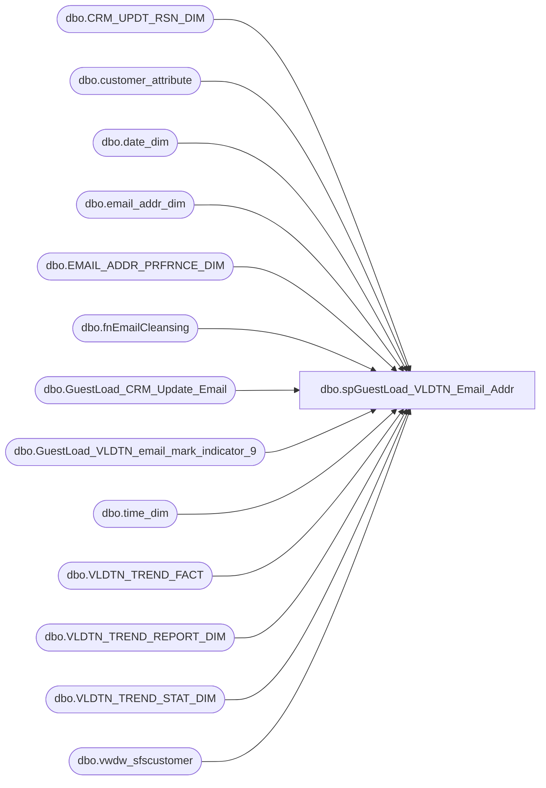

# dbo.spGuestLoad_VLDTN_Email_Addr

**Database:** dw  
**Server:** papamart  

## Architecture Diagram



## Table Dependencies

| Referenced Table |
|---|
| dbo.CRM_UPDT_RSN_DIM |
| dbo.customer_attribute |
| dbo.date_dim |
| dbo.email_addr_dim |
| dbo.EMAIL_ADDR_PRFRNCE_DIM |
| dbo.fnEmailCleansing |
| dbo.GuestLoad_CRM_Update_Email |
| dbo.GuestLoad_VLDTN_email_mark_indicator_9 |
| dbo.time_dim |
| dbo.VLDTN_TREND_FACT |
| dbo.VLDTN_TREND_REPORT_DIM |
| dbo.VLDTN_TREND_STAT_DIM |
| dbo.vwdw_sfscustomer |

## Stored Procedure Code

```sql
CREATE PROCEDURE [dbo].[spGuestLoad_VLDTN_Email_Addr]
-- =============================================================================================================
-- Name: spGuestLoad_VLDTN_Email_Addr
--
-- Description:	
--		This proc will validate the email addresses from CRM.  We're looking for the following:
--			1.  opt-in/out statuses that don't match between CRM and DW
--			2.	attributes that aren't matching the main opt-in status
--			3.	bad/uncleansable addresses that aren't marked as such in CRM
--
--		The goal is to show patterns over time by recording the statuses in validation tables.
--		And, try to automatically fix things.
--		Things are complicated by the crmise01 and crmdb02 replication back and forth that can
--		override our settings without setting any of the date fields we use to indicate that an 
--		update occurred.  Plus, accounts can be merged together which might cause. 
--		Although, you would think that since the same address would be used in the merge, there
--		shouldn't be a change - have to mention this because merging happens behind the scenes 
--		automatically.
--
--
-- Input:
--		none
--
-- Output: 
--		Validation stats will be inserted into VLDTN_TREND_FACT.
--
--		Addresses that can be fixed are loaded into GaryMu's table so that they can be resync'd 
--		from DW up to CRM:  dw.dbo.GuestLoad_CRM_Update_Email
--
--		GaryMu's code can not update address records in CRM where there is a null address line 1.
--		There are checks in place in CRM to prevent this, so we need to manually update them.
--		I have to do this by loading up a table CRM with customer numbers that then will get processed
--		through a loop.  Tried to batch update it for efficiancy, but it threw CRM for a loop.  Locks
--		occurred and we had to reboot.  Odd, could have been a coincidence, but to be safe, I stopped the
--		batching and removed my begin tran/commit tran clause and only process one customer at a time.
--		The problem could have been the triggers that fire off on the update.
--
--
-- Dependencies: 
--
-- EXAMPLE:
--		exec dw.dbo.spGuestLoad_VLDTN_Email_Addr
--
-- Revision History
--		Name:			Date:			Comments:
--		Dave Rice		04/21/2011		created
-- =============================================================================================================
AS
BEGIN
-- SET NOCOUNT ON added to prevent extra result sets from
-- interfering with SELECT statements.
SET NOCOUNT ON;

-- pull the crm folks 
IF (Object_ID('tempdb.dbo.#crm_email') IS NOT NULL) DROP TABLE #crm_email
select customer_no, 
	email_indicator, 
	opt_in_flag, 
	opt_in_date, 
	email_attr.attribute_value email_attr_opt_in_flag, 
	membership_type_code, 
	email_address, 
	case when opt_in_flag not in (2) then 'OPT-IN' else 'OPT-OUT' end drvd_email_stat_cd,
	-- get the last "touched" date
	c.create_date,
	c.last_update_date

into #crm_email
from crmdb02.crm.dbo.vwdw_sfscustomer c
	-- duplicate of opt_in_flag, needs to be kept in sync
	LEFT JOIN crmdb02.crm.dbo.customer_attribute email_attr with (nolock)
		ON email_attr.customer_id = c.customer_id
		AND email_attr.attribute_grouping_code = 'PRFT'
		AND email_attr.attribute_code = 'EMAIL'
where email_address is not null
--create index ix_#crm_email on #crm_email(customer_no)
create index ix_#crm_email_email_address on #crm_email(email_address)
--5848051

-- do not process emails that have been touched in the last day
-- we need to let them process through the guest load first
delete from #crm_email
from #crm_email e
	join (
		select email_address from #crm_email
		where create_date > dateadd(dd, -1, getdate())
			or last_update_date > dateadd(dd, -1, getdate())
	) d
	on d.email_address = e.email_address

-- clean up the email to standardize with dw
IF (Object_ID('tempdb.dbo.#crm_email_new') IS NOT NULL) DROP TABLE #crm_email_new
select c.*, case when ead.email_addr_txt is not null then ead.email_addr_txt else dw.dbo.fnEmailCleansing(email_address) end email_address_cleansed
into #crm_email_new
from #crm_email c
	left join dw.dbo.email_addr_dim ead with (nolock)
	on ead.email_addr_txt = c.email_address collate SQL_Latin1_General_CP1_CI_AS

-- ************************************************************************************************************
-- ************************************************************************************************************
-- ************************************************************************************************************

IF (Object_ID('tempdb.dbo.#crm_email_dw') IS NOT NULL) DROP TABLE #crm_email_dw
select c.*, ead.email_addr_id, ead.email_addr_txt, 
	case 
		when eapd.promo_pref = 'Y' then 'OPT-IN' 
		when eapd.promo_pref = 'N' then 'OPT-OUT' 
		else 'UNK'
	end promo_pref,
	eapd.promo_updt_dt,
	ead.email_stat_cd,
	cast(null as varchar(100)) problem
--, ead.opt_in_src_sys_cd ead_opt_in_src_sys_cd
into #crm_email_dw
from #crm_email_new c
--	left join dw.dbo.email_addr_dim ead
	left join dw.dbo.email_addr_dim ead with (nolock)
	on ead.email_addr_txt = c.email_address_cleansed
	left join dw.dbo.EMAIL_ADDR_PRFRNCE_DIM eapd with (nolock)
	on eapd.email_addr_id = ead.email_addr_id

-- ************************************************************************************************************
-- ************************************************************************************************************
-- ************************************************************************************************************

-- optin/out issues do not matter to these
update #crm_email_dw 
set problem = 'bad@email.adr and indicator 4'
from #crm_email_dw
where 1=1
	and problem is null
	and email_address = 'bad@email.adr'
	and email_indicator = 4

update #crm_email_dw
set problem = 'bounce is set to indicator 4'
from #crm_email_dw
where 1=1
	and problem is null
	and email_stat_cd = 'bounce'
	and email_indicator = 4

update #crm_email_dw
set problem = 'invalid is set to indicator 4'
from #crm_email_dw
where 1=1
	and problem is null
	and email_stat_cd = 'invalid'
	and email_indicator = 4

update #crm_email_dw
set problem = 'spam is set to indicator 4'
from #crm_email_dw
where 1=1
	and problem is null
	and email_stat_cd = 'spam'
	and email_indicator = 4

update #crm_email_dw
set problem = 'inactive is set to indicator 4'
from #crm_email_dw
where 1=1
	and problem is null
	and email_stat_cd = 'INACTIVE'
	and email_indicator = 4


-- ************************************************************************************************************
-- ************************************************************************************************************
-- ************************************************************************************************************

update #crm_email_dw 
set problem = 'mismatched attribute flag'
from #crm_email_dw
where 1=1
	and problem is null
	and email_attr_opt_in_flag is not null
	and ((opt_in_flag = 1 and email_attr_opt_in_flag != 1)
		or (opt_in_flag = 2 and email_attr_opt_in_flag != 0))

update #crm_email_dw 
set problem = 'bad@email.adr and indicator is not 4'
from #crm_email_dw
where 1=1
	and problem is null
	and email_address = 'bad@email.adr'
	and email_indicator != 4

update #crm_email_dw 
set problem = 'bad address that needs to be set to bad@email.adr but is indicator 4'
from #crm_email_dw r
	join (
		select email_address, count(*) countme
		from #crm_email_dw
		where 1=1
			and problem is null
			and email_address_cleansed is null
		group by email_address
		having count(*) >= 3
--order by count(*) asc
	) d
	on d.email_address = r.email_address
where 1=1
	and problem is null
	and r.email_indicator = 4

update #crm_email_dw 
set problem = 'bad address that needs to be set to bad@email.adr but is not indicator 4'
from #crm_email_dw r
	join (
		select email_address, count(*) countme
		from #crm_email_dw
		where 1=1
			and problem is null
			and email_address_cleansed is null
		group by email_address
		having count(*) >= 3
--order by count(*) asc
	) d
	on d.email_address = r.email_address
where 1=1
	and problem is null

update #crm_email_dw 
set problem = 'invalid address that should be set to indicator 4'
from #crm_email_dw
where 1=1
	and problem is null
	and email_address_cleansed is null
	and email_indicator != 4

update #crm_email_dw
set problem = 'bounce not set to indicator 4'
from #crm_email_dw
where 1=1
	and problem is null
	and email_stat_cd = 'bounce'
	and email_indicator != 4

update #crm_email_dw
set problem = 'invalid is not set to indicator 4'
from #crm_email_dw
where 1=1
	and problem is null
	and email_stat_cd = 'invalid'
	and email_indicator != 4

update #crm_email_dw
set problem = 'spam is not set to indicator 4'
from #crm_email_dw
where 1=1
	and problem is null
	and email_stat_cd = 'spam'
	and email_indicator != 4

update #crm_email_dw
set problem = 'inactive is not set to indicator 4'
from #crm_email_dw
where 1=1
	and problem is null
	and email_stat_cd = 'inactive'
	and email_indicator != 4


update #crm_email_dw
set problem = 'opt-out dw / opt-in crm issue'
--select count(*)
from #crm_email_dw
where 1=1
	and problem is null
	and promo_pref != drvd_email_stat_cd
	and promo_pref = 'opt-out' and drvd_email_stat_cd = 'opt-in'

update #crm_email_dw
set problem = 'opt-in dw / opt-out crm issue'
--select count(*)
from #crm_email_dw
where 1=1
	and problem is null
	and promo_pref != drvd_email_stat_cd
	and promo_pref = 'opt-in' and drvd_email_stat_cd = 'opt-out'

update #crm_email_dw
set problem = 'address cleansable, need to update it'
--select email_address,email_address_cleansed, *
from #crm_email_dw
where 1=1
	and problem is null
	and email_address collate SQL_Latin1_General_CP1_CI_AS != email_address_cleansed

update #crm_email_dw
set problem = 'valid is not set to indicator 0'
--select *
from #crm_email_dw
where 1=1
	and problem is null
	and email_stat_cd = 'valid'
	and email_indicator != 0

-- ************************************************************************************************************
-- ************************************************************************************************************
-- ************************************************************************************************************

--update #crm_email_dw
--set problem = 'email not found in dw'
--where problem = 'interesting:  email not found in dw'

update #crm_email_dw
set problem = 'email not found in dw'
from #crm_email_dw
where 1=1
	and problem is null
	and email_addr_id is null

update #crm_email_dw
set problem = 'valid is set to indicator 0'
--select *
from #crm_email_dw
where 1=1
	and problem is null
	and email_stat_cd = 'valid'
	and email_indicator = 0

-- ************************************************************************************************************
-- ************************************************************************************************************
-- ************************************************************************************************************
IF (Object_ID('tempdb.dbo.#problem') IS NOT NULL) DROP TABLE #problem
select vtrd.VLDTN_TREND_REPORT_ID, VLDTN_TREND_STAT_ID, CAT1, problem, count, dsply_seq
into #problem
from (
	select problem, sum(countme) count
	from (
		select problem, count(*) countme
		from #crm_email_dw
		group by problem
		union 
			select 'bad@email.adr and indicator 4' problem, 0 countme
			union select 'bounce is set to indicator 4' problem, 0 countme
			union select 'invalid is set to indicator 4' problem, 0 countme
			union select 'spam is set to indicator 4' problem, 0 countme
			union select 'valid is set to indicator 0' problem, 0 countme
			union select 'email not found in dw' problem, 0 countme
			union select 'address cleansable, need to update it' problem, 0 countme
			union select 'bad address that needs to be set to bad@email.adr but is indicator 4' problem, 0 countme
			union select 'bad address that needs to be set to bad@email.adr but is not indicator 4' problem, 0 countme
			union select 'bad@email.adr and indicator is not 4' problem, 0 countme
			union select 'bounce not set to indicator 4' problem, 0 countme
			union select 'invalid address that should be set to indicator 4' problem, 0 countme
			union select 'invalid is not set to indicator 4' problem, 0 countme
			union select 'mismatched attribute flag' problem, 0 countme
			union select 'opt-in dw / opt-out crm issue' problem, 0 countme
			union select 'opt-out dw / opt-in crm issue' problem, 0 countme
			union select 'spam is not set to indicator 4' problem, 0 countme
			union select 'valid is not set to indicator 0' problem, 0 countme
		) d
	group by problem
	) p
	left join dw.dbo.VLDTN_TREND_REPORT_DIM vtrd
	on vtrd.nm = 'CRM Email Sync'
	left join dw.dbo.VLDTN_TREND_STAT_DIM vtsd
	on vtsd.nm = p.problem
	and vtsd.VLDTN_TREND_REPORT_ID = vtrd.VLDTN_TREND_REPORT_ID
order by dsply_seq

--select * from #problem
--
--select problem,* from #crm_email_dw
--where problem in (
--	'bad@email.adr and indicator 4',
--	'bad address that needs to be set to bad@email.adr but is indicator 4',
--	'bad address that needs to be set to bad@email.adr but is not indicator 4',
--	'bad@email.adr and indicator is not 4'
--	)


-- save off our status for reporting 
insert into dw.dbo.VLDTN_TREND_FACT (VLDTN_TREND_REPORT_ID, VLDTN_TREND_STAT_ID, DT_ID, TM_ID, METRIC_VALUE, ins_dt, updt_dt)
select 
	VLDTN_TREND_REPORT_ID, 
	VLDTN_TREND_STAT_ID, 
	(select date_key from dw.dbo.date_dim where actual_date = convert(varchar, getdate(), 101)),  
	(select time_key from dw.dbo.time_dim where hour = datepart(hh, getdate()) and minute = datepart(mi, getdate())),
	count,
	getdate(), 
	getdate()
from #problem


-- load up those customers that have invalid addresses that need to be marked as indicator 4
delete from crmdb02.crm.dbo.GuestLoad_VLDTN_email_mark_indicator_9
insert into crmdb02.crm.dbo.GuestLoad_VLDTN_email_mark_indicator_9 (customer_no)
select top 100000 customer_no
from #crm_email_dw
where problem in (
	'bad@email.adr and indicator 4',
	'bad address that needs to be set to bad@email.adr but is indicator 4',
	'bad address that needs to be set to bad@email.adr but is not indicator 4',
	'bad@email.adr and indicator is not 4'
	)
AND LEN(customer_no) <= 9 -- Alter to handle records with customer numbers longer than 9 digits

-- load up customers that need to be cleansed or synced with DW
-- this will populate GaryMu's table for processing
insert into dw.dbo.GuestLoad_CRM_Update_Email (CRM_UPDT_RSN_ID, EMAIL_ADDR_ID, EMAIL_ADDR_TXT_OLD, EMAIL_ADDR_TXT_NEW, INS_DT, ETL_LOG_ID)
select distinct
	(select CRM_UPDT_RSN_ID from dw.dbo.CRM_UPDT_RSN_DIM where CRM_UPDT_RSN_CD = 'CRM_UPDT'),
	u.email_addr_id,
	email_address,
	email_address_cleansed,
	getdate(),
	-1
--select *
from #crm_email_dw u
where problem in (
	'bounce not set to indicator 4',
	'invalid address that should be set to indicator 4',
	'invalid is not set to indicator 4',
	'mismatched attribute flag',
	'opt-in dw / opt-out crm issue',
	'opt-out dw / opt-in crm issue',
	'spam is not set to indicator 4',
	'inactive is not set to indicator 4',
	'valid is not set to indicator 0'
	)

END
```

