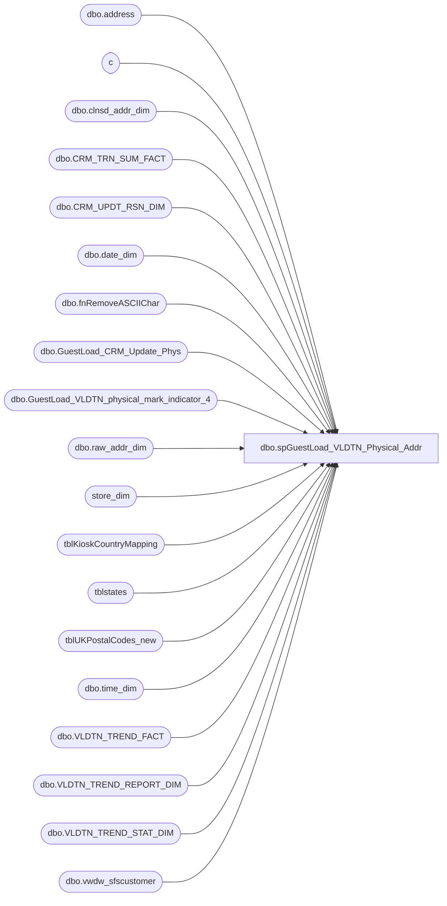

# dbo.spGuestLoad_VLDTN_Physical_Addr

**Database:** dw  
**Server:** papamart  

## Architecture Diagram



## Table Dependencies

| Referenced Table |
|---|
| dbo.address |
| c |
| dbo.clnsd_addr_dim |
| dbo.CRM_TRN_SUM_FACT |
| dbo.CRM_UPDT_RSN_DIM |
| dbo.date_dim |
| dbo.fnRemoveASCIIChar |
| dbo.GuestLoad_CRM_Update_Phys |
| dbo.GuestLoad_VLDTN_physical_mark_indicator_4 |
| dbo.raw_addr_dim |
| store_dim |
| tblKioskCountryMapping |
| tblstates |
| tblUKPostalCodes_new |
| dbo.time_dim |
| dbo.VLDTN_TREND_FACT |
| dbo.VLDTN_TREND_REPORT_DIM |
| dbo.VLDTN_TREND_STAT_DIM |
| dbo.vwdw_sfscustomer |

## Stored Procedure Code

```sql
-- =============================================================================================================
-- Name: spGuestLoad_VLDTN_Physical_Addr
--
-- Description:	
--		This proc will validate the physical addresses from CRM.  We're looking for the following:
--			1.  opt-in/out statuses that don't match between CRM and DW
--			2.	attributes that aren't matching the main opt-in status
--			3.	bad/uncleansable addresses that aren't marked as such in CRM
--
--		The goal is to show patterns over time by recording the statuses in validation tables.
--		And, try to automatically fix things.
--		Things are complicated by the crmise01 and crmdb02 replication back and forth that can
--		override our settings without setting any of the date fields we use to indicate that an 
--		update occurred.  Plus, accounts can be merged together which might cause. 
--		Although, you would think that since the same address would be used in the merge, there
--		shouldn't be a change - have to mention this because merging happens behind the scenes 
--		automatically.
--
--		Since there is no reason to update the entire database, I started in March, 2011 and only
--		focused on those folks that had any SFS activity in two years.  Hmmm, this might not work
--		for Pref Center users.  Something to think about.
--
-- Input:
--		none
--
-- Output: 
--		Validation stats will be inserted into VLDTN_TREND_FACT.
--
--		Addresses that can be fixed are loaded into GaryMu's table so that they can be resync'd 
--		from DW up to CRM:  dw.dbo.GuestLoad_CRM_Update_Phys
--
--		GaryMu's code can not update address records in CRM where there is a null address line 1.
--		There are checks in place in CRM to prevent this, so we need to manually update them.
--		I have to do this by loading up a table CRM with customer numbers that then will get processed
--		through a loop.  Tried to batch update it for efficiancy, but it threw CRM for a loop.  Locks
--		occurred and we had to reboot.  Odd, could have been a coincidence, but to be safe, I stopped the
--		batching and removed my begin tran/commit tran clause and only process one customer at a time.
--		The problem could have been the triggers that fire off on the update.
--
--
-- Dependencies: 
--
-- EXAMPLE:
--		exec dw.dbo.spGuestLoad_VLDTN_Physical_Addr
--
-- Revision History
--		Name:			Date:			Comments:
--		Dave Rice		04/21/2011		created
--		Edin Pehilj		11/19/2014		added 'Y' in cleansed field to be inserted in the dw.dbo.GuestLoad_CRM_Update_Phys table
--		Edin Pehilj		not implemented		change actual_date to dynamically go back 2 years, intead of hard coded 3/1/2009
--		Edin Pehilj		12/05/2014		Temporary modifying what problems are imported into dw.dbo.GuestLoad_CRM_Update_Phys to focus on certain problems first
-- =============================================================================================================
CREATE PROCEDURE [dbo].[spGuestLoad_VLDTN_Physical_Addr]
AS
BEGIN
-- SET NOCOUNT ON added to prevent extra result sets from
-- interfering with SELECT statements.
SET NOCOUNT ON;

/*

physical addresses

step 1:  take the raw addresses from crm and match to raw_addr_dim
step 2:  match crm address to the clnsd version referenced by raw_addr_dim clnsd_addr_id to make sure
		we have the cleansed address.	

*/


-- delete anything that's too old
-- focus on loyalty folks that have had recent activity
declare @min_date_key int
set @min_date_key = (select date_key from dw.dbo.date_dim where actual_date = '3/1/2009')
--set @min_date_key = (select date_key from dw.dbo.date_dim where actual_date = (select convert(varchar(10),dateadd(yyyy,-2,getdate()),111)))

--print @min_date_key

-- pull any loyalty person that had activity since our min date
IF (Object_ID('tempdb.dbo.#crm_transactions') IS NOT NULL) DROP TABLE #crm_transactions
select distinct lylty_gst_nbr
into #crm_transactions
from dw.dbo.CRM_TRN_SUM_FACT crm with (nolock)
where crm.dt_id >= @min_date_key

-- pull the CRM folks from CRM, but only those with recent activity
IF (Object_ID('tempdb.dbo.#crm_physical') IS NOT NULL) DROP TABLE #crm_physical
select 
	membership_type_code,
	create_date,
	last_update_date, 
	date_last_modified,

	store_no,
	c.customer_id, 
	customer_no, 
	active_address_id,
	first_name, 
	last_name, 

	address_1,
	address_2,
	address_3,
	address_4,
	address_5,
	address_6,
	post_code,
	country_code,	
	(binary_checksum(lower(address_1),lower(address_2),NULL,lower(address_3),lower(post_code),lower(address_4),lower(country_code))) addr_chksum_new,

	mail_indicator, 
	mail_opt_in_flag,
	dm_attr_opt_in_flag, 
	address_effective_date, 

	membership_date
into #crm_physical
--select top 100 *
from crmdb02.crm.dbo.vwdw_sfscustomer c
	LEFT OUTER JOIN crmdb02.crm.dbo.address a
	ON c.customer_id = a.customer_id
	AND c.active_address_id = a.address_id
	join #crm_transactions p
	on p.lylty_gst_nbr = c.customer_no
--6846338	6:51

/*
select * from #crm_physical
where customer_no = 729309922
*/

---- don't touch anything that's too new because the guest load might have failed or these
---- are recent updates that haven't been processed yet
--delete from #crm_physical
----select * from #crm_physical
--where create_date > dateadd(dd, -1, getdate())
--	or last_update_date > dateadd(dd, -1, getdate())
--	or date_last_modified > dateadd(dd, -1, getdate())

create index ix_crm_physical_chksum on #crm_physical(addr_chksum_new)

-- do not process addresses that have been touched in the last day
-- we need to let them process through the guest load first
delete from #crm_physical
--select *
from #crm_physical e
	join (
		select distinct addr_chksum_new from #crm_physical
		where (create_date > dateadd(dd, -1, getdate())
			or last_update_date > dateadd(dd, -1, getdate())
			or date_last_modified > dateadd(dd, -1, getdate()))
			and (address_1 is not null or address_2 is not null)
	) d
	on d.addr_chksum_new = e.addr_chksum_new

-- pull all current raw addresses that match our generated chksum
IF (Object_ID('tempdb..#old_rad') IS NOT NULL) DROP TABLE #old_rad
select distinct
	rad.RAW_ADDR_ID, rad.CLNSD_ADDR_ID, rad.ADDR_LN_1_TXT, rad.ADDR_LN_2_TXT, rad.APT_UNIT_NBR, 
	rad.CTY_NM, rad.ST_PRVNC_TXT, rad.PSTL_CD, rad.CNTRY_TXT, rad.DRVD_CNTRY_ABBRV, rad.ADDR_CHKSUM
--select count(*)
into #old_rad
from #crm_physical n
	join dw.dbo.raw_addr_dim rad with (nolock)
	on rad.addr_chksum = n.addr_chksum_new

create index ix_old_rad_chksum on #old_rad(addr_chksum)

-- how to identify records that do not have to character strings stripped of non-ascii characters without
-- using the function?  well, if we can match to the raw address or the clnsd address, then we should be
-- good.  anything not matching would be suspect and must be run through the function

-- using fnRemoveASCIIChar is extremely expensive, so try to avoid using it at all costs

-- try to match to rad addresses directly. get a match, then we don't have to strip out non-ascii characters
IF (Object_ID('tempdb..#crm_physical_full') IS NOT NULL) DROP TABLE #crm_physical_full
select distinct n.*,
	rad.addr_ln_1_txt,
	rad.addr_ln_2_txt,
	rad.cty_nm,
	rad.st_prvnc_txt,
	rad.pstl_cd,
	rad.cntry_txt,
	case when rad.drvd_cntry_abbrv = 'UK' then 'GB' else rad.drvd_cntry_abbrv end drvd_cntry_abbrv,
	cast(null as int) raw_addr_id,
	cast(null as int) clnsd_addr_id
into #crm_physical_full
from #crm_physical n
	join #old_rad rad
	on rad.addr_chksum = n.addr_chksum_new
-- if this is a valid cleansed address then we better have things like addr_ln_1, postal_code, and country
-- if it's coming from CRM and going to CRM, then we better have valid optin/indicator fields
-- we don't care about the kiosk optin field
-- postal code better be the full postal + 4 for US
where n.address_1 collate SQL_Latin1_General_CP1_CI_AS = rad.addr_ln_1_txt
	and isnull(n.address_2,'') collate SQL_Latin1_General_CP1_CI_AS = isnull(rad.addr_ln_2_txt,'')
	and isnull(n.address_3,'') collate SQL_Latin1_General_CP1_CI_AS = isnull(rad.cty_nm,'')
	and isnull(n.address_4,'') collate SQL_Latin1_General_CP1_CI_AS = isnull(rad.st_prvnc_txt,'')
	and n.post_code collate SQL_Latin1_General_CP1_CI_AS = rad.pstl_cd
	and n.country_code collate SQL_Latin1_General_CP1_CI_AS = rad.cntry_txt
	and case 
		when n.country_code = 'USA' then 'US'
		when n.country_code = 'GBR' then 'GB'
		when n.country_code = 'CAN' then 'CA'
		when n.country_code = 'CAF' then 'CA'
	end = case when rad.drvd_cntry_abbrv = 'UK' then 'GB' else rad.drvd_cntry_abbrv end
--5478951	4:24

-- if the data is crap, then don't bother, we more than likely won't get a match, so just slap the data into
-- our full working table
insert into #crm_physical_full
select distinct n.*,
	n.address_1,
	n.address_2,
	n.address_3,
	n.address_4,
	n.post_code,
	n.country_code,
	case 
		when n.country_code = 'USA' then 'US'
		when n.country_code = 'GBR' then 'GB'
		when n.country_code = 'CAN' then 'CA'
		when n.country_code = 'CAF' then 'CA'
	end,
	cast(null as int) raw_addr_id,
	cast(null as int) clnsd_addr_id
from #crm_physical n	
	left join #crm_physical_full f
	on f.customer_no = n.customer_no
where f.customer_no is null
	and ((n.address_1 is null and n.address_2 is null) or n.post_code is null)
--1276910	:31

-- pull out the ones that we didn't match to
IF (Object_ID('tempdb..#leftover') IS NOT NULL) DROP TABLE #leftover
select p.*
into #leftover
from #crm_physical p	
	left join #crm_physical_full f
	on f.customer_no = p.customer_no
where f.customer_no is null
--90477	:22

-- put those non-matches into the full working table
insert into #crm_physical_full
select s.*,
	dw.dbo.fnRemoveASCIIChar(address_1, 0) addr_ln_1_txt,
	dw.dbo.fnRemoveASCIIChar(address_2, 0) addr_ln_2_txt,
	dw.dbo.fnRemoveASCIIChar(address_3, 0) cty_nm,
	dw.dbo.fnRemoveASCIIChar(address_4, 0) st_prvnc_txt,
	dw.dbo.fnRemoveASCIIChar(post_code, 0) pstl_cd,
	country_code cntry_abbrv,

	case 
		when st.statename is not null and st.US_BABW = 'Y' then 'US'
		when st.statename is not null and st.US_BABW = 'N' then 'CA'
		when st2.abrev is not null and len(s.post_code) = 5 and st2.US_BABW = 'Y' then 'US'
		when st2.abrev is not null and st2.US_BABW = 'N' then 'CA'
 		when kcm.sCountry is not null then '' + kcm.sCountry
-- 		when kcm2.sCountry is not null then '' + kcm.sCountry
		when uk.postcode is not null then 'GB'
		when sd.country is not null then case when sd.country = 'UK' then 'GB' else sd.country end
		else 'US'
	end DRVD_CNTRY_ABBRV,
	cast(null as int) raw_addr_id,
	cast(null as int) clnsd_addr_id

from #leftover s
--	join #crm_physical_ctsf ctsf
--	on ctsf.lylty_gst_nbr = s.customer_no
	left join dw..tblKioskCountryMapping kcm with (nolock)
	on kcm.sKioskCountry = s.country_code collate Latin1_General_BIN
	left join dw..tblstates st with (nolock)
	on st.statename = rtrim(s.address_4  collate Latin1_General_BIN)
	left join dw..tblstates st2 with (nolock)
	on st2.abrev = s.address_4  collate Latin1_General_BIN
	left join dw..tblUKPostalCodes_new uk with (nolock)
	on uk.postcodecompressed = replace(s.post_code, ' ','')  collate Latin1_General_BIN
	left join dw..store_dim sd with (nolock)
	on sd.store_id = s.store_no
--90477	1:50


-- set nulls to blanks so that joining is more straightforward
update #crm_physical_full set addr_ln_1_txt = '' where addr_ln_1_txt is null
update #crm_physical_full set addr_ln_2_txt = '' where addr_ln_2_txt is null
update #crm_physical_full set cty_nm = '' where cty_nm is null
update #crm_physical_full set st_prvnc_txt = '' where st_prvnc_txt is null
update #crm_physical_full set pstl_cd = '' where pstl_cd is null
-- very fast
-- 2:31


-- ************************************************************************************************************
-- ************************************************************************************************************
-- ************************************************************************************************************


IF (Object_ID('tempdb..#rad_crm') IS NOT NULL) DROP TABLE #rad_crm
select distinct 
	rad.raw_addr_id,
	rad.clnsd_addr_id,
	isnull(rad.addr_ln_1_txt,'') addr_ln_1_txt,
	isnull(rad.addr_ln_2_txt, '') addr_ln_2_txt,
	isnull(rad.cty_nm, '') cty_nm,
	isnull(rad.st_prvnc_txt, '') st_prvnc_txt,
	isnull(rad.pstl_cd,'') pstl_cd,
	isnull(rad.cntry_txt, '') cntry_txt,
	isnull(rad.drvd_cntry_abbrv, '') drvd_cntry_abbrv
into #rad_crm
from #old_rad rad
where (rad.addr_ln_1_txt is not null or rad.addr_ln_2_txt is not null)
	and rad.pstl_cd is not null
	and rad.apt_unit_nbr is null
--6210056


-- find the dups
-- take the max from the dups to remove ambiguity
IF (Object_ID('tempdb..#rad_crm_dups') IS NOT NULL) DROP TABLE #rad_crm_dups
select addr_ln_1_txt, addr_ln_2_txt, cty_nm, st_prvnc_txt, pstl_cd, DRVD_CNTRY_ABBRV, 
	count(distinct clnsd_addr_id) distinct_clnsd_addr_id, 
	count(*) count, 
	max(raw_addr_id) max_raw_addr_id,
	sum(case when clnsd_addr_id = -1 then 1 else 0 end) sum_neg_1
into #rad_crm_dups
from #rad_crm
group by addr_ln_1_txt, addr_ln_2_txt, cty_nm, st_prvnc_txt, pstl_cd, DRVD_CNTRY_ABBRV
having count(distinct clnsd_addr_id) > 1
--6254	:53


-- delete the dups that aren't the max found
delete from c
from #rad_crm c
	join #rad_crm_dups d
	on d.addr_ln_1_txt = c.addr_ln_1_txt 
	and d.addr_ln_2_txt = c.addr_ln_2_txt 
	and d.cty_nm = c.cty_nm 
	and d.st_prvnc_txt = c.st_prvnc_txt 
	and d.pstl_cd = c.pstl_cd 
	and d.DRVD_CNTRY_ABBRV = c.DRVD_CNTRY_ABBRV 
	and d.max_raw_addr_id != c.raw_addr_id
--6400	:09

-- ************************************************************************************************************
-- ************************************************************************************************************
-- ************************************************************************************************************

-- first pass - try derived country
update #crm_physical_full
set raw_addr_id = r.raw_addr_id, clnsd_addr_id = r.clnsd_addr_id
from #crm_physical_full s
	join #rad_crm r with (nolock)
	on r.addr_ln_1_txt = s.addr_ln_1_txt
	and r.addr_ln_2_txt = s.addr_ln_2_txt
	and r.cty_nm = s.cty_nm
	and r.st_prvnc_txt = s.st_prvnc_txt
	and r.pstl_cd = s.pstl_cd
	and r.DRVD_CNTRY_ABBRV = s.DRVD_CNTRY_ABBRV
where s.clnsd_addr_id is null
--4825493
--5389496	1:18

-- try country text
update #crm_physical_full
set raw_addr_id = r.raw_addr_id, clnsd_addr_id = r.clnsd_addr_id
--select r.cntry_txt, s.country_code, s.cntry_abbrv,*
from #crm_physical_full s
	join #rad_crm r with (nolock)
	on r.addr_ln_1_txt = s.addr_ln_1_txt
	and r.addr_ln_2_txt = s.addr_ln_2_txt
	and r.cty_nm = s.cty_nm
	and r.st_prvnc_txt = s.st_prvnc_txt
	and r.pstl_cd = s.pstl_cd
	and r.cntry_txt collate SQL_Latin1_General_CP1_CI_AS = s.country_code
--------	and r.cntry_txt  collate SQL_Latin1_General_CP1_CI_AS = s.cntry_abbrv
where s.clnsd_addr_id is null
--103058	:09

-- try UK instead of GB
update #crm_physical_full
set raw_addr_id = r.raw_addr_id, clnsd_addr_id = r.clnsd_addr_id
from #crm_physical_full s
	join #rad_crm r with (nolock)
	on r.addr_ln_1_txt = s.addr_ln_1_txt
	and r.addr_ln_2_txt = s.addr_ln_2_txt
	and r.cty_nm = s.cty_nm
	and r.st_prvnc_txt = s.st_prvnc_txt
	and r.pstl_cd = s.pstl_cd 
	and r.DRVD_CNTRY_ABBRV = 'UK'
where s.clnsd_addr_id is null
--8	:01

-- assume these are cleansed and haven't come back down again
update #crm_physical_full
set clnsd_addr_id = cad.clnsd_addr_id
--select *
from #crm_physical_full s
	join dw.dbo.clnsd_addr_dim cad with (nolock)
	on cad.addr_ln_1_txt = s.addr_ln_1_txt collate SQL_Latin1_General_CP1_CI_AS 
	and cad.cty_nm = s.cty_nm collate SQL_Latin1_General_CP1_CI_AS 
	and cad.st_prvnc_abbrv = s.st_prvnc_txt collate SQL_Latin1_General_CP1_CI_AS 
	and cad.pstl_cd = substring(s.pstl_cd,1,5) collate SQL_Latin1_General_CP1_CI_AS 
	and cad.cntry_abbrv = s.cntry_txt collate SQL_Latin1_General_CP1_CI_AS 
where s.clnsd_addr_id is null
	and s.cntry_txt = 'USA'
	and len(s.pstl_cd) > 7
	and substring(s.pstl_cd, 7,10) = cad.pstl_pls_4_cd
	and cad.apt_unit_nbr is null
------	and cad.addr_ln_2_txt = s.addr_ln_2_txt
--54967
--53580	:31


-- ************************************************************************************************************
-- ************************************************************************************************************
-- ************************************************************************************************************

-- stick with crmdb02 collation - if the address doesn't match dw verbatim then it hasn't been cleansed
IF (Object_ID('tempdb..#crm_physical_full_dw') IS NOT NULL) DROP TABLE #crm_physical_full_dw
select
	c.*, cad.mail_stat_cd, 
	glbl_opt_in_dt,
	case when c.clnsd_addr_id is not null and c.clnsd_addr_id != 1 then
		case
			when cad.cntry_abbrv = 'USA' 
				and cad.addr_ln_1_txt = c.addr_ln_1_txt collate Latin1_General_BIN
				and case 
						when cad.addr_ln_2_txt is not null and cad.apt_unit_nbr is not null then cad.addr_ln_2_txt + ' ' + cad.apt_unit_nbr
						when cad.addr_ln_2_txt is not null and cad.apt_unit_nbr is null then cad.addr_ln_2_txt
						when cad.addr_ln_2_txt is null and cad.apt_unit_nbr is not null then cad.apt_unit_nbr
					else ''
					end  = isnull(c.address_2,'') collate Latin1_General_BIN
				and cad.cty_nm = c.address_3 collate Latin1_General_BIN
				and cad.st_prvnc_abbrv = c.address_4 collate Latin1_General_BIN
				and cad.pstl_cd + '-' + cad.pstl_pls_4_cd = c.post_code collate Latin1_General_BIN
			then 'Y'
			when cad.cntry_abbrv != 'USA' 
				and cad.addr_ln_1_txt = c.addr_ln_1_txt collate Latin1_General_BIN
				and case 
						when cad.addr_ln_2_txt is not null and cad.apt_unit_nbr is not null then cad.addr_ln_2_txt + ' ' + cad.apt_unit_nbr
						when cad.addr_ln_2_txt is not null and cad.apt_unit_nbr is null then cad.addr_ln_2_txt
						when cad.addr_ln_2_txt is null and cad.apt_unit_nbr is not null then cad.apt_unit_nbr
					else ''
					end  = isnull(c.address_2,'') collate Latin1_General_BIN
				and cad.cty_nm = c.address_3 collate Latin1_General_BIN
				and isnull(cad.st_prvnc_abbrv,'') = isnull(c.address_4,'') collate Latin1_General_BIN
				and cad.pstl_cd = c.post_code collate Latin1_General_BIN
			then 'Y'
			else 'N'
			end 
		else 'na'
		end cleansed_address_on_crmdb02,
		cast(null as varchar(100)) problem
into #crm_physical_full_dw
from #crm_physical_full c
	left join dw.dbo.clnsd_addr_dim cad
	on cad.clnsd_addr_id = c.clnsd_addr_id
--6641505	30:40

/*
select count(*) from #crm_physical_full_dw
where 1=1
	and problem is null
	and mail_stat_cd = 'OPT-OUT' and mail_opt_in_flag != 2
--258071

select count(*) from #crm_physical_full_dw
where 1=1
	and problem is null
	and mail_stat_cd = 'OPT-OUT' and mail_opt_in_flag != 2
*/

-- ************************************************************************************************************
-- ************************************************************************************************************
-- ************************************************************************************************************


---- optin/out issues do not matter to these
update #crm_physical_full_dw
set problem = 'invalid address is set to indicator 4'
--select top 1000 *
from #crm_physical_full_dw
where 1=1
	and problem is null
--	and ((address_1 is null and address_2 is null)
--		or post_code is null)
	and (clnsd_addr_id is null or clnsd_addr_id = -1)
	and mail_indicator = 4


update #crm_physical_full_dw
set problem = 'active_address_id is 0 and mail_indicator is null'
--select  mail_indicator,clnsd_addr_id,*
from #crm_physical_full_dw
where 1=1
	and problem is null
	and active_address_id = 0
	and mail_indicator is null
--	and ((address_1 is null and address_2 is null)
--		or post_code is null)


-- ************************************************************************************************************
-- ************************************************************************************************************
-- ************************************************************************************************************

update #crm_physical_full_dw 
set problem = 'invalid address that should be set to indicator 4'
from #crm_physical_full_dw
where 1=1
	and problem is null
--	and ((address_1 is null and address_2 is null)
--		or post_code is null)
	and (clnsd_addr_id is null or clnsd_addr_id = -1)
	and (mail_indicator != 4 or mail_indicator is null)
--1321607


update #crm_physical_full_dw 
set problem = 'UNK mail_stat_cd set in dw, use CRM status'
--select 	top 1000 mail_indicator, mail_opt_in_flag, dm_attr_opt_in_flag, mail_stat_cd, cleansed_address_on_crmdb02, *
from #crm_physical_full_dw
where 1=1
	and problem is null
	and mail_stat_cd = 'UNK'

update #crm_physical_full_dw 
set problem = 'mismatched attribute flag'
--select 	top 1000 mail_indicator, mail_opt_in_flag, dm_attr_opt_in_flag, mail_stat_cd, cleansed_address_on_crmdb02, *
from #crm_physical_full_dw
where 1=1
	and problem is null
	and dm_attr_opt_in_flag is not null
	and ((mail_opt_in_flag = 1 and dm_attr_opt_in_flag != 1)
		or (mail_opt_in_flag = 2 and dm_attr_opt_in_flag != 0))

update #crm_physical_full_dw
set problem = 'opt-out dw / opt-in crm issue'
--select count(*)
--select 	top 1000 mail_indicator, mail_opt_in_flag, dm_attr_opt_in_flag, mail_stat_cd, cleansed_address_on_crmdb02, *
from #crm_physical_full_dw
where 1=1
	and problem is null
	and mail_stat_cd = 'OPT-OUT' and mail_opt_in_flag != 2

update #crm_physical_full_dw
set problem = 'opt-in dw / opt-out crm issue'
--select count(*)
--select 	top 1000 mail_indicator, mail_opt_in_flag, dm_attr_opt_in_flag, mail_stat_cd, cleansed_address_on_crmdb02, *
from #crm_physical_full_dw
where 1=1
	and problem is null
	and mail_stat_cd = 'opt-in' and mail_opt_in_flag = 2

update #crm_physical_full_dw
set problem = 'address cleansable, need to update it'
--select *
--select 	top 1000 mail_indicator, mail_opt_in_flag, dm_attr_opt_in_flag, mail_stat_cd, cleansed_address_on_crmdb02, *
from #crm_physical_full_dw
where 1=1
	and problem is null
	and cleansed_address_on_crmdb02 = 'N'

update #crm_physical_full_dw
set problem = 'valid and cleansed but indicator not 0'
--select 	top 1000 mail_indicator, mail_opt_in_flag, dm_attr_opt_in_flag, mail_stat_cd, cleansed_address_on_crmdb02, *
from #crm_physical_full_dw
where 1=1
	and problem is null
	and cleansed_address_on_crmdb02 = 'Y'
	and mail_indicator != 0

-- ************************************************************************************************************
-- ************************************************************************************************************
-- ************************************************************************************************************

update #crm_physical_full_dw
set problem = 'cleansed and indicator 0'
--select 	top 1000 mail_indicator, mail_opt_in_flag, dm_attr_opt_in_flag, mail_stat_cd, cleansed_address_on_crmdb02, *
--select mail_indicator, mail_opt_in_flag, dm_attr_opt_in_flag, mail_stat_cd, cleansed_address_on_crmdb02, *
from #crm_physical_full_dw
where 1=1
	and problem is null
	and cleansed_address_on_crmdb02 = 'Y'
	and mail_indicator = 0

-- ************************************************************************************************************
-- ************************************************************************************************************
-- ************************************************************************************************************

IF (Object_ID('tempdb..#problem') IS NOT NULL) DROP TABLE #problem
select vtrd.VLDTN_TREND_REPORT_ID, VLDTN_TREND_STAT_ID, CAT1, problem, count
into #problem
from (
	select problem, sum(countme) count
	from (
		-- bring in dummy counts so things sort correctly
		select problem, count(*) countme
		from #crm_physical_full_dw
		group by problem
		union 
				  select 'active_address_id is 0 and mail_indicator is null' problem, 0 countme
			union select 'cleansed and indicator 0' problem, 0 countme
			union select 'invalid address is set to indicator 4' problem, 0 countme
			union select 'address cleansable, need to update it' problem, 0 countme
			union select 'invalid address that should be set to indicator 4' problem, 0 countme
			union select 'mismatched attribute flag' problem, 0 countme
			union select 'opt-in dw / opt-out crm issue' problem, 0 countme
			union select 'opt-out dw / opt-in crm issue' problem, 0 countme
			union select 'UNK mail_stat_cd set in dw, use CRM status' problem, 0 countme
			union select 'valid and cleansed but indicator not 0' problem, 0 countme
		) d
	group by problem
	) p
	left join dw.dbo.VLDTN_TREND_REPORT_DIM vtrd
	on vtrd.nm = 'CRM Physical Sync'
	left join dw.dbo.VLDTN_TREND_STAT_DIM vtsd
	on vtsd.nm = p.problem
	and vtsd.VLDTN_TREND_REPORT_ID = vtrd.VLDTN_TREND_REPORT_ID
order by dsply_seq

--select * from #problem

-- save off our status for reporting 
insert into dw.dbo.VLDTN_TREND_FACT (VLDTN_TREND_REPORT_ID, VLDTN_TREND_STAT_ID, DT_ID, TM_ID, METRIC_VALUE, ins_dt, updt_dt)
select 
	VLDTN_TREND_REPORT_ID, 
	VLDTN_TREND_STAT_ID, 
	(select date_key from dw.dbo.date_dim where actual_date = convert(varchar, getdate(), 101)),  
	(select time_key from dw.dbo.time_dim where hour = datepart(hh, getdate()) and minute = datepart(mi, getdate())),
	count,
	getdate(), 
	getdate()
from #problem

-- load up those customers that have invalid addresses that need to be marked as indicator 4
delete from crmdb02.crm.dbo.GuestLoad_VLDTN_physical_mark_indicator_4 
insert into crmdb02.crm.dbo.GuestLoad_VLDTN_physical_mark_indicator_4 (customer_no)
select top 100000 customer_no
from #crm_physical_full_dw
where problem = 'invalid address that should be set to indicator 4'
AND LEN(customer_no) <= 9 -- Alter to handle records with customer numbers longer than 9 digits

-- load up customers that need to be cleansed or synced with DW
-- this will populate GaryMu's table for processing
insert into dw.dbo.GuestLoad_CRM_Update_Phys (
	CRM_UPDT_RSN_ID, 
	clnsd_addr_id, 
	addr_ln_1_txt_old, addr_ln_2_txt_old, pstl_cd_old, cntry_txt_old, cleansable,
	INS_DT, ETL_LOG_ID)
select top 100000
	(select CRM_UPDT_RSN_ID from dw.dbo.CRM_UPDT_RSN_DIM where CRM_UPDT_RSN_CD = 'CRM_UPDT'),

	clnsd_addr_id, 
	address_1, address_2, post_code, country_code, 
	'Y', --need this flag for GaryMu's process to pickup record
	getdate(),
	-1
from #crm_physical_full_dw p
where problem in (
	--'address cleansable, need to update it',
	--'mismatched attribute flag',
	'opt-in dw / opt-out crm issue',
	'opt-out dw / opt-in crm issue',
	'UNK mail_stat_cd set in dw, use CRM status'--,
	--'valid and cleansed but indicator not 0'
	)

-- needed to do this in the beginning but really doesn't need to be done once things are synced up
-- to speed up recleansing of physical addresses during the GuestLoad process, add them in manually 
--exec dw.dbo.spGuestLoad_CRM_Bypass_Phys_Recleansing 123, 123


END
```

