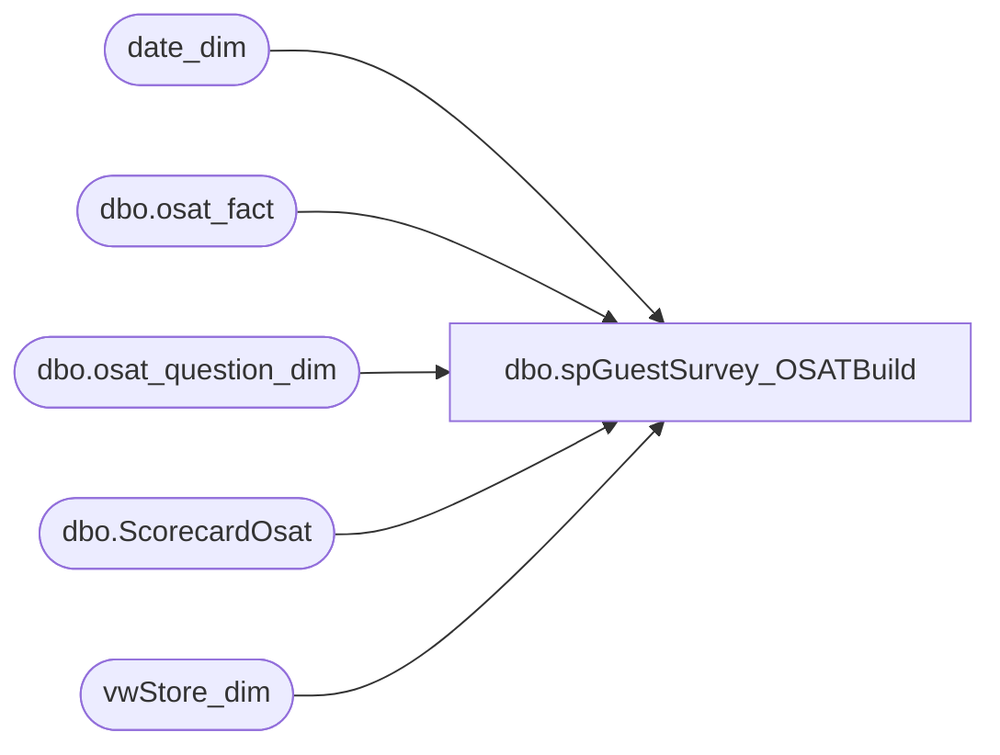

# dbo.spGuestSurvey_OSATBuild

**Database:** dw  
**Server:** papamart  

## Architecture Diagram



## Table Dependencies

| Referenced Table |
|---|
| date_dim |
| dbo.osat_fact |
| dbo.osat_question_dim |
| dbo.ScorecardOsat |
| vwStore_dim |

## Stored Procedure Code

```sql
CREATE PROCEDURE [dbo].[spGuestSurvey_OSATBuild] 
	@validate_y_n char(1)= NULL
AS
BEGIN

-- =============================================
-- Author:        <Brad Davis>
-- Create date: <11/28/2005>
--
-- cleaned things up - dlr 04/07/2008
-- Mike Pelikan		20141023		changed name, pointed to GuestSurvey database
-- =============================================

--DECLARE		@validate_y_n char(1)
--set @validate_y_n = 'Y'
--exec spSc_OSATBuild @validate_y_n='y'

-- only want to report on full months of data.  in reality, that's how it should be coming in.  we get the data a few days 
-- after the END of the fiscal month.  
-- not sure about all these odd checks guess they were assuming the data was coming in weekly 

SET NOCOUNT ON

DECLARE @END_PeriodId INT, @CurrentDATETIME DATETIME, @Current_PeriodId INT, @CurrentFiscalPeriod INT,
@CurrentFiscalWeek INT, @WorkingDate DATETIME,@MaxCallDate DATETIME

--Use @CurrentDATETIME instead of Getdate() 
--This helps with testing
SET @CurrentDATETIME = Getdate()

IF @validate_y_n = 'y'
BEGIN
	SET @CurrentDATETIME = dateadd(dd,15,getdate())
END

SET @Current_PeriodId = (SELECT period_id FROM date_dim WHERE actual_date = CONVERT(DATETIME,CONVERT(CHAR(10),@CurrentDATETIME,101)));
SET @CurrentFiscalPeriod = (SELECT DISTINCT Fiscal_Period FROM date_dim WHERE period_id = @Current_PeriodId);
SET @CurrentFiscalWeek = (SELECT DISTINCT week_of_period FROM date_dim WHERE actual_date = CONVERT(DATETIME,CONVERT(CHAR(10),@CurrentDATETIME,101)));

--We do not want to show previous fiscal month until 2nd week in fiscal period 
-- why?  beats me dlr
IF (@CurrentFiscalWeek > 1) 
BEGIN
	SET @END_PeriodId = @Current_PeriodId - 1
END
ELSE
BEGIN
	SET @END_PeriodId = @Current_PeriodId - 2
END

SET @MaxCallDate = (SELECT MAX(Actual_Date) FROM  date_dim WHERE Period_Id = @END_PeriodId + 1 AND week_of_period = 1  AND day_of_week = 5) 

--We do not want to show previous fiscal month until 2nd week in fiscal period
-- why?  beats me dlr
IF (@CurrentFiscalPeriod = 2 AND @CurrentFiscalWeek = 1)
BEGIN
	SET @CurrentFiscalPeriod = @CurrentFiscalPeriod - 1
	SET @Current_PeriodId = @Current_PeriodId - 1
	SET @CurrentFiscalWeek = (SELECT MAX(week_of_period) FROM date_dim WHERE period_id  = @Current_PeriodId)
END

--IF the Fiscal period 1 or the first week in period 2 in THEN We still want to return all of previous year
IF (@CurrentFiscalPeriod = 1) 
BEGIN
      SET @WorkingDate = (SELECT MAX(actual_date) FROM date_dim WHERE period_id = @Current_PeriodId-1);
END
ELSE
BEGIN
      SET @WorkingDate = @CurrentDATETIME;
END

--SELECT @END_PeriodId, @CurrentDATETIME, @Current_PeriodId, @CurrentFiscalPeriod, @CurrentFiscalWeek, @WorkingDate, @MaxCallDate 

--Create Temp Table to Store results of Loop
DECLARE @YTD TABLE
( 
	[store_id] INT, 
	[Period_Id] INT,                    
	[OSAT] decimal(18,2),
	[Responses] INT,
	[Scores] INT
) 

DECLARE @RollingYTD TABLE
( 
	[store_id] INT, 
	[Store_Key] INT,
	[Bearritory] varchar(255), 
	[Region] varchar(50),
	[Period_Id] INT,
	[Month] varchar(255),
	[RollingOSAT] decimal(18,2),
	[RollingResponses] INT,
	[RollingScores] INT,                      
	[fiscal_period] INT
) 

DECLARE skel_cursor CURSOR 
FOR 
	--Get a list of all periods ENDdates for this year
--	SELECT MAX(actual_date) 
	SELECT period_id, MAX(actual_date)
	FROM date_dim 
-- added this 1/8/2009, because things were taking too long, no need to go back forever AND calculate stuff we don't need, dlr
	WHERE Period_Id between @END_PeriodId-15 AND @END_PeriodId
--	WHERE Period_Id <= @END_PeriodId 
	group by period_id

open skel_cursor 
DECLARE @PeriodENDDate DATETIME 
DECLARE	@PeriodId   INT
fetch next FROM skel_cursor INTO @PeriodId, @PeriodENDDate 
while (@@fetch_status <> -1) 
BEGIN 
	DECLARE
		@PeriodStart_Date DATETIME,
		@Scores INT,
		@Responses INT,
		@OSAT DECIMAL(18,2),
		@Month NVARCHAR(3)

	--Get the period AND month name
	SELECT 
		@PeriodId = period_id,
-- added this 1/8/2009, because the fiscal period, bled into January AND it was setting the month to JAN, not DEC, dlr
		@Month = case 
					WHEN fiscal_period = 1 THEN 'JAN'
					WHEN fiscal_period = 2 THEN 'FEB'
					WHEN fiscal_period = 3 THEN 'MAR'
					WHEN fiscal_period = 4 THEN 'APR'
					WHEN fiscal_period = 5 THEN 'MAY'
					WHEN fiscal_period = 6 THEN 'JUN'
					WHEN fiscal_period = 7 THEN 'JUL'
					WHEN fiscal_period = 8 THEN 'AUG'
					WHEN fiscal_period = 9 THEN 'SEP'
					WHEN fiscal_period = 10 THEN 'OCT'
					WHEN fiscal_period = 11 THEN 'NOV'
					WHEN fiscal_period = 12 THEN 'DEC'
			END
--		@Month = substring(month_name,1,3)
	FROM date_dim dd
	WHERE actual_date = @PeriodENDDate

	SET @PeriodStart_Date = (SELECT MIN(actual_date) FROM date_dim WHERE period_id = @PeriodId - 2)

	-- sum up the ostat scores for the month
	-- makes sense to ignore the first 2 months, but not the first 3rd month
	IF (@CurrentFiscalPeriod not in (2,3) AND @CurrentFiscalWeek > 1)
	BEGIN
		-- get the monthly osat score
		INSERT INTO @YTD
		SELECT MAX(sd.store_id), @PeriodId,
	
		cast(SUM(ISNULL(owf.calc_score,0))as decimal(18,2)) / cast(count(ISNULL(owf.calc_score,0))as decimal(18,2))AS OSAT,                                                     
		COUNT(ISNULL(owf.calc_score,0)),
		SUM(ISNULL(owf.calc_score,0))
		FROM SurveyResults.dbo.osat_fact owf
		INNER JOIN SurveyResults.dbo.osat_question_dim qd ON owf.question_dim_key = qd.question_dim_key
		INNER JOIN date_dim dd ON owf.date_key = dd.date_key
		INNER JOIN date_dim cd ON owf.call_date_key = cd.date_key
		INNER JOIN vwStore_dim sd ON sd.Store_Key = owf.Store_Key
		WHERE 
		dd.period_id = @PeriodId
		and cd.Actual_Date < @MaxCallDate
		and qd.division IN ('BABW','F2BM') 
		and qd.question_id IN(1,2)--1 for BEARS AND 2 for DOLLS
		and owf.visit_type_dim_key = 2
		and owf.calc_score >= 0
		--and store_id = 232
		group by sd.store_id
	END
                                               
	-- get the rolling ostat scores for the past 3 fiscal months
	INSERT INTO @RollingYTD
	SELECT sd.store_id, MAX(sd.Store_Key),  MAX(bearritory) as Bearritory, MAX(Region),  @PeriodId, @Month,
		cast(SUM(ISNULL(owf.calc_score,0))as decimal(18,2))/  cast(count(ISNULL(owf.calc_score,0))as decimal(18,2))AS OSAT,
		COUNT(ISNULL(owf.calc_score,0))as Responses,
		SUM(ISNULL(owf.calc_score,0)) as Scores,
		MAX(dd.fiscal_period)
	FROM SurveyResults.dbo.osat_fact owf
		join SurveyResults.dbo.osat_question_dim qd ON owf.question_dim_key = qd.question_dim_key
		join date_dim dd ON owf.date_key = dd.date_key
		join date_dim cd ON owf.call_date_key = cd.date_key
		join vwStore_dim sd ON sd.Store_Key = owf.Store_Key
	WHERE 
		dd.period_id <= @PeriodId
		and dd.actual_date >= @PeriodStart_Date
		and cd.Actual_Date < @MaxCallDate
		and qd.division IN ('BABW','F2BM') 
		and qd.question_id IN(1,2)--1 for BEARS AND 2 for DOLLS
		and owf.visit_type_dim_key = 2
		and owf.calc_score >= 0                                         
--and store_id = 232
	group by sd.store_id

	fetch next FROM skel_cursor into @PeriodId, @PeriodENDDate 
END 
close skel_cursor 
deallocate skel_cursor 

-- not sure who uses this, must be feeding into the next step of the process that probably THEN loads the table
-- the cube is pulling FROM - dw.dbo.osatfacts


-- combine the monthly AND rolling osat scores together
IF object_id('dbo.ScorecardOsat') IS NOT NULL DROP TABLE dw.dbo.ScorecardOsat
CREATE TABLE [dbo].[ScorecardOsat](
	[store_id] [int] NULL,
	[Store_Key] [int] NULL,
	[Bearritory] [varchar](255) COLLATE SQL_Latin1_General_CP1_CI_AS NULL,
	[Region] [varchar](255) COLLATE SQL_Latin1_General_CP1_CI_AS NULL,
	[Period_Id] [int] NULL,
	[Month] [varchar](255) COLLATE SQL_Latin1_General_CP1_CI_AS NULL,
	[RollingOSAT] [decimal](18, 2) NULL,
	[RollingResponses] [int] NULL,
	[RollingScores] [int] NULL,
	[OSAT] [decimal](18, 2) NULL,
	[Responses] [int] NULL,
	[Scores] [int] NULL,
	[fiscal_period] [int] NULL,
	[RefreshDate] [DATETIME] NULL CONSTRAINT [DF_ScorecardOsat_RefreshDate]  DEFAULT (getdate())
) 

INSERT into dw.dbo.ScorecardOsat
SELECT 
	RYTD.store_id, 
	RYTD.Store_Key,
	RYTD.Bearritory, 
	RYTD.Region,
	RYTD.Period_Id,
	RYTD.Month,
	RYTD.RollingOSAT,
	RYTD.RollingResponses,
	RYTD.RollingScores,                       
	YTD.OSAT,
	YTD.Responses,
	YTD.Scores ,
	RYTD.fiscal_period,
	Getdate()
FROM @RollingYTD RYTD
	left join @YTD YTD 
	ON RYTD.store_id = YTD.store_id 
	and RYTD.period_id = YTD.period_id 
order by RYTD.store_id, RYTD.Period_Id

--SELECT * FROM @YTD 

IF upper(@validate_y_n) = 'Y'
BEGIN
	-----validate report-------------------
	DECLARE @Period_Id int
	SET @Period_Id = (SELECT min(period_id) FROM date_dim WHERE fiscal_year = datepart(yy,dateadd(dd,-15,getdate())))

	SELECT -- *
		region
		,bearritory
		,store_id
--		,fiscal_period
		,month
		,rollingOSAT
		,rollingResponses
		,rollingScores
	FROM dw.dbo.ScorecardOsat
	WHERE 1=1
		AND Period_Id >=@Period_Id
	ORDER BY 
		CASE 
			WHEN month = 'JAN' THEN 1
			WHEN month = 'FEB' THEN 2
			WHEN month = 'MAR' THEN 3
			WHEN month = 'APR' THEN 4
			WHEN month = 'MAY' THEN 5
			WHEN month = 'JUN' THEN 6
			WHEN month = 'JUL' THEN 7
			WHEN month = 'AUG' THEN 8
			WHEN month = 'SEP' THEN 9
			WHEN month = 'OCT' THEN 10
			WHEN month = 'NOV' THEN 11
			WHEN month = 'DEC' THEN 12 
			ELSE 13 
		END,
		store_id 
END

END
```

