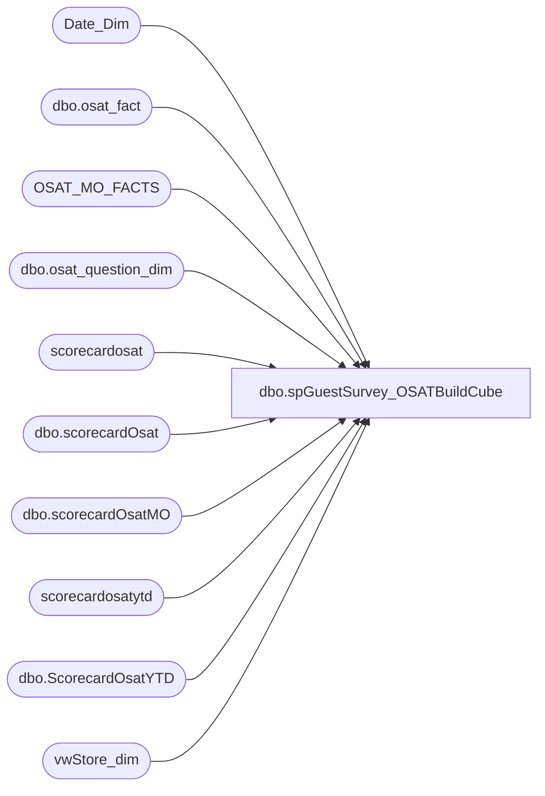

# dbo.spGuestSurvey_OSATBuildCube

**Database:** dw  
**Server:** papamart  

## Architecture Diagram



## Table Dependencies

| Referenced Table |
|---|
| Date_Dim |
| dbo.osat_fact |
| OSAT_MO_FACTS |
| dbo.osat_question_dim |
| scorecardosat |
| dbo.scorecardOsat |
| dbo.scorecardOsatMO |
| scorecardosatytd |
| dbo.ScorecardOsatYTD |
| vwStore_dim |

## Stored Procedure Code

```sql
CREATE PROCEDURE [dbo].[spGuestSurvey_OSATBuildCube] 
AS
-- =============================================
-- Author:        <Brad Davis & Julie Lucas>
-- Create date: <11/28/2005>
-- Modified date: <5/10/2006>
--Mike Pelikan		10/23/2014		Modifed to use SurveyResults database
-- =============================================

-----------------------------------------------------------------------------------------
SET NOCOUNT ON 

DECLARE @CurDateTime datetime, @CurPeriodId int
Set @CurDateTime = CONVERT(CHAR(10),Getdate(),101)
--Set @CurDateTime = '1/31/2007'
					
--Current periodId (112)
SET @CurPeriodId = (SELECT period_id  FROM Date_Dim 
WHERE actual_date = CONVERT(DATETIME,CONVERT(CHAR(10),@CurDateTime,101)));

-----------------------------------------------------------------------------------------
--BUILD MONTHLY OSAT 
-----------------------------------------------------------------------------------------

IF OBJECT_ID('dw.dbo.ScorecardOsatMO') IS NOT NULL DROP TABLE dw.dbo.ScorecardOsatMO

SELECT owf.store_key, sd.store_id, dd.period_id, SUM(ISNULL(calc_score,0)) as SumCalcScore_Scores,
COUNT(ISNULL(calc_score,0)) as CountCalcScore_Responses
INTO dw.dbo.ScorecardOsatMO
FROM SurveyResults.dbo.osat_fact owf
INNER JOIN SurveyResults.dbo.osat_question_dim qd ON owf.question_dim_key = qd.question_dim_key
INNER JOIN date_dim dd ON owf.date_key = dd.date_key
INNER JOIN vwStore_dim sd ON sd.Store_Key = owf.Store_Key
WHERE qd.division IN ('BABW','F2BM') 
AND qd.question_id IN(1,2)--1 for BEARS and 2 for DOLLS
AND owf.visit_type_dim_key = 2
AND owf.calc_score >= 0
AND dd.period_id < @curperiodId
GROUP BY sd.Store_Id, owf.store_key, dd.period_id
ORDER BY sd.store_id, dd.period_id desc

-----------------------------------------------------------------------------------------
--BUILD YTD OSAT
-----------------------------------------------------------------------------------------

--Build LastDayDate Object                       
IF OBJECT_ID('tempdb.dbo.##OSATLastDOM') IS NOT NULL DROP TABLE dbo.##OSATLastDOM

SELECT MAX(actual_date) as EOMDate,  max(date_key) as EOMDateKey, fiscal_year, fiscal_period, period_id
INTO ##OsatLastDOM
FROM date_dim
GROUP BY fiscal_year, fiscal_period, period_id--, MONTH_NAME
ORDER BY 2, 3


DECLARE @End_PeriodId int, @CurrentDateTime Datetime, @Current_PeriodId int, @CurrentFiscalPeriod int,
@CurrentFiscalWeek int, @WorkingDate Datetime, @MaxCallDate Datetime
SET @CurrentDateTime = CONVERT(CHAR(10),Getdate(),101)
--Set @CurrentDateTime = '5/7/2006'

--Current periodId (112)
SET @Current_PeriodId = (SELECT period_id  FROM Date_Dim 
WHERE actual_date = CONVERT(DATETIME,CONVERT(CHAR(10),@CurrentDateTime,101)));

--Current Fiscal Period  (4)
SET @CurrentFiscalPeriod = (SELECT Max(Fiscal_Period) FROM date_dim 
WHERE period_id = @Current_PeriodId);  

--Current Fiscal Week  (4)
SET @CurrentFiscalWeek = (SELECT week_of_period FROM Date_Dim 
WHERE actual_date = CONVERT(DATETIME,CONVERT(CHAR(10),@CurrentDateTime,101)));

--We do not want to show prevouis fiscal month until 2nd week in fiscal period
IF (@CurrentFiscalWeek > 1)
BEGIN
    SET @End_PeriodId = @Current_PeriodId -1  --(111)
END
ELSE
BEGIN
    SET @End_PeriodId = @Current_PeriodId -2
END

--4/6/2006
SET @MaxCallDate =  (SELECT MAX(Actual_Date) FROM  Date_Dim WHERE Period_Id = @End_PeriodId + 1 AND week_of_period = 1  AND day_of_week = 5) 

--We do not want to show prevouis fiscal month until 2nd week in fiscal period
IF (@CurrentFiscalPeriod = 2 and @CurrentFiscalWeek = 1)
BEGIN
    SET @CurrentFiscalPeriod = @CurrentFiscalPeriod -1
    SET @Current_PeriodId = @Current_PeriodId - 1
    SET @CurrentFiscalWeek = (SELECT MAX(week_of_period) FROM Date_Dim WHERE period_id  = @Current_PeriodId)
END

--If the Fiscal period 1 or the first week in period 2 in then We still want to return all of prevouis year
IF (@CurrentFiscalPeriod = 1) 
BEGIN
    SET @WorkingDate = (SELECT max(actual_date) FROM Date_Dim WHERE period_id = @Current_PeriodId-1);
END
ELSE
BEGIN
    SET @WorkingDate = @CurrentDateTime;
END
				
--Create Temp Table to Store results of Loop
SET NOCOUNT ON 
DECLARE @YTD TABLE
( 
        [Store_Id] INT, 
        [Period_Id] INT,                    
        [OSAT] decimal(18,2),
        [Responses] INT,
        [Scores] INT
) 

DECLARE @RollingYTD TABLE
( 
        [Store_Id] INT, 
        [Store_Key] INT,
        [Bearritory] varchar(255), 
        [Region] varchar(50),
        [Period_Id] INT,
        [Month] varchar(255),
        [RollingOSAT] decimal(18,2),
        [RollingResponses] INT,
        [RollingScores] INT,                      
        [fiscal_period] INT
) 

DECLARE skel_cursor CURSOR 
FOR --Get a list of all periods enddates for this year
    SELECT max(actual_date) FROM Date_Dim WHERE fiscal_Year = YEAR(@WorkingDate) 
    and Period_Id <= @End_PeriodId GROUP BY period_id;  --1/28, 2/25, 4/1

OPEN skel_cursor 
DECLARE @PeriodEndDate datetime 
FETCH NEXT FROM skel_cursor INTO @PeriodEndDate 
WHILE (@@FETCH_STATUS <> -1) 
BEGIN 
	IF (@@FETCH_STATUS <> -2) 
	BEGIN 

		DECLARE @PeriodId INT, @FiscalYearID INT, @PeriodStart_Date datetime, @Scores INT,
		@Responses INT, @OSAT DECIMAL(18,2), @Month nVarchar(3)

        --Get the period and month name
        SELECT @PeriodId = period_id,
                @Month   = CASE WHEN dd.fiscal_period = 1  THEN 'JAN' 
                                WHEN dd.fiscal_period = 2  THEN 'FEB' 
                                WHEN dd.fiscal_period = 3  THEN 'MAR' 
                                WHEN dd.fiscal_period = 4  THEN 'APR' 
                                WHEN dd.fiscal_period = 5  THEN 'MAY'
                                WHEN dd.fiscal_period = 6  THEN 'JUN' 
                                WHEN dd.fiscal_period = 7  THEN 'JUL' 
                                WHEN dd.fiscal_period = 8  THEN 'AUG'
                                WHEN dd.fiscal_period = 9  THEN 'SEP' 
                                WHEN dd.fiscal_period = 10 THEN 'OCT' 
                                WHEN dd.fiscal_period = 11 THEN 'NOV' 
                                WHEN dd.fiscal_period = 12 THEN 'DEC'
                            END
		FROM date_dim dd
		WHERE actual_date = @PeriodEndDate

		SET @FiscalYearID = (Select fiscal_year from date_dim WHERE ACTUAL_DATE = @WORKINGDATE) --2006
        SET @PeriodStart_Date = (Select MIN(actual_date) FROM date_dim  WHERE fiscal_year = @FiscalYearID) -- 1/1/2006
					--WHERE period_id = @PeriodId - 2)
        IF (@CurrentFiscalPeriod not in (2,3) AND @CurrentFiscalWeek > 1)
        BEGIN

			--Get OSAT Reponses and Scores
			INSERT @YTD
			SELECT max(sd.Store_Id), max(dd.period_id), 
			Cast(SUM(ISNULL(owf.calc_score,0))as decimal(18,2))/  Cast(count(ISNULL(owf.calc_score,0))as decimal(18,2))AS OSAT,                                                     
			count(ISNULL(owf.calc_score,0)), SUM(ISNULL(owf.calc_score,0))
			FROM SurveyResults.dbo.osat_fact owf
			JOIN SurveyResults.dbo.osat_question_dim qd ON owf.question_dim_key = qd.question_dim_key
			JOIN date_dim dd ON owf.date_key = dd.date_key
			JOIN vwStore_dim sd ON sd.Store_Key = owf.Store_Key
			WHERE  dd.period_id <= @PeriodId AND dd.actual_date >= @PeriodStart_Date
			AND qd.division IN ('BABW','F2BM') 
			AND qd.question_id IN(1,2)--1 for BEARS and 2 for DOLLS
			AND owf.visit_type_dim_key = 2
			AND owf.calc_score >= 0
			GROUP BY sd.Store_Id;
		END
                                                    
        --Add OSAT Responses and Scores varables Into @Results Insert 
        --@Results Insert gets the 3 Fiscal Month Rolling Responses and Scores
        INSERT INTO @RollingYTD
		SELECT sd.Store_Id, max(sd.Store_Key),  max(bearritory) as Bearritory, max(Region),  max(dd.period_id), @Month,
		Cast(SUM(ISNULL(owf.calc_score,0))as decimal(18,2))/  Cast(count(ISNULL(owf.calc_score,0))as decimal(18,2))AS OSAT,
		COUNT(ISNULL(owf.calc_score,0))as Responses, SUM(ISNULL(owf.calc_score,0)) as Scores, MAX(dd.fiscal_period)										
		FROM SurveyResults.dbo.osat_fact owf
		JOIN SurveyResults.dbo.osat_question_dim qd ON owf.question_dim_key = qd.question_dim_key
		JOIN date_dim dd ON owf.date_key = dd.date_key
		JOIN vwStore_dim sd ON sd.Store_Key = owf.Store_Key
		WHERE dd.period_id <= @PeriodId AND dd.actual_date >= @PeriodStart_Date
		AND qd.division IN ('BABW','F2BM')  AND qd.question_id IN(1,2)--1 for BEARS and 2 for DOLLS
		AND owf.visit_type_dim_key = 2 AND owf.calc_score >= 0                                         
		GROUP BY sd.Store_Id;
	END 
	
	FETCH NEXT FROM skel_cursor INTO @PeriodEndDate 

END 
CLOSE skel_cursor 
DEALLOCATE skel_cursor 

IF object_id('dbo.ScorecardOsatYTD') IS NOT NULL DROP TABLE dw.dbo.ScorecardOsatYTD
CREATE TABLE [dbo].[ScorecardOsatYTD](
        [Store_Id] [int] NULL,
        [Store_Key] [int] NULL,
        [Bearritory] [varchar](255) COLLATE SQL_Latin1_General_CP1_CI_AS NULL,
        [Region] [varchar](255) COLLATE SQL_Latin1_General_CP1_CI_AS NULL,
        [Period_Id] [int] NULL,
        [Month] [varchar](255) COLLATE SQL_Latin1_General_CP1_CI_AS NULL,
        [RollingOSAT] [decimal](18, 2) NULL,
        [RollingResponses] [int] NULL,
        [RollingScores] [int] NULL,
        [OSAT] [decimal](18, 2) NULL,
        [Responses] [int] NULL,
        [Scores] [int] NULL,
        [fiscal_period] [int] NULL,
        [RefreshDate] [datetime] NULL CONSTRAINT [DF_ScorecardOsatYTD_RefreshDate]  DEFAULT (getdate())
) 

INSERT INTO dw.dbo.ScorecardOsatYTD
SELECT RYTD.Store_Id, RYTD.Store_Key, RYTD.Bearritory, RYTD.Region, RYTD.Period_Id, RYTD.Month,
RYTD.RollingOSAT, RYTD.RollingResponses, RYTD.RollingScores, 0, 0, 0, RYTD.fiscal_period, Getdate()
FROM @RollingYTD RYTD
LEFT JOIN @YTD YTD ON RYTD.Store_Id = YTD.Store_Id AND RYTD.period_id = YTD.period_id 
ORDER BY RYTD.Store_Id, RYTD.Period_Id

IF OBJECT_ID('tempdb.dbo.##OsatTemp') IS NOT NULL DROP TABLE dbo.##OsatTemp

SELECT DISTINCT  s.store_key, d.EOMDateKey, d.period_id,
ISNULL(m.SumCalcScore_Scores,0) AS Mo_Score,
ISNULL(m.CountCalcScore_Responses,0) AS Mo_Responses,
ISNULL(r.rollingScores,0) AS roll_score,
ISNULL(r.RollingResponses,0) AS roll_responses,
ISNULL(y.RollingScores,0) AS YTD_Score,
ISNULL(y.RollingResponses,0) AS YTD_Responses
INTO ##OsatTemp
FROM dw.dbo.scorecardOsat r
FULL OUTER JOIN dw.dbo.ScorecardOsatYTD y on (r.store_id = y.store_id) and (r.period_id = y.period_id)
FULL OUTER JOIN dw.dbo.scorecardOsatMO m on coalesce(r.store_id, y.store_id) = m.store_id and coalesce (r.period_id, y.period_id) = m.period_id
LEFT JOIN ##OSATLastDOM d on coalesce(r.period_id, y.period_id, m.period_id) = d.period_id
LEFT JOIN vwstore_dim s on coalesce(r.store_id, y.store_id, m.store_id) = s.store_id
ORDER BY 2, 3 DESC

IF (@CurrentFiscalWeek = 1) DELETE from ##OsatTemp where period_id > @End_PeriodId

--BUILD ROLLING OSAT
BEGIN 
	TRUNCATE TABLE DW..OSAT_MO_FACTS

	INSERT INTO  DW..OSAT_MO_FACTS
	SELECT DISTINCT store_key, EOMDateKey, Mo_Score, Mo_Responses, roll_score, roll_responses, YTD_Score, YTD_Responses
	FROM ##OSATTEMP 
	ORDER BY 2, 3 DESC
END

UPDATE dw.dbo.scorecardosat
SET osat = y.rollingosat
FROM scorecardosat s, scorecardosatytd y
WHERE s.store_id = y.store_id AND s.period_id = y.period_id

UPDATE dw.dbo.scorecardosat
SET responses = y.rollingresponses
FROM scorecardosat s, scorecardosatytd y
WHERE s.store_id = y.store_id AND s.period_id = y.period_id

UPDATE dw.dbo.scorecardosat
SET scores = y.rollingscores
FROM scorecardosat s, scorecardosatytd y
WHERE s.store_id = y.store_id AND s.period_id = y.period_id
```

