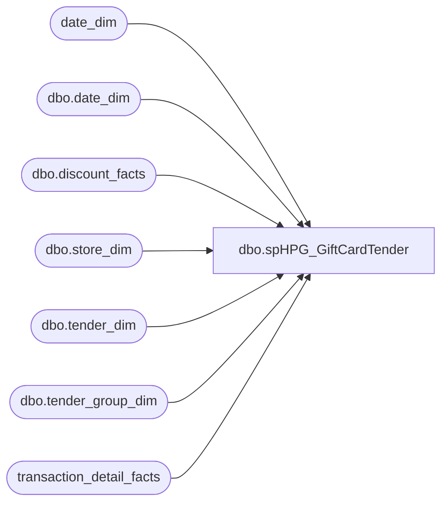

# dbo.spHPG_GiftCardTender

**Database:** dw  
**Server:** papamart  

## Architecture Diagram



## Table Dependencies

| Referenced Table |
|---|
| date_dim |
| dbo.date_dim |
| dbo.discount_facts |
| dbo.store_dim |
| dbo.tender_dim |
| dbo.tender_group_dim |
| transaction_detail_facts |

## Stored Procedure Code

```sql
--select min(actual_date), max(actual_date) from date_dim where fiscal_year = 2000


--EXEC spHPG_GiftCardTender '1/2/2000', '12/30/2000'
--CREATE
CREATE       

PROCEDURE spHPG_GiftCardTender
	/* ===== ARGUMENTS ===== */
	@BeginDate 	datetime, 
	@EndDate 	datetime

AS

SET NOCOUNT ON


/***************************************************************/
/************ Prep build:  ld_transaction_pos_facts ************/
/***************************************************************/
IF (Object_ID('tempdb.dbo.#tmphpg_pos_facts_bytender') IS NOT NULL) DROP TABLE dbo.#tmphpg_pos_facts_bytender


select tdf.* 
into dbo.#tmphpg_pos_facts_bytender
from transaction_detail_facts tdf
	join date_dim dd on tdf.date_key = dd.date_key
where dd.actual_date BETWEEN @BeginDate AND @EndDate -- '7/2/2000' and '7/9/2000'   --
	and transaction_line_seq >= 0

CREATE   CLUSTERED INDEX IX_TMPtf_tender on #tmphpg_pos_facts_bytender (store_key, date_key)
CREATE  INDEX IX_TMPTrans_tranFactsID on #tmphpg_pos_facts_bytender (transaction_id)

--select * from #tmphpg_pos_facts_bytender where transaction_id = 51819 and store_key = 1
/*
select * from tender_group_dim tgd 
join tender_dim td on tgd.tender_key = td.tender_key 
where tender_group_key = 41167607


 
*/


--get redemptions for transactions in range


IF (Object_ID('tempdb.dbo.#temptransbytender') IS NOT NULL) DROP TABLE dbo.#temptransbytender

Select  a.transaction_id,
	a.store_key,
	a.date_key,
	sum(TtlBearBuck + TtlGiftCard + TtlRewardCert + TtlBuyStuff) as ttlRedemptions

INTO dbo.#temptransbytender	
FROM 	(

	select 	ics.transaction_id,
		ics.store_key,
		ics.date_key,
-- 		td.tender_code,
-- 		tg.tender_amt
		isnull(CASE WHEN td.tender_code = 621 THEN tg.tender_amt END,0) as TtlBearBuck,
		isnull(CASE WHEN td.tender_code = 633 THEN tg.tender_amt END,0) as TtlGiftCard,
		isnull(CASE WHEN td.tender_code = 640 THEN tg.tender_amt END,0) as TtlRewardCert,
		isnull(CASE WHEN td.tender_code = 690 THEN tg.tender_amt END,0) as TtlBuyStuff
		
	
	from dbo.#tmphpg_pos_facts_bytender ics
	join dbo.tender_group_dim tg on ics.tender_group_key = tg.tender_group_key
	join dbo.tender_dim td on tg.tender_key = td.tender_key
	
	group by ics.transaction_id,
 		 ics.store_key,
 		 ics.date_key,
		 tender_code,
 		 tender_amt
		

	--order by transaction_id
		
	) a 
group by a.transaction_id,
	 a.store_key,
	 a.date_key

having sum(TtlBearBuck+TtlGiftCard) <> 0

--select * from #temptransbytender   where transaction_id = 85508
-- and store_key = 1  order by transaction_id  


-- --get a uga for the transactions with the tender
IF (Object_ID('tempdb.dbo.#tmpgctenderuga') IS NOT NULL) DROP TABLE dbo.#tmpgctenderuga

select a.transaction_id,
	a.store_key,
	a.date_key,
	sum(isnull(a.uga,0)) as ttluga


into dbo.#tmpgctenderuga

from (

	select tbt.transaction_id,
	       tbt.store_key,
	       tbt.date_key, --unit_gross_amount
	 	-- tbt.product_key, 
	       CASE WHEN tbt.product_key NOT IN (-700,-701,-710,-711,-712,-713,-714) THEN tbt.unit_gross_amount
		    ELSE 0 END as UGA

	from dbo.#tmphpg_pos_facts_bytender tbt 
	left join  dbo.#temptransbytender ttt on tbt.transaction_id = ttt.transaction_id
		and tbt.store_key = ttt.store_key
		and tbt.date_key = ttt.date_key
	--where tbt.transaction_id = 85508

	) a

group by a.transaction_id,
	 a.store_key,
	 a.date_key
-- 
-- --select * from #tmpgctenderuga where transaction_id = 51819


-- --get discounts for those transactions
IF (Object_ID('tempdb.dbo.#tmpTenderTransDiscount') IS NOT NULL) DROP TABLE dbo.#tmpTenderTransDiscount

SELECT 	ics.transaction_id, 
	ics.store_key,
	ics.date_key,
	sum(isnull(df.unit_gross_amount,0)) as ttlDiscount
	
INTO dbo.#tmpTenderTransDiscount

FROM dbo.#temptransbytender ics
LEFT JOIN dbo.discount_facts df ON ics.transaction_id = df.transaction_id
	AND ics.store_key = df.store_key
	AND ics.date_key = df.date_key

GROUP BY ics.transaction_id, 
	    ics.store_key,
	    ics.date_key

-- --select sum(ttlDiscount) from #tmpTenderTransDiscount


IF (Object_ID('tempdb.dbo.#tmpTransSale') IS NOT NULL) DROP TABLE dbo.#tmpTransSale


select 	s.store_id,
	--d.actual_date,
	d.fiscal_period,
	d.fiscal_year,
-- 	ics.transaction_id,
-- 	ics.ttluga,
-- 	tt.ttlRedemptions,
-- 	td.ttlDiscount
	--,
	count(ics.transaction_id) as ttlTrans,
	sum(isnull(ics.ttluga,0) + isnull(tt.ttlRedemptions,0) + isnull(td.ttlDiscount,0)) as ttlSale

from #tmpgctenderuga ics
	
join dbo.store_dim s on ics.store_key = s.store_key  
join dbo.date_dim d on ics.date_key = d.date_key

left join #temptransbytender tt on ics.transaction_id = tt.transaction_id
	and ics.store_key = tt.store_key
	and ics.date_key = tt.date_key

left join #tmpTenderTransDiscount td on ics.transaction_id = td.transaction_id
	and ics.store_key = td.store_key
	and ics.date_key = td.date_key
	

group by d.fiscal_year,
	 d.fiscal_period,
	 s.store_id--,ics.transaction_id
	 

--order by ics.transaction_id
	 


SET NOCOUNT OFF

/* ============================================================================= */
/* =================================  END  ===================================== */
/* ============================================================================= */
```

