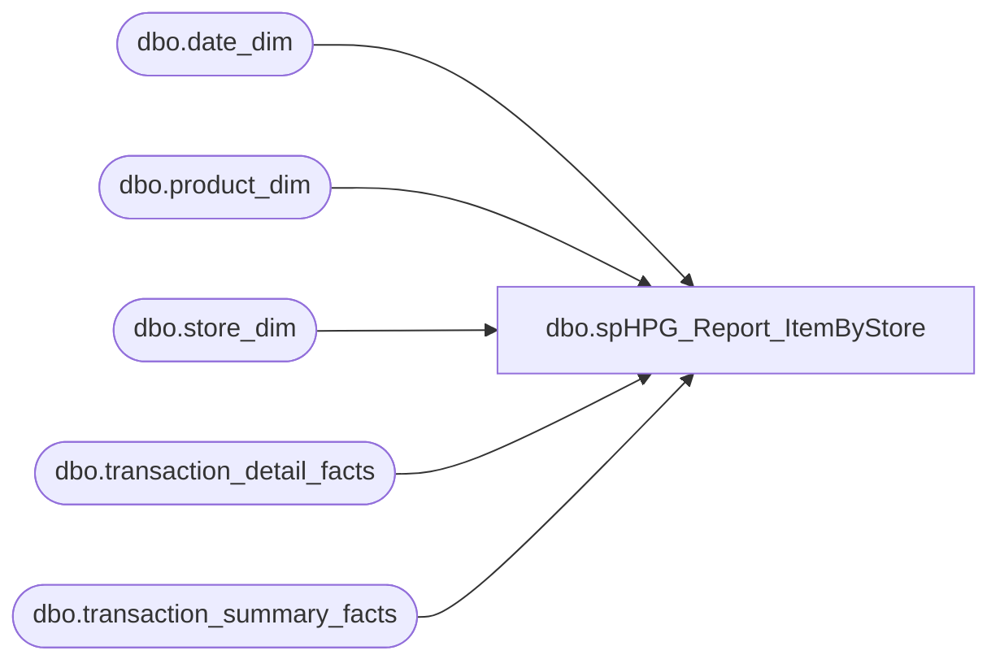

# dbo.spHPG_Report_ItemByStore

**Database:** dw  
**Server:** papamart  

## Architecture Diagram



## Table Dependencies

| Referenced Table |
|---|
| dbo.date_dim |
| dbo.product_dim |
| dbo.store_dim |
| dbo.transaction_detail_facts |
| dbo.transaction_summary_facts |

## Stored Procedure Code

```sql
CREATE PROC [spHPG_Report_ItemByStore]
-- =============================================================================================================
-- Name: [spHPG_Report_ItemByStore]
--
-- Description:	returns HPG by store for a particular item
--
-- Input:		@ad_startdate			start date for analysis
--				@ad_enddate				end date for analysis
--				@ac_item				product to search for in analysis
--
-- Output: returns hpg by store for sales for that item
--
-- Dependencies: 
--
-- Revision History
--		Name:			Date:			Comments:
--		Keith Missey	3/15/2009		Created
-- =============================================================================================================
    @ad_startdate DATETIME,
    @ad_enddate DATETIME,
    @ac_item VARCHAR(25),
    @ai_storeid INT=NULL
AS 
    SET NOCOUNT ON  

    SELECT DISTINCT
            t.transaction_id,
            t.store_key,
            t.date_key
    INTO    dbo.#tmphpgItem
    FROM    dw.dbo.transaction_detail_facts t WITH (NOLOCK) 
            JOIN dw.dbo.product_dim p WITH (NOLOCK) ON p.product_key = t.product_key
            JOIN dw.dbo.date_dim d WITH (NOLOCK) ON d.date_key = t.date_key
            INNER JOIN dw.dbo.store_dim s WITH (NOLOCK) ON s.store_key = t.store_key
    WHERE   p.sku = @ac_item
            AND d.actual_date BETWEEN @ad_startdate AND @ad_enddate
			AND (store_id = @ai_storeid OR @ai_storeid IS NULL)
  
    CREATE CLUSTERED INDEX idxC_NU_tmphpgItem ON dbo.#tmphpgItem ( date_key, store_key, transaction_id )      

    SELECT  s.store_id,
            d.[org_fiscal_period],
            d.fiscal_year,
            COUNT(t.transaction_id) AS ttlTrans,
            SUM(ISNULL(GAAP_Sale, 0)) AS ttlGAAPSale
    INTO    #tmphpg
    FROM    #tmphpgitem t
			INNER JOIN dw.dbo.transaction_summary_facts tsf WITH ( NOLOCK ) ON t.transaction_id = tsf.transaction_id
            INNER JOIN dw.dbo.store_dim s WITH (NOLOCK) ON tsf.store_key = s.store_key
            INNER JOIN dw.dbo.date_dim d WITH (NOLOCK) ON tsf.date_key = d.date_key
    WHERE   gaap_sale > 0
            AND actual_date BETWEEN @ad_startdate AND @ad_enddate
    GROUP BY s.store_id,
            d.fiscal_year,
            d.org_fiscal_period
    ORDER BY s.store_id,
            d.fiscal_year,
            d.org_fiscal_period

    SELECT  CAST(store_id AS VARCHAR) AS store_id,
            CAST(org_fiscal_period AS VARCHAR) AS fiscal_period,
            CAST(fiscal_year AS VARCHAR) AS fiscal_year,
            ttlgaapsale / ttltrans AS gaaphpg
    FROM    #tmphpg
	ORDER BY CAST(store_id AS INT), fiscal_year, org_fiscal_period
```

