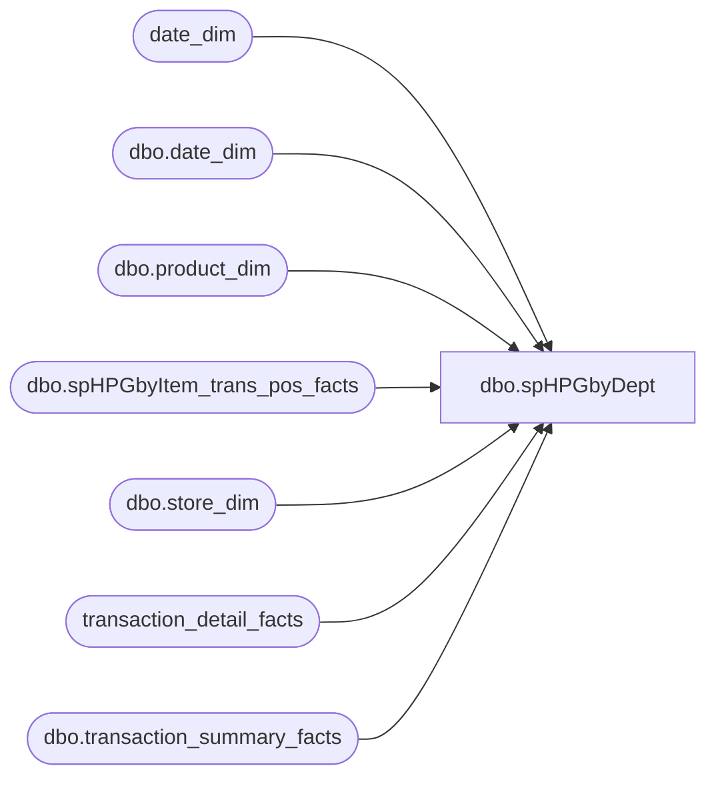

# dbo.spHPGbyDept

**Database:** dw  
**Server:** papamart  

## Architecture Diagram



## Table Dependencies

| Referenced Table |
|---|
| date_dim |
| dbo.date_dim |
| dbo.product_dim |
| dbo.spHPGbyItem_trans_pos_facts |
| dbo.store_dim |
| transaction_detail_facts |
| dbo.transaction_summary_facts |

## Stored Procedure Code

```sql
--EXEC spHPGbyDept '11/15/2004', '11/16/2004', 'unstuffed'
CREATE PROCEDURE [dbo].[spHPGbyDept]
	/* ===== ARGUMENTS ===== */
	@BeginDate 	datetime, 
	@EndDate 	datetime,
	@dept		varchar(20)

AS

SET NOCOUNT ON

/***************************************************************/
/************ Prep build:  ld_transaction_pos_facts ************/
/***************************************************************/
if exists (select * from sysobjects where id = object_id('dbo.spHPGbyItem_trans_pos_facts') and sysstat & 0xf = 3)
	begin
	drop table dbo.spHPGbyItem_trans_pos_facts
	end

select tdf.* 
into dbo.spHPGbyItem_trans_pos_facts
from transaction_detail_facts tdf
	join date_dim dd on tdf.date_key = dd.date_key
where dd.actual_date BETWEEN @BeginDate AND @EndDate -- '4/1/2005' and '4/2/2005'--
	and transaction_line_seq > 0

CREATE   clustered index idxC_NU_ld_trans_pos_facts_date_key on dbo.spHPGbyItem_trans_pos_facts (date_key, store_key, product_key, line_object_key, tender_group_key, transaction_id, register_num, transaction_type_key, transaction_line_seq)

--get a list of transactions that included the item and where only one bear was sold
IF (Object_ID('tempdb.dbo.#tmphpgItem') IS NOT NULL) DROP TABLE dbo.#tmphpgItem

select distinct 
		t.transaction_id,
		t.store_key,
		t.date_key--,
--		t.tender_group_key
into dbo.#tmphpgItem
	from dbo.spHPGbyItem_trans_pos_facts t
	join dbo.product_dim p on p.product_key = t.product_key 
	join dbo.date_dim d on d.date_key = t.date_key
	where p.department = @dept -- -6  


select 	s.store_id,
	--d.actual_date,
	d.fiscal_period,
	d.fiscal_year,
	count(ics.transaction_id) as ttlTrans,
--	sum(isnull(ics.ttluga,0) + tt.ttlRedemptions + td.ttlDiscount) as ttlSale
	sum(isnull(GAAP_Sale,0)) as ttlGAAPSale,
	sum(isnull(Net_Sale,0)) as ttlCashSale
from #tmphpgItem ics
join dbo.transaction_summary_facts tsf on ics.transaction_id = tsf.transaction_id	
	 and ics.store_key = tsf.store_key
	 and ics.date_key = tsf.date_key
join dbo.store_dim s on ics.store_key = s.store_key  
join dbo.date_dim d on ics.date_key = d.date_key


group by d.fiscal_year,
	 d.fiscal_period,
	 s.store_id
	 

SET NOCOUNT OFF
/* ============================================================================= */
/* =================================  END  ===================================== */
/* ============================================================================= */
```

