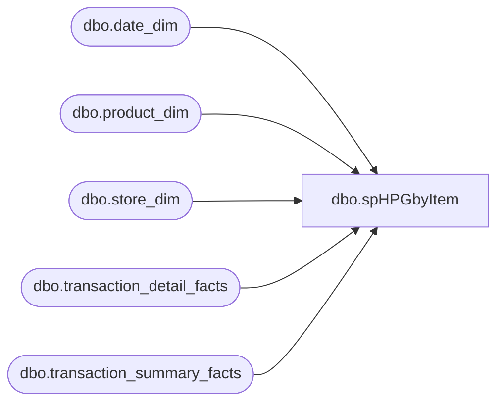

# dbo.spHPGbyItem

**Database:** dw  
**Server:** papamart  

## Architecture Diagram



## Table Dependencies

| Referenced Table |
|---|
| dbo.date_dim |
| dbo.product_dim |
| dbo.store_dim |
| dbo.transaction_detail_facts |
| dbo.transaction_summary_facts |

## Stored Procedure Code

```sql
--EXEC spHPGbyItem '11/15/2004', '11/16/2004', 7067
CREATE PROCEDURE [dbo].[spHPGbyItem]
	/* ===== ARGUMENTS ===== */
	@BeginDate 	datetime, 
	@EndDate 	datetime,
	@iItem	INT

AS

SET NOCOUNT ON


--get a list of transactions that included the item 
IF (Object_ID('tempdb.dbo.#tmphpgItem') IS NOT NULL) DROP TABLE dbo.#tmphpgItem

select distinct 
		t.transaction_id,
		t.store_key,
		t.date_key
into dbo.#tmphpgItem
from dbo.transaction_detail_facts t	
--from dbo.spHPGbyItem_trans_pos_facts t
	join dbo.product_dim p on p.product_key = t.product_key 
	join dbo.date_dim d on d.date_key = t.date_key
	where p.sku = @iItem -- -6  
    and d.actual_date BETWEEN @BeginDate AND @EndDate

CREATE   clustered index idxC_NU_tmphpgItem on dbo.#tmphpgItem (date_key, store_key,  transaction_id)


select 	s.store_id,
	--d.actual_date,
	d.fiscal_period,
	d.fiscal_year,
	count(ics.transaction_id) as ttlTrans,
--	sum(isnull(ics.ttluga,0) + tt.ttlRedemptions + td.ttlDiscount) as ttlSale
	sum(isnull(GAAP_Sale,0)) as ttlGAAPSale,
	sum(isnull(Net_Sale,0)) as ttlCashSale
from #tmphpgItem ics
join dbo.transaction_summary_facts tsf on ics.transaction_id = tsf.transaction_id	
	 and ics.store_key = tsf.store_key
	 and ics.date_key = tsf.date_key
join dbo.store_dim s on ics.store_key = s.store_key  
join dbo.date_dim d on ics.date_key = d.date_key


group by d.fiscal_year,
	 d.fiscal_period,
	 s.store_id


SET NOCOUNT OFF

/* ============================================================================= */
/* =================================  END  ===================================== */
/* ============================================================================= */
```

