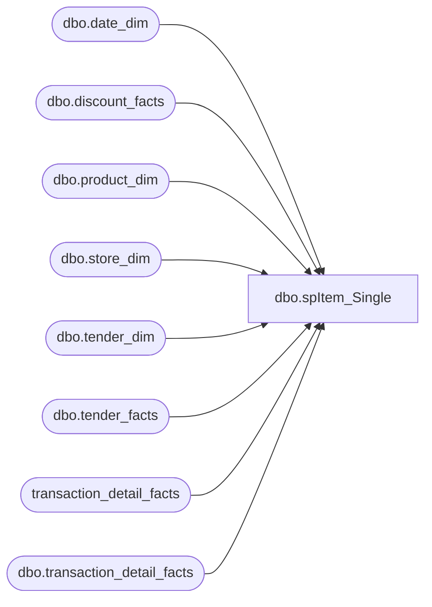

# dbo.spItem_Single

**Database:** dw  
**Server:** papamart  

## Architecture Diagram



## Table Dependencies

| Referenced Table |
|---|
| dbo.date_dim |
| dbo.discount_facts |
| dbo.product_dim |
| dbo.store_dim |
| dbo.tender_dim |
| dbo.tender_facts |
| transaction_detail_facts |
| dbo.transaction_detail_facts |

## Stored Procedure Code

```sql
-- =============================================
-- Author:		Morgan
-- Create date: 
-- Description:	BO report query
-- name		date			change
---	Gary Murrish		1/2/2012	Changed Tender_Group_dim to tender_facts
-- garyd	20081111		comment out index
-- =============================================


--EXEC spItem_Single_postJuly04 '11/15/2004', '11/20/2004', 7067
--CREATE
CREATE       

PROCEDURE [dbo].[spItem_Single]
	/* ===== ARGUMENTS ===== */
	@BeginDate 	datetime, 
	@EndDate 	datetime,
	@iItem	INT

AS

SET NOCOUNT ON

--get a list of transactions that included the item and where only one bear was sold
IF (Object_ID('tempdb..#tmpSingleItem') IS NOT NULL) DROP TABLE #tmpSingleItem


select  a.transaction_id,
	a.store_key,
	a.date_key,
	a.register_num,
	a.tender_group_key,
	p.sku
into #tmpSingleItem	
from(
	select distinct t.transaction_id, t.store_key, t.date_key, t.register_num, t.tender_group_key
	from dbo.transaction_detail_facts t
	join dbo.product_dim p on p.product_key = t.product_key 
	join dbo.date_dim d on d.date_key = t.date_key
	where p.sku = @iItem --7067 
	and (d.actual_date >= @BeginDate AND d.actual_date <= @EndDate) --- @BeginDate AND @EndDate	
	and t.transaction_line_seq >=0 
     ) a
join dbo.transaction_detail_facts t 
	on a.transaction_id = t.transaction_id
	and a.store_key = t.store_key
	and a.date_key = t.date_key
	and a.register_num = t.register_num
join dbo.product_dim p on p.product_key = t.product_key 
where t.transaction_line_seq >=0 
	

DELETE #tmpSingleItem
FROM #tmpSingleItem b
JOIN 	(
	select  transaction_id,
		store_key,
		date_key
	from 	#tmpSingleItem  
	where sku NOT IN (-7,-9,@iItem) --7067
	)a 
ON a.transaction_id = b.transaction_id
	and a.date_key = b.date_key
	and a.store_key = b.store_key


IF (Object_ID('tempdb..#tmpSingleItemTrans') IS NOT NULL) DROP TABLE #tmpSingleItemTrans

select  distinct a.transaction_id,
	a.store_key,
	a.date_key,
	a.register_num,
	a.tender_group_key
 
into #tmpSingleItemTrans
from #tmpSingleItem a


CREATE    CLUSTERED INDEX IX_tmpSingleItem on #tmpSingleItemTrans (store_key, date_key)


--get discounts for those transactions
IF (Object_ID('tempdb..#tmpTransDiscount') IS NOT NULL) DROP TABLE #tmpTransDiscount

SELECT 	ics.transaction_id, 
	ics.store_key,
	ics.date_key,
	sum(isnull(df.unit_gross_amount,0)) as ttlDiscount
	
INTO #tmpTransDiscount

FROM #tmpSingleItemTrans ics
LEFT JOIN dbo.discount_facts df ON df.transaction_id = ics.transaction_id
	AND df.store_key = ics.store_key
	AND df.date_key = ics.date_key

GROUP BY ics.transaction_id, 
	 ics.store_key,
	 ics.date_key

--select * from #tmpTransDiscount

--get redemptions for those transactions


IF (Object_ID('tempdb..#temptenderbytype') IS NOT NULL) DROP TABLE #temptenderbytype

Select a.transaction_id,
	a.store_key,
	a.date_key,
	sum(TtlBearBuck + TtlGiftCard + TtlRewardCert + TtlBuyStuff) as ttlRedemptions

INTO #temptenderbytype	
FROM 	(

	select 	ics.transaction_id,
		ics.store_key,
		ics.date_key,
		ics.register_num,
		sum(isnull(CASE WHEN td.tender_code = 621 THEN tg.tender_amt END,0)) as TtlBearBuck,
		sum(isnull(CASE WHEN td.tender_code = 633 THEN tg.tender_amt END,0)) as TtlGiftCard,
		sum(isnull(CASE WHEN td.tender_code = 640 THEN tg.tender_amt END,0)) as TtlRewardCert,
		sum(isnull(CASE WHEN td.tender_code = 690 THEN tg.tender_amt END,0)) as TtlBuyStuff
		
	
	from #tmpSingleItemTrans ics
	join dbo.tender_facts tg on ics.transaction_id = tg.transaction_id
	join dbo.tender_dim td on tg.tender_key = td.tender_key
	
	group by ics.transaction_id,
		ics.store_key,
		ics.date_key,
		ics.register_num
	) a 

group by a.transaction_id,
	 a.store_key,
	 a.date_key
--select * from #temptenderbytype order by transaction_id

--get a sum of units by sku for those transactions 
IF (Object_ID('tempdb..#tmpSkuSummary') IS NOT NULL) DROP TABLE #tmpSkuSummary

select 	i.date_key,
	i.store_key, 
	i.transaction_id, 
	p.department, 
	p.product_desc, 
	p.sku, 
	sum(t.units) as TotalUnits 

into #tmpSkuSummary
from #tmpSingleItemTrans i
join dbo.transaction_detail_facts t 
on i.transaction_id = t.transaction_id
and i.store_key = t.store_key
and i.date_key = t.date_key
and i.register_num = t.register_num
join dbo.product_dim p on p.product_key = t.product_key
where t.transaction_line_seq >=0

group by i.date_key,
	i.store_key, 
	i.transaction_id, 
	 p.department, 
	 p.product_desc, 
	 p.sku

--order by i.transaction_id

IF (Object_ID('tempdb..#tmpSkuCount') IS NOT NULL) DROP TABLE #tmpSkuCount


select 	a.transaction_id,
	a.store_key, 
	a.date_key,
	count(a.sku) as skuCount
into 	#tmpSkuCount
from 	#tmpSkuSummary a
group by a.transaction_id,
	 a.store_key, 
	 a.date_key

--select * from #tmpSkuCount
--get honey for those transactions
IF (Object_ID('tempdb..#tmpTransHoney') IS NOT NULL) DROP TABLE #tmpTransHoney


select  b.transaction_id,
	b.store_key,
	b.date_key,
	(b.ttluga + tt.ttlRedemptions + td.ttlDiscount) as ttlHoney, 
	sc.skuCount
	

into #tmpTransHoney	
from (
	select 	a.transaction_id,
		a.store_key,
		a.date_key,
		sum(isnull(a.uga,0)) as ttluga 
	
	from 	(
			select 	ics.transaction_id,
				ics.store_key,
				ics.date_key,
				ics.register_num,
				CASE 	WHEN tdf.product_key NOT IN (-700,-701,-710,-711,-712,-713,-714,-9,-7,-18) 
					THEN tdf.unit_gross_amount
					ELSE 0 END as uga
			 
			from #tmpSingleItemTrans ics
			join transaction_detail_facts tdf on ics.transaction_id = tdf.transaction_id
				and ics.store_key = tdf.store_key
				and ics.date_key = tdf.date_key
			where tdf.transaction_line_seq >=0
		) a
	group by a.transaction_id,
		 a.store_key,
		 a.date_key
	) b

left join #temptenderbytype tt on b.transaction_id = tt.transaction_id
	and b.store_key = tt.store_key
	and b.date_key = tt.date_key

left join #tmpTransDiscount td on b.transaction_id = td.transaction_id
	and b.store_key = td.store_key
	and b.date_key = td.date_key
	
left join #tmpSkuCount sc on b.transaction_id = sc.transaction_id
	and b.store_key = sc.store_key
	and b.date_key = sc.date_key


select 	ss.transaction_id,
	ss.sku,
	ss.product_desc,
	ss.department,
	ss.TotalUnits,
	sd.store_id,
	dd.actual_date,
	dd.fiscal_week,
	dd.fiscal_period,
	dd.fiscal_year, 
	--th.skuCount,
	--th.ttlHoney,
	th.ttlHoney/th.skuCount as ttlHoneyBySku

from #tmpSkuSummary ss
left join #tmpTransHoney th on ss.transaction_id = th.transaction_id
	and ss.store_key = th.store_key
	and ss.date_key = th.date_key

join dbo.store_dim sd on ss.store_key = sd.store_key  
join dbo.date_dim dd on ss.date_key = dd.date_key


SET NOCOUNT OFF

/* ============================================================================= */
/* =================================  END  ===================================== */
/* ============================================================================= */
```

