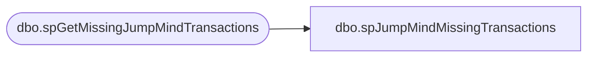

# dbo.spJumpMindMissingTransactions

**Database:** dw  
**Server:** papamart  

## Architecture Diagram



## Table Dependencies

| Referenced Table |
|---|
| dbo.spGetMissingJumpMindTransactions |

## Stored Procedure Code

```sql
/******************************************************************************
**
**	Name:		spJumpMindMissingTransactions
**
**	Description: 	Retrieves transactions that are missing from Sales Audit but present in Postgres
**			
**	History:	
**  Date 		Author 				Purpose
**  06/13/2025	Brandon Hickey   	Created
******************************************************************************/
CREATE PROCEDURE  [dbo].[spJumpMindMissingTransactions]

AS
SET NOCOUNT ON
BEGIN

IF (Object_ID('tempdb..#jmMissingTransactions') IS NOT NULL) DROP TABLE #jmMissingTransactions
    CREATE TABLE #jmMissingTransactions
    (
      device_id VARCHAR(8)
     ,business_date VARCHAR(8)
     ,sequence_number VARCHAR(6)
     ,business_unit_id VARCHAR(4)
     --,JMTransactionCount INT
     ,Store VARCHAR(4)
     ,Register VARCHAR(2)
     ,from_Trans_No VARCHAR(6)
     ,to_Trans_No VARCHAR(6)
    )

    INSERT INTO #jmMissingTransactions
    EXEC [dw].[dbo].[spGetMissingJumpMindTransactions]

	SELECT device_id
	      ,business_date
		  ,sequence_number
		  ,business_unit_id
		  ,Store
		  ,Register
		   FROM #jmMissingTransactions

END

dbo,sp_VoucherLookup_coupon,-- =============================================
-- Author:		<Author,,Name>
-- Create date: <Create Date,,>
-- Description:	<Description,,>
-- =============================================
CREATE PROCEDURE [dbo].[sp_VoucherLookup_coupon]
	-- Add the parameters for the stored procedure here
	@coupon_number varchar(20) = 'NoData',
	@refType int
AS
BEGIN

	SET NOCOUNT ON;

IF @coupon_number != 'NoData'
BEGIN
	SELECT couponNumber 'CouponNumber'
	  ,c.Abbrv 'Country'	  
	  ,Title 'Offer'
	  ,rptDescription 'Description'
      ,CONVERT(SMALLDATETIME, startDate) 'StartDate'
      ,DATEADD(SECOND, -1, (DATEADD(DAY, 1, CONVERT(DATETIME, endingDate)))) 'EndingDate'
      ,CASE
		WHEN startDate > GETDATE() THEN 'Pending'
		WHEN GETDATE() >= endingDate THEN 'Expired'
		ELSE 'Active'
	  END 'Status'
  FROM kodiak.DiscountMstrData.dbo.Discount d
  LEFT JOIN kodiak.DiscountMstrData.dbo.Country c ON d.countryID = c.countryID
  WHERE couponNumber = @coupon_Number
END

END
```

