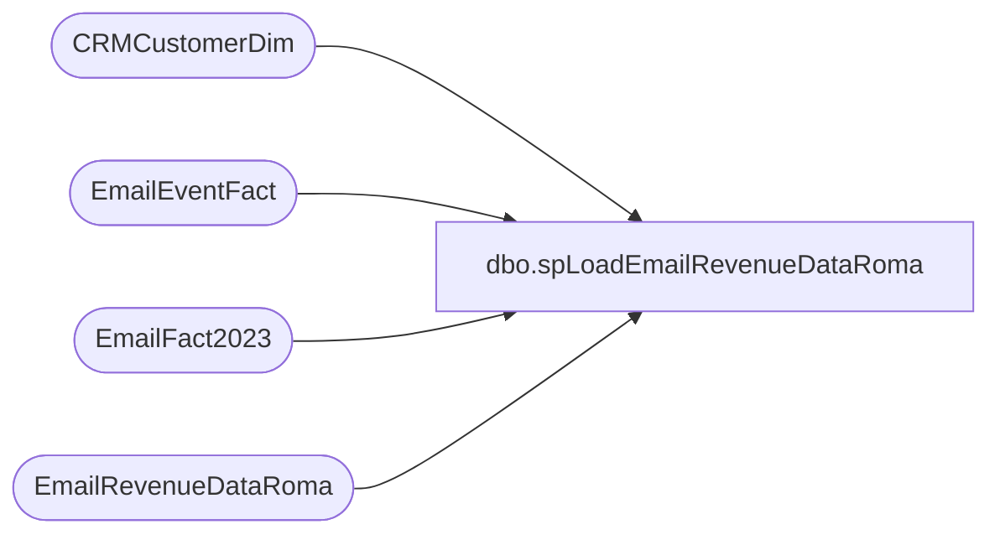

# dbo.spLoadEmailRevenueDataRoma

**Database:** dw  
**Server:** papamart  

## Architecture Diagram



## Table Dependencies

| Referenced Table |
|---|
| CRMCustomerDim |
| EmailEventFact |
| EmailFact2023 |
| EmailRevenueDataRoma |

## Stored Procedure Code

```sql
---- =====================================================================================================
---- Name: spLoadEmailRevenueDataRoma
---- Revision History
----		Name:			Date:			Comments:
----		Tim Callahan	08/10/2023		Initial Release
---- =====================================================================================================

CREATE PROCEDURE [dbo].[spLoadEmailRevenueDataRoma]

@DaysToGoBack int 

as

-- Use This Section for testing 
--Declare @DaysToGoBack int 
--;

--set @DaysToGoBack = 2
--;


-- Build Temp Country Table 
IF OBJECT_ID(N'tempdb..#Country') IS NOT NULL
Drop Table #Country 
select 
EmailAddress, 
Max(CountryCode) as Country
into #Country 
from CRMCustomerDim (nolock) 
group by EmailAddress


-- Build Summary1 table 
IF OBJECT_ID(N'tempdb..#Summary1') IS NOT NULL
Drop Table #Summary1
select 
e.SendID, 
--e.SendDate, 
cast (e.SendDate as Date) as SendDate, 
ef.Subject, 
ef.EmailName, 
c.Country, 
sum (e.retRev1) as RetailRevenue1Summed,
sum (e.retRev2) as RetailRevenue2Summed,
sum (e.retRev3) as RetailRevenue3Summed,
sum (e.webRev1) as WebRevenue1Summed,
sum (e.webRev2) as WebRevenue2Summed,
sum (e.webRev3) as WebRevenue3Summed
--,e.*
into #Summary1
from EmailFact2023 e (nolock)
join EmailEventFact ef (nolock) on ef.SendID=e.SendID and ef.ClientID=e.ClientID
join #Country c (nolock) on c.EmailAddress=e.EmailAddress
where 1=1
and DATEDIFF(dd,cast (e.SendDate as Date), getdate()) <= @DaysToGoBack
group by 
e.SendID, 
--e.SendDate, 
cast (e.SendDate as Date), 
ef.Subject, 
ef.EmailName, 
c.Country


-- Build Summary2 Table 
IF OBJECT_ID(N'tempdb..#Summary2') IS NOT NULL
Drop Table #Summary2

select
s.SendID, 
s.SendDate, 
s.Subject, 
s.EmailName, 
s.Country, 
s.RetailRevenue1Summed, 
s.RetailRevenue2Summed, 
s.RetailRevenue3Summed, 
s.WebRevenue1Summed, 
s.WebRevenue2Summed, 
s.WebRevenue3Summed,
sum (s.RetailRevenue1Summed+s.RetailRevenue2Summed+s.RetailRevenue3Summed) as RetailRevenueSummed , 
sum (s.WebRevenue1Summed+s.WebRevenue2Summed+s.WebRevenue3Summed) as WebRevenueSummed  
into #Summary2
from #Summary1 s (nolock) 
group by 
s.SendID, 
s.SendDate, 
s.Subject, 
s.EmailName, 
s.Country, 
s.RetailRevenue1Summed, 
s.RetailRevenue2Summed, 
s.RetailRevenue3Summed, 
s.WebRevenue1Summed, 
s.WebRevenue2Summed, 
s.WebRevenue3Summed

-- Summary 3 Table 
IF OBJECT_ID(N'tempdb..#Summary3') IS NOT NULL
Drop Table #Summary3


select
s.SendID, 
s.SendDate, 
s.Subject, 
s.EmailName, 
s.RetailRevenue1Summed, 
s.RetailRevenue2Summed, 
s.RetailRevenue3Summed, 
s.WebRevenue1Summed, 
s.WebRevenue2Summed, 
s.WebRevenue3Summed, 
s.RetailRevenueSummed, 
s.WebRevenueSummed, 
sum (s.RetailRevenueSummed + s.WebRevenueSummed) as OmniRevenueSummed, 
s.Country 
into #Summary3
from #Summary2 s
group by 
s.SendID, 
s.SendDate, 
s.Subject, 
s.EmailName, 
s.RetailRevenue1Summed, 
s.RetailRevenue2Summed, 
s.RetailRevenue3Summed, 
s.WebRevenue1Summed, 
s.WebRevenue2Summed, 
s.WebRevenue3Summed, 
s.RetailRevenueSummed, 
s.WebRevenueSummed,
s.Country


-- Final Load to Destination Table 

Truncate table EmailRevenueDataRoma

Insert into EmailRevenueDataRoma
select *
from #Summary3 s
```

