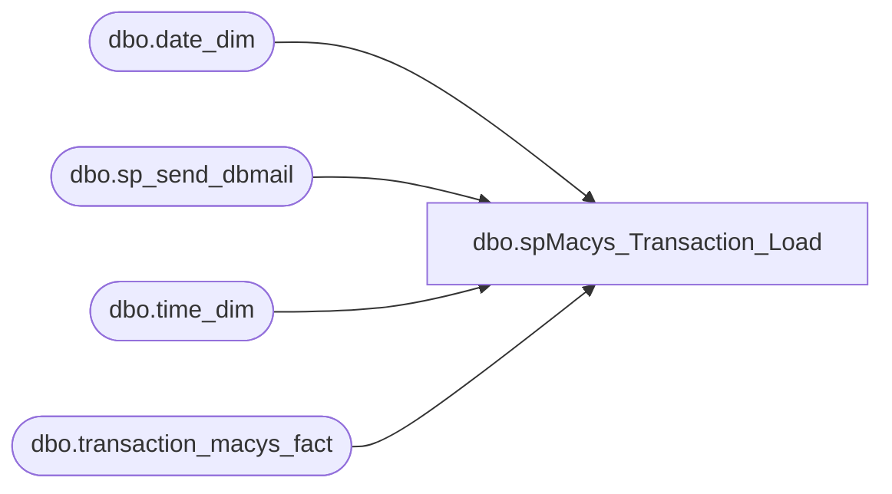

# dbo.spMacys_Transaction_Load

**Database:** dw  
**Server:** papamart  

## Architecture Diagram



## Table Dependencies

| Referenced Table |
|---|
| dbo.date_dim |
| dbo.sp_send_dbmail |
| dbo.time_dim |
| dbo.transaction_macys_fact |

## Stored Procedure Code

```sql
CREATE PROC [dbo].[spMacys_Transaction_Load]
WITH EXECUTE AS 'bab\SQLServices'
AS

SET NOCOUNT ON 

DECLARE @FileName VARCHAR(100), @Path VARCHAR(100), @PathFileName VARCHAR(200), 
@FormatFilePath VARCHAR(100), @FormatPathFileName VARCHAR(200), 
@cmdStmt VARCHAR(500), @Filter VARCHAR(20)

DECLARE @RecordCount INT, @RecordCountControl INT, @SumUnits INT, @SumUnitsControl INT,
@SumSales NUMERIC (14,2), @SumSalesControl NUMERIC (14,2)

DECLARE @recipients VARCHAR(2000), @copy_recipients VARCHAR(2000), @subject VARCHAR(200), @MessageTxt VARCHAR(2000)


DECLARE @files TABLE (fileID  INT IDENTITY(1,1), results varchar(1000))

SET @Path = '\\kermode\FileRepository\Macys_RSP_Transactions\'
SET @FormatFilePath = '\\kermode\d$\ETL Executables\Macys_RSP_Transactions\'

-------------------------------------------------------------------------------------------
--\ LeasedSalesControl Load																	/--
-------------------------------------------------------------------------------------------
SET @Filter = 'LeasedSalesControl'
SET @FormatPathFileName = @FormatFilePath + 'Control.fmt'

SET @cmdStmt = 'dir "' + @Path + @Filter + '*.csv" /b /A:-D '

INSERT INTO @files EXEC xp_cmdshell @cmdStmt

DELETE FROM @files WHERE results IS NULL
DELETE FROM @files WHERE results = 'File Not Found'

IF OBJECT_ID('tempdb..##LeasedSalesControl') IS NULL
	CREATE TABLE ##LeasedSalesControl( TransDate VARCHAR(10) NULL, DataDate VARCHAR(10) NULL,
	RecordCount VARCHAR(20) NULL, SumUnits VARCHAR(10) NULL, SumSales VARCHAR(10) NULL
) 		

TRUNCATE TABLE ##LeasedSalesControl

WHILE (SELECT COUNT(*) FROM @files) > 0
BEGIN
	SELECT TOP 1 @FileName = results FROM @files ORDER BY FileID
	SELECT @PathFileName = @Path + @Filename
	
	EXEC ('BULK INSERT ##LeasedSalesControl 
	FROM ''' + @PathFileName + '''
	WITH
	(
		FIELDTERMINATOR = '','',
		ROWTERMINATOR = ''\n'',
		FORMATFILE = ''' + @FormatPathFileName + '''	
	)'	)

	DELETE FROM ##LeasedSalesControl WHERE TransDate = 'TransDate'
	
	SET @cmdStmt = 'MOVE "' + @PathFileName + '" "' +  @Path + 'Archive\"' 
	EXEC xp_cmdshell @cmdStmt, no_output
	DELETE FROM @files WHERE results = @FileName
END
DELETE FROM ##LeasedSalesControl WHERE RecordCount = 0

-------------------------------------------------------------------------------------------
--\ LeasedSales Load																	/--
-------------------------------------------------------------------------------------------
SET @Filter = 'LeasedSales'
SET @FormatPathFileName = @FormatFilePath + 'Sales.fmt'

SET @cmdStmt = 'dir "' + @Path + @Filter + '*.csv" /b /A:-D '
DELETE FROM @files

INSERT INTO @files EXEC xp_cmdshell @cmdStmt

DELETE FROM @files WHERE results IS NULL
DELETE FROM @files WHERE results = 'File Not Found'

IF OBJECT_ID('tempdb..##LeasedSales') IS NULL

CREATE TABLE ##LeasedSales (
	[DATE] varchar (20) NULL, [TIME] varchar (20) NULL, [SELL_DIV] varchar (20) NULL, [SELL_LOCATION] varchar (20) NULL, 
	[FILL_DIV] varchar (20) NULL, [FILL_LOCATION] varchar (20) NULL, [REGISTER] varchar (20) NULL, [TRANS] varchar (20) NULL, 
	[TRANSTYPEID] varchar (20) NULL, [SEQUENCE] varchar (20) NULL, [RINGASSOCID] varchar (20) NULL, [COMMASSOCID] varchar (20) NULL, 
	[TENDER1_TYPE] varchar (20) NULL, [TENDER1_AMOUNT] varchar (20) NULL, [TENDER1_GIFTCARD] varchar (20) NULL,
	[TENDER2_TYPE] varchar (20) NULL, [TENDER2_AMOUNT] varchar (20) NULL, [TENDER2_GIFTCARD] varchar (20) NULL, 
	[TENDER3_TYPE] varchar (20) NULL, [TENDER3_AMOUNT] varchar (20) NULL, [TENDER3_GIFTCARD] varchar (20) NULL, 
	[TENDER4_TYPE] varchar (20) NULL, [TENDER4_AMOUNT] varchar (20) NULL, [TENDER4_GIFTCARD] varchar (20) NULL, 
	[TENDER5_TYPE] varchar (20) NULL, [TENDER5_AMOUNT] varchar (20) NULL, [TENDER5_GIFTCARD] varchar (20) NULL, 
	[TENDER6_TYPE] varchar (20) NULL, [TENDER6_AMOUNT] varchar (20) NULL, [TENDER6_GIFTCARD] varchar (20) NULL,
	[TENDER7_TYPE] varchar (20) NULL, [TENDER7_AMOUNT] varchar (20) NULL, [TENDER7_GIFTCARD] varchar (20) NULL, 
	[TENDER8_TYPE] varchar (20) NULL, [TENDER8_AMOUNT] varchar (20) NULL, [TENDER8_GIFTCARD] varchar (20) NULL, 
	[TENDER9_TYPE] varchar (20) NULL, [TENDER9_AMOUNT] varchar (20) NULL, [TENDER9_GIFTCARD] varchar (20) NULL, 
	[TENDER10_TYPE] varchar (20) NULL, [TENDER10_AMOUNT] varchar (20) NULL, [TENDER10_GIFTCARD] varchar (20) NULL, 
	[COUPON1_CODE] varchar (20) NULL, [COUPON1_DISCOUNT] varchar (20) NULL, [COUPON2_CODE] varchar (20) NULL,
	[COUPON2_DISCOUNT] varchar (20) NULL, [COUPON3_CODE] [varchar](20) NULL, [COUPON3_DISCOUNT] varchar (20) NULL, 
	[RESERVATION] varchar (20) NULL, [LOYALTY] varchar(20) NULL, [DEPT] varchar (20) NULL, [CLASS] varchar (20) NULL, 
	[SKU] varchar (20) NULL, [UNITS] varchar (20) NULL, [PLUAMOUNT] varchar (20) NULL, [SALEAMOUNT] varchar (20) NULL, 
	[ORIGDATE] varchar (20) NULL, [ORIGLOCATION] varchar (20) NULL, [ORIGREGISTER] varchar (20) NULL, [ORIGTRANS] varchar (20) NULL,
	[EMPLOYEE] varchar (20) NULL, [AUDITED] varchar (20) NULL
) 		

TRUNCATE TABLE ##LeasedSales

WHILE (SELECT COUNT(*) FROM @files) > 0
BEGIN
	SELECT TOP 1 @FileName = results FROM @files ORDER BY FileID
	SELECT @PathFileName = @Path + @Filename
	
	EXEC ('BULK INSERT ##LeasedSales 
	FROM ''' + @PathFileName + '''
	WITH
	(
		FIELDTERMINATOR = '','',
		ROWTERMINATOR = ''\n'',
		FORMATFILE = ''' + @FormatPathFileName + '''	
	)')

	DELETE FROM ##LeasedSales WHERE [Date] = 'Date'
	
	SET @cmdStmt = 'MOVE "' + @PathFileName + '" "' +  @Path + 'Archive\"' 
	EXEC xp_cmdshell @cmdStmt, no_output
	DELETE FROM @files WHERE results = @FileName
END

------------------------------------------------------------------------------------------------------
--Check everything made it into the temp
------------------------------------------------------------------------------------------------------
SET @MessageTxt = ''
SELECT @recipients = 'databears@buildabear.com', @copy_recipients = NULL, @subject = 'Macys Transactions DW load error!'

--Date logic will need to be added, beacuse this proc can consume multiple sets of files
SELECT @RecordCountControl = RecordCount, @SumUnitsControl = SumUnits, @SumSalesControl = SumSales
FROM ##LeasedSalesControl lsc

SELECT --MIN(CAST([DATE] AS DATETIME)), MAX(CAST([DATE] AS DATETIME)) maxDate, 
@RecordCount = COUNT(*), @SumUnits = SUM(CAST(UNITS AS INT)), @SumSales = SUM(CAST(PLUAMOUNT AS NUMERIC(10,2))) 
FROM ##LeasedSales 

IF ISNULL(@RecordCountControl, 0) <> ISNULL(@RecordCount, 0)
SET @MessageTxt = @MessageTxt + 'Record Counts do not match. ' +  CAST(ISNULL(@RecordCountControl, 0) AS VARCHAR(10)) + ' - '  +  CAST(ISNULL(@RecordCount, 0) AS VARCHAR(10)) + '
'
IF ISNULL(@SumUnitsControl, 0) <> ISNULL(@SumUnits, 0)
SET @MessageTxt = @MessageTxt + 'Unit Counts do not match. ' +  CAST(ISNULL(@SumUnitsControl, 0) AS VARCHAR(10)) + ' - '  +  CAST(ISNULL(@SumUnits, 0) AS VARCHAR(10)) + '
'
IF ISNULL(@SumSalesControl, 0) <> ISNULL(@SumSales, 0)
SET @MessageTxt = @MessageTxt + 'Sales Summations do not match. ' +  CAST(ISNULL(@SumSalesControl, 0) AS VARCHAR(10)) + ' - '  +  CAST(ISNULL(@SumSales, 0) AS VARCHAR(10)) + '
'

IF LEN(@MessageTxt) > 0
BEGIN
	SET @MessageTxt = @MessageTxt + CHAR(13) + CHAR(13) + CHAR(13) + 'This email was generated from dw.dbo.spMacys_Transaction_Load'
	EXEC msdb.dbo.sp_send_dbmail @recipients=@recipients ,@copy_recipients=@copy_recipients ,@subject = @subject, @body = @MessageTxt

	--GoTo EndHere
END
------------------------------------------------------------------------------------------------------
--Put the data into the data warehouse
------------------------------------------------------------------------------------------------------

--Clean up old records

DELETE FROM dw.dbo.transaction_macys_fact 
FROM dw.dbo.transaction_macys_fact tmf
INNER JOIN ( 
	SELECT dd.date_key 
	FROM ##LeasedSales stg
	INNER JOIN dw.dbo.date_dim dd ON stg.[DATE] = dd.actual_date
) qry ON tmf.date_key = qry.date_key
WHERE tmf.AUDITED = 0 

DELETE FROM dw.dbo.transaction_macys_fact 
FROM dw.dbo.transaction_macys_fact tmf
INNER JOIN ( 
	SELECT dd.date_key, time_key, SELL_LOCATION, TRANS, SEQUENCE, AUDITED 
	FROM ##LeasedSales stg
	INNER JOIN dw.dbo.date_dim dd ON stg.[DATE] = dd.actual_date
	INNER JOIN 
	(
		SELECT RIGHT('00' +  CAST(minute AS VARCHAR(2)), 2) twoplcMin, RIGHT('00' +  CAST(hour AS VARCHAR(2)), 2) vcHour, * 
		FROM dw.dbo.time_dim
	) td ON RIGHT('0' + stg.[TIME],5) = vcHour + ':' + td.twoplcMin 
	WHERE stg.AUDITED = 1
) qry ON tmf.date_key = qry.date_key AND tmf.time_key = qry.time_key AND tmf.SELL_LOCATION = qry.SELL_LOCATION AND tmf.TRANS = qry.TRANS AND tmf.SEQUENCE = qry.SEQUENCE 

--Insert records

INSERT INTO dw.dbo.transaction_macys_fact ([DATE_KEY], [TIME_KEY], SELL_DIV, SELL_LOCATION, FILL_DIV, FILL_LOCATION, REGISTER, TRANS, TRANSTYPEID, SEQUENCE, RINGASSOCID, COMMASSOCID, TENDER1_TYPE, TENDER1_AMOUNT, TENDER1_GIFTCARD, TENDER2_TYPE, TENDER2_AMOUNT, TENDER2_GIFTCARD, TENDER3_TYPE, TENDER3_AMOUNT, TENDER3_GIFTCARD, TENDER4_TYPE, TENDER4_AMOUNT, TENDER4_GIFTCARD, TENDER5_TYPE, TENDER5_AMOUNT, TENDER5_GIFTCARD, TENDER6_TYPE, TENDER6_AMOUNT, TENDER6_GIFTCARD, TENDER7_TYPE, TENDER7_AMOUNT, TENDER7_GIFTCARD, TENDER8_TYPE, TENDER8_AMOUNT, TENDER8_GIFTCARD, TENDER9_TYPE, TENDER9_AMOUNT, TENDER9_GIFTCARD, TENDER10_TYPE, TENDER10_AMOUNT, TENDER10_GIFTCARD, COUPON1_CODE, COUPON1_DISCOUNT, COUPON2_CODE, COUPON2_DISCOUNT, COUPON3_CODE, COUPON3_DISCOUNT, RESERVATION, LOYALTY, DEPT, CLASS, SKU, UNITS, PLUAMOUNT, SALEAMOUNT, DATE_KEY_ORIGDATE, ORIGLOCATION, ORIGREGISTER, ORIGTRANS, EMPLOYEE, AUDITED)
SELECT dd.date_key, td.time_key, SELL_DIV, SELL_LOCATION, FILL_DIV, FILL_LOCATION, REGISTER, TRANS, TRANSTYPEID, SEQUENCE, RINGASSOCID, 
COMMASSOCID, TENDER1_TYPE, TENDER1_AMOUNT, TENDER1_GIFTCARD, TENDER2_TYPE, TENDER2_AMOUNT, TENDER2_GIFTCARD, TENDER3_TYPE, TENDER3_AMOUNT, 
TENDER3_GIFTCARD, TENDER4_TYPE, TENDER4_AMOUNT, TENDER4_GIFTCARD, TENDER5_TYPE, TENDER5_AMOUNT, TENDER5_GIFTCARD, TENDER6_TYPE, TENDER6_AMOUNT, 
TENDER6_GIFTCARD, TENDER7_TYPE, TENDER7_AMOUNT, TENDER7_GIFTCARD, TENDER8_TYPE, TENDER8_AMOUNT, TENDER8_GIFTCARD, TENDER9_TYPE, TENDER9_AMOUNT, 
TENDER9_GIFTCARD, TENDER10_TYPE, TENDER10_AMOUNT, TENDER10_GIFTCARD, COUPON1_CODE, COUPON1_DISCOUNT, COUPON2_CODE, COUPON2_DISCOUNT, COUPON3_CODE, 
COUPON3_DISCOUNT, RESERVATION, LOYALTY, DEPT, CLASS, SKU, UNITS, PLUAMOUNT, SALEAMOUNT, odd.date_key DATE_KEY_ORIGDATE, ORIGLOCATION, ORIGREGISTER, 
ORIGTRANS, EMPLOYEE, AUDITED
FROM ##LeasedSales  stg
INNER JOIN dw.dbo.date_dim dd ON stg.[DATE] = dd.actual_date
INNER JOIN 
(
	SELECT RIGHT('00' +  CAST(minute AS VARCHAR(2)), 2) twoplcMin, RIGHT('00' +  CAST(hour AS VARCHAR(2)), 2) vcHour, 
	* 
	FROM dw.dbo.time_dim
) td ON RIGHT('0' + stg.[TIME],5) = vcHour + ':' + td.twoplcMin 
LEFT JOIN dw.dbo.date_dim odd ON stg.ORIGDATE = odd.actual_date

EndHere:
```

