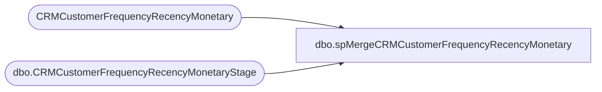

# dbo.spMergeCRMCustomerFrequencyRecencyMonetary

**Database:** dw  
**Server:** papamart  

## Architecture Diagram



## Table Dependencies

| Referenced Table |
|---|
| CRMCustomerFrequencyRecencyMonetary |
| dbo.CRMCustomerFrequencyRecencyMonetaryStage |

## Stored Procedure Code

```sql
CREATE proc [dbo].[spMergeCRMCustomerFrequencyRecencyMonetary] 

as

set nocount on

merge into CRMCustomerFrequencyRecencyMonetary as target
using dwstaging.dbo.CRMCustomerFrequencyRecencyMonetaryStage as source
on
	(
		target.CustomerNumber=source.CustomerNumber
	)
when matched 
	and 
		(
			isnull(target.LifetimeTransactionCount,0)<>isnull(source.LifetimeTransactionCount,0) or
			isnull(target.LifetimeRecencyCount,0)<>isnull(source.LifetimeRecencyCount,0) or
			isnull(target.LifetimeSalesTotal,0)<>isnull(source.LifetimeSalesTotal,0) or
			isnull(target.FirstStoreConcept,'xx')<>isnull(source.FirstStoreConcept,'xx') or
			isnull(target.FirstTransactionDate,'3030-12-31')<>isnull(source.FirstTransactionDate,'3030-12-31') or
			isnull(target.Frequency1M,0)<>isnull(source.Frequency1M,0) or
			isnull(target.Recency1M,0)<>isnull(source.Recency1M,0) or
			isnull(target.Sales1M,0)<>isnull(source.Sales1M,0) or
			isnull(target.minDaysBetween1M,0)<>isnull(source.minDaysBetween1M,0) or
			isnull(target.maxDaysBetween1M,0)<>isnull(source.maxDaysBetween1M,0) or
			isnull(target.DaysBetween1M,0)<>isnull(source.DaysBetween1M,0) or
			isnull(target.Frequency3M,0)<>isnull(source.Frequency3M,0) or
			isnull(target.Recency3M,0)<>isnull(source.Recency3M,0) or
			isnull(target.Sales3M,0)<>isnull(source.Sales3M,0) or
			isnull(target.minDaysBetween3M,0)<>isnull(source.minDaysBetween3M,0) or
			isnull(target.maxDaysBetween3M,0)<>isnull(source.maxDaysBetween3M,0) or
			isnull(target.DaysBetween3M,0)<>isnull(source.DaysBetween3M,0) or
			isnull(target.Frequency6M,0)<>isnull(source.Frequency6M,0) or
			isnull(target.Recency6M,0)<>isnull(source.Recency6M,0) or
			isnull(target.Sales6M,0)<>isnull(source.Sales6M,0) or
			isnull(target.minDaysBetween6M,0)<>isnull(source.minDaysBetween6M,0) or
			isnull(target.maxDaysBetween6M,0)<>isnull(source.maxDaysBetween6M,0) or
			isnull(target.DaysBetween6M,0)<>isnull(source.DaysBetween6M,0) or
			isnull(target.Frequency12M,0)<>isnull(source.Frequency12M,0) or
			isnull(target.Recency12M,0)<>isnull(source.Recency12M,0) or
			isnull(target.Sales12M,0)<>isnull(source.Sales12M,0) or
			isnull(target.minDaysBetween12M,0)<>isnull(source.minDaysBetween12M,0) or
			isnull(target.maxDaysBetween12M,0)<>isnull(source.maxDaysBetween12M,0) or
			isnull(target.DaysBetween12M,0)<>isnull(source.DaysBetween12M,0) or
			isnull(target.Frequency18M,0)<>isnull(source.Frequency18M,0) or
			isnull(target.Recency18M,0)<>isnull(source.Recency18M,0) or
			isnull(target.Sales18M,0)<>isnull(source.Sales18M,0) or
			isnull(target.minDaysBetween18M,0)<>isnull(source.minDaysBetween18M,0) or
			isnull(target.maxDaysBetween18M,0)<>isnull(source.maxDaysBetween18M,0) or
			isnull(target.DaysBetween18M,0)<>isnull(source.DaysBetween18M,0) or
			isnull(target.Frequency24M,0)<>isnull(source.Frequency24M,0) or
			isnull(target.Recency24M,0)<>isnull(source.Recency24M,0) or
			isnull(target.Sales24M,0)<>isnull(source.Sales24M,0) or
			isnull(target.minDaysBetween24M,0)<>isnull(source.minDaysBetween24M,0) or
			isnull(target.maxDaysBetween24M,0)<>isnull(source.maxDaysBetween24M,0) or
			isnull(target.DaysBetween24M,0)<>isnull(source.DaysBetween24M,0) or
			isnull(target.Frequency36M,0)<>isnull(source.Frequency36M,0) or
			isnull(target.Recency36M,0)<>isnull(source.Recency36M,0) or
			isnull(target.Sales36M,0)<>isnull(source.Sales36M,0) or
			isnull(target.minDaysBetween36M,0)<>isnull(source.minDaysBetween36M,0) or
			isnull(target.maxDaysBetween36M,0)<>isnull(source.maxDaysBetween36M,0) or
			isnull(target.DaysBetween36M,0)<>isnull(source.DaysBetween36M,0) or
			isnull(target.LastTransactionStore,'xx')<>isnull(source.LastTransactionStore,'xx') or
			isnull(target.LastTransactionDate,'3030-12-31')<>isnull(source.LastTransactionDate,'3030-12-31') 
		)
then
	update
		set 
			target.LifetimeTransactionCount=source.LifetimeTransactionCount,
			target.LifetimeRecencyCount=source.LifetimeRecencyCount,
			target.LifetimeSalesTotal=source.LifetimeSalesTotal,
			target.FirstStoreConcept=source.FirstStoreConcept,
			target.FirstTransactionDate=source.FirstTransactionDate,
			target.Frequency1M=source.Frequency1M,
			target.Recency1M=source.Recency1M,
			target.Sales1M=source.Sales1M,
			target.minDaysBetween1M=source.minDaysBetween1M,
			target.maxDaysBetween1M=source.maxDaysBetween1M,
			target.DaysBetween1M=source.DaysBetween1M,
			target.Frequency3M=source.Frequency3M,
			target.Recency3M=source.Recency3M,
			target.Sales3M=source.Sales3M,
			target.minDaysBetween3M=source.minDaysBetween3M,
			target.maxDaysBetween3M=source.maxDaysBetween3M,
			target.DaysBetween3M=source.DaysBetween3M,
			target.Frequency6M=source.Frequency6M,
			target.Recency6M=source.Recency6M,
			target.Sales6M=source.Sales6M,
			target.minDaysBetween6M=source.minDaysBetween6M,
			target.maxDaysBetween6M=source.maxDaysBetween6M,
			target.DaysBetween6M=source.DaysBetween6M,
			target.Frequency12M=source.Frequency12M,
			target.Recency12M=source.Recency12M,
			target.Sales12M=source.Sales12M,
			target.minDaysBetween12M=source.minDaysBetween12M,
			target.maxDaysBetween12M=source.maxDaysBetween12M,
			target.DaysBetween12M=source.DaysBetween12M,
			target.Frequency18M=source.Frequency18M,
			target.Recency18M=source.Recency18M,
			target.Sales18M=source.Sales18M,
			target.minDaysBetween18M=source.minDaysBetween18M,
			target.maxDaysBetween18M=source.maxDaysBetween18M,
			target.DaysBetween18M=source.DaysBetween18M,
			target.Frequency24M=source.Frequency24M,
			target.Recency24M=source.Recency24M,
			target.Sales24M=source.Sales24M,
			target.minDaysBetween24M=source.minDaysBetween24M,
			target.maxDaysBetween24M=source.maxDaysBetween24M,
			target.DaysBetween24M=source.DaysBetween24M,
			target.Frequency36M=source.Frequency36M,
			target.Recency36M=source.Recency36M,
			target.Sales36M=source.Sales36M,
			target.minDaysBetween36M=source.minDaysBetween36M,
			target.maxDaysBetween36M=source.maxDaysBetween36M,
			target.DaysBetween36M=source.DaysBetween36M,
			target.LastTransactionStore=source.LastTransactionStore,
			target.LastTransactionDate=source.LastTransactionDate,
			target.UpdateDate=getdate()
When not matched by target 
then 
	insert
		(
			CustomerNumber,
			LifetimeTransactionCount,
			LifetimeRecencyCount,
			LifetimeSalesTotal,
			FirstStoreConcept,
			FirstTransactionDate,
			Frequency1M,
			Recency1M,
			Sales1M,
			minDaysBetween1M,
			maxDaysBetween1M,
			DaysBetween1M,
			Frequency3M,
			Recency3M,
			Sales3M,
			minDaysBetween3M,
			maxDaysBetween3M,
			DaysBetween3M,
			Frequency6M,
			Recency6M,
			Sales6M,
			minDaysBetween6M,
			maxDaysBetween6M,
			DaysBetween6M,
			Frequency12M,
			Recency12M,
			Sales12M,
			minDaysBetween12M,
			maxDaysBetween12M,
			DaysBetween12M,
			Frequency18M,
			Recency18M,
			Sales18M,
			minDaysBetween18M,
			maxDaysBetween18M,
			DaysBetween18M,
			Frequency24M,
			Recency24M,
			Sales24M,
			minDaysBetween24M,
			maxDaysBetween24M,
			DaysBetween24M,
			Frequency36M,
			Recency36M,
			Sales36M,
			minDaysBetween36M,
			maxDaysBetween36M,
			DaysBetween36M,
			LastTransactionStore,
			LastTransactionDate,
			InsertDate
		)
	values
		(
			source.CustomerNumber,
			source.LifetimeTransactionCount,
			source.LifetimeRecencyCount,
			source.LifetimeSalesTotal,
			source.FirstStoreConcept,
			source.FirstTransactionDate,
			source.Frequency1M,
			source.Recency1M,
			source.Sales1M,
			source.minDaysBetween1M,
			source.maxDaysBetween1M,
			source.DaysBetween1M,
			source.Frequency3M,
			source.Recency3M,
			source.Sales3M,
			source.minDaysBetween3M,
			source.maxDaysBetween3M,
			source.DaysBetween3M,
			source.Frequency6M,
			source.Recency6M,
			source.Sales6M,
			source.minDaysBetween6M,
			source.maxDaysBetween6M,
			source.DaysBetween6M,
			source.Frequency12M,
			source.Recency12M,
			source.Sales12M,
			source.minDaysBetween12M,
			source.maxDaysBetween12M,
			source.DaysBetween12M,
			source.Frequency18M,
			source.Recency18M,
			source.Sales18M,
			source.minDaysBetween18M,
			source.maxDaysBetween18M,
			source.DaysBetween18M,
			source.Frequency24M,
			source.Recency24M,
			source.Sales24M,
			source.minDaysBetween24M,
			source.maxDaysBetween24M,
			source.DaysBetween24M,
			source.Frequency36M,
			source.Recency36M,
			source.Sales36M,
			source.minDaysBetween36M,
			source.maxDaysBetween36M,
			source.DaysBetween36M,
			source.LastTransactionStore,
			source.LastTransactionDate,
			getdate()
		)
--when not matched by source
--then 
--	delete
;

dbo,spGuestLoad_Pull_Email_Addr,-- =============================================================================================================
-- Name: spGuestLoad_Pull_Email_Addr
--
-- Description:	
--		pull raw email data for kiosk and crm guests
--
-- Input:
--		@etl_log_id			int	
--			Current load to process
--
-- Output: 
--		data will be loaded into dw.dbo.GuestLoad_Pull_Email_Addr 
--
-- Dependencies: 
--
-- EXAMPLE:
--		exec dw.dbo.spGuestLoad_Pull_Email_Addr 17436
--
-- Revision History
--		Name:			Date:			Comments:
--		Dave Rice		7/19/2010		created
--		Dave Rice		12/13/2010		new preference center fields
--		Dave Rice		12/28/2010		do not allow party transaction data to be inserted, but we do need physical cleansed addresses for cleansed guests
--		Keith Missey	9/22/2011		added PRO as country code for Puerto Rico
--		Keith Missey	3/2/2012		added QUE as country code for Quebec
--		Keith Missey	4/18/2012		added additional where clause to derived country to default to store's country
--										if no physical address information 									
-- =============================================================================================================
CREATE PROCEDURE [dbo].[spGuestLoad_Pull_Email_Addr](@etl_log_id int)
AS
BEGIN
-- SET NOCOUNT ON added to prevent extra result sets from
-- interfering with SELECT statements.
SET NOCOUNT ON;

----exec dbo.[spGuestLoad_Pull_Email_Addr] 14224
--select top 1 etl_log_id from dwstaging.dbo.load_rec_id_cntrl with (nolock)
--declare @etl_log_id int
--set @etl_log_id = 17636

truncate table GuestLoad_Pull_Email_Addr

--select * from GuestLoad_Pull_Email_Addr

/*
select * from GuestLoad_Pull_Email_Addr
order by orig_src_sys_cd desc

select email_addr_txt, count(*) 
from GuestLoad_Pull_Email_Addr
group by email_addr_txt
having count(*) > 1

order by orig_src_sys_cd desc


select * from email_addr_dim
select * from dbo.EMAIL_ADDR_PRFRNCE_DIM

*/

insert into GuestLoad_Pull_Email_Addr (
	stg_id, 
	orig_src_sys_cd, updt_src_sys_cd, 
	email_addr_id, email_addr_txt,
	email_stat_cd, email_stat_dt, 
	frst_nm, last_nm, brth_dt, cntry_abbrv, 

	promo_pref, promo_updt_dt,
	sfscert_pref, sfscert_updt_dt, 
	sfspnts_pref, sfspnts_updt_dt
)
-- kiosk data
SELECT
	lric.stg_id,

	lric.stg_dta_set_cd,
	lric.stg_dta_set_cd,
	IsNull(ead.email_addr_id, -1),
	rgd.drvd_email_addr_txt,

	'VALID',
	getdate(),

	rgd.frst_nm,
	rgd.last_nm,
	rgd.brth_dt,
	CASE
		WHEN rad.st_prvnc_txt IN ('pr','puertorico','puerto rico') THEN 'PRO'
		WHEN rad.cntry_txt = 'puerto rico' THEN 'PRO'
		WHEN rad.st_prvnc_txt IN ('quebec','que','qc','qbc') THEN 'QUE'
		WHEN rad.cntry_txt IN ('quebec','que','qc','qbc') THEN 'QUE'
		when rad.DRVD_CNTRY_ABBRV = 'US' then 'USA'
		when rad.DRVD_CNTRY_ABBRV = 'CA' then 'CAN'
		when rad.DRVD_CNTRY_ABBRV IN ('GB','UK') then 'GBR'
		when rad.DRVD_CNTRY_ABBRV = 'FR' then 'FRA'
		WHEN rad.drvd_cntry_abbrv = 'IE' THEN 'IRE'
		else CASE 
					WHEN sd.store_id = 255 THEN 'PRO' 
					WHEN sd.store_id IN (269, 270, 279) THEN 'QUE'
					WHEN sd.country = 'US' THEN 'USA'
					WHEN sd.country = 'CA' THEN 'CAN'
					WHEN sd.country = 'UK' THEN 'GBR'
					WHEN sd.country = 'FR' THEN 'FRA'
					WHEN sd.country = 'IE' THEN 'IRE' ELSE 'USA' END
	end,

	rgd.drvd_email_stat_cd,
	cast(convert(varchar, s.trn_start_dt, 101) as datetime) trn_start_dt,

	'Y', '1/1/1900',
	'Y', '1/1/1900'
FROM dwstaging.dbo.load_rec_id_cntrl lric with (nolock)
	join dwstaging.dbo.ksk_regis_stg s with (nolock)
	ON s.ksk_regis_stg_id = lric.stg_id
	join dw.dbo.raw_gst_dim rgd with (nolock)
	ON rgd.raw_gst_id = lric.raw_gst_id
	join dw.dbo.raw_addr_dim rad with (nolock)
	ON rad.raw_addr_id = lric.raw_addr_id
	left join dw.dbo.email_addr_dim ead with (nolock)
	ON ead.email_addr_txt = rgd.drvd_email_addr_txt
	LEFT JOIN dw.dbo.store_dim sd ON lric.str_id = sd.store_key
where 1=1
	AND lric.stg_dta_set_cd = 'KSK'
	AND lric.etl_log_id = @etl_log_id
	and rgd.drvd_email_addr_txt is not null
	-- do not insert any party emails, no point in it, but physical addresses we will need to tie cleansed guests to
	and isnull(s.prty_trn_cd,'') not in ('true','yes','1')

union

-- crm
SELECT
	lric.stg_id,
	lric.stg_dta_set_cd,
	lric.stg_dta_set_cd,

	IsNull(ead.email_addr_id, -1),
	rgd.drvd_email_addr_txt,
	'VALID',
	getdate(),

	cast(rgd.frst_nm as varchar(50)),
	cast(rgd.last_nm as varchar(50)),
	rgd.brth_dt,

	case 
		WHEN rad.st_prvnc_txt IN ('pr','puertorico','puerto rico') THEN 'PRO'
		WHEN rad.cntry_txt = 'puerto rico' THEN 'PRO'
		WHEN rad.st_prvnc_txt IN ('quebec','que','qc','qbc') THEN 'QUE'
		WHEN rad.cntry_txt IN ('quebec','que','qc','qbc') THEN 'QUE'
		when rad.DRVD_CNTRY_ABBRV = 'US' then 'USA'
		when rad.DRVD_CNTRY_ABBRV = 'CA' then 'CAN'
		when rad.DRVD_CNTRY_ABBRV IN ('GB','UK') then 'GBR'
		when rad.DRVD_CNTRY_ABBRV = 'FR' then 'FRA'
		WHEN rad.drvd_cntry_abbrv = 'IE' THEN 'IRE'
		else CASE 
					WHEN sd.store_id = 255 THEN 'PRO' 
					WHEN sd.store_id IN (269, 270, 279) THEN 'QUE'
					WHEN sd.country = 'US' THEN 'USA'
					WHEN sd.country = 'CA' THEN 'CAN'
					WHEN sd.country = 'UK' THEN 'GBR'
					WHEN sd.country = 'FR' THEN 'FRA'
					WHEN sd.country = 'IE' THEN 'IRE' ELSE 'USA' END
	end,

	rgd.drvd_email_stat_cd,
	cast(convert(varchar, s.email_updt_dt, 101) as datetime) email_updt_dt,

	rgd.drvd_emailcert_stat_cd,
	cast(convert(varchar, isnull(s.emailcert_updt_dt, '1/1/1900'), 101) as datetime) emailcert_updt_dt,

	rgd.drvd_sfspoints_stat_cd,
	cast(convert(varchar, isnull(s.sfspoints_updt_dt, '1/1/1900'), 101) as datetime) sfspoints_updt_dt

FROM dwstaging.dbo.load_rec_id_cntrl lric with (nolock)
	join dwstaging.dbo.crm_stg s with (nolock)
	ON s.crm_stg_id = lric.stg_id
	join dw.dbo.raw_gst_dim rgd with (nolock)
	ON rgd.raw_gst_id = lric.raw_gst_id
	join dw.dbo.raw_addr_dim rad with (nolock)
	ON rad.raw_addr_id = lric.raw_addr_id
	left join dw.dbo.email_addr_dim ead with (nolock)
	ON ead.email_addr_txt = rgd.drvd_email_addr_txt
	LEFT JOIN dw.dbo.store_dim sd ON str_nbr = sd.store_id
where 1=1
	AND lric.stg_dta_set_cd = 'CRM'
	AND lric.etl_log_id = @etl_log_id
	and rgd.drvd_email_addr_txt is not null
END
```

