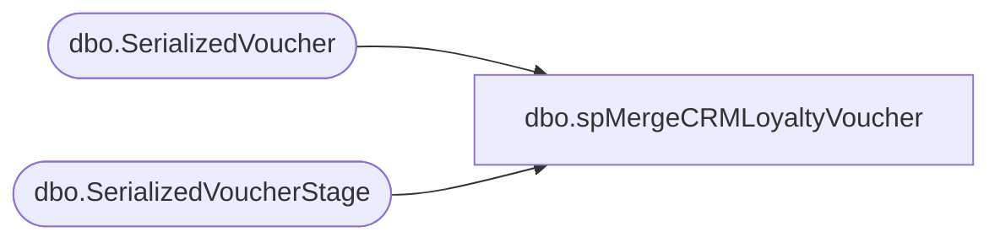

# dbo.spMergeCRMLoyaltyVoucher

**Database:** dw  
**Server:** papamart  

## Architecture Diagram



## Table Dependencies

| Referenced Table |
|---|
| dbo.SerializedVoucher |
| dbo.SerializedVoucherStage |

## Stored Procedure Code

```sql
CREATE proc [dbo].[spMergeCRMLoyaltyVoucher]

as

set nocount on

merge into [papamart].[dw].[dbo].[SerializedVoucher] as target
using (
--select distinct * from [papamart].[DWStaging].[dbo].[SerializedVoucherStage] where Status = 'Issued'


SELECT distinct [SerializedNumber],[StartDate],[DiscountAmount],[CustomerNumber],[Email]
,[ExpirationDate],[FirstName],[LastName],[Address1],[Address2],[City],[State],[ZipCode],[Country],[CouponID],[Description],[Status],[title]
  FROM [papamart].[DWStaging].[dbo].[SerializedVoucherStage]
   where Status = 'Issued'
   -- and SerializedNumber = '20053070269347763'
  group by  [SerializedNumber],[StartDate],[DiscountAmount],[CustomerNumber],[Email]
,[ExpirationDate],[FirstName],[LastName],[Address1],[Address2],[City],[State],[ZipCode],[Country],[CouponID],[Description],[Status],[title]


)
as source
on 
	target.[SerializedNumber]=source.[SerializedNumber]
	
when matched 
	and 
		isnull(target.[StartDate],'3030-12-31')<>isnull(source.[StartDate],'3030-12-31')	
					or
		isnull(target.[DiscountAmount],0)<>isnull(source.[DiscountAmount],0) 
		or
		--isnull(target.[IssuingStoreNumber],'x')<>isnull(source.[IssuingStoreNumber],'x')
		--or
		isnull(target.[CustomerNumber],'x')<>isnull(source.[CustomerNumber],'x')
		or
		--isnull(target.[PurchasingEmployeeNumber],'x')<>isnull(source.[PurchasingEmployeeNumber],'x')
		--or
		--isnull(target.[Title],'x')<>isnull(source.[Title],'x')
		--or
		isnull(target.[Email],'x')<>isnull(source.[Email],'x')
		or
		isnull(target.[ExpirationDate],'3030-12-31')<>isnull(source.[ExpirationDate],'3030-12-31')
		or
		--isnull(target.[isExported],0)<>isnull(source.[isExported],0)
		--or
		--isnull(target.[InsertDate],'3030-12-31')<>isnull(source.[InsertDate],'3030-12-31')
		isnull(target.[FirstName],'x')<>isnull(source.[FirstName],'x')
		or
	    isnull(target.[LastName],'x')<>isnull(source.[LastName],'x')
	    or
	    isnull(target.[Address1],'x')<>isnull(source.[Address1],'x')
	    or
	    isnull(target.[Address2],'x')<>isnull(source.[Address2],'x')
	    or
	    isnull(target.[City],'x')<>isnull(source.[City],'x')
	    or
	    isnull(target.[State],'x')<>isnull(source.[State],'x')
	   or
	    isnull(target.[ZipCode],'x')<>isnull(source. [ZipCode],'x')
	    or
	    isnull(target.[Country],'x')<>isnull(source.[Country],'x')
	    or
		isnull(target.[CouponID],0)<>isnull(source.[CouponID],0) 
		or 
		isnull(target.[Description],'x')<>isnull(source.[Description],'x')
		or 
		isnull(target.[title],'x')<>isnull(source.[title],'x')

then update
	set
	target.[StartDate]=source.[StartDate],
	target.[DiscountAmount]=source.[DiscountAmount],
	--target.[IssuingStoreNumber]=source.[IssuingStoreNumber],
	target.[CustomerNumber]=source.[CustomerNumber],
	--target.[PurchasingEmployeeNumber]=source.[PurchasingEmployeeNumber],
	--target.[Title]=source.[Title],
	target.[Email]=source.[Email],
	target.[ExpirationDate]=source.[ExpirationDate],
	--target.[isExported]=source.[isExported],
	--target.[InsertDate]=source.[InsertDate],
	target.[UpdateDate]=getdate(),
	target.[CouponID]=source.[CouponID],
	target.[Description]=source.[Description],
	target.[title]=source.[title]

when not matched by target
then insert
	(
	  [SerializedNumber],
	  [StartDate],
	  [DiscountAmount],
	 -- [IssuingStoreNumber],
	  [CustomerNumber],
	 -- [PurchasingEmployeeNumber],
	 -- [Title],
	  [Email],
	  [ExpirationDate],
	  [FirstName],
	  [LastName],
	  [Address1],
	  [Address2],
	  [City],
	  [State],
	  [ZipCode],
	  [Country],
	  --[isExported],
	  [InsertDate],
	  [CouponID],
	  [Description],
	  [Status],
	  [title]

	)
values
	(
	  source.[SerializedNumber],
      source.[StartDate],
	  source.[DiscountAmount],
	 -- source.[IssuingStoreNumber],
	  source.[CustomerNumber],
	 -- source.[PurchasingEmployeeNumber],
	 -- source.[Title],
	  source.[Email],
	  source.[ExpirationDate],
	 -- source.[isExported],
	 -- source.[Email],
	 -- source.[ExpirationDate],
	  source.[FirstName],
	  source.[LastName],
	  source.[Address1],
	  source.[Address2],
	  source.[City],
	  source.[State],
	  source.[ZipCode],
	  source.[Country],
	  --source.[InsertDate],
	  getdate(),
	  source.[CouponID],
	  source.[Description],
	  source.[Status],
	  source.[title]
	)
--when not matched by source
--then delete
;
```

