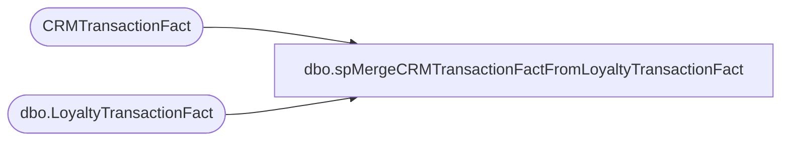

# dbo.spMergeCRMTransactionFactFromLoyaltyTransactionFact

**Database:** dw  
**Server:** papamart  

## Architecture Diagram



## Table Dependencies

| Referenced Table |
|---|
| CRMTransactionFact |
| dbo.LoyaltyTransactionFact |

## Stored Procedure Code

```sql
CREATE proc [dbo].[spMergeCRMTransactionFactFromLoyaltyTransactionFact]

as 

set nocount on

;


merge into CRMTransactionFact as target
--using LoyaltyTransactionFact as source
using 
(
SELECT [TransactionID]
      ,[StoreKey]
      ,[DateKey]
      ,[TransactionDate]
      ,[LoyaltyTransactionType]
      ,[POSTransactionNumber]
      ,[POSRegisterNumber]
      ,[CustomerNumber]
      ,[GaapSales]
      ,[GaapUnits]
      ,[InsertDate]
      ,[UpdateDate]
      ,[matchedByEmail]
      ,[isWebGift]
  FROM [dbo].[LoyaltyTransactionFact] where cast(TransactionDate as date) >= cast(getdate()-45 as date)
) as source
	on target.TransactionID=source.TransactionID
when matched
	and
		isnull(target.StoreKey,0)<>isnull(source.StoreKey,0) OR
		isnull(target.TransactionPostedDate,'3030-12-31')<>isnull(source.TransactionDate,'3030-12-31') OR	
		isnull(target.TransactionDate,'3030-12-31')<>isnull(source.TransactionDate,'3030-12-31') OR	
		isnull(target.CRMTransactionType,'x')<>isnull(source.LoyaltyTransactionType,'x') OR	
		isnull(target.POSTransactionNumber,0)<>isnull(source.POSTransactionNumber,0) OR	
		isnull(target.POSRegisterNumber,0)<>isnull(source.POSRegisterNumber,0) OR		
		isnull(target.CustomerNumber,0)<>isnull(source.CustomerNumber,0) OR		
		isnull(target.GaapSales,0)<>isnull(source.GaapSales,0) OR		
		isnull(target.GaapUnits,0)<>isnull(source.GaapSales,0)	OR
		isnull(target.matchedByEmail, 0) <> isnull(source.matchedByEmail, 0) OR
		isnull(target.isWebGift, 0) <> isnull(source.isWebGift, 0)
then update
	set
		target.StoreKey=source.StoreKey,
		target.TransactionPostedDate=source.TransactionDate,
		target.TransactionDate=source.TransactionDate,	
		target.CRMTransactionType=source.LoyaltyTransactionType,	
		target.POSTransactionNumber=source.POSTransactionNumber,	
		target.POSRegisterNumber=source.POSRegisterNumber,	
		target.CustomerNumber=source.CustomerNumber,	
		target.GaapSales=source.GaapSales,	
		target.GaapUnits=source.GaapUnits,
		target.POS='JumpMind',
		target.UpdatedDate=getdate(),
		target.matchedByEmail=source.matchedByEmail,
		target.isWebGift=source.isWebGift

when not matched by target
then insert
	(
		TransactionID,
		StoreKey,
		TransactionPostedDate,
		TransactionDate,	
		CRMTransactionType,	
		POSTransactionNumber,	
		POSRegisterNumber,	
		CustomerNumber,	
		GaapSales,	
		GaapUnits,	
		POS,
		InsertedDate,
		matchedByEmail,
		isWebGift
	)
values
	(
		TransactionID,
		StoreKey,
		TransactionDate,
		TransactionDate,	
		LoyaltyTransactionType,	
		POSTransactionNumber,	
		POSRegisterNumber,	
		CustomerNumber,	
		GaapSales,	
		GaapUnits,	
		'JumpMind',
		getdate(),
		matchedByEmail,
		isWebGift
	)
;
```

