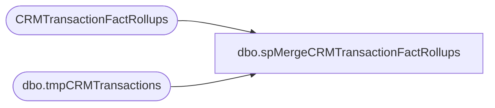

# dbo.spMergeCRMTransactionFactRollups

**Database:** dw  
**Server:** papamart  

## Architecture Diagram



## Table Dependencies

| Referenced Table |
|---|
| CRMTransactionFactRollups |
| dbo.tmpCRMTransactions |

## Stored Procedure Code

```sql
CREATE proc [dbo].[spMergeCRMTransactionFactRollups]

as


set nocount on

--=======================================================================================================================
---Dan Tweedie - 2021-2-25 Updated proc to preStage the merge Source query into temp table #stage, then merge from there. 
--							That pre stage takes less than a minute, as does the subsequent merge
--							I also added index to the stage data table before making this update
--								CREATE NONCLUSTERED INDEX [NCI_tmpTranIDCustNumSKU]
--								ON [dbo].[tmpCRMTransactions] ([TransactionID],[CustomerNumber],[sku])
--=======================================================================================================================

--IF (Object_ID('tempdb..#Stage') IS NOT NULL) DROP TABLE #Stage
--select
--	CustomerNumber,	
--	TransactionYear,	
--	TransacionMonth,	
--	TransactionDate,	
--	StoreConcept,
--	StoreNumber,
--	Country,
--	TransactionID,	
--	KeyStory,	
--	ConsumerGroup,	
--	Department,	
--	LicensedOrNot,	
--	LifetimeVisitNumber,
--	sum(Units) Units,
--	sum(Sales) Sales,
--	sku
--into #Stage
--from dwstaging.dbo.tmpCRMTransactions with (nolock)
--group by 
--	CustomerNumber,	
--	TransactionYear,	
--	TransacionMonth,	
--	TransactionDate,	
--	StoreConcept,	
--	StoreNumber,
--	Country,
--	TransactionID,	
--	KeyStory,	
--	ConsumerGroup,	
--	Department,	
--	LicensedOrNot,
--	LifetimeVisitNumber,
--	sku

--;


merge into CRMTransactionFactRollups as target
using dwstaging.dbo.tmpCRMTransactions as source
on 
	target.TransactionID=source.TransactionID
	--and
	--target.CustomerNumber=source.CustomerNumber
	and 
	target.sku=source.sku


when matched 
	and 
		isnull(target.CustomerNumber,'x')<>isnull(source.CustomerNumber,'x')
		or
		isnull(target.StoreConcept,'x')<>isnull(source.StoreConcept,'x')
		or
		isnull(target.Units,0)<>isnull(source.Units,0)
		or
		isnull(target.Sales,0)<>isnull(source.Sales,0)
		or 
		isnull(target.LifetimeVisitNumber,0)<>isnull(source.LifetimeVisitNumber,0)
		or 
		isnull(target.KeyStory,'x')<>isnull(source.KeyStory,'x')
		or 
		isnull(target.Department,'x')<>isnull(source.Department,'x')
		or 
		isnull(target.LicensedOrNot,'x')<>isnull(source.LicensedOrNot,'x')

		
then update
	set
		target.CustomerNumber=source.CustomerNumber,
		target.StoreConcept=source.StoreConcept,
		target.Units=source.Units,
		target.Sales=source.Sales,
		target.LifetimeVisitNumber=source.LifetimeVisitNumber,
		target.KeyStory=source.KeyStory,
		target.Department=source.Department,
		target.LicensedOrNot=source.LicensedOrNot,
		target.UpdateDate=getdate()
when not matched by target
then insert
	(
		CustomerNumber,	
		TransactionYear,	
		TransacionMonth,	
		TransactionDate,	
		StoreConcept,
		StoreNumber,
		Country,
		TransactionID,	
		KeyStory,	
		ConsumerGroup,	
		Department,	
		LicensedOrNot,	
		LifetimeVisitNumber,
		Units,
		Sales,
		sku,
		InsertDate
	)
values
	(
		source.CustomerNumber,	
		source.TransactionYear,	
		source.TransacionMonth,	
		source.TransactionDate,	
		source.StoreConcept,	
		source.StoreNumber,
		source.Country,
		source.TransactionID,	
		source.KeyStory,	
		source.ConsumerGroup,	
		source.Department,	
		source.LicensedOrNot,	
		source.LifetimeVisitNumber,
		source.Units,
		source.Sales,
		source.sku,
		getdate()
	)
--when not matched by source
--then delete
;


dbo,spMetricsBuild_GAAP,


/****** Object:  Stored Procedure dbo.spMetricsBuild_GAAP    Script Date: 3/23/2005 ******/

--EXEC spMetricsBuild_GAAP @bDebugFl = 1


CREATE
--CREATE

PROCEDURE [dbo].[spMetricsBuild_GAAP]
	/* ===== ARGUMENTS ===== */
	@StartDate 	datetime = NULL, 
	@EndDate 	datetime = NULL,
	@bDebugFl	BIT = 0		-- Debug Flag

AS

SET NOCOUNT ON

/* ===== DECLARATIONS ===== */
DECLARE 
	@iRowCnt	INT		-- Used to save @@rowcount
	,@iErrNbr	INT		-- Used to save @@error
	,@iRtnCd	INT		-- Return code of procedure
	,@dStartDt	DATETIME	-- Time this procedure started
	,@dStopDt	DATETIME	-- Time this procedure ended
	,@SQLi 		VARCHAR(8000)
	,@sDateKeyList	VARCHAR(8000) 
	,@curDay 	char(2)
	,@curMon 	char(2)
	,@curYr 	char(4)
	,@curDate 	datetime
	,@wkCurTY 	int

	--@bDebugFl	BIT
/* ===== INITIALIZE VARIABLES ===== */
SELECT @iRtnCd	= 0	


/* ============================================================================= */
/* ================================  BEGIN  ==================================== */
/* ============================================================================= */


SET @curDay = datepart(dd,getdate())
SET @curMon = datepart(mm,getdate())
SET @curYr = datepart(yy,getdate())


SET @curDate = cast((@curMon+'/'+@curDay+'/'+@curYr) as Datetime)

--SELECT @StartDate ='11/21/2003'
--SELECT @EndDate ='12/4/2003'
IF @StartDate is NULL
BEGIN
	SELECT @StartDate = dateadd(dd, -14,@curDate)  
	SELECT @EndDate =  dateadd(dd, -1,@curDate) 
END
--select @StartDate,@EndDate


/* ----- DEBUG */
IF @bDebugFl = 1

BEGIN
	PRINT 'KEY INDICATORS ROLLUP'
	PRINT ' '
	PRINT @@SERVERNAME + '/' + DB_Name()
	PRINT 'Procedure Name: ' + Object_Name(@@PROCID)
	PRINT 'Parmameter @StartDate: ' + cast(@StartDate as varchar)
	PRINT 'Parmameter @EndDate: ' + cast(@EndDate as varchar)
	PRINT ' '
END
/***************************************************************/
/*********************  DELETE PAST WEEK **********************/
/***************************************************************/


delete --dbo.metric_gaap_facts
from dbo.metric_gaap_facts 
where date_key IN (select date_key from dbo.date_dim 
	--WHERE actual_date BETWEEN '11/26/2003' AND '12/1/2003 23:59')				
	where actual_date BETWEEN @StartDate AND @EndDate)
and metric_dim_key in (select metric_dim_key from metric_dim 
						where source in ('KIOSK','POS')
						)

-- --log------------------------------------------------------------
-- -- truncate table ld_monitor
-- 
-- INSERT INTO dw.dbo.ld_monitor(process_name, status, process_date)
-- VALUES('spMetricsBuild_GAAP', '1 of 17', getdate())
-- -----------------------------------------------------------------


/***************************************************************/
/********************* TRANSACTION ROLLUP  *********************/
/***************************************************************/

IF (Object_ID('tempdb..#tmptransrollup') IS NOT NULL) DROP TABLE #tmptransrollup
SELECT   t.transaction_id
	,t.store_key
	,t.date_key
	,t.register_no
	,t.party_y_n
	,ttd.transaction_type
--	,t.UGA
 	,t.Merchandise_UGA
	,t.Coupon_Amt
	,t.Coupon_Units
	,t.Discounts
-- 	,t.Paid_Outs
	,t.Gift_Card_Sold
	,t.Bear_Buck_Tender
	,t.Gift_Card_Tender
	,t.Tax_Tender
	,t.Cash_Tender
	,t.Check_Tender
	,t.Other_Tender
	,t.Amex_Tender
	,t.Discover_Tender
	,t.MasterCard_Tender
	,t.Visa_Tender
	,t.BuyStuff_Tender
	,t.Reward_Cert_Tender
	,t.Shipping
	,t.Other_Fee
	,t.Donations
	,t.Cub_Cash
	,t.GiftCardDiscounts
	,t.Party_Deposit_Merch
	,t.StuffingAndSupplies
-- 	,t.Merch_Units	
	,t.Units
	,t.Donation_Only
	,t.Gift_Card_Only
	,t.Party_Dep_Only
	,t.Paid_Outs
	,t.Net_Sale
	,t.GAAP_Sale
	,t.Receipt_Ttl
	,(isnull(t.Net_Sale,0) - isnull(Shipping,0)) as ttlHoney

INTO #tmptransrollup 	
FROM dbo.transaction_summary_facts t
JOIN dbo.store_dim s ON s.store_key = t.store_key
JOIN dbo.date_dim d ON d.date_key = t.date_key
LEFT JOIN dbo.transaction_type_dim ttd ON t.transaction_type_key = ttd.transaction_key
	
WHERE d.actual_date  BETWEEN @StartDate AND @EndDate 
--WHERE d.actual_date BETWEEN '3/14/2005' AND '3/15/2005 23:59'
--AND s.store_id = 3
--AND (t.transaction_line_seq >=0)
--AND (t.product_key <> -18)


	

/* ===== CREATE  INDEX ON TRANS ROLLUP TABLE ===== */

CREATE  CLUSTERED INDEX IX_TMPTrans on #tmptransrollup (store_key, date_key)
CREATE  INDEX IX_TMPTrans_tranID on #tmptransrollup (transaction_id, register_no)
--select * from #tmptransrollup where giftcardonly_y_n = 1


/***************************************************************/
/********************** UNITS BY DEPT **************************/
/***************************************************************/

--select distinct department,class,subclass from dbo.product_dim order by department
IF (Object_ID('tempdb..#tmpunits') IS NOT NULL) DROP TABLE #tmpunits

/** Cece modified on 1/5/05 to include discounts **/

	SELECT  t.transaction_id,
		t.store_key,
		t.date_key,
		t.register_num,
		sum(isnull(CASE WHEN p.department = 'Unstuffed' THEN t.units END,0)) as ttlanimals,
		sum(isnull(CASE WHEN p.department = 'Unstuffed' THEN t.unit_gross_amount END,0)) as ttlanimaluga,
-- 		sum(isnull(CASE WHEN p.department = 'Unstuffed' AND t.unit_gross_amount < 15 THEN t.units END,0)) as animals_lt15,
-- 		sum(isnull(CASE WHEN p.department = 'Unstuffed' AND t.unit_gross_amount >= 15 AND t.unit_gross_amount < 20 THEN t.units END,0)) as animals_gte15_lt20,
-- 		sum(isnull(CASE WHEN p.department = 'Unstuffed' AND t.unit_gross_amount >= 20 THEN t.units END,0)) as animals_gte20,
		sum(isnull(CASE WHEN p.department IN ('Sports Licensing','Clothes','Sounds','Accessories','Footwear','Prestuffed','Human') THEN t.units END,0)) as ttlnonanimals,
		sum(isnull(CASE WHEN p.department IN ('Sports Licensing','Clothes','Sounds','Accessories','Footwear','Prestuffed','Human') THEN t.unit_gross_amount END,0)) as ttlnonanimaluga,
		sum(isnull(CASE WHEN p.department = 'Accessories' THEN t.units END,0)) as ttlaccessories,
		sum(isnull(CASE WHEN p.department = 'Footwear' THEN t.units END,0)) as ttlshoes,	
		sum(isnull(CASE WHEN p.department = 'Sounds' THEN t.units END,0)) as ttlsounds,
		--units = coupons, bear bucks redeemed OR sold, gift cards redeemed OR sold, - basically just merchandise

		sum(isnull(CASE WHEN p.product_key > 0 
				AND p.department NOT IN ('Supplies','BABW Gift Cards') 
				AND p.department <> '' AND p.department is not null 
				THEN t.units END,0)) as ttlunits,
		
		sum(isnull(CASE WHEN p.product_key = -6 
				THEN t.units END,0)) as ttlGiftCardUnits
	
	INTO #tmpunits	
	FROM dbo.transaction_detail_facts t
	JOIN dbo.store_dim s ON s.store_key = t.store_key
	JOIN dbo.date_dim d ON d.date_key = t.date_key
	JOIN dbo.product_dim p ON p.product_key = t.product_key
	WHERE d.actual_date  BETWEEN @StartDate AND @EndDate
	--WHERE d.actual_date BETWEEN '3/14/2005' AND '3/15/2005 23:59'
	--AND s.store_id =3
	AND (t.transaction_line_seq >=0)
	

	GROUP BY t.transaction_id,
	 t.store_key,
	 t.date_key,
	 t.register_num
	

/* ===== CREATE  INDEX ON UNITS BY DEPT TABLE ===== */
CREATE  INDEX IX_TMPUnits on #tmpunits (store_key, date_key)

--select * from #tmpunits where ttlsounds > 0


/***************************************************************/
/************************ REGISTRATIONS ************************/
/***************************************************************/

IF (Object_ID('tempdb..#tmpRegRollup') IS NOT NULL) DROP TABLE #tmpRegRollup
select 	tdf.store_key,

	tdf.date_key,
	count(distinct
	CASE 	WHEN tdf.transaction_line_seq < 0 
 		THEN ad.animal_id
		ELSE null
	END) as NumAnimalsReg,
	count(distinct
	CASE 	WHEN tdf.transaction_line_seq < 0 AND tdf.animal_key <> 0 AND cd.gender = 'M'
 		THEN ad.animal_id
		ELSE null
	END) as NumBoyReg,
	count(distinct
	CASE 	WHEN tdf.transaction_line_seq < 0 AND tdf.animal_key <> 0 AND cd.gender = 'F'
 		THEN ad.animal_id
		ELSE null
	END) as NumGirlReg,
	count(distinct
	CASE 	WHEN tdf.transaction_line_seq < 0 AND tdf.animal_key <> 0 AND tdf.purpose_key = 2
 		THEN ad.animal_id
		ELSE null
	END) as NumGiftReg,
	count(distinct
	CASE 	WHEN tdf.transaction_line_seq < 0 AND tdf.animal_key <> 0 AND tdf.purpose_key = 1 
 		THEN ad.animal_id
		ELSE null
	END) as NumSelfReg
into #tmpRegRollup

from dbo.transaction_detail_facts tdf
join dbo.animal_dim ad ON tdf.animal_key = ad.animal_key
left join dbo.customer_dim cd ON ad.Reference_ID = cd.customer_num
join dbo.date_dim d on tdf.date_key = d.date_key 
join dbo.store_dim s on tdf.store_key = s.store_key
WHERE d.actual_date BETWEEN @StartDate AND @EndDate   
--WHERE d.actual_date >= '12/11/2003' 
AND tdf.transaction_line_seq < 0
--AND s.store_id = 1
--WHERE d.fiscal_year = 2003 and d.fiscal_week = 46	
GROUP BY tdf.store_key,
	 tdf.date_key


/* ===== CREATE  INDEX ON REG ROLLUP TABLE ===== */
CREATE  INDEX IX_TMPRegRoll on #tmpRegRollup (store_key, date_key)


/**************************************************************/
/**************************************************************/
/******** ===== INSERT TOTALS INTO METRICS TABLE ===== ********/
/**************************************************************/
/**************************************************************/


INSERT INTO [dbo].[metric_gaap_facts](metric_dim_key, [store_key], [date_key], [amount])

select 	1, --metric_dim_key
	a.store_key,
	a.date_key,
	sum(isnull(ttlHoney,0))	

FROM #tmptransrollup a 

group by a.store_key,
	 a.date_key


INSERT INTO [dbo].[metric_gaap_facts](metric_dim_key, [store_key], [date_key], [amount])
select 	2, --all transactions 
	a.store_key,
	a.date_key,
	count(distinct a.transaction_id) 
from #tmptransrollup a
group by a.store_key,
	 a.date_key


INSERT INTO [dbo].[metric_gaap_facts](metric_dim_key, [store_key], [date_key], [amount])
SELECT 	4, --returns
	a.store_key,
	a.date_key,
	count(transaction_id)

FROM #tmptransrollup a
WHERE receipt_ttl < 0
GROUP BY a.store_key,
	 a.date_key


INSERT INTO [dbo].[metric_gaap_facts](metric_dim_key, [store_key], [date_key], [amount])
select 	5, --Gift Cards Redeemed
	a.store_key,
	a.date_key,
	sum(isnull(Gift_Card_Tender,0)) 
from #tmptransrollup a
group by a.store_key,
	 a.date_key


INSERT INTO [dbo].[metric_gaap_facts](metric_dim_key, [store_key], [date_key], [amount])
select 	6, --Bear Bucks Redeemed
	a.store_key,
	a.date_key,
	sum(isnull(Bear_Buck_Tender,0)) 
from #tmptransrollup a
group by a.store_key,
	 a.date_key


INSERT INTO [dbo].[metric_gaap_facts](metric_dim_key, [store_key], [date_key], [amount])
select 	7, --BuyStuff
	a.store_key,
	a.date_key,
	sum(isnull(BuyStuff_Tender,0)) 
from #tmptransrollup a
group by a.store_key,
	 a.date_key


INSERT INTO [dbo].[metric_gaap_facts](metric_dim_key, [store_key], [date_key], [amount])
select 	9, --party deps
	a.store_key,
	a.date_key,
	sum(isnull(Party_Deposit_Merch,0)) 

from #tmptransrollup a

group by a.store_key,
	 a.date_key


INSERT INTO [dbo].[metric_gaap_facts](metric_dim_key, [store_key], [date_key], [amount])
select 	10, --Coupons 
	a.store_key,
	a.date_key,
	sum(isnull(Coupon_Amt,0)) 
from #tmptransrollup a
--where line_object IN (290,295,1600,1610,1611,1615,1618,1802,1803,1806,1809)
group by a.store_key,
	 a.date_key


INSERT INTO [dbo].[metric_gaap_facts](metric_dim_key, [store_key], [date_key], [amount])
select 	11, --discounts (incl coupons) 
	a.store_key,
	a.date_key,
	sum(isnull(Discounts,0)) 

from #tmptransrollup a

group by a.store_key,
	 a.date_key


INSERT INTO [dbo].[metric_gaap_facts](metric_dim_key, [store_key], [date_key], [amount])
select 	12, --parties
	a.store_key,
	a.date_key,
	count(a.transaction_id) 

FROM #tmptransrollup a

WHERE a.party_y_n = 'y'
group by a.store_key,
	 a.date_key


INSERT INTO [dbo].[metric_gaap_facts](metric_dim_key, [store_key], [date_key], [amount])

SELECT 	13, --party sales
	a.store_key,
	a.date_key,
	sum(isnull(Net_sale,0))
FROM #tmptransrollup a

WHERE a.party_y_n = 'y'

GROUP BY a.store_key,
	 a.date_key


INSERT INTO [dbo].[metric_gaap_facts](metric_dim_key, [store_key], [date_key], [amount])
select 	14, --Accessories
	a.store_key,
	a.date_key,
	sum(isnull(ttlaccessories,0)) 

from #tmpunits a

group by a.store_key,
	 a.date_key


INSERT INTO [dbo].[metric_gaap_facts](metric_dim_key, [store_key], [date_key], [amount])
select 	15, --shoe units
	a.store_key,
	a.date_key,
	sum(isnull(ttlshoes,0)) 

from #tmpunits a

group by a.store_key,
	 a.date_key


INSERT INTO [dbo].[metric_gaap_facts](metric_dim_key, [store_key], [date_key], [amount])
select 	16, --sound units
	a.store_key,
	a.date_key,
	sum(isnull(ttlsounds,0)) 

from #tmpunits a

group by a.store_key,
	 a.date_key

INSERT INTO [dbo].[metric_gaap_facts](metric_dim_key, [store_key], [date_key], [amount])
select 	17, --Net / cash SALES
	a.store_key,
	a.date_key,
	sum(isnull(Net_Sale,0))
		
FROM #tmptransrollup a 
GROUP BY a.store_key,
	 a.date_key

INSERT INTO [dbo].[metric_gaap_facts](metric_dim_key, [store_key], [date_key], [amount])
select 	19, --units 
	a.store_key,
	a.date_key,
	sum(isnull(ttlunits,0)) 

from #tmpunits a

group by a.store_key,
	 a.date_key


INSERT INTO [dbo].[metric_gaap_facts](metric_dim_key, [store_key], [date_key], [amount])
select 	20, --Animals / unstuffed units
	a.store_key,
	a.date_key,
	sum(isnull(ttlanimals,0)) 

from #tmpunits a

group by a.store_key,
	 a.date_key


INSERT INTO [dbo].[metric_gaap_facts](metric_dim_key, [store_key], [date_key], [amount])
select 	23, --Girl Reg
	a.store_key,
	a.date_key,
	NumGirlReg 

from #tmpRegRollup a


INSERT INTO [dbo].[metric_gaap_facts](metric_dim_key, [store_key], [date_key], [amount])
select 	24, --Boy Reg
	a.store_key,
	a.date_key,
	NumBoyReg

from #tmpRegRollup a


INSERT INTO [dbo].[metric_gaap_facts](metric_dim_key, [store_key], [date_key], [amount])
select 	25, --Registrations
	a.store_key,
	a.date_key,
	NumAnimalsReg

from #tmpRegRollup a


INSERT INTO [dbo].[metric_gaap_facts](metric_dim_key, [store_key], [date_key], [amount])
select 	28, --Self Reg
	a.store_key,
	a.date_key,
	NumSelfReg

from #tmpRegRollup a


INSERT INTO [dbo].[metric_gaap_facts](metric_dim_key, [store_key], [date_key], [amount])
select 	29, --Gift Reg
	a.store_key,
	a.date_key,
	NumGiftReg

from #tmpRegRollup a


INSERT INTO [dbo].[metric_gaap_facts](metric_dim_key, [store_key], [date_key], [amount])
select 	30, --Skins UGA
	a.store_key,
	a.date_key,
	sum(isnull(ttlanimaluga,0)) 

from #tmpunits a

group by a.store_key,
	 a.date_key


INSERT INTO [dbo].[metric_gaap_facts](metric_dim_key, [store_key], [date_key], [amount])
select 	31, --NonSkin UGA
	a.store_key,
	a.date_key,
	sum(isnull(ttlnonanimaluga,0)) 

from #tmpunits a

group by a.store_key,
	 a.date_key

INSERT INTO [dbo].[metric_gaap_facts](metric_dim_key, [store_key], [date_key], [amount])

select 	32, --NonAnimal units 
	a.store_key,
	a.date_key,
	sum(isnull(ttlnonanimals,0)) 

from #tmpunits a

group by a.store_key,
	 a.date_key


INSERT INTO [dbo].[metric_gaap_facts](metric_dim_key, [store_key], [date_key], [amount])
select 	33, --Bare Bear Transactions
	a.store_key,
	a.date_key,
	count(transaction_id)
	

from #tmptransrollup a
where transaction_type = 'Bare Bear'
group by a.store_key,
	 a.date_key


INSERT INTO [dbo].[metric_gaap_facts](metric_dim_key, [store_key], [date_key], [amount])
select 	34, --Bear Plus Transactions
	a.store_key,
	a.date_key,
	count(transaction_id)

from #tmptransrollup a
where transaction_type = 'Bear Plus'

group by a.store_key,
	 a.date_key


INSERT INTO [dbo].[metric_gaap_facts](metric_dim_key, [store_key], [date_key], [amount])
select 	35, --Plus Only Transactions 
	a.store_key,
	a.date_key,
	count(transaction_id)

from #tmptransrollup a
where transaction_type = 'Plus Only'

group by a.store_key,
	 a.date_key


-- INSERT INTO [dbo].[metric_gaap_facts](metric_dim_key, [store_key], [date_key], [amount])
-- select 	36, 
-- 	a.store_key,
-- 	a.date_key,
-- 	sum(animals_lt15) 
-- 
-- from #tmpunits a
-- 
-- group by a.store_key,
-- 	 a.date_key


-- INSERT INTO [dbo].[metric_gaap_facts](metric_dim_key, [store_key], [date_key], [amount])
-- select 	37, 
-- 	a.store_key,
-- 	a.date_key,
-- 	sum(animals_gte15_lt20) 
-- 
-- from #tmpunits a
-- 
-- group by a.store_key,
-- 	 a.date_key


-- INSERT INTO [dbo].[metric_gaap_facts](metric_dim_key, [store_key], [date_key], [amount])
-- select 	38, 
-- 	a.store_key,
-- 	a.date_key,
-- 	sum(animals_gte20) 
-- 
-- from #tmpunits a
-- 
-- group by a.store_key,
-- 	 a.date_key


INSERT INTO [dbo].[metric_gaap_facts](metric_dim_key, [store_key], [date_key], [amount])
select 	39, --shoe transactions
	a.store_key,
	a.date_key,
	count(transaction_id) 

from #tmpunits a
where ttlshoes > 0
group by a.store_key,
	 a.date_key


-- select * from #tmpunits where ttlsounds > 0
INSERT INTO [dbo].[metric_gaap_facts](metric_dim_key, [store_key], [date_key], [amount])
select 	40, --sound transactions
	a.store_key,
	a.date_key,
	count(transaction_id) 

from #tmpunits a
where ttlsounds > 0
group by a.store_key,
	 a.date_key


INSERT INTO [dbo].[metric_gaap_facts](metric_dim_key, [store_key], [date_key], [amount])
select 	41, --ttlBBUXsold  
	a.store_key,
	a.date_key,
	sum(isnull(Gift_Card_Sold+GiftCardDiscounts,0)) 

from #tmptransrollup a

group by a.store_key,
	 a.date_key

--42 = Sales Plan CA
--43 = ActualHoneyDiscount

INSERT INTO [dbo].[metric_gaap_facts](metric_dim_key, [store_key], [date_key], [amount])
select 	44, --party units 
	a.store_key,
	a.date_key,
	sum(isnull(Units,0)) 

from #tmptransrollup a
where party_y_n = 'y'

group by a.store_key,
	 a.date_key


INSERT INTO [dbo].[metric_gaap_facts](metric_dim_key, [store_key], [date_key], [amount])
select 	45, --Bare Bear Sales
	a.store_key,
	a.date_key,
	sum(isnull(Net_Sale,0))

FROM #tmptransrollup a
where transaction_type = 'Bare Bear'
group by a.store_key,
	 a.date_key


INSERT INTO [dbo].[metric_gaap_facts](metric_dim_key, [store_key], [date_key], [amount])
select 	46, --Bare Plus Sales
	a.store_key,
	a.date_key,
	sum(isnull(Net_Sale,0))

FROM #tmptransrollup a
where transaction_type = 'Bare Plus'
group by a.store_key,
	 a.date_key


INSERT INTO [dbo].[metric_gaap_facts](metric_dim_key, [store_key], [date_key], [amount])
select 	47, -- Plus Only Sales
	a.store_key,
	a.date_key,
	sum(isnull(Net_Sale,0))

FROM #tmptransrollup a
where transaction_type = 'Plus Only'
group by a.store_key,
	 a.date_key


INSERT INTO [dbo].[metric_gaap_facts](metric_dim_key, [store_key], [date_key], [amount])
select 	48, --Gift Card Only Transactions 
	a.store_key,
	a.date_key,
	sum(isnull(a.Gift_Card_Only,0))

from 	#tmptransrollup a
group by a.store_key,
	 a.date_key

INSERT INTO [dbo].[metric_gaap_facts](metric_dim_key, [store_key], [date_key], [amount])
select 	49, --gift card only sales
	a.store_key,
	a.date_key,
	sum(isnull(GAAP_sale,0))

FROM  	#tmptransrollup a

where a.Gift_Card_Only = 1

GROUP BY a.store_key,
	 a.date_key


INSERT INTO [dbo].[metric_gaap_facts](metric_dim_key, [store_key], [date_key], [amount])
select 	50, --actual transactions = ttl excluding returns
	a.store_key,
	a.date_key,
	count(transaction_id)

FROM #tmptransrollup a
WHERE receipt_ttl >= 0
GROUP BY a.store_key,
	 a.date_key


INSERT INTO [dbo].[metric_gaap_facts](metric_dim_key, [store_key], [date_key], [amount])
select 	53, --Bare Bear 
	a.store_key,
	a.date_key,
	sum(isnull(Units,0)) 

from #tmptransrollup a
where transaction_type = 'Bare Bear'
group by a.store_key,
	 a.date_key

INSERT INTO [dbo].[metric_gaap_facts](metric_dim_key, [store_key], [date_key], [amount])
select 	54, --Bear Plus Units
	a.store_key,
	a.date_key,
	sum(isnull(Units,0))

from #tmptransrollup a
where transaction_type = 'Bear Plus'
group by a.store_key,
	 a.date_key

INSERT INTO [dbo].[metric_gaap_facts](metric_dim_key, [store_key], [date_key], [amount])
select 	55, -- Plus Only Units
	a.store_key,
	a.date_key,
	sum(isnull(Units,0))

from #tmptransrollup a
where transaction_type = 'Plus Only'
group by a.store_key,
	 a.date_key

INSERT INTO [dbo].[metric_gaap_facts](metric_dim_key, [store_key], [date_key], [amount])
select 	56, -- GiftCardOnly units
	a.store_key,
	a.date_key,
	sum(isnull(u.ttlGiftCardUnits,0))

from 	#tmptransrollup a
join 	#tmpunits u on a.transaction_id = u.transaction_id
	and a.store_key = u.store_key
	and a.date_key = u.date_key

where a.Gift_Card_Only = 1
group by a.store_key,
	 a.date_key


INSERT INTO [dbo].[metric_gaap_facts](metric_dim_key, [store_key], [date_key], [amount])
select 	59,  --Reward Certificates
	a.store_key,
	a.date_key,
	sum(isnull(Reward_Cert_Tender,0)) 
from #tmptransrollup a
group by a.store_key,
	 a.date_key


INSERT INTO [dbo].[metric_gaap_facts](metric_dim_key, [store_key], [date_key], [amount])
select 	60, -- Party Guests
	a.store_key,
	a.date_key,
	sum(isnull(u.ttlAnimals,0)) 

from #tmptransrollup a
join 	#tmpunits u on a.transaction_id = u.transaction_id
	and a.store_key = u.store_key
	and a.date_key = u.date_key
where a.party_y_n = 'y'
group by a.store_key,
	 a.date_key


INSERT INTO [dbo].[metric_gaap_facts](metric_dim_key, [store_key], [date_key], [amount])
select 	64, --GAAP SALES
	a.store_key,
	a.date_key,
	sum(isnull(a.GAAP_sale,0))
		
FROM #tmptransrollup a 
GROUP BY a.store_key,
	 a.date_key


DECLARE @startDate_Key AS INT, @endDate_Key AS INT
SET @startDate_Key = (SELECT date_key FROM date_dim WHERE actual_date = @StartDate)
SET @endDate_Key = (SELECT date_key FROM date_dim WHERE actual_date=@EndDate)

SELECT @startDate_Key, @endDate_Key, @startDate, @endDate

INSERT INTO [dbo].[metric_facts](metric_dim_key, [store_key], [date_key], [amount])
select 	66, --GAAP transactions
	a.store_key,
	a.date_key,
	count(transaction_id)

FROM dbo.vwDW_Transactions a
WHERE a.GAAPTransactionFlag=1
	AND a.date_key BETWEEN @startdate_key AND @endDate_Key
GROUP BY a.store_key,
	 a.date_key

INSERT INTO [dbo].[metric_gaap_facts](metric_dim_key, [store_key], [date_key], [amount])

SELECT 	67, --GAAP party sales
	a.store_key,
	a.date_key,
	sum(isnull(GAAP_sale,0))
FROM #tmptransrollup a

WHERE a.party_y_n = 'y'

GROUP BY a.store_key,
	 a.date_key


INSERT INTO [dbo].[metric_gaap_facts](metric_dim_key, [store_key], [date_key], [amount])
select 	68, --GAAP Bare Bear Sales
	a.store_key,
	a.date_key,
	sum(isnull(GAAP_Sale,0))

FROM #tmptransrollup a
where transaction_type = 'Bare Bear'
group by a.store_key,
	 a.date_key


INSERT INTO [dbo].[metric_gaap_facts](metric_dim_key, [store_key], [date_key], [amount])
select 	69, --GAAP Bare Plus Sales
	a.store_key,
	a.date_key,
	sum(isnull(GAAP_Sale,0))

FROM #tmptransrollup a
where transaction_type = 'Bare Plus'
group by a.store_key,
	 a.date_key


INSERT INTO [dbo].[metric_gaap_facts](metric_dim_key, [store_key], [date_key], [amount])
select 	70, -- GAAP Plus Only Sales
	a.store_key,
	a.date_key,
	sum(isnull(GAAP_Sale,0))

FROM #tmptransrollup a
where transaction_type = 'Plus Only'
group by a.store_key,
	 a.date_key


INSERT INTO [dbo].[metric_gaap_facts](metric_dim_key, [store_key], [date_key], [amount])
select 	71, --Tax
	a.store_key,
	a.date_key,
	sum(isnull(Tax_Tender,0)) 
from #tmptransrollup a
group by a.store_key,
	 a.date_key


INSERT INTO [dbo].[metric_gaap_facts](metric_dim_key, [store_key], [date_key], [amount])
select 	72, --Cash
	a.store_key,
	a.date_key,
	sum(isnull(Cash_Tender,0)) 
from #tmptransrollup a
group by a.store_key,
	 a.date_key

INSERT INTO [dbo].[metric_gaap_facts](metric_dim_key, [store_key], [date_key], [amount])
select 	73, --Checks
	a.store_key,
	a.date_key,
	sum(isnull(Check_Tender,0)) 
from #tmptransrollup a
group by a.store_key,
	 a.date_key


INSERT INTO [dbo].[metric_gaap_facts](metric_dim_key, [store_key], [date_key], [amount])
select 	74, --OtherTender
	a.store_key,
	a.date_key,
	sum(isnull(Other_Tender,0)) 
from #tmptransrollup a
group by a.store_key,
	 a.date_key


INSERT INTO [dbo].[metric_gaap_facts](metric_dim_key, [store_key], [date_key], [amount])
select 	75, --Amex_Tender
	a.store_key,
	a.date_key,
	sum(isnull(Amex_Tender,0)) 
from #tmptransrollup a
group by a.store_key,
	 a.date_key

INSERT INTO [dbo].[metric_gaap_facts](metric_dim_key, [store_key], [date_key], [amount])
select 	76, --Discover_Tender
	a.store_key,
	a.date_key,
	sum(isnull(Discover_Tender,0)) 
from #tmptransrollup a
group by a.store_key,
	 a.date_key

INSERT INTO [dbo].[metric_gaap_facts](metric_dim_key, [store_key], [date_key], [amount])
select 	77, --MasterCard_Tender
	a.store_key,
	a.date_key,
	sum(isnull(MasterCard_Tender,0)) 
from #tmptransrollup a
group by a.store_key,
	 a.date_key


INSERT INTO [dbo].[metric_gaap_facts](metric_dim_key, [store_key], [date_key], [amount])
select 	78, --Visa_Tender
	a.store_key,
	a.date_key,
	sum(isnull(Visa_Tender,0)) 
from #tmptransrollup a
group by a.store_key,
	 a.date_key
	
	

INSERT INTO [dbo].[metric_gaap_facts](metric_dim_key, [store_key], [date_key], [amount])
select 	79,   
	a.store_key,
	a.date_key,
	sum(isnull(GiftCardDiscounts,0)) 

from #tmptransrollup a

group by a.store_key,
	 a.date_key


INSERT INTO [dbo].[metric_gaap_facts](metric_dim_key, [store_key], [date_key], [amount])
select 	80, 
	a.store_key,
	a.date_key,
	sum(isnull(Coupon_Units,0)) 
from #tmptransrollup a
group by a.store_key,
	 a.date_key


INSERT INTO [dbo].[metric_gaap_facts](metric_dim_key, [store_key], [date_key], [amount])
select 	81, 
	a.store_key,
	a.date_key,
	sum(isnull(Merchandise_UGA,0)) 
from #tmptransrollup a
group by a.store_key,
	 a.date_key


INSERT INTO [dbo].[metric_gaap_facts](metric_dim_key, [store_key], [date_key], [amount])
select 	82, 
	a.store_key,
	a.date_key,
	sum(isnull(Donations,0)) 
from #tmptransrollup a
group by a.store_key,
	 a.date_key

INSERT INTO [dbo].[metric_gaap_facts](metric_dim_key, [store_key], [date_key], [amount])
select 	83, 
	a.store_key,
	a.date_key,
	sum(isnull(StuffingAndSupplies,0)) 
from #tmptransrollup a
group by a.store_key,
	 a.date_key


INSERT INTO [dbo].[metric_gaap_facts](metric_dim_key, [store_key], [date_key], [amount])
select 	84, 
	a.store_key,
	a.date_key,
	sum(isnull(Cub_Cash,0)) 
from #tmptransrollup a
group by a.store_key,
	 a.date_key


INSERT INTO [dbo].[metric_gaap_facts](metric_dim_key, [store_key], [date_key], [amount])
select 	85, 
	a.store_key,
	a.date_key,
	sum(isnull(Shipping,0)) 
from #tmptransrollup a
group by a.store_key,
	 a.date_key


INSERT INTO [dbo].[metric_gaap_facts](metric_dim_key, [store_key], [date_key], [amount])
select 	86, 
	a.store_key,
	a.date_key,
	sum(isnull(Other_Fee,0)) 
from #tmptransrollup a
group by a.store_key,
	 a.date_key


INSERT INTO [dbo].[metric_gaap_facts](metric_dim_key, [store_key], [date_key], [amount])
select 	87, 
	a.store_key,
	a.date_key,
	sum(isnull(a.party_dep_only,0))

from 	#tmptransrollup a
group by a.store_key,
	 a.date_key


INSERT INTO [dbo].[metric_gaap_facts](metric_dim_key, [store_key], [date_key], [amount])
select 	88, 
	a.store_key,
	a.date_key,
	sum(isnull(a.donation_only,0))

from 	#tmptransrollup a
group by a.store_key,
	 a.date_key


INSERT INTO [dbo].[metric_gaap_facts](metric_dim_key, [store_key], [date_key], [amount])
select 	89, 
	a.store_key,
	a.date_key,
	sum(isnull(a.paid_outs,0))

from 	#tmptransrollup a
group by a.store_key,
	 a.date_key

-- --log------------------------------------------------------------
-- INSERT INTO dw.dbo.ld_monitor(process_name, status, process_date)
-- VALUES('spMetricsBuild_GAAP', '16 of 17', getdate())
-- -----------------------------------------------------------------


/*************************************************
** Fill in the missing date_key blanks
** Added:  Dan M. 10/10/03
**************************************************/
---- get 26 months of date_keys
select * into #date_dim
from date_dim where actual_date >= dateadd(mm,-26,getdate()) and actual_date <= dateadd(mm,2,getdate())

---- populate a table with every combination
select date_key, store_key,metric_dim_key
into #metric_cross_join
from #date_dim dd
	cross join metric_dim mf 
	cross join store_dim sd 

---- insert the blanks
INSERT INTO dbo.metric_gaap_facts(metric_dim_key, store_key, date_key, amount)
select mc.metric_dim_key
	,mc.store_key
	,mc.date_key
	,0
 from #metric_cross_join mc
	left join metric_gaap_facts mf on mc.date_key = mf.date_key 
		and mc.store_key = mf.store_key
		and mc.metric_dim_key = mf.metric_dim_key
where mf.date_key is null

-- --log------------------------------------------------------------
-- INSERT INTO dw.dbo.ld_monitor(process_name, status, process_date)
-- VALUES('spMetricsBuild_GAAP', '17 of 17', getdate())
-- -----------------------------------------------------------------


---- rebuild the indexes on metric_gaap_facts
--DBCC DBREINDEX (metric_gaap_facts, '', 80)

/**************************************************/
-- 3/9/05 DanM--now called separately in DTS package; 
-- /*==========================================================================
-- == Call the procedure for "Jacks Facts"
-- =================================================================*/
-- DECLARE @RC int

-- 
-- EXEC @RC = dw.dbo.spTransactionSummaryBuild @StartDate, @EndDate
-- /*==========================================================================*/


SET NOCOUNT OFF
Return(@iRtnCd)
```

