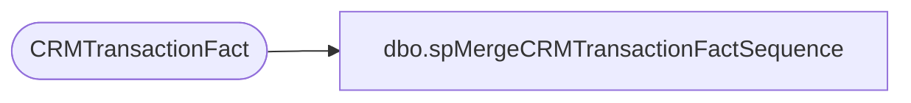

# dbo.spMergeCRMTransactionFactSequence

**Database:** dw  
**Server:** papamart  

## Architecture Diagram



## Table Dependencies

| Referenced Table |
|---|
| CRMTransactionFact |

## Stored Procedure Code

```sql
CREATE proc [dbo].[spMergeCRMTransactionFactSequence]

as 

--=====================================================================================================================--
--	Dan Tweedie	2021-03-18	Created Proc to run with CustomerTransactionETL.
--							For any customer with transactions staged (from past x days. normally 2) 
--							it will resequence their transaction and visit counters. This will help with dashboarding
--=====================================================================================================================--

set nocount on

IF (Object_ID('tempdb..#CustomerStage') IS NOT NULL) DROP TABLE #CustomerStage
select CustomerNumber
into #CustomerStage
from CRMTransactionFact 
where 
	isnull(LifeTimeTransactionSequence,0)=0
	or
	CRMTransactionType is null
	or
	(LifeTimeTransactionSequence=1 and CRMTransactionType<>'New')
	or
	(LifeTimeTransactionSequence<>1 and CRMTransactionType='New')
group by CustomerNumber

IF (Object_ID('tempdb..#MergeStage') IS NOT NULL) DROP TABLE #MergeStage;
With CustSeq as
	(
		select 
			ctf.customerNumber,
			ctf.transactionID,
			DENSE_RANK() OVER (partition by ctf.CustomerNumber ORDER BY cast(ctf.TransactionDate as date), TransactionID) as LifetimeTransactionSequence,
			DENSE_RANK() OVER (partition by ctf.CustomerNumber ORDER BY cast(ctf.TransactionDate as date)) as LifetimeVisitSequence
		from CRMTransactionFact ctf with (nolock)
		join #CustomerStage c on ctf.CustomerNumber=c.CustomerNumber
	)
select
	CustomerNumber,
	TransactionID,
	LifetimeTransactionSequence,
	LifetimeVisitSequence,
	case 
		when LifetimeTransactionSequence=1 
			then 'New' 
		else 'Repeat' 
	end as CRMTransactionType
into #MergeStage
from CustSeq

merge into CRMTransactionFact as target
using #MergeStage as source
	on 
		target.CustomerNumber=source.CustomerNumber 
		and
		target.TransactionID=source.TransactionID
when matched
	then update
		set 
			target.LifetimeTransactionSequence=source.LifetimeTransactionSequence,
			target.LifetimeVisitSequence=source.LifetimeVisitSequence,
			target.CRMTransactionType=source.CRMTransactionType
;


--select *
--from CRMTransactionFact
--where CustomerNumber='300522648'

--select *
--from #MergeStage
--where CustomerNumber='300522648'
```

