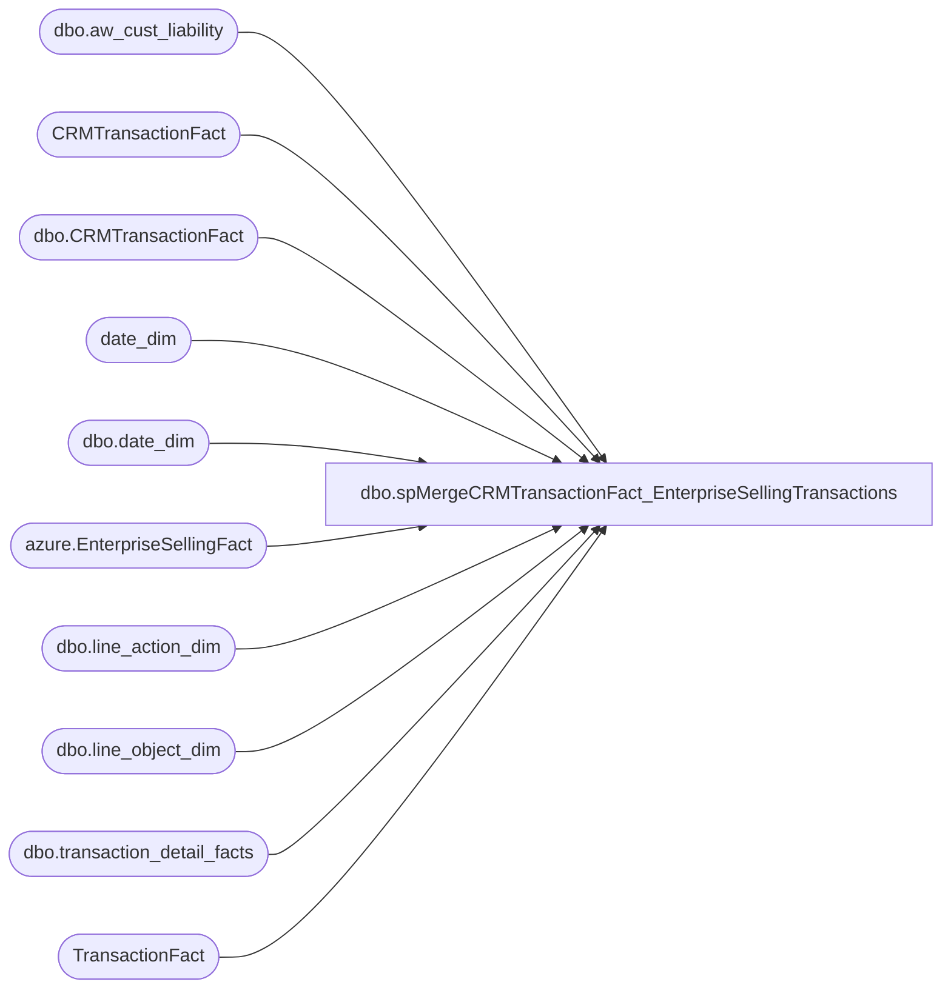

# dbo.spMergeCRMTransactionFact_EnterpriseSellingTransactions

**Database:** dw  
**Server:** papamart  

## Architecture Diagram



## Table Dependencies

| Referenced Table |
|---|
| dbo.aw_cust_liability |
| CRMTransactionFact |
| dbo.CRMTransactionFact |
| date_dim |
| dbo.date_dim |
| azure.EnterpriseSellingFact |
| dbo.line_action_dim |
| dbo.line_object_dim |
| dbo.transaction_detail_facts |
| TransactionFact |

## Stored Procedure Code

```sql
CREATE proc [dbo].[spMergeCRMTransactionFact_EnterpriseSellingTransactions] 

as 


--------------------------------------------------------------------------------------------------------------------------------------------------------------------------------
--	Dan Tweedie	2022-11-07	Created proc to merge Enterprise Selling Fulfillment Transactions into CRMTransactionFact, as they were not previously being included
--							The process captures the CustomerNumber from the ES Order transaction, then joins that to the ES Fulfillment transaction to post to CTF
--------------------------------------------------------------------------------------------------------------------------------------------------------------------------------

set nocount on

--es orders from past 30 days, for which we have the customer contained within CRMTransactionFact transaction 
--(the ES order transactions in CRMTransactionFact have 0 value, the transactions might contain normal transaction items with value, 
------but ES won't have gaap until the fulfillment)

if object_id('tempdb..#ESOrderCustomer') is not null drop table #ESOrderCustomer
select  
	esf.TransactionID,
	esf.ReferenceNumber,
	ctf.CustomerNumber
into #ESOrderCustomer
from azure.EnterpriseSellingFact esf with (nolock)
join CRMTransactionFact ctf on esf.TransactionID=ctf.TransactionID
where esf.ESAction = 'ordered'
and datediff(dd, esf.TransactionDate, getdate())<=30
--and ctf.CustomerNumber='919181264'
group by 
	esf.TransactionID,
	esf.ReferenceNumber,
	ctf.CustomerNumber

--es fulfillment transactions with customer number from the order transaction, excluding transactions already in CRMTransactionFact
if object_id('tempdb..#ESFulfillmentTran') is not null drop table #ESFulfillmentTran
select 
	c.CustomerNumber,
	esf.TransactionID
into #ESFulfillmentTran 
from azure.EnterpriseSellingFact esf with (nolock)
join #ESOrderCustomer c on esf.TransactionID<>c.TransactionID and esf.ReferenceNumber=c.ReferenceNumber
where ESAction in ('order delivered', 'order picked up','delivery returned')
and datediff(dd, esf.TransactionDate, getdate())<=14
and not exists (select ctf.TransactionID from CRMTransactionFact ctf with (nolock) where ctf.TransactionID=esf.TransactionID)
--and c.CustomerNumber='919181264'
and esf.transactionID not in ('491833252','491829232')
group by 
	c.CustomerNumber,
	esf.TransactionID

--dw es fulfillment transactions from past 14 days, also not in CRMTransactionFact
if object_id('tempdb..#DWESTrans') is not null drop table #DWESTrans
select 
	acl.reference_no, 
	tdf.transaction_id 
into #DWESTrans
from dwstaging.dbo.aw_cust_liability acl --will hold data captured from the morning Sales to DW processing, includes 90 days of transactions
join dw.dbo.transaction_detail_facts tdf with (nolock) on acl.reference_no collate SQL_Latin1_General_CP1_CI_AS = tdf.reference_no 
join dw.dbo.date_dim dd on tdf.date_key=dd.date_key
join dw.dbo.line_object_dim lod with (nolock) on tdf.line_object_key = lod.line_object_key
join dw.dbo.line_action_dim lad with (nolock) on tdf.line_action_key = lad.line_action_key
where lod.line_object = 106 --enterprise selling
and lad.line_action in (90, 142, 8) --fulfillment or cancel
and not exists (select ctf.TransactionID from CRMTransactionFact ctf with (nolock) where ctf.TransactionID=tdf.transaction_id) ---not really needed since we know the transactions aren't in CTF
and datediff(dd, dd.actual_date, getdate())<=14
--and tdf.transaction_id=460861267
group by acl.reference_no, tdf.transaction_id--, esc.CustomerNumber


if object_id('tempdb..#MergeStage') is not null drop table #MergeStage
select 
	dw.transaction_id as TransactionID,
	dw.transaction_id as CRMTransactionID,
	tf.store_key as StoreKey,
	cast(dd.actual_date as date) TransactionDate,
	cast(dd.actual_date as date) TransactionPostedDate,
	case 
		when exists (select ctf.CustomerNumber from CRMTransactionFact ctf where ctf.CustomerNumber=esc.CustomerNumber and ctf.TransactionID<dw.transaction_id) 
			then 'Repeat'
		else 'New'
	end as CRMTransactionType,
	tf.transaction_no as POSTransactionNumber,
	tf.register_no as POSRegisterNumber,
	esc.CustomerNumber,
	'1' as PointsEarned,
	'1' as ETLLogID,
	'1' as ETLEventID, 
	getdate() as InsertedDate,
	NULL as UpdatedDate,
	'BIAdmin - ESTrans' as InsertedBy,
	NULL as UpdatedBy,
	NULL as MNTH_01_12_VST_CNT,	
	NULL as MNTH_01_24_VST_CNT,	
	NULL as MNTH_01_36_VST_CNT,	
	NULL as daysSinceLastVisit,	
	NULL as numTransToday,	
	NULL as lifetimeVisitNumber,	
	tf.gaap_sales_amount as GaapSales,	
	tf.gaap_units as GaapUnits,	
	NULL as LifetimeTransactionSequence,	
	NULL as LifetimeVisitSequence
into #MergeStage
from #DWESTrans dw
join #ESFulfillmentTran es on dw.transaction_id=es.TransactionID
join #ESOrderCustomer esc on dw.reference_no collate SQL_Latin1_General_CP1_CI_AS =esc.ReferenceNumber
join TransactionFact tf on dw.transaction_id=tf.transaction_id
join date_dim dd on tf.date_key=dd.date_key
group by 
	dw.transaction_id,
	tf.store_key,
	cast(dd.actual_date as date),
	tf.transaction_no,
	tf.register_no,
	esc.CustomerNumber,
	tf.gaap_sales_amount,
	tf.gaap_units


;
MERGE into dw.dbo.CRMTransactionFact as target
		using 
			#MergeStage as source
		on
			(
				target.TransactionID = source.TransactionID
			)

		--when matched
		--	and 
		--		(
		--			isnull(target.GaapSales,0)<>isnull(source.GaapSales,0) or
		--			isnull(target.GaapUnits,0)<>isnull(source.GaapUnits,0) or 
		--			isnull(target.CRMTransactionID, 0) <> isnull(source.CRMTransactionID, 0) OR
		--			isnull(target.StoreKey, 0) <> isnull(source.StoreKey, 0) OR
		--			isnull(target.TransactionDate, '') <> isnull(source.TransactionDate, '') OR
		--			isnull(target.TransactionPostedDate, '') <> isnull(source.TransactionPostedDate, '') OR
		--			isnull(target.CRMTransactionType, '') <> isnull(source.CRMTransactionType, '') OR
		--			isnull(target.POSTransactionNumber, '') <> isnull(source.POSTransactionNumber, '') OR
		--			isnull(target.POSRegisterNumber, 0) <> isnull(source.POSRegisterNumber, 0) OR
		--			isnull(target.CustomerNumber, '') <> isnull(source.CustomerNumber, '') OR
		--			isnull(target.PointsEarned, 0) <> isnull(source.PointsEarned, 0) 
		--		)
		--		then UPDATE
		--			set
		--				target.GaapSales=source.GaapSales,
		--				target.GaapUnits=source.GaapUnits,
		--				target.CRMTransactionID = source.CRMTransactionID,
		--				target.StoreKey = source.StoreKey,
		--				target.TransactionDate = source.TransactionDate,
		--				target.TransactionPostedDate = source.TransactionPostedDate,
		--				target.CRMTransactionType = source.CRMTransactionType,
		--				target.POSTransactionNumber = source.POSTransactionNumber,
		--				target.POSRegisterNumber = source.POSRegisterNumber,
		--				target.CustomerNumber = source.CustomerNumber,
		--				target.PointsEarned = source.PointsEarned,
		--				target.UpdatedDate = source.InsertedDate,
		--				target.UpdatedBy = 'spCRMTransactionFactMergeES'

		when not matched by target
			then INSERT
				(
					TransactionID,
					GaapSales,
					GaapUnits,
					CRMTransactionID,
					StoreKey,
					TransactionDate,
					TransactionPostedDate,
					CRMTransactionType,
					POSTransactionNumber,
					POSRegisterNumber,
					CustomerNumber,
					PointsEarned,
					ETLLogID,
					ETLEventID,
					InsertedDate,
					UpdatedDate,
					InsertedBy,
					UpdatedBy
				)
			values
				(
					source.TransactionID,
					source.GaapSales,
					source.GaapUnits,
					source.CRMTransactionID,
					source.StoreKey,
					source.TransactionDate,
					source.TransactionPostedDate,
					source.CRMTransactionType,
					source.POSTransactionNumber,
					source.POSRegisterNumber,
					source.CustomerNumber,
					source.PointsEarned,
					source.ETLLogID,
					source.ETLEventID,
					source.InsertedDate,
					NULL,
					'spCRMTransactionFactMergeES',
					NULL
				)


;
```

