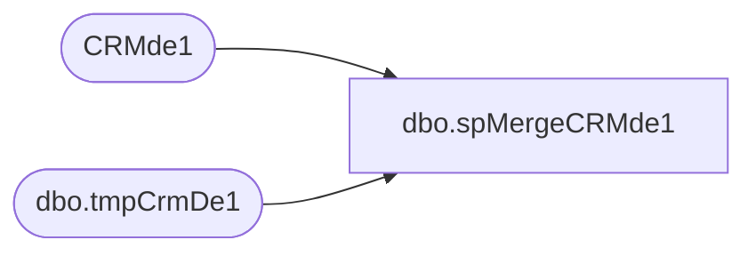

# dbo.spMergeCRMde1

**Database:** dw  
**Server:** papamart  

## Architecture Diagram



## Table Dependencies

| Referenced Table |
|---|
| CRMde1 |
| dbo.tmpCrmDe1 |

## Stored Procedure Code

```sql
-- =============================================
-- Author:		<Author,,Name>
-- Create date: <Create Date,,>
-- Description:	<Description,,>
-- =============================================
CREATE proc [dbo].[spMergeCRMde1]

as


set nocount on

merge into CRMde1 as target
using 
	(
	SELECT	 [CustomerNumber],
			 [EmailAddress],
			 [status],
			 [dateJoined],
			 [LastSentDate],
			 [LastOpenDate],
			 [LastClickDate],
			 [bonusClubMember],
			 [bonusClubMembershipType],
			 [bonusClubPointsBalance],
			 [hasOnlineAccount],
			 [bonusClubSignUpSource],
			 [Country],
			 [FrequencyCount3m],
			 [FrequencyCount6m],
			 [FrequencyCount12m],
			 [FrequencyCount18m],
			 [FrequencyCount24m],
			 [FrequencyCountTTL],
			 [RecencyCount3m],
			 [RecencyCount6m],
			 [RecencyCount12m],
			 [RecencyCount18m],
		     [RecencyCount24m],
			 [RecencyCountTTL],
			 [MonetarySum3m],
			 [MonetarySum6m],
			 [MonetarySum12m],
			 [MonetarySum18m],
			 [MonetarySum24m],
			 [MonetarySumTTL],
			 [FrequencyCount1m],
			 [RecencyCount1m],
			 [MonetarySum1m],
			 [address_1],
			 [address_2],
			 [address_3],
			 [address_4],
			 [post_code],
			 [mobile],
			 [locale],
			 [text_opt_in],
			 [LastTransactionDate],
			 [LastTransactionStore],
			 [PreferredStory]
		from dwstaging.dbo.tmpCrmDe1 with (nolock)
	) as source
on 
	target.customerNumber=source.CustomerNumber
when matched 
	and 
		isnull(target.[subscriberKey],'x')<>isnull(source.[EmailAddress],'x')
		or
		isnull(target.status,'x')<>isnull(source.status,'x')
		or
		isnull(target.[LastSentDate],'3030-12-31')<>isnull(source.[LastSentDate],'3030-12-31')
		or
		isnull(target.[LastOpenDate],'3030-12-31')<>isnull(source.[LastOpenDate],'3030-12-31')	 
		or
		isnull(target.[LastClickDate],'3030-12-31')<>isnull(source.[LastClickDate],'3030-12-31')
		or
		isnull(target.bonusClubMember,0)<>isnull(source.bonusClubMember,0)
		or 
		isnull(target.bonusClubMembershipType,'x')<>isnull(source.bonusClubMembershipType,'x')
		or
		isnull(target.[bonusClubPointsBalance],0)<>isnull(source.[bonusClubPointsBalance],0)
		or
		isnull(target.[hasOnlineAccount],0)<>isnull(source.[hasOnlineAccount],0)
		or
		isnull(target.[bonusClubSignUpSource],'x')<>isnull(source.[bonusClubSignUpSource],'x')	  
		or
		isnull(target.[Country],'x')<>isnull(source.[Country],'x')	  
		or
		isnull(target.[FrequencyCount3m],0)<>isnull(source.[FrequencyCount3m],0)
		or
		isnull(target.[FrequencyCount6m],0)<>isnull(source.[FrequencyCount6m],0)
		or
		isnull(target.[FrequencyCount12m],0)<>isnull(source. [FrequencyCount12m],0)
		or
		isnull(target.[FrequencyCount18m],0)<>isnull(source.	[FrequencyCount18m],0)  
		or
		isnull(target.[FrequencyCount24m],0)<>isnull(source.[FrequencyCount24m],0)
		or
		isnull(target.[FrequencyCountTTL],0)<>isnull(source.[FrequencyCountTTL],0)	 
		or
		isnull(target.[RecencyCount3m],0)<>isnull(source.[RecencyCount3m],0)	 
		or
		isnull(target.[RecencyCount6m],0)<>isnull(source.[RecencyCount6m],0)
		or
		isnull(target.[RecencyCount12m],0)<>isnull(source.[RecencyCount12m],0)
		or
		isnull(target.[RecencyCount18m],0)<>isnull(source.[RecencyCount18m],0)   
		or
		isnull(target.[RecencyCount24m],0)<>isnull(source.[RecencyCount24m],0)	  
		or
		isnull(target.[RecencyCountTTL],0)<>isnull(source.[RecencyCountTTL],0)	 
		or
		isnull(target.[MonetarySum3m],0)<>isnull(source.[MonetarySum3m],0)	  
		or
		isnull(target.[MonetarySum6m],0)<>isnull(source.[MonetarySum6m],0)	 
		or
		isnull(target.[MonetarySum12m],0)<>isnull(source.[MonetarySum12m],0)	  
		or
		isnull(target.[MonetarySum18m],0)<>isnull(source.[MonetarySum18m],0)	  
		or
		isnull(target.[MonetarySum24m],0)<>isnull(source.[MonetarySum24m],0)	  
		or
		isnull(target.[MonetarySumTTL],0)<>isnull(source.[MonetarySumTTL],0)	  
		or
		isnull(target.[FrequencyCount1m],0)<>isnull(source.[FrequencyCount1m],0)  
		or
		isnull(target.[RecencyCount1m],0)<>isnull(source.[RecencyCount1m],0)	  
		or
		isnull(target.[MonetarySum1m],0)<>isnull(source. [MonetarySum1m],0)
		or
		isnull(target.[address_1],'x')<>isnull(source.[address_1],'x')	 
		or
		isnull(target.[address_2],'x')<>isnull(source.[address_2],'x') 
		or
		isnull(target.[address_3],'x')<>isnull(source.[address_3],'x')	  
		or
		isnull(target.[address_4],'x')<>isnull(source.[address_4],'x')  
		or
		isnull(target.[post_code],'x')<>isnull(source.[post_code],'x')	  
		or
		isnull(target.[mobile],'x')<>isnull(source.[mobile],'x') 
		or
		isnull(target.[locale],'x')<>isnull(source.[locale],'x') 
		or
		isnull(target.[text_opt_in],0)<>isnull(source.[text_opt_in],0)
		or
		isnull(target.[LastTransactionDate],'3030-12-31')<>isnull(source.[LastTransactionDate],'3030-12-31')
		 or
		isnull(target.[LastTransactionStore],'x')<>isnull(source.[LastTransactionStore],'x')	
		  or
		isnull(target.[PreferredStory],'x')<>isnull(source.[PreferredStory],'x')	
		 
then update
	set
		target.subscriberKey=source.EmailAddress,
		target.emailAddress=source.EmailAddress,
		target.status=source.status,
		target.[LastSentDate]=source.[LastSentDate],
		target.[LastOpenDate]=source.[LastOpenDate],
		target.[LastClickDate]=source.[LastClickDate],
		target.bonusClubMember=source.bonusClubMember,
		target.bonusClubMembershipType=source.bonusClubMembershipType,
		target.[bonusClubPointsBalance]=source.[bonusClubPointsBalance],
		target.[hasOnlineAccount]=source.[hasOnlineAccount],
		target.[bonusClubSignUpSource]=source.[bonusClubSignUpSource],
		target.[Country]=source.[Country],
		target.[FrequencyCount3m]=source.[FrequencyCount3m],
		target.[FrequencyCount6m]=source.[FrequencyCount6m],
		target.[FrequencyCount12m]=source.[FrequencyCount12m],
		target.[FrequencyCount18m]=source.[FrequencyCount18m],
		target.[FrequencyCount24m]=source.[FrequencyCount24m],
		target.[FrequencyCountTTL]=source.[FrequencyCountTTL],
		target.[RecencyCount3m]=source.[RecencyCount3m],
		target.[RecencyCount6m]=source.[RecencyCount6m],
		target.[RecencyCount12m]=source.[RecencyCount12m],
		target.[RecencyCount18m]=source.[RecencyCount18m],
		target.[RecencyCount24m]=source.[RecencyCount24m],
		target.[RecencyCountTTL]=source.[RecencyCountTTL],
		target.[MonetarySum3m]=source.[MonetarySum3m],
		target.[MonetarySum6m]=source.[MonetarySum6m],
		target.[MonetarySum12m]=source.[MonetarySum12m],
		target.[MonetarySum18m]=source.[MonetarySum18m],
		target.[MonetarySum24m]=source.[MonetarySum24m],
		target.[MonetarySumTTL]=source.[MonetarySumTTL],
		target.[FrequencyCount1m]=source.[FrequencyCount1m],
		target.[RecencyCount1m]=source.[RecencyCount1m],
		target.[MonetarySum1m]=source.[MonetarySum1m],
		target.[address_1]=source.[address_1],
		target.[address_2]=source.[address_2],
		target.[address_3]=source.[address_3],
		target.[address_4]=source.[address_4],
		target.[post_code]=source.[post_code],
		target.[mobile]=source.[mobile],
		target.[locale]=source.[locale],
		target.[text_opt_in]=source.[text_opt_in],
		target.[LastTransactionDate]=source.[LastTransactionDate],
		target.[LastTransactionStore]=source.[LastTransactionStore],
		target.[PreferredStory]=source.[PreferredStory],
		target.UpdateDate=getdate()
when not matched by target
then insert
	(
	   [customerNumber],
       [SubscriberKey],
	   [emailAddress],
       [status],
       [dateJoined],
       [LastSentDate],
       [LastOpenDate],
       [LastClickDate],
       [bonusClubMember],
       [bonusClubMembershipType],
       [bonusClubPointsBalance],
       [hasOnlineAccount],
       [bonusClubSignUpSource],
       [Country],
       [FrequencyCount3m],
       [FrequencyCount6m],
       [FrequencyCount12m],
       [FrequencyCount18m],
       [FrequencyCount24m],
       [FrequencyCountTTL],
       [RecencyCount3m],
       [RecencyCount6m],
       [RecencyCount12m],
       [RecencyCount18m],
       [RecencyCount24m],
       [RecencyCountTTL],
       [MonetarySum3m],
       [MonetarySum6m],
       [MonetarySum12m],
       [MonetarySum18m],
       [MonetarySum24m],
       [MonetarySumTTL],
       [FrequencyCount1m],
       [RecencyCount1m],
       [MonetarySum1m],
       [address_1],
       [address_2],
       [address_3],
       [address_4],
       [post_code],
       [mobile],
       [locale],
       [text_opt_in],
       [InsertDate],
	   [LastTransactionDate],
	   [LastTransactionStore],
	   [PreferredStory]
	)
values
	(
       source.[CustomerNumber],
       source.[EmailAddress],
	   source.[EmailAddress],
       source.[status],
       source.[dateJoined],
       source.[LastSentDate],
       source.[LastOpenDate],
       source.[LastClickDate],
       source.[bonusClubMember],
       source.[bonusClubMembershipType],
       source.[bonusClubPointsBalance],
       source.[hasOnlineAccount],
       source.[bonusClubSignUpSource],
       source.[Country],
       source.[FrequencyCount3m],
       source.[FrequencyCount6m],
       source.[FrequencyCount12m],
       source.[FrequencyCount18m],
       source.[FrequencyCount24m],
       source.[FrequencyCountTTL],
       source.[RecencyCount3m],
       source.[RecencyCount6m],
       source.[RecencyCount12m],
       source.[RecencyCount18m],
       source.[RecencyCount24m],
       source.[RecencyCountTTL],
       source.[MonetarySum3m],
       source.[MonetarySum6m],
       source.[MonetarySum12m],
       source.[MonetarySum18m],
       source.[MonetarySum24m],
       source.[MonetarySumTTL],
       source.[FrequencyCount1m],
       source.[RecencyCount1m],
       source.[MonetarySum1m],
       source.[address_1],
       source.[address_2],
       source.[address_3],
       source.[address_4],
       source.[post_code],
       source.[mobile],
       source.[locale],
       source.[text_opt_in],
		getdate(),
	   source.[LastTransactionDate],
	   source.[LastTransactionStore],
	   source.[PreferredStory]
	)
--when not matched by source
--then delete
;
```

