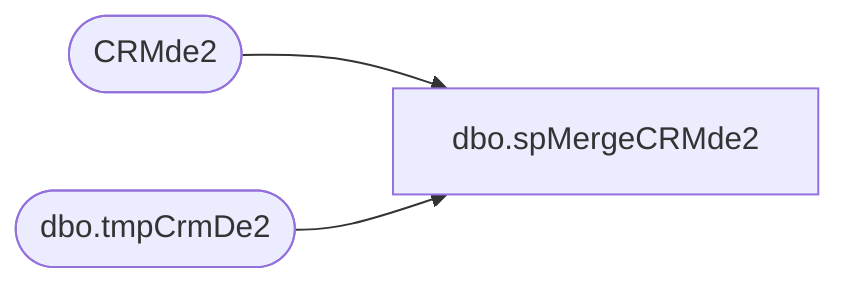

# dbo.spMergeCRMde2

**Database:** dw  
**Server:** papamart  

## Architecture Diagram



## Table Dependencies

| Referenced Table |
|---|
| CRMde2 |
| dbo.tmpCrmDe2 |

## Stored Procedure Code

```sql
CREATE proc [dbo].[spMergeCRMde2]

as


set nocount on

merge into CRMde2 as target
using 
	(
	SELECT	[CRMcustomerNumber],
      [bonusClubBdayAttribute],
      [bonusClubBdayRelationship],
      [bonusClubBdayDate]
  from dwstaging.dbo.tmpCrmDe2 with (nolock)
	) as source
on 
	target.customerNumber=source.CRMcustomerNumber
	and
	target.[bonusClubBdayAttribute]=source.[bonusClubBdayAttribute]
	and
	target.[bonusClubBdayRelationship]=source.[bonusClubBdayRelationship]
	and
	target.[bonusClubBdayDate]=source.[bonusClubBdayDate]

when matched 
		and 
		isnull(target.[bonusClubBdayAttribute],'x')<>isnull(source.[bonusClubBdayAttribute],'x')
		or 
		isnull(target.[bonusClubBdayRelationship],'x')<>isnull(source.[bonusClubBdayRelationship],'x')
	    or 
		isnull(target.[bonusClubBdayDate],'x')<>isnull(source.[bonusClubBdayDate],'x')
		
then update
	set
		target.[bonusClubBdayAttribute]=source.[bonusClubBdayAttribute],
		target.[bonusClubBdayRelationship]=source.[bonusClubBdayRelationship],
		target.[bonusClubBdayDate]=source.[bonusClubBdayDate],
		target.UpdateDate=getdate()
when not matched by target
then insert
	(
       [customerNumber],
       [bonusClubBdayAttribute],
       [bonusClubBdayRelationship],
       [bonusClubBdayDate],
	   [InsertDate]

	)
values
	(
       source.[CRMcustomerNumber],
       source.[bonusClubBdayAttribute],
       source.[bonusClubBdayRelationship],
       source.[bonusClubBdayDate],
	   getdate()
	)
when not matched by source
then delete
;


dbo,spGuestLoad_Update_Raw_Addr_Clnsd_ID,-- =============================================================================================================
-- Name: spGuestLoad_Update_Raw_Addr_Clnsd_ID
--
-- Description:	
--		There is no need to recleanse/regeocode an exact match to a previous raw address, so why waste the time.
--		So, when we done cleansing this batch, update the raw_addr_dim table with the associated clnsd_addr_id we
--		cleansed to.
--
--		In theory, this should speed up subsequent loads since we should have a proportion of previous raws coming in.
--		This definitely will speed up full reloads, since more than half the load time is just geocoding.
--
-- Input:
--		@etl_log_id			int	
--			Current load to process
--
-- Output: 
--
-- Dependencies: 
--
-- EXAMPLE:
--		exec dw.dbo.spGuestLoad_Update_Raw_Addr_Clnsd_ID 1
--
-- Revision History
--		Name:			Date:			Comments:
--		Dave Rice		7/19/2010		created
--		Dan Tweedie		08/20/2016		Altered proc to allow for bypass of QAS
-- =============================================================================================================

CREATE PROCEDURE [dbo].[spGuestLoad_Update_Raw_Addr_Clnsd_ID](@etl_log_id int)
AS
BEGIN

SET NOCOUNT ON;


-- remember, raw_addr_id was used as the stg_id into qas - BATCH_ADDR_STG
IF (Object_ID('tempdb..#raw_addr') IS NOT NULL) DROP TABLE #raw_addr
select distinct 
	c.raw_addr_id, 
	g.addr_ln_1_txt,
	isnull(g.addr_ln_2_txt,'') addr_ln_2_txt,
	isnull(g.apt_unit_nbr,'') apt_unit_nbr,
	g.pstl_cd,
	g.cntry_abbrv,
	case when substring(qas_rtrn_cd, 1, 2) != 'R9' then -1 else null end clnsd_addr_id
into #raw_addr
from dwstaging.dbo.LOAD_REC_ID_CNTRL c
	join dwstaging.dbo.BATCH_ADDR_STG g
	on g.stg_id = c.raw_addr_id
--	on g.stg_dta_set_cd = c.stg_dta_set_cd
--	and g.stg_id = c.raw_addr_id
where c.etl_log_id = @etl_log_id
create index ix_raw_addr on #raw_addr(addr_ln_1_txt, apt_unit_nbr, pstl_cd, cntry_abbrv)

-- grab more clnsd_addr recs than we need, we're just basing this on addr_ln_1 and pstl_cd
-- the goal is to use the index to get a subset of rows that we can than join on quickly below
IF (Object_ID('tempdb..#clnsd_addr') IS NOT NULL) DROP TABLE #clnsd_addr
select distinct 
	cad.clnsd_addr_id, 
	cad.addr_ln_1_txt, 
	isnull(cad.addr_ln_2_txt,'') addr_ln_2_txt,
	isnull(cad.apt_unit_nbr,'') apt_unit_nbr, 
	isnull(cad.st_prvnc_abbrv, '') st_prvnc_abbrv,
	cad.pstl_cd, 
	cad.cntry_abbrv
into #clnsd_addr
from dwstaging.dbo.BATCH_ADDR_STG g with (nolock)
	join dw.dbo.clnsd_addr_dim cad with (nolock)
	on cad.addr_ln_1_txt = g.addr_ln_1_txt
	and cad.pstl_cd = g.pstl_cd
create index ix_clnsd_addr on #clnsd_addr(addr_ln_1_txt, apt_unit_nbr, pstl_cd, cntry_abbrv)
--166586

-- Non-Puerto Rico
update #raw_addr
set clnsd_addr_id = cad.clnsd_addr_id
from #raw_addr rad
	join #clnsd_addr cad
	on cad.addr_ln_1_txt = rad.addr_ln_1_txt
	and cad.apt_unit_nbr = rad.apt_unit_nbr
	and cad.pstl_cd = rad.pstl_cd
	and cad.cntry_abbrv = rad.cntry_abbrv
where cad.st_prvnc_abbrv != 'PR'

-- Puerto Rico
update #raw_addr
set clnsd_addr_id = cad.clnsd_addr_id
from #raw_addr rad
	join #clnsd_addr cad
	on cad.addr_ln_1_txt = rad.addr_ln_1_txt
	and cad.addr_ln_2_txt = rad.addr_ln_2_txt
	and cad.apt_unit_nbr = rad.apt_unit_nbr
	and cad.pstl_cd = rad.pstl_cd
	and cad.cntry_abbrv = rad.cntry_abbrv
where cad.st_prvnc_abbrv = 'PR'

update raw_addr_dim
set clnsd_addr_id = t.clnsd_addr_id
from raw_addr_dim rad
	join #raw_addr t
	on t.raw_addr_id = rad.raw_addr_id
where rad.clnsd_addr_id is null

END
```

