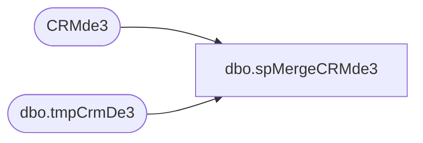

# dbo.spMergeCRMde3

**Database:** dw  
**Server:** papamart  

## Architecture Diagram



## Table Dependencies

| Referenced Table |
|---|
| CRMde3 |
| dbo.tmpCrmDe3 |

## Stored Procedure Code

```sql
CREATE proc [dbo].[spMergeCRMde3]

as


set nocount on

merge into CRMde3 as target
using 
	(
	SELECT	
      [CRMcustomerNumber],
      [transactionID],
      [purchaseDate],
      [purchaseChannel],
      [purchaseStoreNumber],
      [purchaseRevenue],
      [purchaseUnitCount],
      [stuffed],
      [unstuffed],
      [licensedORNot],
      [consumerGroup],
      [keyStory],
      [department],
      [Country],
	  [sku],
	  [Emailable]
  from dwstaging.dbo.tmpCrmDe3 with (nolock)
	) as source
on 
	--target.customerNumber=source.CRMcustomerNumber
	--and
	target.[transactionID]=source.[transactionID]
	and
	target.[keyStory]=source.[keyStory]
	and
	target.[consumerGroup]=source.[consumerGroup]
	and
	target.[department]=source.[department]
	and
	target.[sku]=source.[sku]

when matched 
	and 
		isnull(target.customerNumber,'x')<>isnull(source.CRMcustomerNumber,'x')
		or
		isnull(target.[purchaseRevenue],0)<>isnull(source.[purchaseRevenue],'x')
		or 
		isnull(target.[purchaseUnitCount],0)<>isnull(source.[purchaseUnitCount],0)
	    or 
		isnull(target.[Emailable],0)<>isnull(source.[Emailable],0)
		
then update
	set
		target.CustomerNumber=source.CRMcustomerNumber,
		target.[purchaseRevenue]=source.[purchaseRevenue],
		target.[purchaseUnitCount]=source.[purchaseUnitCount],
		target.[Emailable]=source.[Emailable],
		target.UpdateDate=getdate()
when not matched by target
then insert
	(
      [customerNumber],
      [transactionID],
      [purchaseDate],
      [purchaseChannel],
      [purchaseStoreNumber],
      [purchaseRevenue],
      [purchaseUnitCount],
      [stuffed],
      [unstuffed],
      [licensedORNot],
      [consumerGroup],
      [keyStory],
      [department],
      [Country],
	  [sku],
	  [Emailable],
	  [InsertDate]

	)
values
	(
      source.[CRMcustomerNumber],
      source.[transactionID],
      source.[purchaseDate],
      source.[purchaseChannel],
      source.[purchaseStoreNumber],
      source.[purchaseRevenue],
      source.[purchaseUnitCount],
      source.[stuffed],
      source.[unstuffed],
      source.[licensedORNot],
      source.[consumerGroup],
      source.[keyStory],
      source.[department],
      source.[Country],
	  source.[sku],
	  source.[Emailable],
	  getdate()
	)
--when not matched by source
--then delete
;
```

