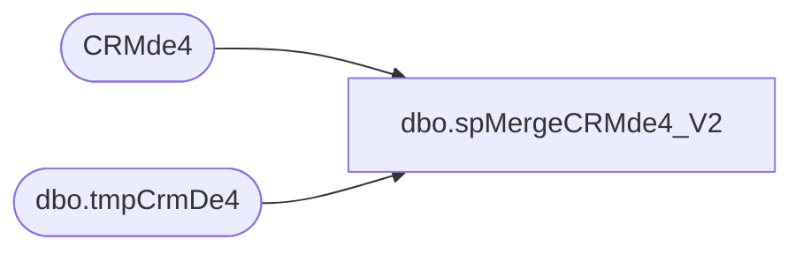

# dbo.spMergeCRMde4_V2

**Database:** dw  
**Server:** papamart  

## Architecture Diagram



## Table Dependencies

| Referenced Table |
|---|
| CRMde4 |
| dbo.tmpCrmDe4 |

## Stored Procedure Code

```sql
CREATE proc [dbo].[spMergeCRMde4_V2]

as


set nocount on

merge into CRMde4 as target
using 
	(
	SELECT	
	  [transactionID],
      isnull([units],0) as units,
      isnull([event_name],'') as event_name,
      isnull([category],'') as category,
      isnull([unit_gross_amount],0) as unit_gross_amount,
      isnull([coupon_desc],'') as coupon_desc,
	  isnull([couponNumber],'') as couponNumber,
	  isnull([certificateNumber],'') as certificateNumber
  from dwstaging.dbo.tmpCrmDe4 with (nolock)
	) as source
on 
	target.[transactionID]=source.[transactionID]
	and
	target.[units]=source.[units]
	and
	target.[event_name]=source.[event_name]
	and
	target.[category]=source.[category]
	and
	target.[unit_gross_amount]=source.[unit_gross_amount]
	and
	target.[coupon_desc]=source.[coupon_desc]
	and
	target.[couponNumber]=source.[couponNumber]
	and
	target.[certificateNumber]=source.[certificateNumber]

--when matched 
--	and 
--		--isnull(target.unit_gross_amount,0)<>isnull(source.unit_gross_amount,0)
--		--OR
--		isnull(target.[couponNumber],0)<>isnull(source.[couponNumber],0)	
--					or
--		isnull(target.[certificateNumber],'x')<>isnull(source.[certificateNumber],'x') 
		
--then update
--	set
--	target.[transactionID]=source.[transactionID],
--	target.[units]=source.[units],
--	target.[event_name]=source.[event_name],
--	target.[category]=source.[category],
--	target.[unit_gross_amount]=source.[unit_gross_amount],
--	target.[coupon_desc]=source.[coupon_desc],
--	target.[couponNumber]=source.[couponNumber],
--	target.[certificateNumber]=source.[certificateNumber],
--	target.[UpdateDate]=getdate()

when not matched by target
then insert
	(
	  [transactionID],
      [units],
      [event_name],
      [category],
      [unit_gross_amount],
      [coupon_desc],
	  [couponNumber],
	  [certificateNumber],
	  [InsertDate]
	)
values
	(
	  source.[transactionID],
      source.[units],
      source.[event_name],
      source.[category],
      source.[unit_gross_amount],
      source.[coupon_desc],
	  source.[couponNumber],
	  source.[certificateNumber],
	  getdate()
	)
--when not matched by source
--then delete
;
```

