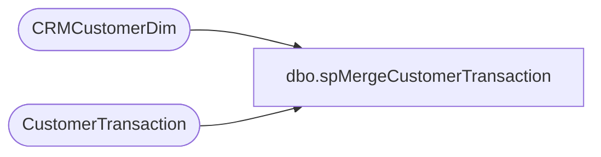

# dbo.spMergeCustomerTransaction

**Database:** dw  
**Server:** papamart  

## Architecture Diagram



## Table Dependencies

| Referenced Table |
|---|
| CRMCustomerDim |
| CustomerTransaction |

## Stored Procedure Code

```sql
CREATE proc [dbo].[spMergeCustomerTransaction] 

as

set nocount on
;

with 
Customerz as
	(
		select 
			max(c.CustomerNumber) CustomerNumber,
			c.EmailAddress
		from CRMCustomerDim c with (nolock) 
		--join CustomerTransaction ct with (nolock) on c.EmailAddress=ct.EmailAddress
		--where c.CustomerNumber<>ct.CustomerNumber
		group by c.EmailAddress
	) 
select 
	ct.CustomerNumber SACustomer,
	ct.TransactionID,
	ct.EmailAddress,
	c.CustomerNumber 
into #MergeStage
from CustomerTransaction ct
join Customerz c on ct.EmailAddress=c.EmailAddress
where not exists (select cd.CustomerNumber from CRMCustomerDim cd where ct.CustomerNumber=cd.CustomerNumber)
and exists (select cdd.EmailAddress from CRMCustomerDim cdd where cdd.EmailAddress=ct.EmailAddress)
UNION
select
	ct.CustomerNumber SACustomer,
	ct.TransactionID,
	ct.EmailAddress,
	c.CustomerNumber
from CustomerTransaction ct with (nolock)
join CRMCustomerDim c with (nolock) on ct.CustomerNumber=c.CustomerNumber
;
merge into CustomerTransaction as target
using
	(
		select 
			ct.TransactionID as TransactionID,
			ct.CustomerNumber as CustomerNumber
		from #MergeStage ct
	) as source
on 
	target.TransactionID=source.TransactionID
when matched
	and isnull(target.CustomerNumber,'x')<>isnull(source.CustomerNumber,'x')
		--or isnull(target.EmailAddress,'x')<>isnull(source.EmailAddress,'x')
	then update 
		set 
			target.CustomerNumber=source.CustomerNumber,
			--target.EmailAddress=source.EmailAddress,
			target.UpdateDate=getdate()
when not matched by target
	then insert
		(
			TransactionID,
			CustomerNumber,
			--EmailAddress,
			InsertDate
		)
	values 
		(
			source.TransactionID,
			source.CustomerNumber,
			--source.EmailAddress,
			getdate()
		)
;
```

