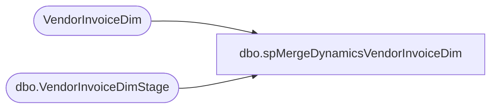

# dbo.spMergeDynamicsVendorInvoiceDim

**Database:** dw  
**Server:** papamart  

## Architecture Diagram



## Table Dependencies

| Referenced Table |
|---|
| VendorInvoiceDim |
| dbo.VendorInvoiceDimStage |

## Stored Procedure Code

```sql
CREATE proc [dbo].[spMergeDynamicsVendorInvoiceDim]

------------------------------------------------------------------------------------------------------------------------------------------
----Tim Callahan 	2021-09-10	Created proc to merge Vendor Master Payment data to DataWarehouse
----Tim Callahan	2022-10-24  Added additional fields to destination and staging tables and updated merge accordingly 
------------------------------------------------------------------------------------------------------------------------------------------

as

set nocount on

merge into VendorInvoiceDim as target
--using DWSTaging.dbo.VendorInvoiceDimStage as source 
using (

select 
VendorAccount, 
VendorName, 
SearchName, 
RemittanceEmail, 
RemittanceLocation, 
RemittanceAddress, 
MethodOfPayment, 
TermsOfPayment, 
StoreNumber, 
StoreName, 
Company, 
OffsetAccountDisplayValue, 
DefaultAccountLedger, 
CostCenter, 
BusinessStream, 
ProjectID, 
ProjectCategory

from DWStaging.dbo.VendorInvoiceDimStage
group by VendorAccount, 
VendorName, 
SearchName, 
RemittanceEmail, 
RemittanceLocation, 
RemittanceAddress, 
MethodOfPayment, 
TermsOfPayment, 
StoreNumber, 
StoreName, 
Company, 
OffsetAccountDisplayValue, 
DefaultAccountLedger, 
CostCenter, 
BusinessStream, 
ProjectID, 
ProjectCategory

) as source 

on (
		target.VendorAccount = source.VendorAccount
		and 
		target.StoreNumber = source.StoreNumber
		and
		target.Company = source.Company
		and 
		target.OffsetAccountDisplayValue = source.OffsetAccountDisplayValue -- Added 10/24/2022

	)
when matched and 
	(
		--target.VendorAccount<>source.VendorAccount or
		target.VendorName<>source.VendorName or 
		target.SearchName<>source.SearchName or 
		target.RemittanceEmail<>source.RemittanceEmail or 
		target.RemittanceLocation<>source.RemittanceLocation or
		target.RemittanceAddress<>source.RemittanceAddress or
		target.MethodOfPayment<>source.MethodOfPayment or
		target.TermsOfPayment<>source.TermsOfPayment or
		--target.StoreNumber<>source.StoreNumber or
		target.StoreName<>source.StoreName or
		--target.Company<>source.Company or		
		--isnull(target.OffsetAccountDisplayValue,'x') <> isnull(source.OffsetAccountDisplayValue,'x') or
		isnull(target.DefaultAccountLedger,'x')	<> isnull(source.DefaultAccountLedger,'x')	or
		isnull(target.CostCenter,'x')	<> isnull(source.CostCenter,'x')	or
		isnull(target.BusinessStream,'x')	<> isnull(source.BusinessStream,'x')	or
		isnull(target.ProjectID,'x')	<> isnull(source.ProjectID,'x')	or
		isnull(target.ProjectCategory,'x')	<> isnull(source.ProjectCategory,'x')

		
	)
then update 
	set 
		--target.VendorAccount=source.VendorAccount,
		target.VendorName=source.VendorName, 
		target.SearchName=source.SearchName, 
		target.RemittanceEmail=source.RemittanceEmail, 
		target.RemittanceLocation=source.RemittanceLocation,
		target.RemittanceAddress=source.RemittanceAddress,
		target.MethodOfPayment=source.MethodOfPayment,
		target.TermsOfPayment=source.TermsOfPayment,
		--target.StoreNumber=source.StoreNumber,
		target.StoreName=source.StoreName,
		--target.Company=source.Company,
		--target.OffsetAccountDisplayValue=source.OffsetAccountDisplayValue,
		target.DefaultAccountLedger=source.DefaultAccountLedger,
		target.CostCenter=source.CostCenter,
		target.BusinessStream=source.BusinessStream,
		target.ProjectID=source.ProjectID	,
		target.ProjectCategory=source.ProjectCategory,
		target.UpdateDate = getdate()
			
when not matched by target
then insert
	(
		VendorAccount, 
		VendorName, 
		SearchName, 
		RemittanceEmail, 
		RemittanceLocation, 
		RemittanceAddress, 
		MethodOfPayment, 
		TermsOfPayment, 
		StoreNumber, 
		StoreName, 
		Company,
		InsertDate,
		UpdateDate,
		OffsetAccountDisplayValue,
		DefaultAccountLedger,
		CostCenter,
		BusinessStream,
		ProjectID,
		ProjectCategory


	)
	values
	(
		source.VendorAccount, 
		source.VendorName, 
		source.SearchName, 
		source.RemittanceEmail, 
		source.RemittanceLocation, 
		source.RemittanceAddress, 
		source.MethodOfPayment, 
		source.TermsOfPayment, 
		source.StoreNumber, 
		source.StoreName, 
		source.Company,
		getdate(),
		NULL, 
		source.OffsetAccountDisplayValue,
		source.DefaultAccountLedger,
		source.CostCenter,
		source.BusinessStream,
		source.ProjectID,
		source.ProjectCategory
	)
;
```

