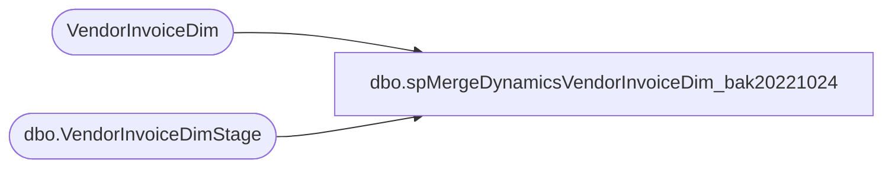

# dbo.spMergeDynamicsVendorInvoiceDim_bak20221024

**Database:** dw  
**Server:** papamart  

## Architecture Diagram



## Table Dependencies

| Referenced Table |
|---|
| VendorInvoiceDim |
| dbo.VendorInvoiceDimStage |

## Stored Procedure Code

```sql
create proc [dbo].[spMergeDynamicsVendorInvoiceDim_bak20221024]

----------------------------------------------------------------------------------------------------------------------------------------
--Tim Callahan 	2021-09-10	Created proc to merge Vendor Master Payment data to DataWarehouse
----------------------------------------------------------------------------------------------------------------------------------------

as

set nocount on

merge into VendorInvoiceDim as target
using DWSTaging.dbo.VendorInvoiceDimStage as source 

on (
		target.VendorAccount = source.VendorAccount
		and 
		target.StoreNumber = source.StoreNumber
		and
		target.Company = source.Company
	)
when matched and 
	(
		target.VendorAccount<>source.VendorAccount or
		target.VendorName<>source.VendorName or 
		target.SearchName<>source.SearchName or 
		target.RemittanceEmail<>source.RemittanceEmail or 
		target.RemittanceLocation<>source.RemittanceLocation or
		target.RemittanceAddress<>source.RemittanceAddress or
		target.MethodOfPayment<>source.MethodOfPayment or
		target.TermsOfPayment<>source.TermsOfPayment or
		target.StoreNumber<>source.StoreNumber or
		target.StoreName<>source.StoreName or
		target.Company<>source.Company
	)
then update 
	set 
		target.VendorAccount=source.VendorAccount,
		target.VendorName=source.VendorName, 
		target.SearchName=source.SearchName, 
		target.RemittanceEmail=source.RemittanceEmail, 
		target.RemittanceLocation=source.RemittanceLocation,
		target.RemittanceAddress=source.RemittanceAddress,
		target.MethodOfPayment=source.MethodOfPayment,
		target.TermsOfPayment=source.TermsOfPayment,
		target.StoreNumber=source.StoreNumber,
		target.StoreName=source.StoreName,
		target.Company=source.Company,
		target.UpdateDate = getdate()
			
when not matched by target
then insert
	(
		VendorAccount, 
		VendorName, 
		SearchName, 
		RemittanceEmail, 
		RemittanceLocation, 
		RemittanceAddress, 
		MethodOfPayment, 
		TermsOfPayment, 
		StoreNumber, 
		StoreName, 
		Company,
		InsertDate,
		UpdateDate

	)
	values
	(
		source.VendorAccount, 
		source.VendorName, 
		source.SearchName, 
		source.RemittanceEmail, 
		source.RemittanceLocation, 
		source.RemittanceAddress, 
		source.MethodOfPayment, 
		source.TermsOfPayment, 
		source.StoreNumber, 
		source.StoreName, 
		source.Company,
		getdate(),
		NULL
	)
;
```

