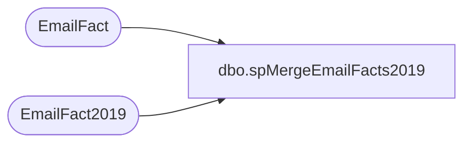

# dbo.spMergeEmailFacts2019

**Database:** dw  
**Server:** papamart  

## Architecture Diagram



## Table Dependencies

| Referenced Table |
|---|
| EmailFact |
| EmailFact2019 |

## Stored Procedure Code

```sql
CREATE proc [dbo].[spMergeEmailFacts2019]
as

set nocount on
-----------------------------------------------------------
--	Dan Tweedie	2018-12-18	Created proc 
-----------------------------------------------------------

merge into EmailFact2019 as target
using 
	(
		select *
		from EmailFact with (nolock)
		where datepart(yyyy, SendDate) = 2019
		and datediff(dd, isnull(UpdateDate, InsertDate), getdate()) <= 3
	)
		as source 
on 
	(
		target.ClientID=source.ClientID 
		AND	target.SendID=source.SendID
		AND target.SubscriberKey=source.SubscriberKey
		AND target.EmailAddress=source.EmailAddress
	)
when matched 
	and 
		(
			isnull(target.SendDate, '3030-12-31') <> isnull(source.SendDate, '3030-12-31')
			OR
			isnull(target.BounceDate, '3030-12-31') <> isnull(source.BounceDate, '3030-12-31')
			OR
			isnull(target.UnSubDate, '3030-12-31') <> isnull(source.UnSubDate, '3030-12-31')
			OR
			isnull(target.OpenDate, '3030-12-31') <> isnull(source.OpenDate, '3030-12-31')
			OR
			isnull(target.ClickDate, '3030-12-31') <> isnull(source.ClickDate, '3030-12-31')
		)
then update
	set
		target.SendDate=source.SendDate,
		target.BounceDate=source.BounceDate,
		target.ClickDate=source.ClickDate,
		target.UnSubDate=source.UnSubDate,
		target.OpenDate=source.OpenDate,
		target.UpdateDate=getdate()

when not matched by target
	then insert 
		(
			ClientID,
			SendID,
			SubscriberKey,
			EmailAddress,
			SendDate,
			BounceDate,
			ClickDate,
			UnSubDate,
			OpenDate,
			InsertDate
		)
	values
		(
			source.ClientID,
			source.SendID,
			source.SubscriberKey,
			source.EmailAddress,
			source.SendDate,
			source.BounceDate,
			source.ClickDate,
			source.UnSubDate,
			source.OpenDate,
			getdate()
		)

;
```

