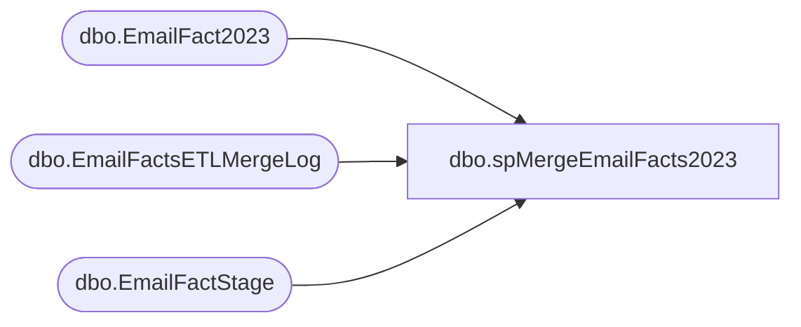

# dbo.spMergeEmailFacts2023

**Database:** dw  
**Server:** papamart  

## Architecture Diagram



## Table Dependencies

| Referenced Table |
|---|
| dbo.EmailFact2023 |
| dbo.EmailFactsETLMergeLog |
| dbo.EmailFactStage |

## Stored Procedure Code

```sql
CREATE proc [dbo].[spMergeEmailFacts2023]

as 

----------------------------------------------------------------------------------------------------------------
--	Ian Wallace	2023-02-08	Created proc, runs at end of SSIS package to move data from Kodiak.ESPStaging to DW
----------------------------------------------------------------------------------------------------------------


set nocount on

merge into dw.dbo.EmailFact2023 as target
Using (
		select 
			ClientID,
			SendID,
			min(SendDate) SendDate,
			EmailAddress,
			BounceDate,
			ClickDate,
			UnSubDate,
			OpenDate,
			FrequencyCount1m,
			FrequencyCount3m,
			FrequencyCount6m,
			FrequencyCount12m,
			FrequencyCount18m,
			FrequencyCount24m,
			FrequencyCountTtl,
			RecencyCount1m,
			RecencyCount3m,
			RecencyCount6m,
			RecencyCount12m,
			RecencyCount24m,
			RecencyCountTtl,
			MonetarySum1m,
			MonetarySum3m,
			MonetarySum6m,
			MonetarySum12m,
			MonetarySum18m,
			MonetarySum24m,
			MonetarySumTtl,
			AudienceSeg,
			LastPurchaseDate,
			clickCount,
			StoreName
		from DWStaging.dbo.EmailFactStage 
		group by 
			ClientID,
			SendID,
			EmailAddress,
			BounceDate,
			ClickDate,
			UnSubDate,
			OpenDate,
			FrequencyCount1m,
			FrequencyCount3m,
			FrequencyCount6m,
			FrequencyCount12m,
			FrequencyCount18m,
			FrequencyCount24m,
			FrequencyCountTtl,
			RecencyCount1m,
			RecencyCount3m,
			RecencyCount6m,
			RecencyCount12m,
			RecencyCount24m,
			RecencyCountTtl,
			MonetarySum1m,
			MonetarySum3m,
			MonetarySum6m,
			MonetarySum12m,
			MonetarySum18m,
			MonetarySum24m,
			MonetarySumTtl,
			AudienceSeg,
			LastPurchaseDate,
			clickCount,
			StoreName
	)as source
on 
	(
		target.ClientID=source.ClientID
		and
		target.SendID=source.SendID
		and
		--target.SubscriberKey = source.SubscriberKey
		--and
		target.EmailAddress=source.EmailAddress
	)
when matched 
	and
		(
			isnull(target.BounceDate,'3030-12-31')<>isnull(source.BounceDate,'3030-12-31') OR
			isnull(target.ClickDate,'3030-12-31')<>isnull(source.ClickDate,'3030-12-31') OR
			isnull(target.UnSubDate,'3030-12-31')<>isnull(source.UnSubDate,'3030-12-31') OR 
			isnull(target.OpenDate,'3030-12-31')<>isnull(source.OpenDate,'3030-12-31') OR
			isnull(target.FrequencyCount1m,0)<>isnull(source.FrequencyCount1m,0) OR
			isnull(target.FrequencyCount3m,0)<>isnull(source.FrequencyCount3m,0) OR
			isnull(target.FrequencyCount6m,0)<>isnull(source.FrequencyCount6m,0) OR
			isnull(target.FrequencyCount12m,0)<>isnull(source.FrequencyCount12m,0) OR
			isnull(target.FrequencyCount18m,0)<>isnull(source.FrequencyCount18m,0) OR
			isnull(target.FrequencyCount24m,0)<>isnull(source.FrequencyCount24m,0) OR
			isnull(target.FrequencyCountTtl,0)<>isnull(source.FrequencyCountTtl,0) OR
			isnull(target.RecencyCount1m,0)<>isnull(source.RecencyCount1m,0) OR
			isnull(target.RecencyCount3m,0)<>isnull(source.RecencyCount3m,0) OR
			isnull(target.RecencyCount6m,0)<>isnull(source.RecencyCount6m,0) OR
			isnull(target.RecencyCount12m,0)<>isnull(source.RecencyCount12m,0) OR
			isnull(target.RecencyCount24m,0)<>isnull(source.RecencyCount24m,0) OR
			isnull(target.RecencyCountTtl,0)<>isnull(source.RecencyCountTtl,0) OR
			isnull(target.MonetarySum1m,0)<>isnull(source.MonetarySum1m,0) OR
			isnull(target.MonetarySum3m,0)<>isnull(source.MonetarySum3m,0) OR
			isnull(target.MonetarySum6m,0)<>isnull(source.MonetarySum6m,0) OR
			isnull(target.MonetarySum12m,0)<>isnull(source.MonetarySum12m,0) OR
			isnull(target.MonetarySum18m,0)<>isnull(source.MonetarySum18m,0) OR
			isnull(target.MonetarySum24m,0)<>isnull(source.MonetarySum24m,0) OR
			isnull(target.MonetarySumTtl,0)<>isnull(source.MonetarySumTtl,0) OR
			isnull(target.AudienceSeg,'x')<>isnull(source.AudienceSeg,'x') OR
			isnull(target.LastPurchaseDate,'3030-12-31')<>isnull(source.LastPurchaseDate,'3030-12-31') OR
			isnull(target.clickCount,0)<>isnull(source.clickCount,0) OR
			isnull(target.StoreName,'x')<>isnull(source.StoreName,'x')
			--isnull(target.LastPurchaseChan,'x')<>isnull(source.LastPurchaseChan,'x')  OR
			--isnull(target.PreferredStory,'x')<>isnull(source.PreferredStory,'x')  
			--isnull(target.SubscriberID,0)<>isnull(source.SubscriberID,0)
		)
	then 
		UPDATE
			SET
				target.BounceDate=source.BounceDate,
				target.ClickDate=source.ClickDate,
				target.UnSubDate=source.UnSubDate,
				target.OpenDate=source.OpenDate,
				target.FrequencyCount1m=source.FrequencyCount1m,
				target.FrequencyCount3m=source.FrequencyCount3m,
				target.FrequencyCount6m=source.FrequencyCount6m,
				target.FrequencyCount12m=source.FrequencyCount12m,
				target.FrequencyCount18m=source.FrequencyCount18m,
				target.FrequencyCount24m=source.FrequencyCount24m,
				target.FrequencyCountTtl=source.FrequencyCountTtl,
				target.RecencyCount1m=source.RecencyCount1m,
				target.RecencyCount3m=source.RecencyCount3m,
				target.RecencyCount6m=source.RecencyCount6m,
				target.RecencyCount12m=source.RecencyCount12m,
				target.RecencyCount24m=source.RecencyCount24m,
				target.RecencyCountTtl=source.RecencyCountTtl,
				target.MonetarySum1m=source.MonetarySum1m,
				target.MonetarySum3m=source.MonetarySum3m,
				target.MonetarySum6m=source.MonetarySum6m,
				target.MonetarySum12m=source.MonetarySum12m,
				target.MonetarySum18m=source.MonetarySum18m,
				target.MonetarySum24m=source.MonetarySum24m,
				target.MonetarySumTtl=source.MonetarySumTtl,
				target.AudienceSeg=source.AudienceSeg,
				target.LastPurchaseDate=source.LastPurchaseDate,
				target.clickCount=source.clickCount,
				target.StoreName=source.StoreName,
				--target.LastPurchaseChan=source.LastPurchaseChan,
				--target.PreferredStory=source.PreferredStory,
				--target.SubscriberID=source.SubscriberID,
				target.UpdateDate=getdate()
when NOT MATCHED by Target
	then
		Insert
			(
				ClientID,
				SendID,
				--SubscriberKey,
				SendDate,
				EmailAddress,
				BounceDate,
				ClickDate,
				UnSubDate,
				OpenDate,
				FrequencyCount1m,
				FrequencyCount3m,
				FrequencyCount6m,
				FrequencyCount12m,
				FrequencyCount18m,
				FrequencyCount24m,
				FrequencyCountTtl,
				RecencyCount1m,
				RecencyCount3m,
				RecencyCount6m,
				RecencyCount12m,
				RecencyCount24m,
				RecencyCountTtl,
				MonetarySum1m,
				MonetarySum3m,
				MonetarySum6m,
				MonetarySum12m,
				MonetarySum18m,
				MonetarySum24m,
				MonetarySumTtl,
				AudienceSeg,
				LastPurchaseDate,
				clickCount,
				StoreName,
				--LastPurchaseChan,
				--PreferredStory,
				--SubscriberID,
				InsertDate
			)
		values
			(
				source.ClientID,
				source.SendID,
				--source.SubscriberKey,
				source.SendDate,
				source.EmailAddress,
				source.BounceDate,
				source.ClickDate,
				source.UnSubDate,
				source.OpenDate,
				source.FrequencyCount1m,
				source.FrequencyCount3m,
				source.FrequencyCount6m,
				source.FrequencyCount12m,
				source.FrequencyCount18m,
				source.FrequencyCount24m,
				source.FrequencyCountTtl,
				source.RecencyCount1m,
				source.RecencyCount3m,
				source.RecencyCount6m,
				source.RecencyCount12m,
				source.RecencyCount24m,
				source.RecencyCountTtl,
				source.MonetarySum1m,
				source.MonetarySum3m,
				source.MonetarySum6m,
				source.MonetarySum12m,
				source.MonetarySum18m,
				source.MonetarySum24m,
				source.MonetarySumTtl,
				source.AudienceSeg,
				source.LastPurchaseDate,
				source.clickCount,
				source.StoreName,
				--source.LastPurchaseChan,
				--source.PreferredStory,
				--source.SubscriberID,
				getdate()
			)

;

begin --we simply want ability to query this table to verify job ran
	insert DWStaging.dbo.EmailFactsETLMergeLog
	select getdate(), 1
end
```

