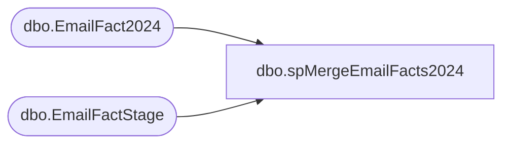

# dbo.spMergeEmailFacts2024

**Database:** dw  
**Server:** papamart  

## Architecture Diagram



## Table Dependencies

| Referenced Table |
|---|
| dbo.EmailFact2024 |
| dbo.EmailFactStage |

## Stored Procedure Code

```sql
CREATE proc [dbo].[spMergeEmailFacts2024]

as 

----------------------------------------------------------------------------------------------------------------
--	Ian Wallace	2023-02-08	Created proc, runs at end of SSIS package to move data from Kodiak.ESPStaging to DW
----------------------------------------------------------------------------------------------------------------


	select 
			ClientID,
			SendID,
			min(SendDate) SendDate,
			EmailAddress,
			BounceDate,
			ClickDate,
			UnSubDate,
			OpenDate,
			FrequencyCount1m,
			FrequencyCount3m,
			FrequencyCount6m,
			FrequencyCount12m,
			FrequencyCount18m,
			FrequencyCount24m,
			FrequencyCountTtl,
			RecencyCount1m,
			RecencyCount3m,
			RecencyCount6m,
			RecencyCount12m,
			RecencyCount24m,
			RecencyCountTtl,
			MonetarySum1m,
			MonetarySum3m,
			MonetarySum6m,
			MonetarySum12m,
			MonetarySum18m,
			MonetarySum24m,
			MonetarySumTtl,
			AudienceSeg,
			LastPurchaseDate,
			clickCount,
			StoreName
		into #Stage
		from DWStaging.dbo.EmailFactStage
		group by 
			ClientID,
			SendID,
			EmailAddress,
			BounceDate,
			ClickDate,
			UnSubDate,
			OpenDate,
			FrequencyCount1m,
			FrequencyCount3m,
			FrequencyCount6m,
			FrequencyCount12m,
			FrequencyCount18m,
			FrequencyCount24m,
			FrequencyCountTtl,
			RecencyCount1m,
			RecencyCount3m,
			RecencyCount6m,
			RecencyCount12m,
			RecencyCount24m,
			RecencyCountTtl,
			MonetarySum1m,
			MonetarySum3m,
			MonetarySum6m,
			MonetarySum12m,
			MonetarySum18m,
			MonetarySum24m,
			MonetarySumTtl,
			AudienceSeg,
			LastPurchaseDate,
			clickCount,
			StoreName


create unique index NCI_ClientIDSendIDEmail on #Stage
(
	ClientID,
	SendID,
	EmailAddress
)
include 
	(	
		BounceDate,
		ClickDate,
		UnSubDate,
		OpenDate,
		FrequencyCount1m,
		FrequencyCount3m,
		FrequencyCount6m,
		FrequencyCount12m,
		FrequencyCount18m,
		FrequencyCount24m,
		FrequencyCountTtl,
		RecencyCount1m,
		RecencyCount3m,
		RecencyCount6m,
		RecencyCount12m,
		RecencyCount24m,
		RecencyCountTtl,
		MonetarySum1m,
		MonetarySum3m,
		MonetarySum6m,
		MonetarySum12m,
		MonetarySum18m,
		MonetarySum24m,
		MonetarySumTtl,
		AudienceSeg,
		LastPurchaseDate,
		clickCount,
		StoreName
	)

set nocount on

merge into dw.dbo.EmailFact2024 as target
Using #Stage as source
on 
	(
		target.ClientID=source.ClientID
		and
		target.SendID=source.SendID
		and
		target.EmailAddress=source.EmailAddress
	)
when matched 
	and
		(
			isnull(target.BounceDate,'3030-12-31')<>isnull(source.BounceDate,'3030-12-31') OR
			isnull(target.ClickDate,'3030-12-31')<>isnull(source.ClickDate,'3030-12-31') OR
			isnull(target.UnSubDate,'3030-12-31')<>isnull(source.UnSubDate,'3030-12-31') OR 
			isnull(target.OpenDate,'3030-12-31')<>isnull(source.OpenDate,'3030-12-31') OR
			isnull(target.FrequencyCount1m,0)<>isnull(source.FrequencyCount1m,0) OR
			isnull(target.FrequencyCount3m,0)<>isnull(source.FrequencyCount3m,0) OR
			isnull(target.FrequencyCount6m,0)<>isnull(source.FrequencyCount6m,0) OR
			isnull(target.FrequencyCount12m,0)<>isnull(source.FrequencyCount12m,0) OR
			isnull(target.FrequencyCount18m,0)<>isnull(source.FrequencyCount18m,0) OR
			isnull(target.FrequencyCount24m,0)<>isnull(source.FrequencyCount24m,0) OR
			isnull(target.FrequencyCountTtl,0)<>isnull(source.FrequencyCountTtl,0) OR
			isnull(target.RecencyCount1m,0)<>isnull(source.RecencyCount1m,0) OR
			isnull(target.RecencyCount3m,0)<>isnull(source.RecencyCount3m,0) OR
			isnull(target.RecencyCount6m,0)<>isnull(source.RecencyCount6m,0) OR
			isnull(target.RecencyCount12m,0)<>isnull(source.RecencyCount12m,0) OR
			isnull(target.RecencyCount24m,0)<>isnull(source.RecencyCount24m,0) OR
			isnull(target.RecencyCountTtl,0)<>isnull(source.RecencyCountTtl,0) OR
			isnull(target.MonetarySum1m,0)<>isnull(source.MonetarySum1m,0) OR
			isnull(target.MonetarySum3m,0)<>isnull(source.MonetarySum3m,0) OR
			isnull(target.MonetarySum6m,0)<>isnull(source.MonetarySum6m,0) OR
			isnull(target.MonetarySum12m,0)<>isnull(source.MonetarySum12m,0) OR
			isnull(target.MonetarySum18m,0)<>isnull(source.MonetarySum18m,0) OR
			isnull(target.MonetarySum24m,0)<>isnull(source.MonetarySum24m,0) OR
			isnull(target.MonetarySumTtl,0)<>isnull(source.MonetarySumTtl,0) OR
			isnull(target.AudienceSeg,'x')<>isnull(source.AudienceSeg,'x') OR
			isnull(target.LastPurchaseDate,'3030-12-31')<>isnull(source.LastPurchaseDate,'3030-12-31') OR
			isnull(target.clickCount,0)<>isnull(source.clickCount,0) OR
			isnull(target.StoreName,'x')<>isnull(source.StoreName,'x')
			--isnull(target.LastPurchaseChan,'x')<>isnull(source.LastPurchaseChan,'x')  OR
			--isnull(target.PreferredStory,'x')<>isnull(source.PreferredStory,'x')  
			--isnull(target.SubscriberID,0)<>isnull(source.SubscriberID,0)
		)
	then 
		UPDATE
			SET
				target.BounceDate=source.BounceDate,
				target.ClickDate=source.ClickDate,
				target.UnSubDate=source.UnSubDate,
				target.OpenDate=source.OpenDate,
				target.FrequencyCount1m=source.FrequencyCount1m,
				target.FrequencyCount3m=source.FrequencyCount3m,
				target.FrequencyCount6m=source.FrequencyCount6m,
				target.FrequencyCount12m=source.FrequencyCount12m,
				target.FrequencyCount18m=source.FrequencyCount18m,
				target.FrequencyCount24m=source.FrequencyCount24m,
				target.FrequencyCountTtl=source.FrequencyCountTtl,
				target.RecencyCount1m=source.RecencyCount1m,
				target.RecencyCount3m=source.RecencyCount3m,
				target.RecencyCount6m=source.RecencyCount6m,
				target.RecencyCount12m=source.RecencyCount12m,
				target.RecencyCount24m=source.RecencyCount24m,
				target.RecencyCountTtl=source.RecencyCountTtl,
				target.MonetarySum1m=source.MonetarySum1m,
				target.MonetarySum3m=source.MonetarySum3m,
				target.MonetarySum6m=source.MonetarySum6m,
				target.MonetarySum12m=source.MonetarySum12m,
				target.MonetarySum18m=source.MonetarySum18m,
				target.MonetarySum24m=source.MonetarySum24m,
				target.MonetarySumTtl=source.MonetarySumTtl,
				target.AudienceSeg=source.AudienceSeg,
				target.LastPurchaseDate=source.LastPurchaseDate,
				target.clickCount=source.clickCount,
				target.StoreName=source.StoreName,
				--target.LastPurchaseChan=source.LastPurchaseChan,
				--target.PreferredStory=source.PreferredStory,
				--target.SubscriberID=source.SubscriberID,
				target.UpdateDate=getdate()
when NOT MATCHED by Target
	then
		Insert
			(
				ClientID,
				SendID,
				--SubscriberKey,
				SendDate,
				EmailAddress,
				BounceDate,
				ClickDate,
				UnSubDate,
				OpenDate,
				FrequencyCount1m,
				FrequencyCount3m,
				FrequencyCount6m,
				FrequencyCount12m,
				FrequencyCount18m,
				FrequencyCount24m,
				FrequencyCountTtl,
				RecencyCount1m,
				RecencyCount3m,
				RecencyCount6m,
				RecencyCount12m,
				RecencyCount24m,
				RecencyCountTtl,
				MonetarySum1m,
				MonetarySum3m,
				MonetarySum6m,
				MonetarySum12m,
				MonetarySum18m,
				MonetarySum24m,
				MonetarySumTtl,
				AudienceSeg,
				LastPurchaseDate,
				clickCount,
				StoreName,
				--LastPurchaseChan,
				--PreferredStory,
				--SubscriberID,
				InsertDate
			)
		values
			(
				source.ClientID,
				source.SendID,
				--source.SubscriberKey,
				source.SendDate,
				source.EmailAddress,
				source.BounceDate,
				source.ClickDate,
				source.UnSubDate,
				source.OpenDate,
				source.FrequencyCount1m,
				source.FrequencyCount3m,
				source.FrequencyCount6m,
				source.FrequencyCount12m,
				source.FrequencyCount18m,
				source.FrequencyCount24m,
				source.FrequencyCountTtl,
				source.RecencyCount1m,
				source.RecencyCount3m,
				source.RecencyCount6m,
				source.RecencyCount12m,
				source.RecencyCount24m,
				source.RecencyCountTtl,
				source.MonetarySum1m,
				source.MonetarySum3m,
				source.MonetarySum6m,
				source.MonetarySum12m,
				source.MonetarySum18m,
				source.MonetarySum24m,
				source.MonetarySumTtl,
				source.AudienceSeg,
				source.LastPurchaseDate,
				source.clickCount,
				source.StoreName,
				--source.LastPurchaseChan,
				--source.PreferredStory,
				--source.SubscriberID,
				getdate()
			)

;

--begin --we simply want ability to query this table to verify job ran
--	insert DWStaging.dbo.EmailFactsETLMergeLog
--	select getdate(), 1
--end

dbo,spCOA,CREATE                                                                       
--CREATE

PROCEDURE [dbo].[spCOA]   -- [sp_Select_COA_Address]
	/* ===== ARGUMENTS ===== */
	@1_CalendarYear int  = NULL, 
	@2_CalendarMonth int = NULL

AS
SET NOCOUNT ON


SELECT
  dbo.vwStore_dimBO6.store_id,
  dbo.date_dim.actual_date,
  dbo.vwTRN_KSK_FACT.ANML_BRTH_DT ,
  dbo.vwTRN_KSK_FACT.ANML_BARCD_NBR,
  dbo.product_dim.sku,
  dbo.vwGST_SUM_FACT.FRST_NM + ' ' + dbo.vwGST_SUM_FACT.LAST_NM,
  rtrim(isnull(TOR_CLNSD_ADDR.ADDR_LN_1_TXT,'') + ' ' +
isnull(TOR_CLNSD_ADDR.APT_UNIT_NBR,'') + ' ' +
isnull(TOR_CLNSD_ADDR.ADDR_LN_2_TXT,'') + ' ' +
isnull(TOR_CLNSD_ADDR.ADDR_LN_3_TXT,'') + ' ' +
isnull(TOR_CLNSD_ADDR.ADDR_LN_4_TXT,'') + ' ' +
isnull(TOR_CLNSD_ADDR.ADDR_LN_5_TXT,'')),
  TOR_CLNSD_ADDR.CTY_NM,
  TOR_CLNSD_ADDR.PSTL_CD,
  TOR_CLNSD_ADDR.PSTL_PLS_4_CD,
  TOR_CLNSD_ADDR.CNTRY_ABBRV
FROM
  dbo.vwTRN_KSK_FACT  with (nolock) 
	join  dbo.vwGST_SUM_FACT  with (nolock) on 
	( dbo.vwGST_SUM_FACT.CLNSD_GST_ID=dbo.vwTRN_KSK_FACT.CLNSD_GST_ID  ) 
	join   dbo.vwADDR_SUM_FACT  TOR_CLNSD_ADDR on 
	( dbo.vwTRN_KSK_FACT.TOR_CLNSD_ADDR_ID=TOR_CLNSD_ADDR.CLNSD_ADDR_ID  )
	join   dbo.product_dim with (nolock) on 
    ( dbo.vwTRN_KSK_FACT.PRDCT_ID=dbo.product_dim.product_key  )
	join  dbo.vwStore_dimBO6  with (nolock) on 
	( dbo.vwTRN_KSK_FACT.STR_ID=dbo.vwStore_dimBO6.store_key  )
	join dbo.date_dim  with (nolock) on 
    ( dbo.vwTRN_KSK_FACT.DT_ID=dbo.date_dim.date_key  )
WHERE   TOR_CLNSD_ADDR.CLNSD_ADDR_ID  >  0
  AND  dbo.vwGST_SUM_FACT.CLNSD_GST_ID  >  0
  AND  dbo.date_dim.year  =  @1_CalendarYear
  AND  dbo.date_dim.month  =  @2_CalendarMonth
  AND  dbo.product_dim.class  IN  ('Limited/Wwf/License', 'Limited/Wwf/Licensed', 'Uk-Limited/Wwf/Licen')

dbo,spPOS_Select_SingleItemCoSell_SideXSide,
CREATE   
--PROCEDURE [dbo].[spPOS_Select_MultiItemCoSell]
PROCEDURE [dbo].[spPOS_Select_SingleItemCoSell_SideXSide]

	/* ===== ARGUMENTS ===== */
	@1_StartDate 	datetime, 
	@2_EndDate 	datetime,
	@1stItem	INT,
	@2ndItem	INT =NULL,
	@3rdItem	INT =NULL,
	@4thItem	INT =NULL,
	@5thItem	INT =NULL,
	@6thItem	INT =NULL

AS

SET NOCOUNT ON

--transaction info for the Prim skus
IF (Object_ID('tempdb.dbo.##PrimTrans1') IS NOT NULL) DROP TABLE dbo.##PrimTrans1

select
cast(tdf.transaction_id as varchar(20)) + ':' + cast(p.SKU as varchar(20)) UniqueID, 
 tdf.transaction_id, tdf.store_key, tdf.date_key, tdf.register_num, tdf.tender_group_key, 
tdf.product_key PrimProdKey, p.sku PrimSKU,tdf.units, tdf.unit_gross_amount
into dbo.##PrimTrans1
from transaction_detail_facts tdf  with (nolock)
	join date_dim dd on tdf.date_key = dd.date_key 
join dbo.product_dim p  with (nolock) on p.product_key = tdf.product_key 
where transaction_line_seq >= 0 
and dd.actual_date >= @1_StartDate AND dd.actual_date <= @2_EndDate 
and p.sku in (@1stItem, @2ndItem, @3rdItem,@4thItem, @5thItem,@6thItem )
--and dd.actual_date >= '4/5/2009' AND dd.actual_date <= '7/4/2009' 
--and p.sku in (10076,10077,14778)

/*
and dd.actual_date >= @1_StartDate AND dd.actual_date <= @2_EndDate 
--and p.sku in (@1stItem, @2ndItem)
and ((p.sku = @1stItem  and @2ndItem is null and @3rdItem is null 
and @4thItem is null  and @5thItem is null and @6thItem is null)
or (p.sku in (@1stItem, @2ndItem) and @3rdItem is null 
and @4thItem is null  and @5thItem is null and @6thItem is null)
or (p.sku in (@1stItem, @2ndItem, @3rdItem) and @4thItem is null 
 and @5thItem is null and @6thItem is null)
or (p.sku in (@1stItem, @2ndItem, @3rdItem,@4thItem) and @5thItem is null 
and @6thItem is null)
or (p.sku in (@1stItem, @2ndItem, @3rdItem,@4thItem, @5thItem) and @6thItem is null)
or (p.sku in (@1stItem, @2ndItem, @3rdItem,@4thItem, @5thItem,@6thItem )))
*/


--get total SKU units and SKU uga for each Prim transaction

IF (Object_ID('tempdb.dbo.##PrimTrans') IS NOT NULL) DROP TABLE dbo.##PrimTrans

select tdf.UniqueID, count(transaction_id) NoOfPrimSKURecs, tdf.transaction_id, tdf.store_key, tdf.date_key, tdf.register_num, tdf.tender_group_key, 
tdf.PrimProdKey, tdf.PrimSKU,sum(tdf.units) TotalPrimSKUUnits, sum(tdf.unit_gross_amount) TotalPrimSKUUGA
into ##PrimTrans
from dbo.##PrimTrans1 tdf
group by tdf.UniqueID,tdf.transaction_id, tdf.store_key, tdf.date_key, tdf.register_num, tdf.tender_group_key, 
tdf.PrimProdKey, tdf.PrimSKU
--select * from ##PrimTrans

IF (Object_ID('tempdb.dbo.##SecTrans1') IS NOT NULL) DROP TABLE dbo.##SecTrans1

select pt.PrimSKU,
cast(tdf.transaction_id as varchar(20)) + ':' + cast(p.SKU as varchar(20)) UniqueID, 
tdf.transaction_id, tdf.store_key, tdf.date_key, tdf.register_num, tdf.tender_group_key, 
tdf.product_key, p.department,p.subclass,p.SKU,	p.product_desc,tdf.units, 
CASE 	WHEN tdf.product_key NOT IN (-700,-701,-710,-711,-712,-713,-714,-9,-7,-18) 
THEN tdf.unit_gross_amount
ELSE 0 END as uga
into ##SecTrans1
from transaction_detail_facts tdf  with (nolock)
join dbo.product_dim p  with (nolock) on p.product_key = tdf.product_key 
join ##PrimTrans pt  with (nolock) on tdf.transaction_id = pt.transaction_id
where tdf.transaction_id in (select transaction_id from ##PrimTrans)
and transaction_line_seq >= 0

IF (Object_ID('tempdb.dbo.##SecTrans') IS NOT NULL) DROP TABLE dbo.##SecTrans

select PrimSKU,UniqueID,
count(transaction_id ) NoOfTDFRecords, 
transaction_id, store_key, date_key, register_num, tender_group_key, 
product_key, department,subclass,SKU,product_desc,sum(units) Units, sum(uga) UGA
into ##SecTrans
from ##SecTrans1
group by 
PrimSKU,UniqueID,transaction_id, store_key, date_key, register_num, tender_group_key, 
product_key, department,subclass,SKU,product_desc

IF (Object_ID('tempdb.dbo.##MultiplePrimSKUsInTrans') IS NOT NULL) DROP TABLE dbo.##MultiplePrimSKUsInTrans

select * 
into ##MultiplePrimSKUsInTrans
from ##SecTrans where UniqueID in 
(select UniqueID from ##SecTrans
group by UniqueID having count(PrimSKU) > 1)
order by UniqueID

-- select top 3 * from ##MultiplePrimSKUsInTrans

IF (Object_ID('tempdb.dbo.##DedupMultiple_##MinPrimSKUsInTrans') IS NOT NULL) 
DROP TABLE dbo.##DedupMultiple_##MinPrimSKUsInTrans

Select min(PrimSKU) PrimSKU ,UniqueID,NoOfTDFRecords,
transaction_id, store_key, date_key, register_num, tender_group_key, 
product_key, department,subclass,SKU,product_desc,Units,UGA
into ##DedupMultiple_##MinPrimSKUsInTrans
from ##MultiplePrimSKUsInTrans 
group by 
UniqueID,NoOfTDFRecords,
transaction_id, store_key, date_key, register_num, tender_group_key, 
product_key, department,subclass,SKU,product_desc,Units,UGA

IF (Object_ID('tempdb.dbo.##AllTrans') IS NOT NULL) DROP TABLE dbo.##AllTrans

select * 
into ##AllTrans
from ##SecTrans where UniqueID in 
(select UniqueID from ##SecTrans
group by UniqueID having count(PrimSKU) = 1)
union all 
select * from ##DedupMultiple_##MinPrimSKUsInTrans
order by UniqueID

--determine total transaction UGA and SKU count for these transactions
IF (Object_ID('tempdb.dbo.##TransUGASxS') IS NOT NULL) DROP TABLE dbo.##TransUGASxS

select tdf.transaction_id, tdf.store_key, tdf.date_key, tdf.register_num ,-- tdf.tender_group_key, 
 count(distinct SKU) TransSKUCount, sum(uga) TotalTransUGA
into ##TransUGASxS
from ##AllTrans tdf
group by tdf.transaction_id, tdf.store_key, tdf.date_key, tdf.register_num --, tdf.tender_group_key
--select * from ##TransUGASxS

IF (Object_ID('tempdb..##tsfSxS') IS NOT NULL) DROP TABLE ##tsfSxS

select t.transaction_id,t.store_key,t.date_key,t.register_no,
IsNull((Bear_Buck_Tender + Gift_Card_Tender + Reward_Cert_Tender + BuyStuff_Tender),0) TtlRedemptions,
IsNull((discounts + coupon_amt),0) TtlDiscounts 
into ##tsfSxS
from dbo.Transaction_Summary_Facts t 	
join ##PrimTrans pt on 
t.transaction_id = pt.transaction_id
and t.date_key = pt.date_key
and t.store_key = pt.store_key
and t.register_no = pt.register_num 
group by t.transaction_id,t.store_key,t.date_key,t.register_no,
(Bear_Buck_Tender + Gift_Card_Tender + Reward_Cert_Tender + BuyStuff_Tender),
(discounts + coupon_amt)  
order by t.transaction_id

--select top 3 * from ##AllTrans
IF (Object_ID('tempdb..##AllTransTtlHoneySxS') IS NOT NULL) DROP TABLE ##AllTransTtlHoneySxS

select s.*,u.TotalTransUGA,t.TtlRedemptions,t.TtlDiscounts,
(u.TotalTransUGA+t.TtlRedemptions+ t.TtlDiscounts) TtlHoney, u.TransSKUCount,
 ((u.TotalTransUGA+t.TtlRedemptions+ t.TtlDiscounts)/u.TransSKUCount) TtlHoneyBySKU
into ##AllTransTtlHoneySxS
from 
##AllTrans s with (nolock)  
join ##tsfSxS t with (nolock) on 
s.transaction_id = t.transaction_id 
and s.store_key = t.store_key
and s.date_key = t.date_key 
and s.register_num = t.register_no  
join ##TransUGASxS u with (nolock) on 
s.transaction_id = u.transaction_id 
and s.store_key = u.store_key
and s.date_key = u.date_key 
and s.register_num = u.register_num


--$$--$$--$$
/*
select
PrimSKU,transaction_id, store_key, date_key, register_num, tender_group_key, 
product_key, department,subclass,SKU,product_desc,units, uga
 from ##AllTransTtlHoney --where sku = 14778
where PrimSKU = 10076 
group by PrimSKU,transaction_id, store_key, date_key, register_num, tender_group_key, 
product_key, department,subclass,SKU,product_desc,units, uga

*/


IF (Object_ID('tempdb..##AllTransTtlHoney2') IS NOT NULL) DROP TABLE ##AllTransTtlHoney2

select s.*,u.TotalTransUGA,t.TtlRedemptions,t.TtlDiscounts,
(u.TotalTransUGA+t.TtlRedemptions+ t.TtlDiscounts) TtlHoney, u.TransSKUCount,
 ((u.TotalTransUGA+t.TtlRedemptions+ t.TtlDiscounts)/u.TransSKUCount) TtlHoneyBySKU
into ##AllTransTtlHoney2
from 
##SecTrans s with (nolock)  
join ##tsfSxS t with (nolock) on 
s.transaction_id = t.transaction_id 
and s.store_key = t.store_key
and s.date_key = t.date_key 
and s.register_num = t.register_no  
join ##TransUGASxS u with (nolock) on 
s.transaction_id = u.transaction_id 
and s.store_key = u.store_key
and s.date_key = u.date_key 
and s.register_num = u.register_num


IF (Object_ID('tempdb..##TtlHoney2') IS NOT NULL) DROP TABLE ##TtlHoney2

select PrimSKU,sum(TtlHoneyBySKU) TtlHoney 
into ##TtlHoney2
from ##AllTransTtlHoney2
group by PrimSKU


IF (Object_ID('tempdb..##HoneyBySKU2') IS NOT NULL) DROP TABLE ##HoneyBySKU2

select 	department,subclass,SKU,product_desc,
	count(distinct transaction_id) TransCnt,
	sum(Units) TotalUnits,
	sum(TtlHoneyBySKU) as TtlHoneyBySKU 
into ##HoneyBySKU2
from ##AllTransTtlHoney2
group by department,subclass,sku,product_desc


IF (Object_ID('tempdb..##SKU_HPG2') IS NOT NULL) DROP TABLE ##SKU_HPG2

select h.PrimSKU,s.product_desc,s.TransCnt,s.TotalUnits, h.TtlHoney,
(h.TtlHoney/s.TransCnt) HPG 
into ##SKU_HPG2
	 from ##HoneyBySKU2 s join ##TtlHoney2 h on 
s.SKU = h.PrimSKU


--Select * from ##HoneyBySKU2 
--order by TtlHoneyBySKU desc

Select * from ##SKU_HPG2


select 	department,subclass,sku,product_desc,
	count(distinct transaction_id) TransCnt,
	sum(Units) TotalUnits,
	sum(TtlHoneyBySKU) as TtlHoneyBySKU 
from ##AllTransTtlHoney2
--where PrimSKU = 10076 
where PrimSKU = @1stItem  
/*
and sku in ( 14778,10076,582)
*/
group by department,subclass,sku,product_desc
--order by TtlHoneyBySKU desc


select 	department,subclass,sku,product_desc,
	count(distinct transaction_id) TransCnt,
	sum(Units) TotalUnits,
	sum(TtlHoneyBySKU) as TtlHoneyBySKU 
from ##AllTransTtlHoney2
--where PrimSKU = 10077 
where PrimSKU = @2ndItem  
group by department,subclass,sku,product_desc

select 	department,subclass,sku,product_desc,
	count(distinct transaction_id) TransCnt,
	sum(Units) TotalUnits,
	sum(TtlHoneyBySKU) as TtlHoneyBySKU 
from ##AllTransTtlHoney2
--where PrimSKU = 14778 
where PrimSKU = @3rdItem  
group by department,subclass,sku,product_desc

select 	department,subclass,sku,product_desc,
	count(distinct transaction_id) TransCnt,
	sum(Units) TotalUnits,
	sum(TtlHoneyBySKU) as TtlHoneyBySKU 
from ##AllTransTtlHoney2
--where PrimSKU = 14778 
where PrimSKU = @4thItem  
group by department,subclass,sku,product_desc

select 	department,subclass,sku,product_desc,
	count(distinct transaction_id) TransCnt,
	sum(Units) TotalUnits,
	sum(TtlHoneyBySKU) as TtlHoneyBySKU 
from ##AllTransTtlHoney2
--where PrimSKU = 14778 
where PrimSKU = @5thItem  
group by department,subclass,sku,product_desc

select 	department,subclass,sku,product_desc,
	count(distinct transaction_id) TransCnt,
	sum(Units) TotalUnits,
	sum(TtlHoneyBySKU) as TtlHoneyBySKU 
from ##AllTransTtlHoney2
--where PrimSKU = 14778 
where PrimSKU = @6thItem  
group by department,subclass,sku,product_desc
```

