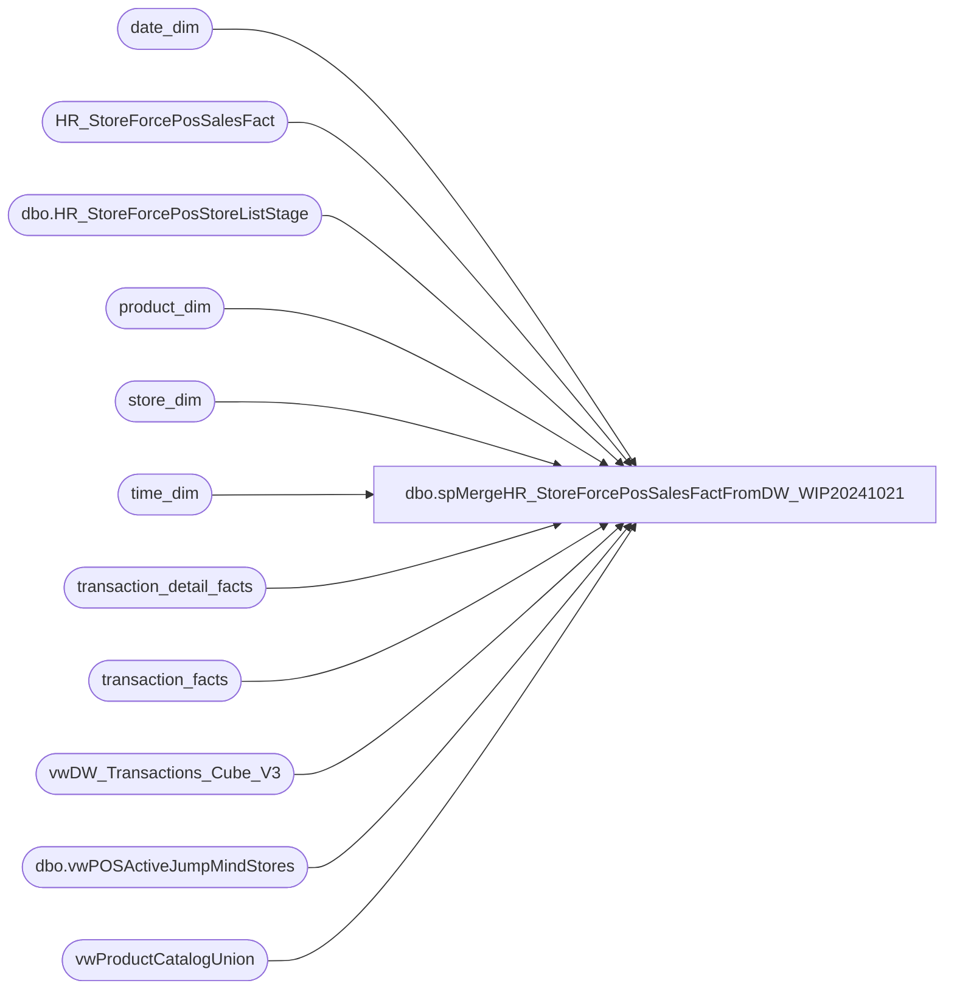

# dbo.spMergeHR_StoreForcePosSalesFactFromDW_WIP20241021

**Database:** dw  
**Server:** papamart  

## Architecture Diagram



## Table Dependencies

| Referenced Table |
|---|
| date_dim |
| HR_StoreForcePosSalesFact |
| dbo.HR_StoreForcePosStoreListStage |
| product_dim |
| store_dim |
| time_dim |
| transaction_detail_facts |
| transaction_facts |
| vwDW_Transactions_Cube_V3 |
| dbo.vwPOSActiveJumpMindStores |
| vwProductCatalogUnion |

## Stored Procedure Code

```sql
CREATE proc [dbo].[spMergeHR_StoreForcePosSalesFactFromDW_WIP20241021]
@StartDate date,
@EndDate date


as 

--=============================================================================================================================================================================================
--	Dan Tweedie	2019-04-18	Created proc - Data is destined for StoreForce system, which accepts flash sales data throughout the day, and DW sales data nightly. 
--												This proc will consistently merge DW data into the outbound stage table so when CSV is created for nightly file, no customization is needed
--	Dan Tweedie	2021-02-10 Updated to include new bopis measures
--	Dan Tweedie 2022-12-09	Updated merge update so if the CRMTransactionFact has not processed today, it will not update the BonusClubTran value
--  Dan Tweedie	2023-05-01	Updated do SaleTran, SaleValue, SaleUnits does not include bopis
--	Dan Tweedie	2024-10-21	Updated to include stuffers, skins
--=============================================================================================================================================================================================

set nocount on


IF (Object_ID('tempdb..#SFStyleLookup1') IS NOT null) DROP TABLE #SFStyleLookup1;
select a.ProductNumber, a.ProductDescription, a.Department, a.DepartmentCode, a.ProductSellingGeography, a.ItemType,
	case 
		when a.ProductNumber in ('427634','427582','427152','426821','426749','426378','426369','426286','426259','426219','426132','425617','425354','425152','424965','424685','424443','424286','424244','422963','422962','422824','422823','422049','421816','421815','420551','420550','415836','127634','127582','127152','126821','126749','126378','126286','126132','125617','125354','125152','124965','124685','124443','124244','122824','122823','122049','121816','121815','120551','120550','027634','027582','027217','027152','026980','026838','026821','026749','026603','026378','026369','026286','026166','026132','025617','025354','025152','024965','024685','024443','024290','024286','024244','023842','023834','022889','022888','022887','022886','022831','022830','022829','022828','022824','022823','022141','022049','021816','021815','020559','020558','020557','020556','020555','020554','020553','020552','020551','020550','018194','017295','015833','015831','015830','015281','014258','031829','027765','026378','025617','030306','031696','031659','028925','028552','025354','028895','022831','022830','022888','030394','027217','026603','022829','030418','028855','022886','026166','031977','022887','031451','031510','031408','031059','026915','024290','030174','028741','032063','028559','029984','026749','022824','028403','026980','027910','024244','021815','022141','032078','032096','032008','028473','027582','028405','027893','027634','029842','024965','026838','030548','131829','127765','126378','125617','130306','131696','131659','128925','128552','125354','128895','130394','130418','131977','131451','131408','131059','130174','128741','132063','129984','126749','122824','128403','127910','124244','121815','132078','132008','128473','127582','128405','127893','127634','129842','124965','130548','431829','427765','426378','425617','430306','431696','431659','428925','428552','425354','428895','430394','430418','431977','431451','431408','431059','430174','428741','432063','429984','426749','422824','428403','427910','424244','421815','432078','432008','428473','427582','428405','427893','427634','429842','424965','430548','426369','422963','422962','432067')
			then 1
		else 0
	end as isBackpack,
	case when a.Department='Stuffers' then 1 else 0 end as isStuffer,
	case when a.Department in ('Unstuffed','Stuffed') then 1 else 0 end as isSkin
into #SFStyleLookup1
from vwProductCatalogUnion a
group by a.ProductNumber, a.ProductDescription, a.Department, a.DepartmentCode, a.ProductSellingGeography, a.ItemType;


IF (Object_ID('tempdb..#SFStyleLookup') IS NOT null) DROP TABLE #SFStyleLookup;
select pd.product_key, a.*
into #SFStyleLookup
from #SFStyleLookup1 a
left join product_dim pd on a.ProductNumber=pd.style_code and a.ProductSellingGeography=pd.jurisdiction_code;


BEGIN

		IF (Object_ID('tempdb..#StoreDateTime') IS NOT null) DROP TABLE #StoreDateTime;

		with 
		AllTime (Slot) as
		(
					select '00:00'	UNION	select '00:30'	UNION	select '01:00'	UNION	select '01:30'	UNION	select '02:00'	UNION	select '02:30'	UNION	select '03:00'	UNION	select '03:30'
			UNION	select '04:00'	UNION	select '04:30'	UNION	select '05:00'	UNION	select '05:30'	UNION	select '06:00'	UNION	select '06:30'	UNION	select '07:00'	UNION	select '07:30'
			UNION	select '08:00'	UNION	select '08:30'	UNION	select '09:00'	UNION	select '09:30'	UNION	select '10:00'	UNION	select '10:30'	UNION	select '11:00'	UNION	select '11:30'
			UNION	select '12:00'	UNION	select '12:30'	UNION	select '13:00'	UNION	select '13:30'	UNION	select '14:00'	UNION	select '14:30'	UNION	select '15:00'  UNION	select '15:30'
			UNION	select '16:00'	UNION	select '16:30'	UNION	select '17:00'	UNION	select '17:30'	UNION	select '18:00'	UNION	select '18:30'	UNION	select '19:00'	UNION	select '19:30'
			UNION	select '20:00'	UNION	select '20:30'	UNION	select '21:00'	UNION	select '21:30'	UNION	select '22:00'	UNION	select '22:30'	UNION	select '23:00'	UNION	select '23:30'
		),
		DateTimes as
		(
			select distinct
				cast(dd.actual_date as date) as RawDate,
				convert(varchar, dd.actual_date, 103) as Date,
				alt.Slot
			from date_dim dd with (nolock) 
			cross join AllTime alt
			where (
					(datepart(hh,getdate())>2 and cast(dd.actual_date as date) between @StartDate and @EndDate)
					or (datepart(hh,getdate())<=2 and cast(dd.actual_date as date)=cast(getdate()-1 as date))
					)
		)
			select 
				dt.RawDate,
				dt.Date,
				sl.LocationCode as StoreCode,
				dt.Slot,
				sl.StoreID as StoreCodeRaw
			into #StoreDateTime
			from dwStaging.dbo.HR_StoreForcePosStoreListStage sl
			cross join DateTimes dt
			UNION
			select 
				dt.RawDate,
				dt.Date,
				--right(concat(cast('0000' as varchar), jm.StoreID),4) as StoreCode,
				business_unit_id as StoreCode,
				dt.Slot,
				jm.StoreID as StoreCodeRaw
			from dw.dbo.vwPOSActiveJumpMindStores jm
			cross join DateTimes dt;
	
		IF (Object_ID('tempdb..#DistinctSToreCode') IS NOT null) DROP TABLE #DistinctSToreCode;
		select distinct StoreCode,StoreCodeRaw
		into #DistinctSToreCode
		from #StoreDateTime
		where (datepart(hh, getdate())>2 and StoreCodeRaw>0)
		OR (datepart(hh, getdate())<=2 and StoreCodeRaw<2000) ---EXCLUDES UK WHEN IT RUNS BETWEEN 12AM AND 2AM BECAUSE IT MESSES UP THE SALES TOTAL SOMEHOW FOR UK DURING THIS TIME
	;

		--PARTY
		IF (Object_ID('tempdb..#PartyCounts') IS NOT null) DROP TABLE #PartyCounts;
				select 
					ss.StoreCode,
					--ss.LocationCode as StoreCode,
					cast(dd.actual_date as date) as RawDate,
					convert(varchar, dd.actual_date, 103) as Date,
					right((cast('00' as varchar) + cast(td.hour as varchar)),2)
						+ ':' + case when td.Minute < 30 then '00' else '30' end as Slot,
					count(distinct tf.party_key) as PartyCount
				into #PartyCounts
				from transaction_facts tf with (nolock)
				join store_dim sd with (nolock) on tf.store_key=sd.store_key
				--join dwStaging.dbo.HR_StoreForcePosStoreListStage ss on sd.store_id=ss.StoreID
				join #DistinctStoreCode ss on sd.store_id=ss.StoreCodeRaw 
				join date_dim dd with (nolock) on tf.date_key=dd.date_key
				join time_dim td with (nolock) on tf.time_key=td.time_key
				where 1=1
				and tf.party_key <> 0
				and (
						(datepart(hh,getdate())>2 and cast(dd.actual_date as date) between @StartDate and @EndDate)
						or (datepart(hh,getdate())<=2 and cast(dd.actual_date as date)=cast(getdate()-1 as date))
					)
				group by 
					ss.StoreCode,
					--ss.LocationCode,
					cast(dd.actual_date as date),
					convert(varchar, dd.actual_date, 103),
					right((cast('00' as varchar) + cast(td.hour as varchar)),2)
						+ ':' + case when td.Minute < 30 then '00' else '30' end 
			
			--BACKPACK		
			IF (Object_ID('tempdb..#Backpacks') IS NOT null) DROP TABLE #Backpacks;
				select 
					ss.StoreCode,
					cast(dd.actual_date as date) as RawDate,
					convert(varchar, dd.actual_date, 103) as Date,
					right((cast('00' as varchar) + cast(td.hour as varchar)),2)
						+ ':' + case when td.Minute < 30 then '00' else '30' end as Slot,
					--sum(tdf.unit_gross_amount-tdf.unit_disc_amount) as BackPackSales,
					count(distinct tdf.transaction_id) as BackPackTransactions,
					sum(tdf.units) as BackpackUnits
				into #Backpacks
				from transaction_detail_facts tdf with (nolock)
				join product_dim pd with (nolock) on tdf.product_key=pd.product_key
				join store_dim sd with (nolock) on tdf.store_key=sd.store_key
				join #DistinctStoreCode ss on sd.store_id=ss.StoreCodeRaw 
				join date_dim dd with (nolock) on tdf.date_key=dd.date_key
				join time_dim td with (nolock) on tdf.time_key=td.time_key
				where 1=1
					and (
							(datepart(hh,getdate())>2 and cast(dd.actual_date as date) between @StartDate and @EndDate)
							or (datepart(hh,getdate())<=2 and cast(dd.actual_date as date)=cast(getdate()-1 as date))
						)
					and pd.style_code in ('427634','427582','427152','426821','426749','426378','426369','426286','426259','426219','426132','425617','425354','425152','424965','424685','424443','424286','424244','422963','422962','422824','422823','422049','421816','421815','420551','420550','415836','127634','127582','127152','126821','126749','126378','126286','126132','125617','125354','125152','124965','124685','124443','124244','122824','122823','122049','121816','121815','120551','120550','027634','027582','027217','027152','026980','026838','026821','026749','026603','026378','026369','026286','026166','026132','025617','025354','025152','024965','024685','024443','024290','024286','024244','023842','023834','022889','022888','022887','022886','022831','022830','022829','022828','022824','022823','022141','022049','021816','021815','020559','020558','020557','020556','020555','020554','020553','020552','020551','020550','018194','017295','015833','015831','015830','015281','014258','031829','027765','026378','025617','030306','031696','031659','028925','028552','025354','028895','022831','022830','022888','030394','027217','026603','022829','030418','028855','022886','026166','031977','022887','031451','031510','031408','031059','026915','024290','030174','028741','032063','028559','029984','026749','022824','028403','026980','027910','024244','021815','022141','032078','032096','032008','028473','027582','028405','027893','027634','029842','024965','026838','030548','131829','127765','126378','125617','130306','131696','131659','128925','128552','125354','128895','130394','130418','131977','131451','131408','131059','130174','128741','132063','129984','126749','122824','128403','127910','124244','121815','132078','132008','128473','127582','128405','127893','127634','129842','124965','130548','431829','427765','426378','425617','430306','431696','431659','428925','428552','425354','428895','430394','430418','431977','431451','431408','431059','430174','428741','432063','429984','426749','422824','428403','427910','424244','421815','432078','432008','428473','427582','428405','427893','427634','429842','424965','430548','426369','422963','422962','432067')
				group by 
					ss.StoreCode,
					cast(dd.actual_date as date),
					convert(varchar, dd.actual_date, 103),
					right((cast('00' as varchar) + cast(td.hour as varchar)),2)
						+ ':' + case when td.Minute < 30 then '00' else '30' end 

				---SKINS
				IF (Object_ID('tempdb..#skins') IS NOT null) DROP TABLE #skins;
				select 
					ss.StoreCode,
					cast(dd.actual_date as date) as RawDate,
					convert(varchar, dd.actual_date, 103) as Date,
					right((cast('00' as varchar) + cast(td.hour as varchar)),2)
						+ ':' + case when td.Minute < 30 then '00' else '30' end as Slot,
					--sum(tdf.unit_gross_amount-tdf.unit_disc_amount) as BackPackSales,
					count(distinct tdf.transaction_id) as SkinTransactions,
					sum(tdf.units) as SkinUnits
				into #skins
				from transaction_detail_facts tdf with (nolock)
				join #SFStyleLookup pd with (nolock) on tdf.product_key=pd.product_key
				join store_dim sd with (nolock) on tdf.store_key=sd.store_key
				join #DistinctStoreCode ss on sd.store_id=ss.StoreCodeRaw 
				join date_dim dd with (nolock) on tdf.date_key=dd.date_key
				join time_dim td with (nolock) on tdf.time_key=td.time_key
				where 1=1
					and (
							(datepart(hh,getdate())>2 and cast(dd.actual_date as date) between @StartDate and @EndDate)
							or (datepart(hh,getdate())<=2 and cast(dd.actual_date as date)=cast(getdate()-1 as date))
						)
				AND pd.isSkin=1
				group by 
					ss.StoreCode,
					cast(dd.actual_date as date),
					convert(varchar, dd.actual_date, 103),
					right((cast('00' as varchar) + cast(td.hour as varchar)),2)
						+ ':' + case when td.Minute < 30 then '00' else '30' end 
				
				---STUFFERS
				IF (Object_ID('tempdb..#stuffers') IS NOT null) DROP TABLE #stuffers;
				select 
					ss.StoreCode,
					cast(dd.actual_date as date) as RawDate,
					convert(varchar, dd.actual_date, 103) as Date,
					right((cast('00' as varchar) + cast(td.hour as varchar)),2)
						+ ':' + case when td.Minute < 30 then '00' else '30' end as Slot,
					--sum(tdf.unit_gross_amount-tdf.unit_disc_amount) as BackPackSales,
					count(distinct tdf.transaction_id) as StufferTransactions,
					sum(tdf.units) as StufferUnits
				into #stuffers
				from transaction_detail_facts tdf with (nolock)
				join #SFStyleLookup pd with (nolock) on tdf.product_key=pd.product_key
				join store_dim sd with (nolock) on tdf.store_key=sd.store_key
				join #DistinctStoreCode ss on sd.store_id=ss.StoreCodeRaw 
				join date_dim dd with (nolock) on tdf.date_key=dd.date_key
				join time_dim td with (nolock) on tdf.time_key=td.time_key
				where 1=1
					and (
							(datepart(hh,getdate())>2 and cast(dd.actual_date as date) between @StartDate and @EndDate)
							or (datepart(hh,getdate())<=2 and cast(dd.actual_date as date)=cast(getdate()-1 as date))
						)
				AND pd.isStuffer=1
				group by 
					ss.StoreCode,
					cast(dd.actual_date as date),
					convert(varchar, dd.actual_date, 103),
					right((cast('00' as varchar) + cast(td.hour as varchar)),2)
						+ ':' + case when td.Minute < 30 then '00' else '30' end 


				----


				IF (Object_ID('tempdb..#DataStage1') IS NOT null) DROP TABLE #DataStage1;
				select 
					ss.StoreCode,
					--ss.LocationCode as StoreCode,
					cast(dd.actual_date as date) as DateRaw,
					convert(varchar, dd.actual_date, 103) as Date,
					right((cast('00' as varchar) + cast(td.hour as varchar)),2)
						+ ':' + case when td.Minute < 30 then '00' else '30' end as Slot,
					case 
						when cast(dd.actual_date as date) >='2023-04-30'
							then 
								case 
									when (tf.isCurbside + tf.isPickUpFromStore + tf.isShipFromStore + tf.SameDayShiptAmount) >0
									then 0
									else sum(tf.Store_transaction_flag) 
								end 
							else sum(tf.Store_transaction_flag) 
					end as SaleTrans,
					case 
						when cast(dd.actual_date as date) >='2023-04-30'
							then 
								case 
									when (tf.isCurbside + tf.isPickUpFromStore + tf.isShipFromStore + tf.SameDayShiptAmount) >0
									then 0
									else sum(tf.store_sales_amount) 
								end 
							else sum(tf.store_sales_amount) 
					end as SaleValue,
					case 
						when cast(dd.actual_date as date) >='2023-04-30'
							then 
								case 
									when (tf.isCurbside + tf.isPickUpFromStore + tf.isShipFromStore + tf.SameDayShiptAmount) >0
									then 0
									else sum(tf.store_units) 
								end 
							else sum(cast(tf.store_units as int)) 
					end as SaleUnits,
					sum(case when tf.returns_UGA = 0 then 0 else 1 end) as RefundTrans,
					sum(tf.returns_UGA) as RefundValue,
					sum(cast(isnull(tff.ReturnUnits,0) as int)) as RefundUnits,
					sum(case when tf.party_flag = 1 then tf.store_sales_amount else 0 end) as PartySaleValue,
					sum(tf.party_master) as PartyTrans,
					--sum(isnull(pc.PartyCount,0)) as PartyCount,
					--sum(isnull(bp.BackpackTransactions,0)) as BackpackTransactions,
					--sum(isnull(bp.BackpackUnits,0)) as BackpackUnits,

					--sum(isnull(sk.SkinTransactions,0)) as SkinTransactions,
					--sum(isnull(sk.SkinUnits,0)) as SkinUnits,

					--sum(isnull(st.StufferTransactions,0)) as StufferTransactions,
					--sum(isnull(st.StufferUnits,0)) as StufferUnits,

					sum(case when tf.SFS_TRN_TYP_CD = 0 then 0 else 1 end) as BonusClubTrans,	
					sum(tf.giftcard_UGA) as GiftCardValue,	
					sum(tf.giftcard_units) as GiftCardUnits,	
					sum(tf.enterprise_selling_amount) as EnterpriseSellingValue,	
					sum(tf.enterprise_selling_transaction_count) as EnterpriseSellingTrans,	
					sum(tf.enterprise_selling_units) as EnterpriseSellingUnits,

					sum(tf.ShipFromStoreAmount+tf.SameDayShiptAmount) as ShipFromStoreAmount,
					sum(tf.isShipFromStore+tf.isSameDayShipt) as ShipFromStoreTransactions,
					sum(tf.ShipFromStoreUnits+tf.SameDayShiptUnits) as ShipFromStoreUnits,
					sum(tf.PickupFromStoreAmount) as PickupFromStoreAmount,
					sum(tf.isPickupFromStore) as PickupFromStoreTransactions,
					sum(tf.PickupFromStoreUnits) as PickupFromStoreUnits,
					sum(tf.CurbsideAmount) as CurbsideAmount,
					sum(tf.isCurbside) as CurbsideTransactions,
					sum(tf.CurbsideUnits) as CurbsideUnits
					--sum(crm.MobileCaptureCount) as    MobileCaptureCount,
					--sum(crm.MobileEmailOptInCount) as MobileEmailOptInCount
				into #DataStage1
				from vwDW_Transactions_Cube_V3 tf 
				join store_dim sd with (nolock) on tf.store_key=sd.store_key
				--join dwStaging.dbo.HR_StoreForcePosStoreListStage ss on sd.store_id=ss.StoreID
				join #DistinctStoreCode ss on sd.store_id=ss.StoreCodeRaw 
				join date_dim dd with (nolock) on tf.date_key=dd.date_key
				join time_dim td with (nolock) on tf.time_key=td.time_key
				join transaction_facts tff with (nolock) on tf.transaction_id = tff.transaction_id
				where cast(dd.actual_date as date) between @StartDate and @EndDate
				group by 
					ss.StoreCode,
					--ss.LocationCode,
					cast(dd.actual_date as date),
					convert(varchar, dd.actual_date, 103),
					right((cast('00' as varchar) + cast(td.hour as varchar)),2)
						+ ':' + case when td.Minute < 30 then '00' else '30' end,
					tf.isCurbside,
					tf.isPickUpFromStore,
					tf.isShipFromStore,
					tf.SameDayShiptAmount
		

		IF (Object_ID('tempdb..#DataStage2') IS NOT null) DROP TABLE #DataStage2;
		select
			sdt.StoreCode,
			sdt.Date,
			sdt.Slot,
			case when sum(isnull(d.SaleTrans,0)) < 0 then 0 else sum(isnull(d.SaleTrans,0)) end SaleTrans,	
			case when sum(isnull(d.SaleValue,0)) < 0 then 0 else sum(isnull(d.SaleValue,0)) end SaleValue,	
			case when sum(isnull(d.SaleUnits,0)) < 0 then 0 else sum(isnull(d.SaleUnits,0)) end SaleUnits,	
			sum(isnull(abs(d.RefundTrans),0)) RefundTrans,
			sum(isnull(abs(d.RefundValue),0)) RefundValue,	
			sum(isnull(abs(d.RefundUnits),0)) RefundUnits,
			sum(isnull(d.PartySaleValue,0)) PartySaleValue,	
			sum(isnull(d.PartyTrans,0)) PartyTrans,	
			--sum(isnull(d.PartyCount,0)) PartyCount,	
			--sum(isnull(d.BackpackTransactions,0)) as BackpackTrans,
			--sum(isnull(d.BackpackUnits,0)) as BackpackUnits,

			--sum(isnull(d.SkinTransactions,0)) as SkinTrans,
			--sum(isnull(d.SkinUnits,0)) as SkinUnits,

			--sum(isnull(d.StufferTransactions,0)) as StufferTrans,
			--sum(isnull(d.StufferUnits,0)) as StufferUnits,


			sum(isnull(d.BonusClubTrans,0)) BonusClubTrans,	
			sum(isnull(d.GiftCardValue,0)) GiftCardValue,	
			sum(isnull(d.GiftCardUnits,0)) GiftCardUnits,	
			sum(isnull(d.EnterpriseSellingValue,0))			EnterpriseSellingValue,	
			sum(isnull(d.EnterpriseSellingTrans,0))			EnterpriseSellingTrans,	
			sum(isnull(d.EnterpriseSellingUnits,0))			EnterpriseSellingUnits,
			sum(isnull(d.ShipFromStoreAmount,0))			ShipFromStoreSales,
			sum(isnull(d.ShipFromStoreTransactions,0))		ShipFromStoreTransactions,
			sum(isnull(d.ShipFromStoreUnits,0))				ShipFromStoreUnits,
			sum(isnull(d.PickupFromStoreAmount,0))			PickupFromStoreSales,
			sum(isnull(d.PickupFromStoreTransactions,0))	PickupFromStoreTransactions,
			sum(isnull(d.PickupFromStoreUnits,0))			PickupFromStoreUnits,
			sum(isnull(d.CurbsideAmount,0))					CurbsideSales,
			sum(isnull(d.CurbsideTransactions,0))			CurbsideTransactions,
			sum(isnull(d.CurbsideUnits,0))					CurbsideUnits,
			0 as			MobileCaptureCount,
			0 as	MobileEmailOptInCount,
			sdt.StoreCodeRaw,
			sdt.RawDate as TransactionDateRaw
		into #DataStage2
		from #StoreDateTime sdt
		left join #DataStage1 d 
			on sdt.StoreCode=d.StoreCode
			and sdt.Date=d.Date
			and sdt.Slot=d.Slot
		where sdt.RawDate < cast(getdate() as date)
		group by 
			sdt.StoreCode,
			sdt.Date,
			sdt.Slot,
			sdt.StoreCodeRaw,
			sdt.RawDate

IF (Object_ID('tempdb..#mergeStage') IS NOT null) DROP TABLE #mergeStage;
select ds2.*, 
	isnull(pc.PartyCount,0) PartyCount, 
	isnull(bp.BackPackTransactions,0) BackPackTransactions, 
	isnull(bp.BackpackUnits,0) BackpackUnits, 
	isnull(sk.SkinTransactions,0) SkinTransactions, 
	isnull(sk.SkinUnits,0) SkinUnits, 
	isnull(st.StufferTransactions,0) StufferTransactions, 
	isnull(st.StufferUnits,0) StufferUnits
into #mergeStage 
from #DataStage2 ds2
left join #PartyCounts pc 
	on ds2.StoreCode=pc.StoreCode 
	and ds2.TransactionDateRaw=pc.RawDate
	and ds2.slot = pc.slot
left join #Backpacks bp 
	on ds2.StoreCode=bp.StoreCode 
	and ds2.TransactionDateRaw=bp.RawDate
	and ds2.slot = bp.slot
left join #SKINS sk 
	on ds2.StoreCode=sk.StoreCode 
	and ds2.TransactionDateRaw=sk.RawDate
	and ds2.slot = sk.slot
left join #stuffers st 
	on ds2.StoreCode=st.StoreCode 
	and ds2.TransactionDateRaw=st.RawDate
	and ds2.slot = st.slot

		;
	
		merge into HR_StoreForcePosSalesFact as target
		using #MergeStage as source
		on 
			(
				target.StoreCode=source.StoreCode
				and
				target.Date=source.Date
				and
				target.Slot=source.Slot
			)
		when matched and
			isnull(target.SaleTrans,0)<>isnull(source.SaleTrans,0)
			OR
			isnull(target.SaleValue,0)<>isnull(source.SaleValue,0)
			OR
			isnull(target.SaleUnits,0)<>isnull(source.SaleUnits,0)
			OR
			--isnull(target.RefundTrans,0)<>isnull(source.RefundTrans,0)
			--OR
			--isnull(target.RefundValue,0)<>isnull(source.RefundValue,0)
			--OR
			--isnull(target.RefundUnits,0)<>isnull(source.RefundUnits,0)
			--OR
			isnull(target.PartySaleValue,0)<>isnull(source.PartySaleValue,0)
			OR
			isnull(target.PartyTrans,0)<>isnull(source.PartyTrans,0)
			OR
			isnull(target.PartyCount,0)<>isnull(source.PartyCount,0)
			OR
			isnull(target.Backpacktrans,0)<>isnull(source.BackPackTransactions,0)
			OR
			isnull(target.BackpackUnits,0)<>isnull(source.BackpackUnits,0)

			OR
			isnull(target.Skinstrans,0)<>isnull(source.SkinTransactions,0)
			OR
			isnull(target.SkinsUnits,0)<>isnull(source.SkinUnits,0)

			OR
			isnull(target.Stuffertrans,0)<>isnull(source.StufferTransactions,0)
			OR
			isnull(target.StuffersUnits,0)<>isnull(source.StufferUnits,0)


			OR
			isnull(target.BonusClubTrans,0)<>isnull(source.BonusClubTrans,0)
			OR
			isnull(target.GiftCardValue,0)<>isnull(source.GiftCardValue,0)
			OR
			isnull(target.GiftCardUnits,0)<>isnull(source.GiftCardUnits,0)
			OR
			isnull(target.EnterpriseSellingValue,0)<>isnull(source.EnterpriseSellingValue,0)
			OR
			isnull(target.EnterpriseSellingTrans,0)<>isnull(source.EnterpriseSellingTrans,0)
			OR
			isnull(target.EnterpriseSellingUnits,0)<>isnull(source.EnterpriseSellingUnits,0)
			or
			isnull(target.ShipFromStoreSales,0)<>isnull(source.ShipFromStoreSales,0)
			or
			isnull(target.ShipFromStoreTransactions,0)<>isnull(source.ShipFromStoreTransactions,0)
			or
			isnull(target.ShipFromStoreUnits,0)<>isnull(source.ShipFromStoreUnits,0)
			or
			isnull(target.PickupFromStoreSales,0)<>isnull(source.PickupFromStoreSales,0)
			or
			isnull(target.PickupFromStoreTransactions,0)<>isnull(source.PickupFromStoreTransactions,0)
			or
			isnull(target.PickupFromStoreUnits,0)<>isnull(source.PickupFromStoreUnits,0)
			or
			isnull(target.CurbsideSales,0)<>isnull(source.CurbsideSales,0)
			or
			isnull(target.CurbsideTransactions,0)<>isnull(source.CurbsideTransactions,0)
			or
			isnull(target.CurbsideUnits,0)<>isnull(source.CurbsideUnits,0)
			or
			isnull(target.MobileCaptureCount,0)<>isnull(source.MobileCaptureCount,0)
			or
			isnull(target.MobileEmailOptInCount,0)<>isnull(source.MobileEmailOptInCount,0)
		then update
			set
				target.SaleTrans=source.SaleTrans,	
				target.SaleValue=source.SaleValue,	
				target.SaleUnits=source.SaleUnits,
				--target.RefundTrans=source.RefundTrans,
				--target.RefundValue=source.RefundValue,
				--target.RefundUnits=source.RefundUnits,
				target.PartySaleValue=source.PartySaleValue,
				target.PartyTrans=source.PartyTrans,
				target.PartyCount=source.PartyCount,
				target.BackpackTrans=source.BackPackTransactions,
				target.BackpackUnits=source.BackpackUnits,
				target.SkinsTrans=source.SkinTransactions,
				target.SkinsUnits=source.SkinUnits,
				target.StufferTrans=source.StufferTransactions,
				target.StuffersUnits=source.StufferUnits,
				target.BonusClubTrans= source.BonusClubTrans,
				target.GiftCardValue=source.GiftCardValue,
				target.GiftCardUnits=source.GiftCardUnits,
				target.EnterpriseSellingValue=source.EnterpriseSellingValue,
				target.EnterpriseSellingTrans=source.EnterpriseSellingTrans,
				target.EnterpriseSellingUnits=source.EnterpriseSellingUnits,
				target.ShipFromStoreSales=source.ShipFromStoreSales,
				target.ShipFromStoreTransactions=source.ShipFromStoreTransactions,
				target.ShipFromStoreUnits=source.ShipFromStoreUnits,
				target.PickupFromStoreSales=source.PickupFromStoreSales,
				target.PickupFromStoreTransactions=source.PickupFromStoreTransactions,
				target.PickupFromStoreUnits=source.PickupFromStoreUnits,
				target.CurbsideSales=source.CurbsideSales,
				target.CurbsideTransactions=source.CurbsideTransactions,
				target.CurbsideUnits=source.CurbsideUnits,
				target.MobileCaptureCount=source.MobileCaptureCount,
				target.MobileEmailOptInCount=source.MobileEmailOptInCount,
				target.UpdateDate=getdate()
		when not matched by target
			then insert
			(
				StoreCode,
				Date,
				Slot,
				SaleTrans,
				SaleValue,
				SaleUnits,
				RefundTrans,
				RefundValue,
				RefundUnits,
				PartySaleValue,
				PartyTrans,
				PartyBookings,
				PartyCount,
				BackpackTrans,
				BackpackUnits,
				StufferTrans,
				SkinsTrans,
				StuffersUnits,
				SkinsUnits,
				BonusClubTrans,
				GiftCardValue,
				GiftCardUnits,
				EnterpriseSellingValue,
				EnterpriseSellingTrans,
				EnterpriseSellingUnits,
				ShipFromStoreSales,
				ShipFromStoreTransactions,
				ShipFromStoreUnits,
				PickupFromStoreSales,
				PickupFromStoreTransactions,
				PickupFromStoreUnits,
				CurbsideSales,
				CurbsideTransactions,
				CurbsideUnits,
				MobileCaptureCount,
				MobileEmailOptInCount,
				StoreIDRaw,
				DateRaw,
				InsertDate
			)
				values
					(
						source.StoreCode,
						source.Date,
						source.Slot,
						source.SaleTrans,
						source.SaleValue,
						source.SaleUnits,
						source.RefundTrans,
						source.RefundValue,
						source.RefundUnits,
						source.PartySaleValue,
						source.PartyTrans,
						0, --PartyBookings,
						source.PartyCount,
						source.BackPackTransactions,
						source.BackpackUnits,
						source.StufferTransactions,
						source.SkinTransactions,
						source.StufferUnits,
						source.SkinUnits,
						source.BonusClubTrans,
						source.GiftCardValue,
						source.GiftCardUnits,
						source.EnterpriseSellingValue,
						source.EnterpriseSellingTrans,
						source.EnterpriseSellingUnits,
						source.ShipFromStoreSales,
						source.ShipFromStoreTransactions,
						source.ShipFromStoreUnits,
						source.PickupFromStoreSales,
						source.PickupFromStoreTransactions,
						source.PickupFromStoreUnits,
						source.CurbsideSales,
						source.CurbsideTransactions,
						source.CurbsideUnits,
						source.MobileCaptureCount,
						source.MobileEmailOptInCount,
						source.StoreCodeRaw,
						source.TransactionDateRaw,
						getdate()
					)


		;

END
```

