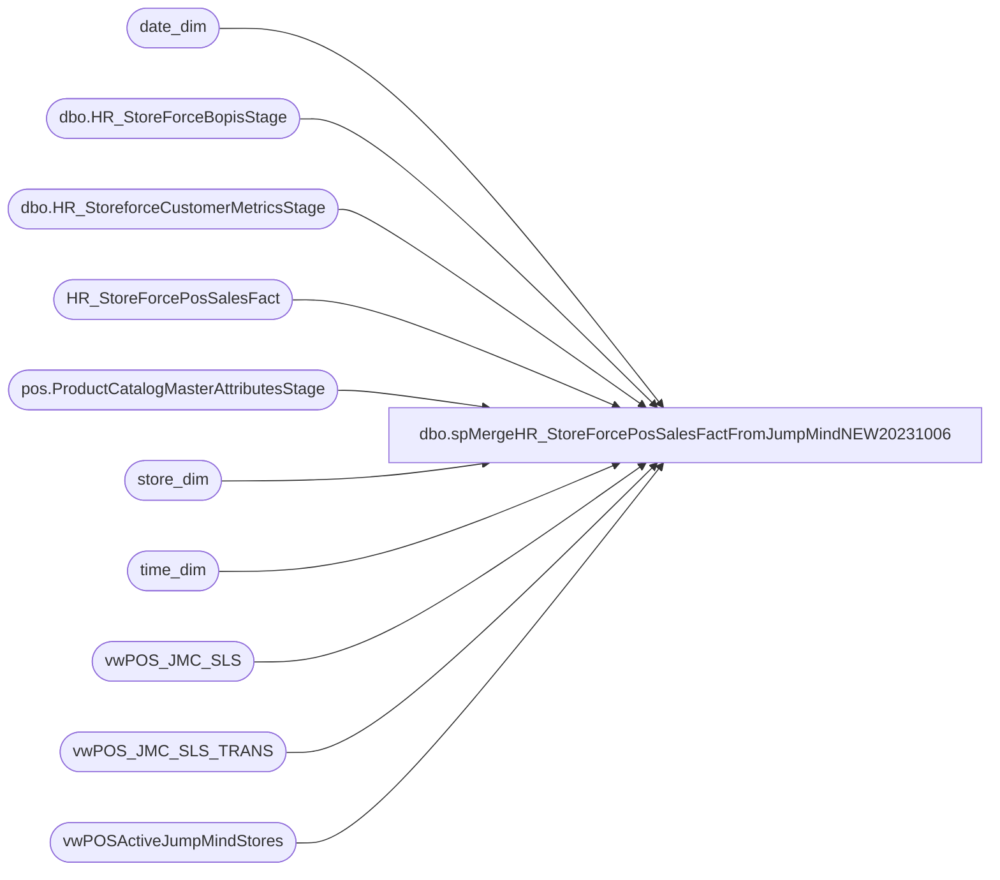

# dbo.spMergeHR_StoreForcePosSalesFactFromJumpMindNEW20231006

**Database:** dw  
**Server:** papamart  

## Architecture Diagram



## Table Dependencies

| Referenced Table |
|---|
| date_dim |
| dbo.HR_StoreForceBopisStage |
| dbo.HR_StoreforceCustomerMetricsStage |
| HR_StoreForcePosSalesFact |
| pos.ProductCatalogMasterAttributesStage |
| store_dim |
| time_dim |
| vwPOS_JMC_SLS |
| vwPOS_JMC_SLS_TRANS |
| vwPOSActiveJumpMindStores |

## Stored Procedure Code

```sql
CREATE proc [dbo].[spMergeHR_StoreForcePosSalesFactFromJumpMindNEW20231006]


as 

set nocount on


BEGIN

IF (Object_ID('tempdb..#AllTime') IS NOT null) DROP TABLE #AllTime;
select '00:00' as Slot
into #AllTime
UNION	select '00:30'	UNION	select '01:00'	UNION	select '01:30'	UNION	select '02:00'	UNION	select '02:30'	UNION	select '03:00'	UNION	select '03:30'
UNION	select '04:00'	UNION	select '04:30'	UNION	select '05:00'	UNION	select '05:30'	UNION	select '06:00'	UNION	select '06:30'	UNION	select '07:00'	UNION	select '07:30'
UNION	select '08:00'	UNION	select '08:30'	UNION	select '09:00'	UNION	select '09:30'	UNION	select '10:00'	UNION	select '10:30'	UNION	select '11:00'	UNION	select '11:30'
UNION	select '12:00'	UNION	select '12:30'	UNION	select '13:00'	UNION	select '13:30'	UNION	select '14:00'	UNION	select '14:30'	UNION	select '15:00'  UNION	select '15:30'
UNION	select '16:00'	UNION	select '16:30'	UNION	select '17:00'	UNION	select '17:30'	UNION	select '18:00'	UNION	select '18:30'	UNION	select '19:00'	UNION	select '19:30'
UNION	select '20:00'	UNION	select '20:30'	UNION	select '21:00'	UNION	select '21:30'	UNION	select '22:00'	UNION	select '22:30'	UNION	select '23:00'	UNION	select '23:30'

IF (Object_ID('tempdb..#DateTimes') IS NOT null) DROP TABLE #DateTimes;
select distinct
	cast(dd.actual_date as date) as RawDate,
	convert(varchar, dd.actual_date, 103) as Date,
	alt.Slot
into #DateTimes
from date_dim dd with (nolock) 
cross join #AllTime alt
where datediff(dd, dd.actual_date,getdate()) =0 


IF (Object_ID('tempdb..#StoreDateTime') IS NOT null) DROP TABLE #StoreDateTime;
select 
	dt.RawDate,
	dt.Date,
	case 
		when v.StoreID < 2000 
			then 1000 + v.StoreID
		else v.StoreID
	end StoreCode,
	dt.Slot,
	v.StoreID as StoreCodeRaw
into #StoreDateTime
from vwPOSActiveJumpMindStores v 
cross join #DateTimes dt


-- Style Data
-- Added 6/20/2023
IF OBJECT_ID(N'tempdb..#StyleLookup') IS NOT NULL
DROP TABLE #StyleLookup
select a.ProductNumber, a.ProductDescription, a.Department, a.DepartmentCode, a.ProductSellingGeography, a.ItemType
into #StyleLookup
from [stl-ssis-p-01].IntegrationStaging.pos.ProductCatalogMasterAttributesStage a 
group by a.ProductNumber, a.ProductDescription, a.Department, a.DepartmentCode, a.ProductSellingGeography, a.ItemType


 

IF (Object_ID('tempdb..#DataStage') IS NOT null) DROP TABLE #DataStage;
select 
	right((cast('00' as varchar) + cast(td.hour as varchar)),2)
		+ ':' + case when td.Minute < 30 then '00' else '30' end as Slot,
	case 
		when h.trans_type in ('SALE','REDEEM') 
			then count(distinct h.trans_nbr)
		else 0
	end as SaleTrans,
	case 
		when h.trans_type in ('SALE','REDEEM') 
			and d.Item_type  in ('STOCK')
			and s.DepartmentCode not in ('R-B-D-47') -- Transaction Flags Department Includes Donations, GCs as well 
			then 
			case when sd.country in ('UK','IE') 
					then sum(l.actual_unit_price-l.tax_amount) 
					else sum(l.actual_unit_price) 
				end
		else 0
	end as SaleValue,
	case 
		when h.trans_type in ('SALE','REDEEM') 
			and d.Item_type  in ('STOCK')
			and s.DepartmentCode not in ('R-B-D-47') -- Transaction Flags Department Includes Donations, GCs as well 
			then sum(cast(quantity as int))
		else 0
	end as SaleUnits,

	case 
		when h.trans_type in ('RETURN') 
			then count(distinct h.trans_nbr)
		else 0
	end as RefundTrans,
	case 
		when h.trans_type in ('RETURN') 
			and d.Item_type  in ('STOCK')
			and s.DepartmentCode not in ('R-B-D-47') -- Transaction Flags Department Includes Donations, GCs as well 
			then case when sd.country in ('UK','IE') 
					then sum(l.actual_unit_price-l.tax_amount) 
					else sum(l.actual_unit_price) 
				end
		else 0
	end as RefundValue,
	case 
		when h.trans_type in ('RETURN')
			and d.Item_type  in ('STOCK')
			and s.DepartmentCode not in ('R-B-D-47') -- Transaction Flags Department Includes Donations, GCs as well 		
			then sum(cast(quantity as int))
		else 0
	end as RefundUnits,

	case 
		when h.loyalty_card_number is not null
			--then count(distinct h.trans_nbr) -- Replaced on 6/20/2023
			then 1
		else 0
	end as BonusClubTrans,

	case 
		when d.item_type='GIFTCARD'
			then case when sd.country in ('UK','IE') 
					then sum(l.actual_unit_price-l.tax_amount) 
					else sum(l.actual_unit_price) 
				end
		else 0
	end as GiftCardValue,
	case 
		when d.item_type='GIFTCARD'
			then sum(cast(quantity as int))
		else 0
	end as GiftCardUnits,

	d.StoreID,
	cast(d.create_time as date) as DateRaw,
	d.voided,
	d.item_type, 
	h.trans_nbr
into #DataStage
from vwPOS_JMC_SLS h with (nolock)
join vwPOS_JMC_SLS_TRANS d with (nolock)
	on h.StoreID=d.StoreID
	and h.RegisterNumber=d.RegisterNumber
	and h.trans_nbr=d.sequence_number
	and h.BusinessDate=d.BusinessDate
join store_dim sd with (nolock) on d.StoreID=sd.store_id 
join date_dim dd with (nolock) on cast(d.create_time as date)=cast(dd.actual_date as date)
join time_dim td with (nolock) 
	on datepart(hh, d.create_time)=td.hour
	and datepart(mi, d.create_time)=td.minute
join #StyleLookup s 
	on s.productnumber=d.item_id -- Added 6/20/2023
	and s.ProductSellingGeography=sd.country 
where d.StoreID not in (13,2013)
and datediff(mm, d.create_time, getdate())=0
and len(d.item_id)=6
and datediff(dd, d.create_time, getdate())=0
group by 
	right((cast('00' as varchar) + cast(td.hour as varchar)),2)
		+ ':' + case when td.Minute < 30 then '00' else '30' end,
	h.trans_type,
	d.StoreID,
	cast(d.create_time as date),
	d.voided,
	d.item_type,
	h.loyalty_card_number, 
	h.trans_nbr, 
	s.DepartmentCode

-- Added 6/20/2023
IF OBJECT_ID(N'tempdb..#BonusClubCount') IS NOT NULL
DROP TABLE #BonusClubCount
select 
ds.StoreID, 
ds.DateRaw, 
ds.slot, 
count (distinct ds.trans_nbr) as CountBonusClubTransactions
into #BonusClubCount
from #DataStage ds
where 1=1 
and ds.BonusClubTrans = 1
group by 
ds.StoreID, 
ds.DateRaw, 
ds.slot


IF (Object_ID('tempdb..#MergeStage') IS NOT null) DROP TABLE #MergeStage;
select
	sdt.StoreCode,
	sdt.Date,
	sdt.Slot,
	--case when sum(isnull(d.SaleTrans,0)) < 0 then 0 else sum(isnull(d.SaleTrans,0)) end SaleTrans,	
	case when sum(isnull(d.SaleTrans,0)) < 0 then 0 else count(distinct d.Trans_nbr) end SaleTrans,	
	case when sum(isnull(d.SaleValue,0)) < 0 then 0 else sum(isnull(d.SaleValue,0)) end SaleValue,	
	case when sum(isnull(d.SaleUnits,0)) < 0 then 0 else sum(isnull(d.SaleUnits,0)) end SaleUnits,	
	sum(isnull(abs(d.RefundTrans),0)) RefundTrans,
	sum(isnull(abs(d.RefundValue),0)) RefundValue,	
	sum(isnull(abs(d.RefundUnits),0)) RefundUnits,
	--sum(isnull(d.BonusClubTrans,0)) BonusClubTrans,	
	isnull(bcc.CountBonusClubTransactions,0) as BonusClubTrans,
	sum(isnull(d.GiftCardValue,0)) GiftCardValue,	
	sum(isnull(d.GiftCardUnits,0)) GiftCardUnits,
	sdt.StoreCodeRaw,
	sdt.RawDate as TransactionDateRaw
into #MergeStage
from #StoreDateTime sdt
left join #DataStage d 
	on sdt.StoreCodeRaw=d.StoreID
	and sdt.RawDate=d.DateRaw
	and sdt.Slot=d.Slot
left join  #BonusClubCount bcc
	on sdt.StoreCodeRaw=bcc.StoreID
	and sdt.RawDate=bcc.DateRaw
	and sdt.Slot=bcc.Slot
where sdt.RawDate = cast(getdate() as date)
and voided=0
group by 
	sdt.StoreCode,
	sdt.Date,
	sdt.Slot,
	sdt.StoreCodeRaw,
	sdt.RawDate, 
	isnull(bcc.CountBonusClubTransactions,0)


		------
		;

		

		merge into HR_StoreForcePosSalesFact as target
		--using #MergeStage as source
		using 
			(
				select 
					s.*,
					isnull(b.ShipFromStoreSales,0) ShipFromStoreSales,
					isnull(b.ShipFromStoreTransactions,0) ShipFromStoreTransactions,
					isnull(b.ShipFromStoreUnits,0) ShipFromStoreUnits,
					isnull(b.PickupFromStoreSales,0) PickupFromStoreSales,
					isnull(b.PickupFromStoreTransactions,0) PickupFromStoreTransactions,
					isnull(b.PickupFromStoreUnits,0) PickupFromStoreUnits,
					isnull(b.CurbsideSales,0) CurbsideSales,
					isnull(b.CurbsideTransactions,0) CurbsideTransactions,
					isnull(b.CurbsideUnits,0) CurbsideUnits,
					isnull(c.MobileCaptureCount,0) MobileCaptureCount,
					isnull(c.MobileEmailOptInCount,0) MobileEmailOptInCount
				from #MergeStage s
				left join dwstaging.dbo.HR_StoreForceBopisStage b with (nolock)
					on 
						s.StoreCode=b.StoreNo
					and s.Slot=b.Slot
					and s.TransactionDateRaw=b.TransactionDateRaw 
				left join dwstaging.dbo.HR_StoreforceCustomerMetricsStage c with (nolock)
					on 
						s.StoreCode=c.StoreNo
					and s.Slot=c.Slot
					and s.TransactionDateRaw=c.TransactionDateRaw
			) as source
		on 
			(
				target.StoreCode=source.StoreCode
				and
				target.Date=source.Date
				and
				target.Slot=source.Slot
			)
		when matched 
		--and
		--	isnull(target.SaleTrans,0)<>isnull(source.SaleTrans,0)
		--	OR
		--	isnull(target.SaleValue,0)<>isnull(source.SaleValue,0)
		--	OR
		--	isnull(target.SaleUnits,0)<>isnull(source.SaleUnits,0)
		--	OR
		--	isnull(target.RefundTrans,0)<>isnull(source.RefundTrans,0)
		--	OR
		--	isnull(target.RefundValue,0)<>isnull(source.RefundValue,0)
		--	OR
		--	isnull(target.RefundUnits,0)<>isnull(source.RefundUnits,0)
		--	OR
		--	isnull(target.BonusClubTrans,0)<>isnull(source.BonusClubTrans,0)
		--	OR
		--	isnull(target.GiftCardValue,0)<>isnull(source.GiftCardValue,0)
		--	OR
		--	isnull(target.GiftCardUnits,0)<>isnull(source.GiftCardUnits,0)
			
		then update
			set
				target.SaleTrans=source.SaleTrans,	
				target.SaleValue=source.SaleValue,	
				target.SaleUnits=source.SaleUnits,
				target.RefundTrans=source.RefundTrans,
				target.RefundValue=source.RefundValue,
				target.RefundUnits=source.RefundUnits,
				target.BonusClubTrans=source.BonusClubTrans,
				target.GiftCardValue=source.GiftCardValue,
				target.GiftCardUnits=source.GiftCardUnits,
				target.ShipFromStoreSales=source.ShipFromStoreSales,
				target.ShipFromStoreTransactions=source.ShipFromStoreTransactions,
				target.ShipFromStoreUnits=source.ShipFromStoreUnits,
				target.PickupFromStoreSales=source.PickupFromStoreSales,
				target.PickupFromStoreTransactions=source.PickupFromStoreTransactions,
				target.PickupFromStoreUnits=source.PickupFromStoreUnits,
				target.CurbsideSales=source.CurbsideSales,
				target.CurbsideTransactions=source.CurbsideTransactions,
				target.CurbsideUnits=source.CurbsideUnits,
				target.MobileCaptureCount=source.MobileCaptureCount,
				target.MobileEmailOptInCount=source.MobileEmailOptInCount,
				target.UpdateDate=getdate()
		when not matched by target
			then insert
			(
				StoreCode,
				Date,
				Slot,
				SaleTrans,
				SaleValue,
				SaleUnits,
				RefundTrans,
				RefundValue,
				RefundUnits,
				BonusClubTrans,
				GiftCardValue,
				GiftCardUnits,
				ShipFromStoreSales,
				ShipFromStoreTransactions,
				ShipFromStoreUnits,
				PickupFromStoreSales,
				PickupFromStoreTransactions,
				PickupFromStoreUnits,
				CurbsideSales,
				CurbsideTransactions,
				CurbsideUnits,
				MobileCaptureCount,
				MobileEmailOptInCount,
				StoreIDRaw,
				DateRaw,
				InsertDate
			)
				values
					(
						source.StoreCode,
						source.Date,
						source.Slot,
						source.SaleTrans,
						source.SaleValue,
						source.SaleUnits,
						source.RefundTrans,
						source.RefundValue,
						source.RefundUnits,
						source.BonusClubTrans,
						source.GiftCardValue,
						source.GiftCardUnits,
						source.ShipFromStoreSales,
						source.ShipFromStoreTransactions,
						source.ShipFromStoreUnits,
						source.PickupFromStoreSales,
						source.PickupFromStoreTransactions,
						source.PickupFromStoreUnits,
						source.CurbsideSales,
						source.CurbsideTransactions,
						source.CurbsideUnits,
						source.MobileCaptureCount,
						source.MobileEmailOptInCount,
						source.StoreCodeRaw,
						source.TransactionDateRaw,
						getdate()
					)


		;

END
```

