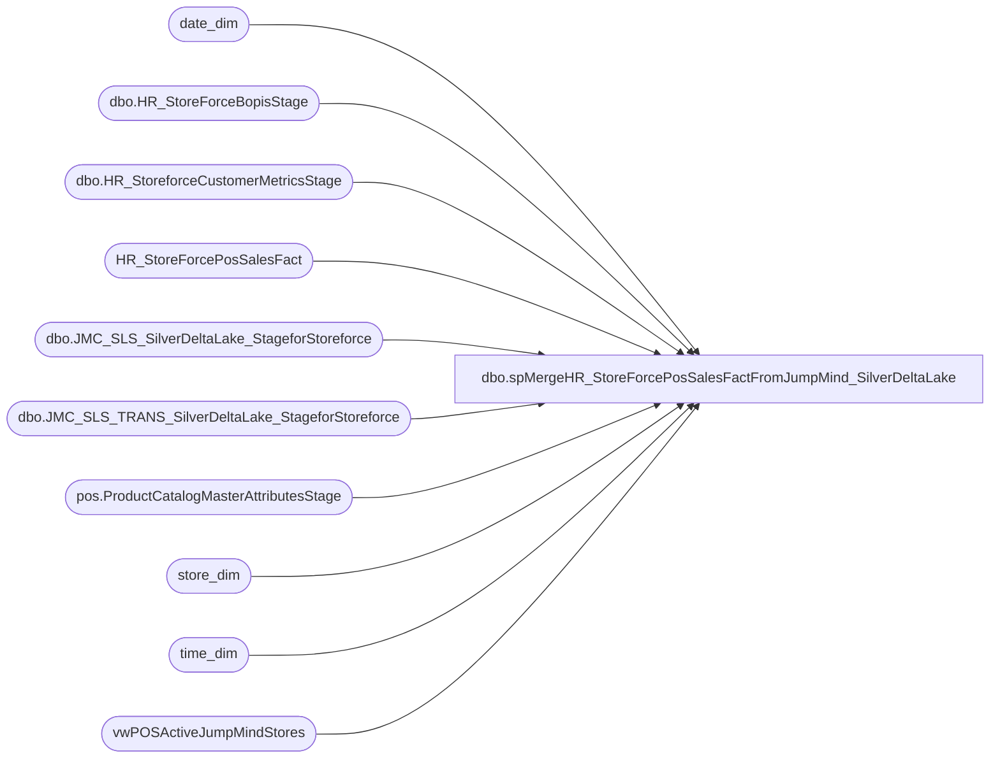

# dbo.spMergeHR_StoreForcePosSalesFactFromJumpMind_SilverDeltaLake

**Database:** dw  
**Server:** papamart  

## Architecture Diagram



## Table Dependencies

| Referenced Table |
|---|
| date_dim |
| dbo.HR_StoreForceBopisStage |
| dbo.HR_StoreforceCustomerMetricsStage |
| HR_StoreForcePosSalesFact |
| dbo.JMC_SLS_SilverDeltaLake_StageforStoreforce |
| dbo.JMC_SLS_TRANS_SilverDeltaLake_StageforStoreforce |
| pos.ProductCatalogMasterAttributesStage |
| store_dim |
| time_dim |
| vwPOSActiveJumpMindStores |

## Stored Procedure Code

```sql
CREATE proc [dbo].[spMergeHR_StoreForcePosSalesFactFromJumpMind_SilverDeltaLake]


as 

set nocount on


BEGIN

IF (Object_ID('tempdb..#AllTime') IS NOT null) DROP TABLE #AllTime;
select '00:00' as Slot
into #AllTime
UNION	select '00:30'	UNION	select '01:00'	UNION	select '01:30'	UNION	select '02:00'	UNION	select '02:30'	UNION	select '03:00'	UNION	select '03:30'
UNION	select '04:00'	UNION	select '04:30'	UNION	select '05:00'	UNION	select '05:30'	UNION	select '06:00'	UNION	select '06:30'	UNION	select '07:00'	UNION	select '07:30'
UNION	select '08:00'	UNION	select '08:30'	UNION	select '09:00'	UNION	select '09:30'	UNION	select '10:00'	UNION	select '10:30'	UNION	select '11:00'	UNION	select '11:30'
UNION	select '12:00'	UNION	select '12:30'	UNION	select '13:00'	UNION	select '13:30'	UNION	select '14:00'	UNION	select '14:30'	UNION	select '15:00'  UNION	select '15:30'
UNION	select '16:00'	UNION	select '16:30'	UNION	select '17:00'	UNION	select '17:30'	UNION	select '18:00'	UNION	select '18:30'	UNION	select '19:00'	UNION	select '19:30'
UNION	select '20:00'	UNION	select '20:30'	UNION	select '21:00'	UNION	select '21:30'	UNION	select '22:00'	UNION	select '22:30'	UNION	select '23:00'	UNION	select '23:30'

IF (Object_ID('tempdb..#DateTimes') IS NOT null) DROP TABLE #DateTimes;
select distinct
	cast(dd.actual_date as date) as RawDate,
	convert(varchar, dd.actual_date, 103) as Date,
	alt.Slot
into #DateTimes
from date_dim dd with (nolock) 
cross join #AllTime alt
where (datepart(hh,getdate())>2 and datediff(dd, dd.actual_date,getdate()) =0 )
or (datepart(hh,getdate())<=2 and cast(dd.actual_date as date)=cast(getdate()-1 as date))


IF (Object_ID('tempdb..#StoreDateTime') IS NOT null) DROP TABLE #StoreDateTime;
select 
	dt.RawDate,
	dt.Date,
	case 
		when v.StoreID < 2000 
			then 1000 + v.StoreID
		else v.StoreID
	end StoreCode,
	dt.Slot,
	v.StoreID as StoreCodeRaw
into #StoreDateTime
from vwPOSActiveJumpMindStores v 
cross join #DateTimes dt
where (datepart(hh, getdate())>2 and v.StoreID>0)
	OR (datepart(hh, getdate())<=2 and v.StoreID<2000) ---EXCLUDES UK WHEN IT RUNS BETWEEN 12AM AND 2AM BECAUSE IT MESSES UP THE SALES TOTAL SOMEHOW FOR UK DURING THIS TIME


-- Style Data
-- Added 6/20/2023
IF OBJECT_ID(N'tempdb..#StyleLookup') IS NOT NULL
DROP TABLE #StyleLookup
select a.ProductNumber, a.ProductDescription, a.Department, a.DepartmentCode, a.ProductSellingGeography, a.ItemType,
	case 
		when a.ProductNumber in ('427634','427582','427152','426821','426749','426378','426369','426286','426259','426219','426132','425617','425354','425152','424965','424685','424443','424286','424244','422963','422962','422824','422823','422049','421816','421815','420551','420550','415836','127634','127582','127152','126821','126749','126378','126286','126132','125617','125354','125152','124965','124685','124443','124244','122824','122823','122049','121816','121815','120551','120550','027634','027582','027217','027152','026980','026838','026821','026749','026603','026378','026369','026286','026166','026132','025617','025354','025152','024965','024685','024443','024290','024286','024244','023842','023834','022889','022888','022887','022886','022831','022830','022829','022828','022824','022823','022141','022049','021816','021815','020559','020558','020557','020556','020555','020554','020553','020552','020551','020550','018194','017295','015833','015831','015830','015281','014258','031829','027765','026378','025617','030306','031696','031659','028925','028552','025354','028895','022831','022830','022888','030394','027217','026603','022829','030418','028855','022886','026166','031977','022887','031451','031510','031408','031059','026915','024290','030174','028741','032063','028559','029984','026749','022824','028403','026980','027910','024244','021815','022141','032078','032096','032008','028473','027582','028405','027893','027634','029842','024965','026838','030548','131829','127765','126378','125617','130306','131696','131659','128925','128552','125354','128895','130394','130418','131977','131451','131408','131059','130174','128741','132063','129984','126749','122824','128403','127910','124244','121815','132078','132008','128473','127582','128405','127893','127634','129842','124965','130548','431829','427765','426378','425617','430306','431696','431659','428925','428552','425354','428895','430394','430418','431977','431451','431408','431059','430174','428741','432063','429984','426749','422824','428403','427910','424244','421815','432078','432008','428473','427582','428405','427893','427634','429842','424965','430548','426369','422963','422962','432067')
			then 1
		else 0
	end as isBackpack
into #StyleLookup
from [stl-ssis-p-01].IntegrationStaging.pos.ProductCatalogMasterAttributesStage a 
group by a.ProductNumber, a.ProductDescription, a.Department, a.DepartmentCode, a.ProductSellingGeography, a.ItemType


CREATE NONCLUSTERED INDEX [NCI_GEOBackPck]
ON [dbo].[#StyleLookup] ([ProductNumber])
INCLUDE ([DepartmentCode],[ProductSellingGeography],[isBackpack])

---==============
----BOPIS
---==============


--IF (Object_ID('tempdb..#BopisPre') IS NOT NULL) DROP TABLE #BopisPre;
--select  
--	cast(o.PickupStore as int) as StoreNumber,
--	case 
--		when cast(o.PickupStore as int) < 2000 
--			then 1000 + cast(o.PickupStore as int)
--		else cast(o.PickupStore as int)
--	end StoreCode,
--	cast(os.StatusDate as date) as ShipDate,
--	right((cast('00' as varchar) + cast(td.hour as varchar)),2)
--		+ ':' + case when td.Minute < 30 then '00' else '30' end as Slot,

--	case when o.ShippingMethod = 'InStore' then 1 else 0 end as isPickupFromStore, 
--	case when o.ShippingMethod = 'curbSide' then 1 else 0 end as isCurbside,
--	case when o.ShippingMethod = 'sameDay' or o.ShippingMethod not in ('InStore', 'curbSide') then 1 else 0 end as isShipFromStore,

--	o.OrderNum,
--	oi.SKU,
--	max(oi.Price) as Price,
--	max(oi.DiscountedPrice) as SubTotal, 
--	max(oi.qty) Qty
--into #BopisPre
--from [bearcluster01.sql.buildabear.com].WebOrderProcessing.wm.Orders o with (nolock)
--join [bearcluster01.sql.buildabear.com].WebOrderProcessing.wm.OrderItems oi with (nolock) on o.OrderID=oi.OrderID
--join [bearcluster01.sql.buildabear.com].WebOrderProcessing.wm.OrderStatus os with (nolock)
--	on o.OrderID=os.OrderID
--	and os.CurrentStatus=1
--join date_dim dd on cast(os.StatusDate as date) =dd.actual_date
--join time_dim td 
--	on datepart(hh,os.StatusDate)=td.hour
--	and datepart(mi,os.StatusDate)=td.minute
--where 1=1
--and (
--		datediff(dd, os.StatusDate, getdate())=0
--		or (datepart(hh,getdate())<=2 and cast(os.StatusDate as date)=cast(getdate()-1 as date))
--	)
--and isnull(o.PickupStore,'') not in ('', '0013', '2013')
--and	os.Status in ('Shipped','Complete')
--and not exists (select g.ProductNumber from #StyleLookup g where g.ProductNumber=oi.SKU and g.ItemType='Gift Card')
--group by 
--	o.OrderNum,
--	oi.SKU,
--	cast(o.PickupStore as int),
--	case 
--		when cast(o.PickupStore as int) < 2000 
--			then 1000 + cast(o.PickupStore as int)
--		else cast(o.PickupStore as int)
--	end,
--	cast(os.StatusDate as date),
--	right((cast('00' as varchar) + cast(td.hour as varchar)),2)
--		+ ':' + case when td.Minute < 30 then '00' else '30' end,
--	case when o.ShippingMethod = 'InStore' then 1 else 0 end, 
--	case when o.ShippingMethod = 'curbSide' then 1 else 0 end,
--	case when o.ShippingMethod = 'sameDay' or o.ShippingMethod not in ('InStore', 'curbSide') then 1 else 0 end

--IF (Object_ID('tempdb..#Bopis') IS NOT NULL) DROP TABLE #Bopis;
--select 
--	sdt.StoreCode,
--	sdt.RawDate BopisDate,
--	sdt.Slot,
--	bp.isPickupFromStore,
--	bp.isCurbside,
--	bp.isShipFromStore,
--	sum(bp.SubTotal) Sales,
--	sum(bp.Qty) Units,
--	count(distinct bp.OrderNum) Transactions
--into #Bopis
--from #StoreDateTime sdt
--left join #BopisPre bp 
--	on sdt.StoreCode=bp.StoreCode
--	and sdt.RawDate=cast(bp.ShipDate as date)
--	and sdt.Slot=bp.Slot
--group by 
--	sdt.StoreCode,
--	sdt.RawDate,
--	sdt.Slot,
--	bp.isPickupFromStore,
--	bp.isCurbside,
--	bp.isShipFromStore

	---NEXT STEPS --  UPDATE THE MERGE TO JOIN TO #BOPIS WHERE IT PRESENTLY WAS GOING TO JOIN TO VWBOPIS -- WORK IT OUT
--=================
--END BOPIS
--================


IF (Object_ID('tempdb..#DataStage') IS NOT null) DROP TABLE #DataStage;
select 
	right((cast('00' as varchar) + cast(td.hour as varchar)),2)
		+ ':' + case when td.Minute < 30 then '00' else '30' end as Slot,
	case 
		when h.trans_type in ('SALE','REDEEM') 
			and d.Item_type  in ('STOCK')
			and s.DepartmentCode not in ('R-B-D-47')
			then count(distinct h.trans_nbr)
		else 0
	end as SaleTrans,
	case 
		when h.trans_type in ('SALE','REDEEM') 
			and d.Item_type  in ('STOCK')
			and s.DepartmentCode not in ('R-B-D-47') -- Transaction Flags Department Includes Donations, GCs as well 
			--then sum(actual_unit_price)
			then sum(d.extended_discounted_amount)
		else 0
	end as SaleValue,
	case 
		when h.trans_type in ('SALE','REDEEM') 
			and d.Item_type  in ('STOCK')
			and s.DepartmentCode not in ('R-B-D-47') -- Transaction Flags Department Includes Donations, GCs as well 
			then sum(cast(quantity as int))
		else 0
	end as SaleUnits,

	case 
		when h.trans_type in ('RETURN') 
			and d.Item_type  in ('STOCK')
			and s.DepartmentCode not in ('R-B-D-47') -- Transaction Flags Department Includes Donations, GCs as well 
			then count(distinct h.trans_nbr)
		else 0
	end as RefundTrans,
	case 
		when h.trans_type in ('RETURN') 
			and d.Item_type  in ('STOCK')
			and s.DepartmentCode not in ('R-B-D-47') -- Transaction Flags Department Includes Donations, GCs as well 
			--then sum(actual_unit_price)
			then sum(d.extended_discounted_amount)
		else 0
	end as RefundValue,
	case 
		when h.trans_type in ('RETURN')
			and d.Item_type  in ('STOCK')
			and s.DepartmentCode not in ('R-B-D-47') -- Transaction Flags Department Includes Donations, GCs as well 		
			then sum(cast(quantity as int))
		else 0
	end as RefundUnits,

	case 
		when h.loyalty_card_number is not null
			--then count(distinct h.trans_nbr) -- Replaced on 6/20/2023
			then 1
		else 0
	end as BonusClubTrans,

	case 
		when d.item_type='GIFTCARD'
			then sum(actual_unit_price)
		else 0
	end as GiftCardValue,
	case 
		when d.item_type='GIFTCARD'
			then sum(cast(quantity as int))
		else 0
	end as GiftCardUnits,

	d.StoreID,
	cast(d.create_time as date) as DateRaw,
	d.voided,
	d.item_type, 
	--h.trans_nbr
	concat(h.businessdate, h.StoreID, h.RegisterNumber, h.trans_nbr) as trans_nbr,
	case 
		when h.trans_type in ('SALE','REDEEM') 
			and d.Item_type  in ('STOCK')
			and s.DepartmentCode not in ('R-B-D-47')
			AND s.isBackPack=1
			then count(distinct h.trans_nbr)
		else 0
	end as BackpackTrans,
	case 
		when h.trans_type in ('SALE','REDEEM') 
			and d.Item_type  in ('STOCK')
			and s.DepartmentCode not in ('R-B-D-47')
			AND s.isBackPack=1
			then sum(cast(quantity as int))
		else 0
	end as BackpackUnits,
	case 
		when h.trans_type in ('SALE','REDEEM') 
			and d.Item_type  in ('STOCK')
			and s.DepartmentCode not in ('R-B-D-47')
			and h.party_id is not null
			then count(distinct h.trans_nbr)
		else 0
	end as PartyTrans,
	case 
		when h.trans_type in ('SALE','REDEEM') 
			and d.Item_type  in ('STOCK')
			and s.DepartmentCode not in ('R-B-D-47') -- Transaction Flags Department Includes Donations, GCs as well 
			and h.party_id is not null
			then sum(d.extended_discounted_amount)
		else 0
	end as PartySaleValue,
	case 
		when h.trans_type in ('SALE','REDEEM') 
			and d.Item_type  in ('STOCK')
			and s.DepartmentCode not in ('R-B-D-47') -- Transaction Flags Department Includes Donations, GCs as well 
			and h.party_id is not null
			then count(distinct h.party_id)
		else 0
	end as PartyCount,
	0 as EnterpriseSellingTrans,
	0 as EnterpriseSellingValue,
	0 as EnterpriseSellingUnits
into #DataStage
from dwstaging.dbo.JMC_SLS_SilverDeltaLake_StageforStoreforce h
join dwstaging.dbo.JMC_SLS_TRANS_SilverDeltaLake_StageforStoreforce d 
	on h.StoreID=d.StoreID
	and h.RegisterNumber=d.RegisterNumber
	and h.trans_nbr=d.sequence_number
	and h.BusinessDate=d.BusinessDate
join store_dim sd with (nolock) on d.StoreID=sd.store_id 
join date_dim dd with (nolock) on cast(d.create_time as date)=cast(dd.actual_date as date)
join time_dim td with (nolock) 
	on datepart(hh, d.create_time)=td.hour
	and datepart(mi, d.create_time)=td.minute
join #StyleLookup s 
	on s.productnumber=d.item_id  collate SQL_Latin1_General_CP1_CI_AS  -- Added 6/20/2023
	and s.ProductSellingGeography=sd.country 
where 1=1
and h.trans_type in ('SALE', 'REDEEM', 'RETURN')
and d.line_item_type ='STORE_SALE'
and d.item_type in ('STOCK', 'DONATION', 'GIFTCARD')
and h.trans_status = 'COMPLETED'
and d.StoreID not in (13,2013)
and datediff(mm, d.create_time, getdate())=0
and len(d.item_id)=6
and d.voided = 0
and d.item_returned = 0
and (
		(datepart(hh,getdate())>2 and datediff(dd, d.create_time, getdate())=0)
		or (datepart(hh,getdate())<=2 and cast(dd.actual_date as date)=cast(getdate()-1 as date))
	)
group by 
	right((cast('00' as varchar) + cast(td.hour as varchar)),2)
		+ ':' + case when td.Minute < 30 then '00' else '30' end,
	h.trans_type,
	d.StoreID,
	cast(d.create_time as date),
	d.voided,
	d.item_type,
	h.loyalty_card_number, 
	--h.trans_nbr, 
	concat(h.businessdate, h.StoreID, h.RegisterNumber, h.trans_nbr),
	s.DepartmentCode,
	s.isBackpack,
	h.party_id

--ORDER_IN_STORE
insert #DataStage
select 
	right((cast('00' as varchar) + cast(td.hour as varchar)),2)
		+ ':' + case when td.Minute < 30 then '00' else '30' end as Slot,
	case 
		when h.trans_type in ('SALE','REDEEM') 
			and d.Item_type  in ('STOCK')
			and s.DepartmentCode not in ('R-B-D-47')
			then count(distinct h.trans_nbr)
		else 0
	end as SaleTrans,
	case 
		when h.trans_type in ('SALE','REDEEM') 
			and d.Item_type  in ('STOCK')
			and s.DepartmentCode not in ('R-B-D-47') -- Transaction Flags Department Includes Donations, GCs as well 
			--then sum(actual_unit_price)
			then sum(d.extended_discounted_amount)
		else 0
	end as SaleValue,
	case 
		when h.trans_type in ('SALE','REDEEM') 
			and d.Item_type  in ('STOCK')
			and s.DepartmentCode not in ('R-B-D-47') -- Transaction Flags Department Includes Donations, GCs as well 
			then sum(cast(quantity as int))
		else 0
	end as SaleUnits,

	case 
		when h.trans_type in ('RETURN') 
			and d.Item_type  in ('STOCK')
			and s.DepartmentCode not in ('R-B-D-47') -- Transaction Flags Department Includes Donations, GCs as well 
			then count(distinct h.trans_nbr)
		else 0
	end as RefundTrans,
	case 
		when h.trans_type in ('RETURN') 
			and d.Item_type  in ('STOCK')
			and s.DepartmentCode not in ('R-B-D-47') -- Transaction Flags Department Includes Donations, GCs as well 
			--then sum(actual_unit_price)
			then sum(d.extended_discounted_amount)
		else 0
	end as RefundValue,
	case 
		when h.trans_type in ('RETURN')
			and d.Item_type  in ('STOCK')
			and s.DepartmentCode not in ('R-B-D-47') -- Transaction Flags Department Includes Donations, GCs as well 		
			then sum(cast(quantity as int))
		else 0
	end as RefundUnits,

	case 
		when h.loyalty_card_number is not null
			--then count(distinct h.trans_nbr) -- Replaced on 6/20/2023
			then 1
		else 0
	end as BonusClubTrans,

	case 
		when d.item_type='GIFTCARD'
			then sum(actual_unit_price)
		else 0
	end as GiftCardValue,
	case 
		when d.item_type='GIFTCARD'
			then sum(cast(quantity as int))
		else 0
	end as GiftCardUnits,

	d.StoreID,
	cast(d.create_time as date) as DateRaw,
	d.voided,
	d.item_type, 
	--h.trans_nbr
	concat(h.businessdate, h.StoreID, h.RegisterNumber, h.trans_nbr) as trans_nbr,
	case 
		when h.trans_type in ('SALE','REDEEM') 
			and d.Item_type  in ('STOCK')
			and s.DepartmentCode not in ('R-B-D-47')
			AND s.isBackPack=1
			then count(distinct h.trans_nbr)
		else 0
	end as BackpackTrans,
	case 
		when h.trans_type in ('SALE','REDEEM') 
			and d.Item_type  in ('STOCK')
			and s.DepartmentCode not in ('R-B-D-47')
			AND s.isBackPack=1
			then sum(cast(quantity as int))
		else 0
	end as BackpackUnits,
	case 
		when h.trans_type in ('SALE','REDEEM') 
			and d.Item_type  in ('STOCK')
			and s.DepartmentCode not in ('R-B-D-47')
			and h.party_id is not null
			then count(distinct h.trans_nbr)
		else 0
	end as PartyTrans,
	case 
		when h.trans_type in ('SALE','REDEEM') 
			and d.Item_type  in ('STOCK')
			and s.DepartmentCode not in ('R-B-D-47') -- Transaction Flags Department Includes Donations, GCs as well 
			and h.party_id is not null
			then sum(d.extended_discounted_amount)
		else 0
	end as PartySaleValue,
	case 
		when h.trans_type in ('SALE','REDEEM') 
			and d.Item_type  in ('STOCK')
			and s.DepartmentCode not in ('R-B-D-47') -- Transaction Flags Department Includes Donations, GCs as well 
			and h.party_id is not null
			then count(distinct h.party_id)
		else 0
	end as PartyCount,
	case 
		when h.trans_type in ('SALE','REDEEM') 
			and d.Item_type  in ('STOCK')
			and s.DepartmentCode not in ('R-B-D-47')
			then count(distinct h.trans_nbr)
		else 0
	end as EnterpriseSellingTrans,
	case 
		when h.trans_type in ('SALE','REDEEM') 
			and d.Item_type  in ('STOCK')
			and s.DepartmentCode not in ('R-B-D-47') -- Transaction Flags Department Includes Donations, GCs as well 
			--then sum(actual_unit_price)
			then sum(d.extended_discounted_amount)
		else 0
	end as EnterpriseSellingValue,
	case 
		when h.trans_type in ('SALE','REDEEM') 
			and d.Item_type  in ('STOCK')
			and s.DepartmentCode not in ('R-B-D-47') -- Transaction Flags Department Includes Donations, GCs as well 
			then sum(cast(quantity as int))
		else 0
	end as EnterpriseSellingUnits
from dwstaging.dbo.JMC_SLS_SilverDeltaLake_StageforStoreforce h
join dwstaging.dbo.JMC_SLS_TRANS_SilverDeltaLake_StageforStoreforce d 
	on h.StoreID=d.StoreID
	and h.RegisterNumber=d.RegisterNumber
	and h.trans_nbr=d.sequence_number
	and h.BusinessDate=d.BusinessDate
join store_dim sd with (nolock) on d.StoreID=sd.store_id 
join date_dim dd with (nolock) on cast(d.create_time as date)=cast(dd.actual_date as date)
join time_dim td with (nolock) 
	on datepart(hh, d.create_time)=td.hour
	and datepart(mi, d.create_time)=td.minute
join #StyleLookup s 
	on s.productnumber=d.item_id  collate SQL_Latin1_General_CP1_CI_AS  -- Added 6/20/2023
	and s.ProductSellingGeography=sd.country 
where 1=1
and h.trans_type in ('SALE', 'REDEEM', 'RETURN')
and d.line_item_type ='ORDER_IN_STORE'
and d.item_type in ('STOCK', 'DONATION', 'GIFTCARD')
and h.trans_status = 'COMPLETED'
and d.StoreID not in (13,2013)
and datediff(mm, d.create_time, getdate())=0
and len(d.item_id)=6
and d.voided = 0
and d.item_returned = 0
and (
		(datepart(hh,getdate())>2 and datediff(dd, d.create_time, getdate())=0)
		or (datepart(hh,getdate())<=2 and cast(dd.actual_date as date)=cast(getdate()-1 as date))
	)
group by 
	right((cast('00' as varchar) + cast(td.hour as varchar)),2)
		+ ':' + case when td.Minute < 30 then '00' else '30' end,
	h.trans_type,
	d.StoreID,
	cast(d.create_time as date),
	d.voided,
	d.item_type,
	h.loyalty_card_number, 
	--h.trans_nbr, 
	concat(h.businessdate, h.StoreID, h.RegisterNumber, h.trans_nbr),
	s.DepartmentCode,
	s.isBackpack,
	h.party_id

-- Added 6/20/2023
IF OBJECT_ID(N'tempdb..#BonusClubCount') IS NOT NULL
DROP TABLE #BonusClubCount
select 
	ds.StoreID, 
	ds.DateRaw, 
	ds.slot, 
	count (distinct ds.trans_nbr) as CountBonusClubTransactions
into #BonusClubCount
from #DataStage ds
where 1=1 
and ds.BonusClubTrans = 1
group by 
	ds.StoreID, 
	ds.DateRaw, 
	ds.slot


IF (Object_ID('tempdb..#MergeStage') IS NOT null) DROP TABLE #MergeStage;
select
	sdt.StoreCode,
	sdt.Date,
	sdt.Slot,
	--case when sum(isnull(d.SaleTrans,0)) < 0 then 0 else sum(isnull(d.SaleTrans,0)) end SaleTrans,	
	case when sum(isnull(d.SaleTrans,0)) < 0 then 0 else count(distinct d.Trans_nbr) end SaleTrans,	
	case when sum(isnull(d.SaleValue,0)) < 0 then 0 else sum(isnull(d.SaleValue,0)) end SaleValue,	
	case when sum(isnull(d.SaleUnits,0)) < 0 then 0 else sum(isnull(d.SaleUnits,0)) end SaleUnits,	
	sum(isnull(abs(d.RefundTrans),0)) RefundTrans,
	sum(isnull(abs(d.RefundValue),0)) RefundValue,	
	sum(isnull(abs(d.RefundUnits),0)) RefundUnits,
	--sum(isnull(d.BonusClubTrans,0)) BonusClubTrans,	
	isnull(bcc.CountBonusClubTransactions,0) as BonusClubTrans,
	sum(isnull(d.GiftCardValue,0)) GiftCardValue,	
	sum(isnull(d.GiftCardUnits,0)) GiftCardUnits,
	sum(isnull(d.BackpackTrans,0)) BackpackTrans,
	sum(isnull(d.BackpackUnits,0)) BackpackUnits,
	sum(isnull(d.PartyTrans,0)) PartyTrans,
	sum(isnull(d.PartySaleValue,0)) PartySaleValue,
	sum(isnull(d.PartyCount,0)) PartyCount,
	sdt.StoreCodeRaw,
	sdt.RawDate as TransactionDateRaw
into #MergeStage
from #StoreDateTime sdt
left join #DataStage d 
	on sdt.StoreCodeRaw=d.StoreID
	and sdt.RawDate=d.DateRaw
	and sdt.Slot=d.Slot
left join  #BonusClubCount bcc
	on sdt.StoreCodeRaw=bcc.StoreID
	and sdt.RawDate=bcc.DateRaw
	and sdt.Slot=bcc.Slot
where voided=0
and (
		(datepart(hh, getdate())>2 and sdt.RawDate = cast(getdate() as date))
		or (datepart(hh, getdate())<=2 and sdt.RawDate = cast(getdate()-1 as date))
	)
group by 
	sdt.StoreCode,
	sdt.Date,
	sdt.Slot,
	sdt.StoreCodeRaw,
	sdt.RawDate, 
	isnull(bcc.CountBonusClubTransactions,0)


		------
		;

		

		merge into HR_StoreForcePosSalesFact as target
		--using #MergeStage as source
		using 
			(   
				----NEW SQL TO USE IF I CONFIRM THE VWBOPIS VIEW IS OK AND/OR HOW TO IDENTIFY SHIP FROM STORE
				--I think I’m able to identify pickup from store and curbside pickup, but I don’t see ship from store.
				--I suspect that Curbside isn’t actually used, and so I’m wondering if that flag might actually mean ship from store.
				--select 
				--	s.*,
				--	0 as ShipFromStoreSales,
				--	0 as ShipFromStoreTransactions,
				--	0 as ShipFromStoreUnits,
				--	isnull(b.PickupFromStoreSales,0) PickupFromStoreSales,
				--	isnull(b.PickupFromStoreTransactions,0) PickupFromStoreTransactions,
				--	isnull(b.PickupFromStoreUnits,0) PickupFromStoreUnits,
				--	isnull(b.CurbsideSales,0) CurbsideSales,
				--	isnull(b.CurbsideTransactions,0) CurbsideTransactions,
				--	isnull(b.CurbsideUnits,0) CurbsideUnits,
				--	0 as MobileCaptureCount,
				--	0 as MobileEmailOptInCount
				--from #MergeStage s
				--left join vwBopis b 
				--	on s.StoreCode=b.StoreCode
				--	and s.Slot=b.Slot
				--	and s.TransactionDateRaw=b.ShipDate
				
				--original sql
				select 
					s.*,
					isnull(b.ShipFromStoreSales,0) ShipFromStoreSales,
					isnull(b.ShipFromStoreTransactions,0) ShipFromStoreTransactions,
					isnull(b.ShipFromStoreUnits,0) ShipFromStoreUnits,
					isnull(b.PickupFromStoreSales,0) PickupFromStoreSales,
					isnull(b.PickupFromStoreTransactions,0) PickupFromStoreTransactions,
					isnull(b.PickupFromStoreUnits,0) PickupFromStoreUnits,
					isnull(b.CurbsideSales,0) CurbsideSales,
					isnull(b.CurbsideTransactions,0) CurbsideTransactions,
					isnull(b.CurbsideUnits,0) CurbsideUnits,
					isnull(c.MobileCaptureCount,0) MobileCaptureCount,
					isnull(c.MobileEmailOptInCount,0) MobileEmailOptInCount
				from #MergeStage s
				left join dwstaging.dbo.HR_StoreForceBopisStage b with (nolock)
					on 
						s.StoreCode=b.StoreNo
					and s.Slot=b.Slot
					and s.TransactionDateRaw=b.TransactionDateRaw 
				left join dwstaging.dbo.HR_StoreforceCustomerMetricsStage c with (nolock)
					on 
						s.StoreCode=c.StoreNo
					and s.Slot=c.Slot
					and s.TransactionDateRaw=c.TransactionDateRaw

			) as source
		on 
			(
				target.StoreCode=source.StoreCode
				and
				target.Date=source.Date
				and
				target.Slot=source.Slot
			)
		when matched 			
		then update
			set
				target.SaleTrans=source.SaleTrans,	
				target.SaleValue=source.SaleValue,	
				target.SaleUnits=source.SaleUnits,
				target.RefundTrans=source.RefundTrans,
				target.RefundValue=source.RefundValue,
				target.RefundUnits=source.RefundUnits,
				target.BonusClubTrans=source.BonusClubTrans,
				target.GiftCardValue=source.GiftCardValue,
				target.GiftCardUnits=source.GiftCardUnits,
				target.ShipFromStoreSales=source.ShipFromStoreSales,
				target.ShipFromStoreTransactions=source.ShipFromStoreTransactions,
				target.ShipFromStoreUnits=source.ShipFromStoreUnits,
				target.PickupFromStoreSales=source.PickupFromStoreSales,
				target.PickupFromStoreTransactions=source.PickupFromStoreTransactions,
				target.PickupFromStoreUnits=source.PickupFromStoreUnits,
				target.CurbsideSales=source.CurbsideSales,
				target.CurbsideTransactions=source.CurbsideTransactions,
				target.CurbsideUnits=source.CurbsideUnits,
				target.MobileCaptureCount=source.MobileCaptureCount,
				target.MobileEmailOptInCount=source.MobileEmailOptInCount,
				target.UpdateDate=getdate()
		when not matched by target
			then insert
			(
				StoreCode,
				Date,
				Slot,
				SaleTrans,
				SaleValue,
				SaleUnits,
				RefundTrans,
				RefundValue,
				RefundUnits,
				BonusClubTrans,
				GiftCardValue,
				GiftCardUnits,
				ShipFromStoreSales,
				ShipFromStoreTransactions,
				ShipFromStoreUnits,
				PickupFromStoreSales,
				PickupFromStoreTransactions,
				PickupFromStoreUnits,
				CurbsideSales,
				CurbsideTransactions,
				CurbsideUnits,
				MobileCaptureCount,
				MobileEmailOptInCount,
				StoreIDRaw,
				DateRaw,
				InsertDate
			)
				values
					(
						source.StoreCode,
						source.Date,
						source.Slot,
						source.SaleTrans,
						source.SaleValue,
						source.SaleUnits,
						source.RefundTrans,
						source.RefundValue,
						source.RefundUnits,
						source.BonusClubTrans,
						source.GiftCardValue,
						source.GiftCardUnits,
						source.ShipFromStoreSales,
						source.ShipFromStoreTransactions,
						source.ShipFromStoreUnits,
						source.PickupFromStoreSales,
						source.PickupFromStoreTransactions,
						source.PickupFromStoreUnits,
						source.CurbsideSales,
						source.CurbsideTransactions,
						source.CurbsideUnits,
						source.MobileCaptureCount,
						source.MobileEmailOptInCount,
						source.StoreCodeRaw,
						source.TransactionDateRaw,
						getdate()
					)


		;

END
```

