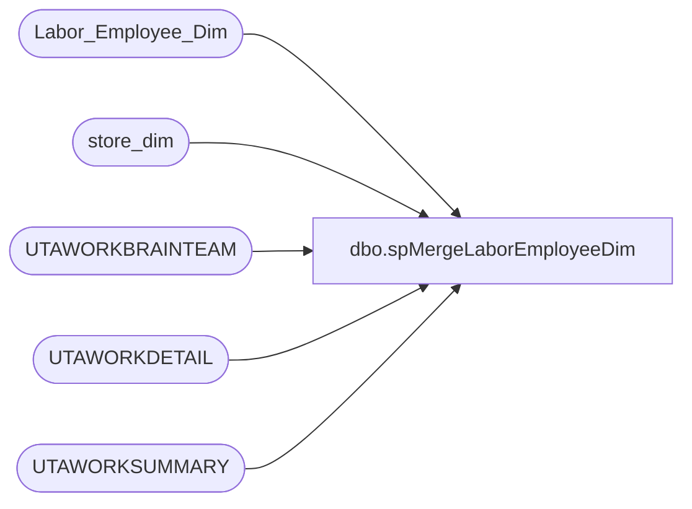

# dbo.spMergeLaborEmployeeDim

**Database:** dw  
**Server:** papamart  

## Architecture Diagram



## Table Dependencies

| Referenced Table |
|---|
| Labor_Employee_Dim |
| store_dim |
| UTAWORKBRAINTEAM |
| UTAWORKDETAIL |
| UTAWORKSUMMARY |

## Stored Procedure Code

```sql
CREATE proc [dbo].[spMergeLaborEmployeeDim]

as

---------------------------------------------------------------------------------------------------------------------------
--	Dan Tweedie	2019-01-24	Created Proc
---------------------------------------------------------------------------------------------------------------------------

set nocount on
declare 
	@LogID int

select @LogID = max(etl_log_id)+1 from Labor_Employee_Dim;


IF OBJECT_ID('tempdb..#MergeStage') IS NOT NULL drop table #MergeStage;

with 
UTA as 
	(	
		SELECT DISTINCT 
			--cast(LEFT(wt.WBT_NAME, 5) as int) AS store_id, 
			case 
				when left(wt.WBT_NAME,1) = '2'
					then cast(LEFT(wt.WBT_NAME, 4) as int) 
					else cast(right(LEFT(wt.WBT_NAME, 4),3) as int)
			end as store_id,
			ws.EMP_ID
		FROM UTAWORKSUMMARY ws WITH (NOLOCK) 
		join UTAWORKDETAIL dtl WITH (NOLOCK) ON ws.WRKS_ID = dtl.WRKS_ID 
		join UTAWORKBRAINTEAM wt WITH (NOLOCK) ON dtl.WBT_ID = wt.WBT_ID
		WHERE        
			(isnumeric(LEFT(wt.WBT_NAME, 4)) = 1)
	)
select
	u.Emp_ID,
	isnull(sd.store_key,-1) store_key
into #MergeStage
from UTA u
left join store_dim sd on u.store_id=sd.store_id
--where sd.store_key is null
group by u.Emp_ID, isnull(sd.store_key,-1)


merge into Labor_Employee_Dim as target
using #MergeStage as source 
	on 
		(
			isnull(target.Emp_ID,0)=isnull(source.emp_id,0)
			and 
			isnull(target.store_key,0)=isnull(source.store_key,0)
		)
when not matched by target
	then Insert
		(
			emp_id,
			store_key,
			etl_log_id,
			etl_evnt_id,
			Ins_Dt
		)
	values
		(
			source.Emp_ID,
			source.store_key,
			@LogID,
			@LogID,
			getdate()
		)
;
```

