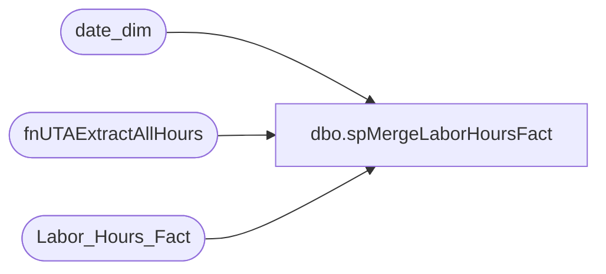

# dbo.spMergeLaborHoursFact

**Database:** dw  
**Server:** papamart  

## Architecture Diagram



## Table Dependencies

| Referenced Table |
|---|
| date_dim |
| fnUTAExtractAllHours |
| Labor_Hours_Fact |

## Stored Procedure Code

```sql
CREATE proc [dbo].[spMergeLaborHoursFact]

as

--=========================================
--	Dan Tweedie	2019-01-25	Created proc - 
--=========================================

set nocount on

declare 
	@LogID int

select @LogID = max(etl_log_id)+1 from Labor_Hours_Fact;

--updates and/or inserts
merge into Labor_Hours_Fact as target
using 
	(
		select * from fnUTAExtractAllHours(getdate()-60, getdate())
		where cast(workDate as date) >= '2019-03-17' -->first day of new labor system, UltiPro, filter added while we're still close to that date
	) as source
	on 
		(
			target.wrkd_id=source.wrkd_id
		)
when matched 
	and
		(
			isnull(target.store_key,0)<>isnull(source.store_key,0) OR
			isnull(target.date_key,0)<>isnull(source.date_key,0) OR
			isnull(target.emp_key,0)<>isnull(source.emp_key,0) OR
			isnull(target.start_time,0)<>isnull(source.start_time,0) OR
			isnull(target.job_key,0)<>isnull(source.job_key,0) OR
			isnull(target.timecode_key,0)<>isnull(source.timecode_key,0) OR
			isnull(target.hourtype_key,0)<>isnull(source.hourtype_key,0) OR
			isnull(target.end_Time, '3030-12-31')<>isnull(source.end_Time, '3030-12-31') OR
			isnull(target.wrkd_minutes,0)<>isnull(source.wrkd_minutes,0) 
		)
	then Update
		set 
			target.store_key=source.store_key,
			target.date_key=source.date_key,
			target.emp_key=source.emp_key,
			target.start_time=source.start_time,
			target.job_key=source.job_key,
			target.timecode_key=source.timecode_key,
			target.hourtype_key=source.hourtype_key,
			target.end_Time=source.end_Time, 
			target.wrkd_minutes=source.wrkd_minutes, 
			target.UpdateDate=getdate()
when not matched by target
	then Insert 
		(
			store_key,
			date_key,
			emp_key,
			start_time,
			end_time,
			job_key,
			timecode_key,
			wrkd_minutes,
			HourType_Key,
			wrkd_id,
			source_system,
			etl_log_id,
			etl_evnt_id,
			INS_Dt
		)
	values 
			(
				source.store_key,
				source.date_key,
				source.emp_key,
				source.start_time,
				source.end_time,
				source.job_key,
				source.timecode_key,
				source.wrkd_minutes,
				source.HourType_Key,
				source.wrkd_id,
				1,
				@LogID,
				@LogID,
				getdate()
			)
;
--deletes
IF (Object_ID('tempdb..#MergeDelete') IS NOT NULL) DROP TABLE #MergeDelete
SELECT        
	f.wrkd_id,
	NULL as DeleteRow
into #MergeDelete
FROM Labor_Hours_Fact f with (nolock)
inner join date_dim d with (nolock)
	on f.date_key = d.date_key
WHERE d.actual_date between getdate()-60 and getdate() 
and cast(d.actual_date as date) >= '2019-03-17'


merge into #MergeDelete as target
using 
	(
		select * from fnUTAExtractAllHours(getdate()-60, getdate())
		where cast(workDate as date) >= '2019-03-17'
	) as source
	on 
		(
			target.wrkd_id=source.wrkd_id
		)
when not matched by source 
then update 
	set target.DeleteRow = 1
;


delete from Labor_Hours_Fact 
where wrkd_id in (select wrkd_id from #MergeDelete where DeleteRow = 1)
```

