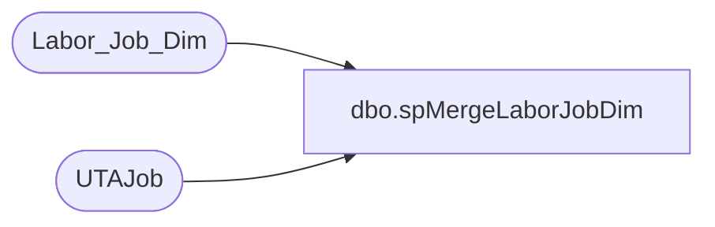

# dbo.spMergeLaborJobDim

**Database:** dw  
**Server:** papamart  

## Architecture Diagram



## Table Dependencies

| Referenced Table |
|---|
| Labor_Job_Dim |
| UTAJob |

## Stored Procedure Code

```sql
CREATE proc [dbo].[spMergeLaborJobDim]

as
------------------------------------------------------------------------
--	2019-01-21	Dan Tweedie	Created proc
------------------------------------------------------------------------

set nocount on

declare 
	@LogID int

select @LogID = max(etl_log_id)+1 from Labor_Job_Dim;

merge into Labor_Job_Dim as target
using UTAJob as source
on 
	(
		source.Job_Name = target.wb_cd
	)
when matched 
	and
		(
			isnull(target.descr,'x')<>isnull(source.Job_Desc,'x')
			OR
			isnull(target.abrv,'x')<>isnull(source.Job_Name,'x')
		)
	then Update
		set
			target.descr=source.Job_Desc,
			target.abrv=source.Job_Name,
			target.Upd_Dt=getdate()
when not matched by target
	then insert 
		(
			descr,
			abrv,
			wb_cd,
			etl_log_id,
			etl_evnt_id,
			ins_dt
		)
	values
		(
			source.Job_Desc,
			source.Job_Name,
			source.Job_Name,
			@LogID,
			@LogID,
			getdate()
		)
--when not matched by source
--	then Delete
	;
```

