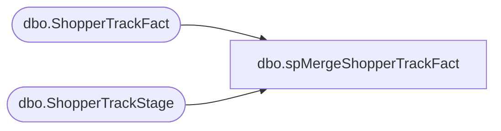

# dbo.spMergeShopperTrackFact

**Database:** dw  
**Server:** papamart  

## Architecture Diagram



## Table Dependencies

| Referenced Table |
|---|
| dbo.ShopperTrackFact |
| dbo.ShopperTrackStage |

## Stored Procedure Code

```sql
CREATE proc [dbo].[spMergeShopperTrackFact] -- Merge Name 

as


set nocount on


----------------------------------------------------------------------------------------------------------------------------------------
--Tim Callahan	2020-03-10	Created proc to merge shopper trak raw data to Data Warehouse 
----------------------------------------------------------------------------------------------------------------------------------------


merge into dw.dbo.ShopperTrackFact as target
using dwstaging.dbo.ShopperTrackStage as source 
on 
	target.ShopperTrakOrgId=source.ShopperTrakOrgId
	and 
	target.StoreKey=source.StoreKey
	and
	target.DateKey=source.DateKey
	and 
	target.TimeKey=source.TimeKey

when matched 
	and 
		(
			isnull(target.Enters,0)<>isnull(source.Enters,0) or
			isnull(target.Exits,0)<>isnull(source.Exits,0) or
			isnull(target.DataIndicatorName,'xxx') <> isnull(source.DataIndicatorName,'xxx')

		)
	then 
		update
			set 
				target.Enters=source.Enters,
				target.Exits=source.Exits,
				target.DataIndicatorName=source.DataIndicatorName,
				target.UpdateDate=getdate()

when not matched by target
	then insert
		(
			ShopperTrakOrgId,
			StoreKey,
			DateKey,
			TimeKey,
			Enters,
			Exits,
			DataIndicatorName,
			InsertDate

		)
		values
		(
		source.ShopperTrakOrgId,
		source.StoreKey,
		source.DateKey,
		source.TimeKey,
		source.Enters,
		source.Exits,
		source.DataIndicatorName,
		getdate ()
		
)
	
;
```

