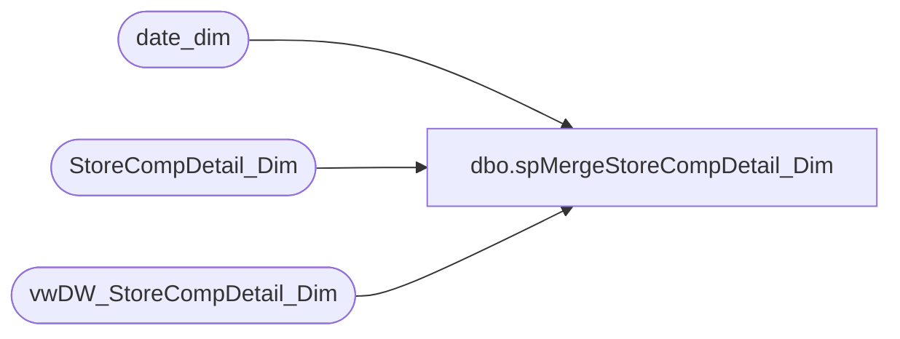

# dbo.spMergeStoreCompDetail_Dim

**Database:** dw  
**Server:** papamart  

## Architecture Diagram



## Table Dependencies

| Referenced Table |
|---|
| date_dim |
| StoreCompDetail_Dim |
| vwDW_StoreCompDetail_Dim |

## Stored Procedure Code

```sql
CREATE proc [dbo].[spMergeStoreCompDetail_Dim] 

as 

set nocount on

merge into StoreCompDetail_Dim as target
using 
	(
		select v.*
		from vwDW_StoreCompDetail_Dim v
		join date_dim dd on v.date_key=dd.date_key
		where datediff(dd, dd.actual_date, getdate()) <= 2000 --trying to lessen the load so it doesn't take forever + one day
	) as source
	on 
		target.store_key=source.store_key
		and 
		target.date_key=source.date_key
when matched 
	and 
		isnull(target.isCompTY,'0')<>isnull(source.isCompTY,'0') or 
		isnull(target.isCompNY,'0')<>isnull(source.isCompNY,'0') or 
		isnull(target.isShopperTrak,'0')<>isnull(source.isShopperTrak,'0') or 
		isnull(target.isShopperTrakCompTY,'0')<>isnull(source.isShopperTrakCompTY,'0') or 
		isnull(target.isShopperTrakCompNY,'0')<>isnull(source.isShopperTrakCompNY,'0') or 
		isnull(target.isSOTF,'0')<>isnull(source.isSOTF,'0') or 
		isnull(target.ShopperTrakStartHour,'0')<>isnull(source.hour_day_start,'0') or 
		isnull(target.ShopperTrakEndHour,'0')<>isnull(source.hour_day_end,'0')
	then update
		set
			target.isCompTY=source.isCompTY,
			target.isCompNY=source.isCompNY,
			target.isShopperTrak=source.isShopperTrak,
			target.isShopperTrakCompTY=source.isShopperTrakCompTY,
			target.isShopperTrakCompNY=source.isShopperTrakCompNY,
			target.isSOTF=source.isSOTF,
			target.ShopperTrakStartHour=source.hour_day_start,
			target.ShopperTrakEndHour=source.hour_day_end,
			target.Updt_dt=getdate()
when not matched by target
	then insert
		(
			store_key,
			date_key,
			isCompTY,
			isCompNY,
			isShopperTrak,
			isShopperTrakCompTY,
			isShopperTrakCompNY,
			isSOTF,
			ShopperTrakStartHour,
			ShopperTrakEndHour,
			Ins_Dt
		)
	values
		(
			source.store_key,
			source.date_key,
			source.isCompTY,
			source.isCompNY,
			source.isShopperTrak,
			source.isShopperTrakCompTY,
			source.isShopperTrakCompNY,
			source.isSOTF,
			source.hour_day_start,
			source.hour_day_end,
			getdate()
		)
when not matched by source
and exists (select dd.date_key from date_dim dd where datediff(dd, dd.actual_date, getdate()) <= 2000 and dd.date_key=target.date_key)
then delete;
```

