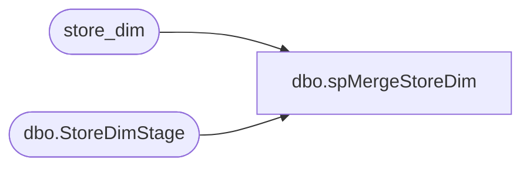

# dbo.spMergeStoreDim

**Database:** dw  
**Server:** papamart  

## Architecture Diagram



## Table Dependencies

| Referenced Table |
|---|
| store_dim |
| dbo.StoreDimStage |

## Stored Procedure Code

```sql
CREATE proc [dbo].[spMergeStoreDim]

as

------------------------------------------------------------------------------------------
-- Dan Tweedie	2018-12-17	- Created Proc to Merge Stage Store Dim Data to store_dim
------------------------------------------------------------------------------------------

set nocount on

merge into store_dim as target
using dwstaging.dbo.StoreDimStage as source
on 
	(
		target.store_id=source.store_id
	)
when matched 
	and 
		isnull(target.bearea,'x')<>isnull(source.bearea,'x') OR 
		isnull(target.store_name,'x')<>isnull(source.store_name,'x') OR 
		isnull(target.store_name_abbrv,'x')<>isnull(source.store_name_abbrv,'x') OR 
		isnull(target.bearritory,'x')<>isnull(source.bearritory,'x') OR 
		isnull(target.address1,'x')<>isnull(source.address1,'x') OR 
		isnull(target.region,'x')<>isnull(source.region,'x') OR 
		isnull(target.zone,'x')<>isnull(source.zone,'x') OR 
		isnull(target.address2,'x')<>isnull(source.address2,'x') OR 
		isnull(target.state_province_name,'x')<>isnull(source.state_province_name,'x') OR 
		isnull(target.business_type,'x')<>isnull(source.business_type,'x') OR 
		isnull(target.city,'x')<>isnull(source.city,'x') OR 
		isnull(target.division,'x')<>isnull(source.division,'x') OR 
		isnull(target.state_province,'x')<>isnull(source.state_province,'x') OR 
		isnull(target.county,'x')<>isnull(source.county,'x') OR 
		isnull(target.business_unit,'x')<>isnull(source.business_unit,'x') OR 
		isnull(target.country,'x')<>isnull(source.country,'x') OR 
		isnull(target.country_name,'x')<>isnull(source.country_name,'x') OR 
		isnull(target.postal_code,'x')<>isnull(source.postal_code,'x') OR 
		isnull(target.phone,'x')<>isnull(source.phone,'x') OR 
		isnull(target.fax,'x')<>isnull(source.fax,'x') OR 	
		isnull(target.email,'x')<>isnull(source.email,'x') OR 
		isnull(target.opening_date,'x')<>isnull(source.opening_date,'x') OR 	
		isnull(target.active,'x')<>isnull(source.active,'x') OR 	
		isnull(target.latitude,'x')<>isnull(source.latitude,'x') OR 	
		isnull(target.longitude,'x')<>isnull(source.longitude,'x') OR 
		isnull(target.volume_group,'x')<>isnull(source.volume_group,'x') OR 	
		isnull(target.store_mgr,'x')<>isnull(source.store_mgr,'x') OR 	
		isnull(target.bearea_mgr,'x')<>isnull(source.bearea_mgr,'x') OR 	
		isnull(target.bearitory_mgr,'x')<>isnull(source.bearitory_mgr,'x') OR 
		isnull(target.region_mgr,'x')<>isnull(source.region_mgr,'x') OR 	
		isnull(target.store_type,'x')<>isnull(source.store_type,'x') OR 	
		isnull(target.closing_date,'x')<>isnull(source.closing_date,'x') OR 	
		isnull(target.comp_date,'x')<>isnull(source.comp_date,'x') OR 	
		isnull(target.store_group_id,'x')<>isnull(source.store_group_id,'x') OR 	
		isnull(target.address3,'x')<>isnull(source.address3,'x') OR 	
		isnull(target.address4,'x')<>isnull(source.address4,'x') OR 
		isnull(target.square_feet,'x')<>isnull(source.square_feet,'x') OR 	
		isnull(target.num_of_pos,'x')<>isnull(source.num_of_pos,'x') OR 	
		isnull(target.num_of_kiosks,'x')<>isnull(source.num_of_kiosks,'x') OR 	
		isnull(target.postal_plus4,'x')<>isnull(source.postal_plus4,'x') OR 	
		isnull(target.Abbreviation,'x')<>isnull(source.Abbreviation,'x') OR 
		isnull(target.Legal_Description,'x')<>isnull(source.Legal_Description,'x') OR 	
		isnull(target.comp_week_id,'x')<>isnull(source.comp_week_id,'x') OR 	
		isnull(target.bearea_id,'x')<>isnull(source.bearea_id,'x') OR 	
		isnull(target.bearitory_id,'x')<>isnull(source.bearitory_id,'x') OR 	
		isnull(target.region_id,'x')<>isnull(source.region_id,'x') OR 	
		isnull(target.division_code,'x')<>isnull(source.division_code,'x') OR 	
		isnull(target.language,'x')<>isnull(source.language,'x') OR 	
		isnull(target.demographics_bg_key,'x')<>isnull(source.demographics_bg_key,'x')  
then UPDATE
	set 

		target.bearea=source.bearea	,
		target.store_name=source.store_name	,
		target.store_name_abbrv=source.store_name_abbrv	,
		target.bearritory=source.bearritory	,
		target.address1=source.address1	,
		target.region=source.region	,
		target.zone=source.zone	,
		target.address2=source.address2	,
		target.state_province_name=source.state_province_name	,
		target.business_type=source.business_type	,
		target.city=source.city	,
		target.division=source.division	,
		target.state_province=source.state_province	,
		target.county=source.county	,
		target.business_unit=source.business_unit	,
		target.country=source.country	,
		target.country_name=source.country_name	,
		target.postal_code=source.postal_code	,
		target.phone=source.phone	,
		target.fax=source.fax	,
		target.email=source.email,	
		target.opening_date=source.opening_date	,
		target.active=source.active	,
		target.latitude=source.latitude	,
		target.longitude=source.longitude	,
		target.volume_group=source.volume_group,
		target.store_mgr=source.store_mgr	,
		target.bearea_mgr=source.bearea_mgr	,
		target.bearitory_mgr=source.bearitory_mgr	,
		target.region_mgr=source.region_mgr	,
		target.store_type=source.store_type	,
		target.closing_date=source.closing_date	,
		target.comp_date=source.comp_date	,
		target.store_group_id=source.store_group_id	,
		target.address3=source.address3	,
		target.address4=source.address4	,
		target.square_feet=source.square_feet	,
		target.num_of_pos=source.num_of_pos	,
		target.num_of_kiosks=source.num_of_kiosks	,
		target.postal_plus4=source.postal_plus4	,
		target.Abbreviation=source.Abbreviation	,
		target.Legal_Description=source.Legal_Description	,
		target.comp_week_id=source.comp_week_id	,
		target.bearea_id=source.bearea_id	,
		target.bearitory_id=source.bearitory_id	,
		target.region_id=source.region_id	,
		target.division_code=source.division_code	,
		target.language=source.language	,
		target.demographics_bg_key=source.demographics_bg_key	,
		--target.INS_DT	
		target.UPDT_DT=getdate()
		--target.ETL_LOG_ID
		--target.ETL_EVNT_ID
when not matched by target
	then INSERT 
		(
			store_id,	
			bearea,	
			store_name,	
			store_name_abbrv,	
			bearritory	,
			address1,	
			region	,
			zone	,
			address2,	
			state_province_name	,
			business_type	,
			city	,
			division,	
			state_province	,
			county	,
			business_unit	,
			country	,
			country_name	,
			postal_code,
			phone,	
			fax	,
			email	,
			opening_date,	
			active	,
			latitude,	
			longitude	,
			volume_group,	
			store_mgr	,
			bearea_mgr	,
			bearitory_mgr,	
			region_mgr	,
			store_type	,
			closing_date,	
			comp_date	,
			store_group_id	,
			address3	,
			address4	,
			square_feet	,
			num_of_pos	,
			num_of_kiosks,	
			postal_plus4	,
			Abbreviation	,
			Legal_Description,	
			comp_week_id	,
			bearea_id	,
			bearitory_id,	
			region_id	,
			division_code	,
			language	,
			demographics_bg_key	,
			INS_DT
		)
	VALUES
		(
			source.store_id,	
			source.bearea,	
			source.store_name,	
			source.store_name_abbrv,	
			source.bearritory	,
			source.address1,	
			source.region	,
			source.zone	,
			source.address2,	
			source.state_province_name	,
			source.business_type	,
			source.city	,
			source.division,	
			source.state_province	,
			source.county	,
			source.business_unit	,
			source.country	,
			source.country_name	,
			source.postal_code	,
			source.phone,	
			source.fax	,
			source.email	,
			source.opening_date,	
			source.active	,
			source.latitude,	
			source.longitude	,
			source.volume_group,	
			source.store_mgr	,
			source.bearea_mgr	,
			source.bearitory_mgr,	
			source.region_mgr	,
			source.store_type	,
			source.closing_date,	
			source.comp_date	,
			source.store_group_id	,
			source.address3	,
			source.address4	,
			source.square_feet	,
			source.num_of_pos	,
			source.num_of_kiosks,	
			source.postal_plus4	,
			source.Abbreviation	,
			source.Legal_Description,	
			source.comp_week_id	,
			source.bearea_id	,
			source.bearitory_id,	
			source.region_id	,
			source.division_code	,
			source.language	,
			source.demographics_bg_key	,
			getdate()
		)

;
```

